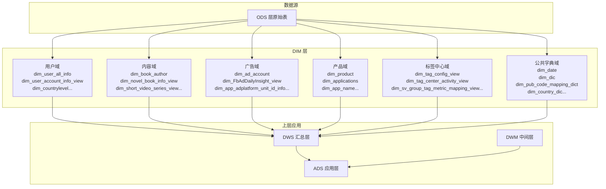
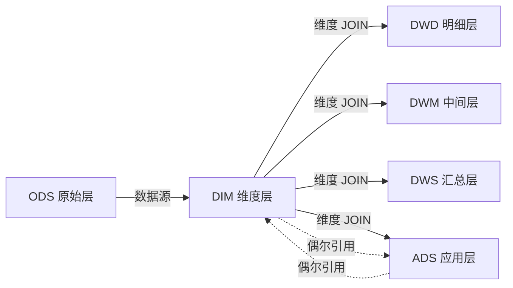

DIM 层是数仓星型模型的核心——它为 DWD、DWM、DWS、ADS 层提供可复用的维度描述信息，使上层分析能够在统一的业务语义上完成聚合与下钻。本仓库的 DIM 层覆盖了**用户、内容（书籍/短剧）、广告投放、产品应用、标签中心、公共字典**六大业务域，共包含 100+ 个 DDL 定义文件和约 40 个 DML 装载脚本，是目前分层架构中表数量最多的一层。

Sources: [dir structure](starrocks/dim)

## DIM 层的两种实现形态

本仓库的维度数据以两种形态并存，选型取决于数据量、更新频率和"单一事实来源"的架构原则。理解这两种形态是正确使用 DIM 层的起点。

**物理维表**由 DDL 定义表结构 + DML 定义装载逻辑，是 StarRocks 中真实存储数据的表。典型代表包括 `dim_date`（日期维度）、`dim_user_all_info`（用户全量信息）、`dim_ad_account`（投放账号）、`dim_product`（产品信息）。它们通常以 `insert overwrite` 或 `delete + insert into` 方式定期全量刷新，作为上层 JOIN 的稳固锚点。

**维度视图**仅以 DDL 存在（无对应 DML），基于 ODS 层原始表通过 `CREATE VIEW` 封装，提供列重命名、业务语义注释和多源 UNION ALL 聚合。典型代表包括 `dim_user_account_info_view`（阅读用户注册信息）、`dim_novel_book_info_view`（小说书籍信息）、`dim_short_video_series_view`（短剧维表视图）。视图的优势在于零存储冗余和数据实时性，代价是无法利用 StarRocks 的布隆过滤器和主键索引优化。

Sources: [dim_user_all_info](starrocks/dim/ddl/dim_user_all_info.sql#L1-L100), [dim_user_account_info_view](starrocks/dim/ddl/dim_user_account_info_view.sql#L1-L5), [dim_novel_book_info_view](starrocks/dim/ddl/dim_novel_book_info_view.sql#L1-L71), [dim_short_video_series_view](starrocks/dim/ddl/dim_short_video_series_view.sql#L1-L74)

| 特性 | 物理维表 (Table) | 维度视图 (View) |
|---|---|---|
| **存储方式** | StarRocks 物理存储，占用磁盘 | 查询时计算，无额外存储 |
| **主键/索引** | PRIMARY KEY + bloom_filter + 持久化索引 | 无，继承底层 ODS 表特性 |
| **数据刷新** | 定期 DML 全量/增量刷新 | 跟随 ODS 源表实时变化 |
| **典型用途** | 高频 JOIN 的核心维度（用户、日期、产品） | 低频查询、多源 UNION 聚合 |
| **文件数量** | 约 40 个 DDL（有对应 DML） | 约 60 个 DDL（仅视图定义） |

Sources: [dim_date](starrocks/dim/ddl/dim_date.sql#L1-L46), [dim_ad_account](starrocks/dim/ddl/dim_ad_account.sql#L1-L53), [dim_product](starrocks/dim/ddl/dim_product.sql#L1-L39)

## 六大业务域维度全景

DIM 层的 100+ 张表可按业务域划分为六个清晰的类别，每个域服务于特定的分析场景。



### 用户域维度

用户域是维度最丰富、JOIN 最频繁的域。`dim_user_all_info` 是用户维度的"集大成者"——它通过 LEFT JOIN 将三个子维度视图整合为一：`dim_user_account_info_view`（注册信息，100+ 字段）、`dim_user_other_info_view`（广告标签、再营销属性）、`dim_user_userdata_view`（VIP 会员、福利包、设备信息）。此外还有 `dim_user_corever`（CoreVer 版本映射）、`dim_user_login_anonymous_map`（匿名用户映射）等辅助维度。

Sources: [dim_user_all_info DML](starrocks/dim/dml/P_dim_user_all_info.sql#L1-L147), [dim_user_all_info DDL](starrocks/dim/ddl/dim_user_all_info.sql#L1-L100)

### 内容域维度

内容域覆盖**阅读书籍**和**短剧**两个业务线。书籍维度以 `dim_novel_book_info_view` 为核心（聚合多产品线书籍信息并 JOIN 分类表和编码映射字典），辅以 `dim_book_author`（书籍-作者关系）、`dim_book_chapter_info`（章节信息）、`dim_book_bill_info`（书籍计费信息）。短剧维度以 `dim_short_video_series_view` 为核心（短剧元数据 + 源语言映射），辅以 `dim_short_video_epis_view`（剧集信息）、`dim_sv_strategy_info`（策略配置）。

Sources: [dim_novel_book_info_view](starrocks/dim/ddl/dim_novel_book_info_view.sql#L1-L71), [dim_book_author](starrocks/dim/ddl/dim_book_author.sql#L1-L20), [dim_short_video_series_view](starrocks/dim/ddl/dim_short_video_series_view.sql#L1-L74)

### 广告投放域维度

广告域以 `dim_ad_account` 为核心，通过 DML 中四个 UNION ALL 分支将 Facebook、TikTok、第三方渠道和 Google 的投放账号统一为一张维度表，以 `types` 字段（1=FB, 2=TikTok, 3=第三方, 4=谷歌）区分渠道。辅以 `dim_FbAdDailyInsight_view`、`dim_admobapp_view`、`dim_adsadgroup_view` 等广告平台原始数据的维度化视图。

Sources: [dim_ad_account DDL](starrocks/dim/ddl/dim_ad_account.sql#L1-L53), [dim_ad_account DML](starrocks/dim/dml/P_dim_ad_account.sql#L1-L48)

### 公共字典域维度

`dim_date` 是数仓最基础的时间维度，提供日/周/月/季/年各粒度的属性描述，以及中国节假日、工作日标记，是几乎所有时间序列分析的基础。`dim_pub_code_mapping_dict` 是一个通用的编码映射字典——以 `(app_plat, cd_col, cd_val)` 为联合主键，将产品 ID、语言编码等业务代码映射为可读描述，在 DWS 层的宽表构建中被大量使用。`dim_dic` 提供表级枚举字段的字典映射。

Sources: [dim_date](starrocks/dim/ddl/dim_date.sql#L1-L46), [dim_pub_code_mapping_dict](starrocks/dim/ddl/dim_pub_code_mapping_dict.sql#L1-L23), [dim_dic](starrocks/dim/ddl/dim_dic.sql#L1-L22)

## 物理维表的 StarRocks 表模型设计

所有 DIM 物理表统一采用 **PRIMARY KEY 模型**（即 StarRocks 的 Duplicate Key 升级版），这是维度表的标准选择——维表以单行唯一定义一个维度实体，需要高效的按主键点查和 UPDATE 能力。

关键建表属性如下：

| 属性 | 取值 | 作用 |
|---|---|---|
| `ENGINE` | OLAP | StarRocks 标准存储引擎 |
| `PRIMARY KEY(...)` | 业务主键列 | 唯一标识维度行，支持 Upsert |
| `DISTRIBUTED BY HASH(...)` | 与主键对齐 | 数据分布，保证关联 JOIN 本地化 |
| `replication_num` | "3"（核心表）/ "2"（日志型） | 副本数，保证高可用 |
| `enable_persistent_index` | "true" | 持久化主键索引，加速点查 |
| `replicated_storage` | "true" | 三副本存储，数据安全性 |
| `compression` | "LZ4" | 压缩算法，平衡速度与空间 |
| `bloom_filter_columns` | 高频过滤列 | 加速等值过滤（如 user_id, book_name） |
| `colocate_with` | 分组名 | 与关联表协同分布，消除 JOIN 时的数据 Shuffle |

Source: [dim_user_all_info DDL](starrocks/dim/ddl/dim_user_all_info.sql#L87-L99), [dim_book_author DDL](starrocks/dim/ddl/dim_book_author.sql#L10-L20), [dim_product DDL](starrocks/dim/ddl/dim_product.sql#L30-L38)

部分维度表采用了 **分区（Partition）** 策略。例如 `dim_sv_user_latest_ord` 按天分区并设置 `partition_live_number = "10"` 只保留最近 10 个分区，`dim_device_device_model_info_df` 同样按天分区——这种设计适用于以日期为粒度持续追加的"快照型维度"。

Sources: [dim_sv_user_latest_ord](starrocks/dim/ddl/dim_sv_user_latest_ord.sql#L1-L22), [dim_device_device_model_info_df](starrocks/dim/ddl/dim_device_device_model_info_df.sql#L1-L22)

## 数据装载模式（DML）

每个 DML 文件顶部包含 DolphinScheduler 调度所需的元数据注释块，记录 `project_name`、`workflow_name`、`task_name`、`update_time` 和 `sql_path`。这既是调度配置的来源，也是代码溯源的关键标识。

Source: [P_dim_ad_account](starrocks/dim/dml/P_dim_ad_account.sql#L1-L9), [P_dim_user_all_info](starrocks/dim/dml/P_dim_user_all_info.sql#L1-L10)

DIM 层的装载逻辑遵循三种核心模式：

**模式一：insert overwrite 全量刷新。** 适用于数据量可控的维度表（如 `dim_ad_account`），直接覆盖写入。通过多个 `UNION ALL` 分支将不同 ODS 源表的数据聚合到统一的维度结构中。

```sql
insert overwrite dim.dim_ad_account
select Id,1 as types,... from ods.ods_tidb_sharpengine_ads_global_FbAccount
union all
select Id,2 as types,... from ods.ods_tidb_sharpengine_ads_global_TiktokAdsAccount
union all ...
```

Source: [P_dim_ad_account](starrocks/dim/dml/P_dim_ad_account.sql#L11-L48)

**模式二：delete + insert into 全量刷新。** 先清空目标表再插入，适用于需要保证数据完全一致的场景（如 `dim_book_author`）。注意这里不使用事务，因此在极高并发下可能出现短暂的"空表窗口"。

```sql
delete from dim.dim_book_author where 1=1;
insert into dim.dim_book_author
select ... from ods.ods_edit_book ...;
```

Source: [P_dim_book_author](starrocks/dim/dml/P_dim_book_author.sql#L11-L33)

**模式三：多源 LEFT JOIN 组装。** 复杂维度（如 `dim_user_all_info`）由多个子维度视图通过 LEFT JOIN 拼装而成，这种"分而治之"的策略将庞大的用户属性拆分为注册信息、广告标签、VIP 状态三张子视图，各自独立维护，最终在物理表中汇聚。

Source: [P_dim_user_all_info](starrocks/dim/dml/P_dim_user_all_info.sql#L15-L147)

## 跨层引用关系

DIM 层在整个数仓中扮演"被引用者"的角色——它从 ODS 读取原始数据，向上为 DWD、DWM、DWS、ADS 层提供维度属性。



在实际代码中，DWS 层对 DIM 的引用最为典型。以 `dws_user_wide_active_ed` 为例，它通过 LEFT JOIN `dim.dim_user_account_info_view` 获取用户注册属性（CoreVer、终端、语言、注册国家），LEFT JOIN `dim.dim_countrylevel` 获取国家等级，再通过 CTE 查询 `dim.dim_pub_code_mapping_dict` 构建语言映射关系——一次装载同时引用三张 DIM 表。

Sources: [P_dws_user_wide_active_ed](starrocks/dws/dml/P_dws_user_wide_active_ed.sql#L1-L80)

DIM 层自身也存在**层内引用**——物理维表引用维度视图来组装数据（如 `dim_user_all_info` 引用三张用户视图），以及**反向引用 ADS 层**的特殊情况（如 `dim_sv_strategy_info` 从 `ads.ads_tidb_short_video_center_activity_position_view` 获取分组位置信息）。

Source: [P_dim_sv_strategy_info](starrocks/dim/dml/P_dim_sv_strategy_info.sql#L11-L30)

## DAS 元数据与 DIM 层的治理关系

DAS（Data Asset Service）目录下的 `P_das_dict_table.sql` 是一张跨越所有数仓分层的元数据汇总表——它将 `information_schema.tables` 中 `db_nm IN ('ods','dwd','dim','dws','ads','alg','dwm','ods_log')` 的所有表信息统一采集到 `das.das_dict_table` 中，记录表名、库名、表类型（物理表/视图）、注释、创建人等信息。DIM 层的 100+ 张表正是通过这套机制被纳入数据资产目录，支持后续的数据血缘追踪和质量监控。

Sources: [P_das_dict_table](starrocks/das/P_das_dict_table.sql#L1-L53)

配套的 `P_das_dict_table_col.sql` 进一步采集列级元数据，`P_das_dict_table_ddl.sql` 和 `P_das_dict_table_dml.sql` 分别记录 DDL 和 DML 变更历史。当 DIM 层添加新维度或修改现有维表结构时，DAS 会在下一个调度周期自动感知变更并更新元数据仓库。

## 维度建模最佳实践总结

基于本仓库 DIM 层的实际代码模式，提炼以下可复用的设计原则：

1. **优先使用视图封装简单维度。** 如果一个维度仅需要在 ODS 表基础上做列重命名和注释补充，创建 View 而非物理表——节省存储且天然实时。
2. **高频 JOIN 的维度必须物理化。** 用户、产品、日期这类被几乎所有上层表引用的维度，物理存储 + bloom_filter + colocate_with 的收益远超存储成本。
3. **多源聚合用 UNION ALL，跨域组装用 LEFT JOIN。** 前者解决"同类数据不同来源"（如各广告渠道账号），后者解决"同一实体不同属性面"（如用户注册信息 + 广告标签 + VIP 状态）。
4. **编码映射统一走 `dim_pub_code_mapping_dict`。** 将所有产品 ID → 语言、产品 ID → 产品名称等映射集中到一张字典表中，避免每个分析查询都写 CASE WHEN。
5. **DML 头部注释是调度溯源的关键。** 每个 DML 文件顶部的 `workflow_name`、`task_name`、`sql_path` 直接对应 DolphinScheduler 中的工作流定义，修改维表逻辑时必须同步更新。

---

**下一步阅读建议：** 理解 DIM 层后，建议继续阅读 [ADS 层：面向业务的应用统计](9-ads-ceng-mian-xiang-ye-wu-de-ying-yong-tong-ji) 了解维度如何在上层被消费，或深入 [ALG 层：算法特征工程与推荐数据](11-alg-ceng-suan-fa-te-zheng-gong-cheng-yu-tui-jian-shu-ju) 了解特征工程层如何利用维度标签。如需理解 DIM 表在调度系统中的编排方式，可参阅 [DolphinScheduler 调度参数与任务编排](27-dolphinscheduler-diao-du-can-shu-yu-ren-wu-bian-pai) 和 [StarRocks 表模型与分区策略](28-starrocks-biao-mo-xing-yu-fen-qu-ce-lue)。