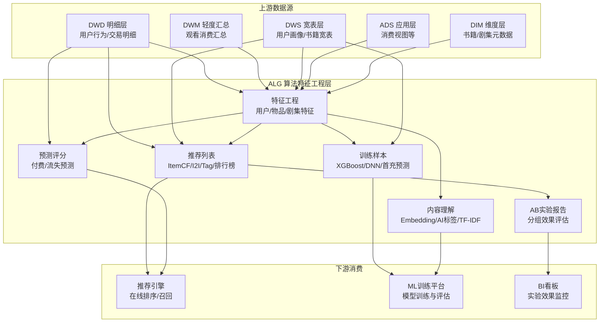
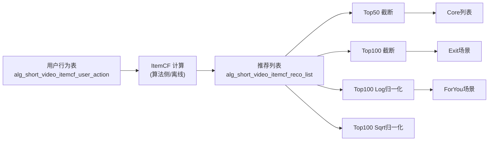
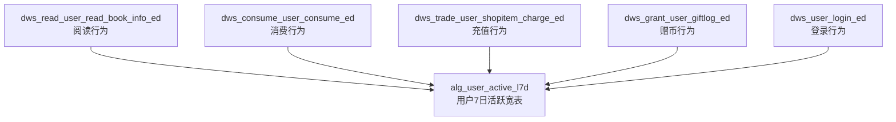
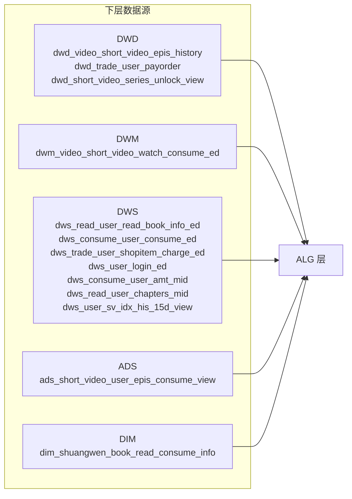

ALG（Algorithm）层是数仓体系中专为推荐算法和机器学习模型服务的特征工程层。它位于 DWS/ADS 层之上、推荐引擎之下，承担着将业务宽表数据转化为算法可用特征、生成推荐候选列表、构造训练样本以及产出 AB 实验评估指标的核心职责。该层覆盖**短剧（Short Video）**和**阅读/小说（Novel）**两大业务线，共计约 190 张 DDL 定义表和 18 个 DML 调度任务。

Sources: [目录结构](starrocks/alg)

## ALG 层在数仓中的定位

ALG 层与传统数仓分层（ODS → DWD → DWM → DWS → ADS）的关系并非严格的上下游，而是一条**垂直切出的算法数据流水线**。它从 DWD（明细）、DWM（轻度汇总）、DWS（宽表）和 ADS（应用统计）拉取数据，经过特征聚合、样本构造、向量生成等加工后，产出推荐系统直接消费的数据产品。

ALG 层的数据写入遵循与 DWD/DWS 层相同的调度规范：DML 脚本通过 DolphinScheduler 编排，使用 `${bf_1_dt}`（T-1 日期）、`${dt}`（当前实例日期）和 `${pname}`（分区名）等调度参数。多数 DML 任务采用 **delete-then-insert** 模式，即先删除目标分区数据再插入当天结果，保证幂等性。

Sources: [P_alg_shortvideo_feature.sql](starrocks/alg/dml/P_alg_shortvideo_feature.sql#L1-L15), [P_alg_read_book_info.sql](starrocks/alg/dml/P_alg_read_book_info.sql#L11-L13)

## 短剧推荐：特征、样本与推荐列表

短剧（Short Video）业务是 ALG 层最大的数据域，涵盖用户行为特征、剧集特征、协同过滤列表、DNN 训练样本、AB 实验报告等完整推荐链路。

### 用户特征体系

短剧用户特征按粒度分为三个层次：

| 层次 | 代表表 | 特征维度 | 主键模式 |
|------|--------|----------|----------|
| 用户-剧集交互明细 | `alg_short_video_user_series_info_detail` | 解锁/完播/点赞/消费金额 | `(dt, user_id, series_id, epis_id)` |
| 用户-剧集聚合 | `alg_short_video_user_series_info_collect` | 解锁集数/观看集数/完播数/消费总额 | `(dt, user_id, series_id)` |
| 用户画像向量 | `alg_short_video_user_profile_vector` | 用户偏好标签及权重向量 | `(user_id, tag, tag_index)` |

`alg_short_video_user_series_info_detail` 是短剧推荐链路中的核心明细表，其 DML 脚本从 `dwm_video_short_video_watch_consume_ed`（观看消费汇总）和 `dwd_short_video_series_unlock_view`（解锁记录）中 JOIN 得到用户对每集剧的完整交互行为——是否解锁、是否完播、是否点赞、消耗的币和券。

Sources: [alg_short_video_user_series_info_detail.sql](starrocks/alg/ddl/alg_short_video_user_series_info_detail.sql#L1-L22), [P_alg_short_video_user_series_info_detail.sql](starrocks/alg/dml/P_alg_short_video_user_series_info_detail.sql#L11-L30)

`alg_short_video_user_feature_di` 和 `alg_short_video_user_series_feature_di` 则为推荐模型提供日级增量用户特征，包含多时间窗口（1d/3d/7d/15d/30d/全量）的观看人数、观看集数、完播集数、消费人数、消费金额、充值人数、充值金额等指标，形成标准的**滑动窗口特征快照**。

`alg_short_video_user_profile_vector` 以向量形式存储用户偏好标签，每条记录是一个 `(user_id, tag, tag_index, weight)` 四元组，支持推荐引擎直接读取用户兴趣向量进行相似度计算。

Sources: [alg_short_video_user_profile_vector.sql](starrocks/alg/ddl/alg_short_video_user_profile_vector.sql#L1-L15)

### 剧集特征与排行榜

剧集侧的描述信息分散在多张表中：

| 表名 | 核心内容 |
|------|----------|
| `alg_short_video_series_info_feature` | 剧集元信息（语言、core、免费集数、总集数） |
| `alg_short_video_series_emb` | 剧集语义向量（embedding） |
| `alg_short_video_series_tag_embed` | 剧集标签向量 |
| `alg_short_video_tf_idf` | 用户-剧集 TF-IDF 权重矩阵 |
| `ads_short_video_series_rank_7d_di` | 七日综合排行榜（含曝光/点击/完播等多维得分和百分位） |

`ads_short_video_series_rank_7d_di` 是一张设计精良的排行榜表。它不仅包含原始指标（如近 7 天曝光 UV、点击率、完播率），还计算了每个指标在语言内的**百分位排名**（percentile），以及基于多指标加权融合的综合得分 `total_score`。这种设计让推荐系统可以直接使用得分或百分位进行排序过滤，无需额外计算。

Sources: [ads_short_video_series_rank_7d_di.sql](starrocks/alg/ddl/ads_short_video_series_rank_7d_di.sql#L1-L54), [alg_short_video_series_emb.sql](starrocks/alg/ddl/alg_short_video_series_emb.sql#L1-L14)

### ItemCF 协同过滤推荐列表

短剧推荐中最重要的召回策略之一是 **Item-based Collaborative Filtering（ItemCF）**。ALG 层为此设计了完整的推荐列表产出链路：

用户行为表 `alg_short_video_itemcf_user_action` 记录了用户对剧集的观看、消费行为，作为 ItemCF 相似度计算的输入。计算完成后，推荐列表被写入 `alg_short_video_itemcf_reco_list`（以及其他变体），每条记录包含 `(user_id, language_id, type, reco_list)`，其中 `reco_list` 以逗号分隔的剧集 ID 列表形式存储。

该体系包含大量变体表，按截断策略（Top50/Top100）、评分归一化方式（Log/Sqrt）、场景（Exit/ForYou/Core）和版本（v1）排列组合，共计约 20 张推荐列表表。这反映了推荐系统在实际落地中需要对不同场景、不同召回策略进行精细化的 AB 实验。

Sources: [alg_short_video_itemcf_reco_list.sql](starrocks/alg/ddl/alg_short_video_itemcf_reco_list.sql#L1-L15), [alg_short_video_itemcf_user_action.sql](starrocks/alg/ddl/alg_short_video_itemcf_user_action.sql)

### I2I 标签向量推荐

除 ItemCF 外，短剧推荐还使用 **I2I（Item-to-Item）标签向量召回**。`alg_short_video_i2i_tag_emb_reco_list` 及其 Exit/ForYou 变体存储基于标签 embedding 相似度计算的推荐列表。这种方法的优势在于可以捕捉 ItemCF 难以发现的**跨品类内容关联**——两个剧集即使没有被同一用户消费过，只要标签语义相似，也能互相推荐。

Sources: [alg_short_video_i2i_tag_emb_reco_list.sql](starrocks/alg/ddl/alg_short_video_i2i_tag_emb_reco_list.sql#L1-L15)

### DNN 深度模型特征与样本

短剧推荐引入了基于 DNN（深度神经网络）的排序模型。相关表包括：

| 表名 | 用途 |
|------|------|
| `alg_short_video_dnn_feature` | 全量用户-剧集特征（含评分、类型、用户偏好等） |
| `alg_short_video_dnn_ctr_label_sample` | 带 CTR 标签的训练样本 |
| `alg_short_video_dnn_user_feature` | 用户侧 DNN 特征 |
| `alg_short_video_dnn_series_feature` | 剧集侧 DNN 特征 |
| `alg_short_video_dnn_click_label` | 点击标签数据 |

DNN 特征表的设计借鉴了 MovieLens 等公开数据集的 schema：不仅包含当前 `(user_id, series_id)` 对的交互评分（rating），还携带了用户历史行为序列（最近评分的 5 个剧集）、用户偏好类型 Top5、以及物品的全局统计（被打分次数、平均分、标准差）。这种**上下文感知**的特征设计让 DNN 模型能够同时捕捉用户长期偏好和物品全局热度。

Sources: [alg_short_video_dnn_feature.sql](starrocks/alg/ddl/alg_short_video_dnn_feature.sql#L1-L37), [alg_short_video_dnn_ctr_label_sample.sql](starrocks/alg/ddl/alg_short_video_dnn_ctr_label_sample.sql#L1-L78)

### AB 实验报告

`alg_short_video_exp_group_report_v1` 到 `v9` 是一个持续迭代的 AB 实验报告表家族。每个版本记录了不同实验分组下的核心指标：UV、付费总额（pay_total）、消费转化率（csum_cvr）、付费转化率（pay_cvr）、人均消费（avg_csum）、人均付费（avg_pay）。v1 版本包含 9 个核心指标，后续版本逐步增加了更多细分维度。这种多版本并存的设计允许同时运行多个实验，互不干扰。

Sources: [alg_short_video_exp_group_report_v1.sql](starrocks/alg/ddl/alg_short_video_exp_group_report_v1.sql#L1-L21)

## 阅读/小说推荐：特征与推荐列表

阅读（Novel/Book）业务线是 ALG 层的第二大域，数据结构与短剧推荐类似，但在特征维度上有其独特之处——阅读行为更注重**章节粒度**（开始阅读章节数、结束阅读章节数、连续阅读章节数）和**书籍元信息**（字数、分类、价格）。

### 书籍特征与用户行为

| 表名 | 核心特征维度 |
|------|-------------|
| `alg_book_feature` | 多时间窗口（1d/3d/7d/30d/全量）的阅读 UV、消费 UV、阅读章节数、消费次数和金额 |
| `alg_read_book_info` | 按阅读深度分层（0-15章/15-50章/50章以上）的用户数、章节消费统计 |
| `alg_consume_book_consume_info` | 消费侧分层统计，含广告用户/非广告用户维度 |
| `alg_book_compile_info` | 书籍元信息（上架时间、字数、分类、价格）与阅读/消费/充值宽表 JOIN |
| `alg_novel_repay_user_feature` | 用户复购预测特征：用户画像 + 阅读行为 + 付费历史 + 设备信息 |

`alg_book_compile_info` 是阅读推荐中最具代表性的大宽表，其 DML 脚本从 `dim_shuangwen_book_read_consume_info`（书籍维度）、`alg_consume_book_consume_info`（消费聚合）、`alg_trade_book_pay_info`（付费聚合）和 `alg_read_book_info`（阅读聚合）四张表 JOIN 而成，单表字段数超过 150 个，涵盖了从书籍元信息到多时间窗口行为统计的全部维度。

Sources: [alg_book_feature.sql](starrocks/alg/ddl/alg_book_feature.sql#L1-L45), [alg_book_compile_info.sql](starrocks/alg/ddl), [P_alg_book_compile_info.sql](starrocks/alg/dml/P_alg_book_compile_info.sql#L11-L210)

### 用户活跃特征

`alg_user_active_l7d` 的 DML 是 ALG 层中最复杂的单脚本之一（263 行），它从 7 个上游源表中聚合出用户的完整活跃画像：

该表产出的特征包括：阅读书籍数/章节数（1d/3d/7d）、最后阅读位置、消费书籍数/金币/券（1d/3d/7d/60d）、充值次数/金额（7d/180d/全量）、最近充值距今天数、赠币/过期币数（1d/3d/7d）、最近赠币距今天数、登录天数、最近登录距今天数。这种**多数据源交叉融合**的特征工程模式，为后续的首充预测、复购预测等模型提供了丰富的输入特征。

Sources: [P_alg_user_active_l7d.sql](starrocks/alg/dml/P_alg_user_active_l7d.sql#L1-L263)

### 首充预测特征体系

首充（First Payment）预测是阅读业务的核心算法场景。ALG 层围绕首充预测构建了完整的特征流水线：

| 表名 | 作用 |
|------|------|
| `alg_firstpay_feature_tmp` | 中间表：用户-书籍-付费金额明细 |
| `alg_firstpay_feature` | 按特征维度（性别/邮箱后缀/注册国家/渠道/产品/版本等）聚合付费统计 |
| `alg_firstpay_feature_export` | 将特征序列化为 `feature_name:feature_value` 和 `pay_total,pay_max,pay_min,pay_avg,pay_model` 的导出格式 |
| `coolstart_pay_first_stat_feature` | 冷启动用户的首充统计特征（3d/7d/15d/30d 窗口，含付费档位分布） |

`alg_firstpay_feature` 的 DML 使用 **UNION ALL** 将 9 个特征维度（sex, emailsuffix, regcountry, mt, productid, corever, chl, chl2, bookid）的聚合结果合并为一张统一格式的表。每个维度下计算付费总额、最大/最小/平均付费金额、以及使用 `FIRST_VALUE` 窗口函数取出的**众数付费金额**（select_max）。这种设计让下游模型可以按任意特征维度查询付费行为分布。

Sources: [P_alg_firstpay_feature.sql](starrocks/alg/dml/P_alg_firstpay_feature.sql#L11-L200), [coolstart_pay_first_stat_feature.sql](starrocks/alg/ddl/coolstart_pay_first_stat_feature.sql#L1-L50)

### 小说推荐列表

与短剧类似，阅读推荐也有 ItemCF 推荐列表：

- `alg_novel_itemcf_reco_list`：基础 ItemCF 推荐列表
- `alg_novel_itemcf_reco_nature_list`：自然量（非广告）用户推荐列表
- `alg_novel_itemcf_user_view_score` / `alg_novel_itemcf_user_view_nature_score`：用户对物品的评分矩阵
- `alg_novel_book_reco_list_top20`：Top20 截断推荐
- `alg_novel_user_new_tag_reco_list` / `alg_novel_user_old_tag_reco_list`：基于新/旧标签的推荐

Sources: [alg_novel_itemcf_reco_list.sql](starrocks/alg/ddl/alg_novel_itemcf_reco_list.sql#L1-L15)

## XGBoost 训练样本体系

ALG 层为 XGBoost 模型训练准备了结构化的样本表，命名规范为 `alg_sample_{场景}_{模型}_{版本}`：

| 表名 | 场景 | 特征范围 |
|------|------|----------|
| `alg_sample_xgb_cnxh_v1/v2` | 催新/唤醒（cnxh） | 用户-书籍对 + 多时间窗口行为特征 + 书籍元信息 |
| `alg_sample_cnxh_data_fyy` | 催新/唤醒数据 | 含用户状态标签 |
| `alg_sample_series_xgb_fyy` | 剧集推荐 | 剧集维度特征 |
| `alg_sample_cmtj_data_fyy` | 催免推剧 | 充值相关特征 |
| `alg_sample_sjdb_data_fyy` | 书籍打包 | 书籍维度聚合 |
| `alg_sample_update_repay_feat_v2` | 复购预测 | 付费时序特征 |

`alg_sample_xgb_cnxh_v1` 的 schema 清晰地展示了 XGBoost 样本的标准结构：以 `(dt, user_id, book_id)` 为主键，携带用户在 1d/3d/7d/30d/全量五个时间窗口的阅读和消费统计（来自 `alg_book_feature`），加上用户当前阅读进度（`read_chapter_sort`）和书籍总章节数（`total_chpts`），以及一个 `books` 字段（varchar 类型）存储用户其他阅读书籍的列表。这种**宽表 + 时序窗口**的设计是推荐系统特征工程的经典范式。

Sources: [alg_sample_xgb_cnxh_v1.sql](starrocks/alg/ddl/alg_sample_xgb_cnxh_v1.sql#L1-L50), [alg_feature_xgb_cnxh_v1.sql](starrocks/alg/ddl/alg_feature_xgb_cnxh_v1.sql#L1-L48)

## 内容理解与语义特征

ALG 层承载了部分 NLP 和内容理解的产出数据：

| 表名 | 内容 |
|------|------|
| `alg_novel_book_embedding` | 书籍语义向量 + 相似度 |
| `alg_novel_book_introduce_emb` | 书籍简介 embedding |
| `alg_novel_book_ai_tags` | AI 生成的书籍标签 |
| `alg_novel_book_text` | 书籍文本内容 |
| `alg_novel_book_list` / `alg_novel_book_list_top20` | 书籍列表 |
| `alg_short_video_series_emb` | 剧集 embedding |
| `alg_short_video_series_tag_embed` | 剧集标签 embedding |
| `alg_short_video_tag2item` | 标签到物品的倒排索引 |
| `alg_short_video_tag_index` | 标签索引映射 |

这些表的数据通常来自离线 NLP 管道（文本向量化、标签提取）的导入，而非 SQL 转换。它们为推荐系统提供了**基于内容的召回能力**——当用户行为稀疏时（冷启动），可以通过内容相似度进行推荐。

Sources: [alg_novel_book_embedding.sql](starrocks/alg/ddl/alg_novel_book_embedding.sql#L1-L20), [alg_novel_book_ai_tags.sql](starrocks/alg/ddl/alg_novel_book_ai_tags.sql#L1-L18)

## 预测评分与在线特征

ALG 层为推荐引擎的在线推理提供了预计算的特征和评分：

- **复购预测**：`alg_novel_repay_user_predict_offline` / `alg_novel_repay_user_feature_online`（阅读）、`alg_short_video_repay_user_predict_offline` / `alg_short_video_repay_user_feature_online`（短剧）——离线批量预测用户复购概率，结果写入在线特征表供推荐引擎实时查询。
- **流失预测**：`alg_novel_user_loss_feature` / `alg_novel_user_loss_feature_online`
- **首充预测**：`alg_user_first_pay_feature_1d` / `alg_user_first_pay_feature_online`
- **推荐日志**：`dwd_reco_user_predict_log_xxg`——记录推荐引擎的每次预测请求，包含请求参数（`reqstr`）、推荐结果（`bookId`）、排序特征（`rankFeature`）、推荐场景（`pageId`）等，用于后续的效果分析和模型迭代。

`dwd_reco_user_predict_log_xxg` 虽然以 `dwd_` 开头，但实际存放在 ALG 层，因为它是推荐算法的直接产物。表结构包含 `traceId` 用于全链路追踪，`index` 记录推荐位序，`extendMap` 和 `rankFeature` 存储扩展埋点和排序特征——这些信息对于排查推荐效果问题和训练精排模型都至关重要。

Sources: [dwd_reco_user_predict_log_xxg.sql](starrocks/alg/ddl/dwd_reco_user_predict_log_xxg.sql#L1-L52)

## 数据导出与下游消费

ALG 层的部分表直接面向推荐引擎的线上服务，需要将特征序列化为 Key-Value 格式：

- **`alg_user_book_read_csum_result`**：将用户最近阅读消费 Top10 书籍序列化为 `book_id:read_chpts:csum_total_amount` 格式，以 `nv{user_id}` 为 key 写入 Redis 缓存。
- **`alg_user_push_reco`**：Push 推送推荐列表，以 `(user_id, language_id)` 为主键。
- **`shortvideo_user_pay_feature`**：短剧用户充值特征，序列化为 `concat('sv', user_id)` → `payfeature` → 逗号分隔的特征值字符串，供线上推荐服务直接读取。

这种**离线批量计算 + 在线 KV 查询**的架构模式，是推荐系统工程化的典型实践：ALG 层负责繁重的特征聚合和模型推理，产出结果以轻量键值对形式注入缓存，推荐引擎在毫秒级延迟内完成特征读取和排序。

Sources: [P_alg_user_book_read_csum_result.sql](starrocks/alg/dml/P_alg_user_book_read_csum_result.sql#L1-L32), [alg_user_push_reco.sql](starrocks/alg/ddl/alg_user_push_reco.sql#L1-L14), [P_shortvideo_user_pay_feature.sql](starrocks/alg/dml/P_shortvideo_user_pay_feature.sql#L1-L46)

## 表模型与分区策略

ALG 层表的 StarRocks 建表策略遵循明确的设计原则：

| 表类型 | 表模型 | 分区策略 | 分布策略 | 典型 Bucket 数 |
|--------|--------|----------|----------|----------------|
| 推荐列表 | PRIMARY KEY | 无分区 | HASH(user_id, language_id, type) | 50 |
| 特征宽表 | DUPLICATE KEY | RANGE(dt) + 动态分区 | HASH(dt) 或 HASH(book_id) | 12-16 |
| 样本表 | DUPLICATE KEY / PRIMARY KEY | RANGE(dt) + 动态分区 | HASH(dt) | 7-16 |
| 明细交互表 | PRIMARY KEY | 无分区 | HASH(多列组合) | 420（极大） |
| 内容向量表 | PRIMARY KEY | 无分区 | HASH(主键) | 1 |
| 实验报告 | DUPLICATE KEY | 无/RANGE | HASH(dt) | 14 |

**PRIMARY KEY 模型**用于推荐列表和明细表，因为它们需要高效的**点查询**（按 user_id 查询推荐列表），且支持 StarRocks 的持久化索引加速。

**DUPLICATE KEY 模型**用于特征宽表和样本表，因为这些表以**批量扫描**为主要访问模式（模型训练读全表或按日期分区扫描），不需要唯一性约束。

分区策略上，大表普遍采用 **RANGE(dt) + dynamic_partition** 自动管理分区生命周期（保留 31 天历史 + 3 天未来分区），配置 `dynamic_partition.time_zone = "Asia/Shanghai"`。压缩默认使用 LZ4，部分超大表使用 ZSTD 以获得更好的压缩比。副本数一般为 3，超大明细表（420 Buckets）降为 2 以节省存储。

Sources: [alg_short_video_user_series_info_detail.sql](starrocks/alg/ddl/alg_short_video_user_series_info_detail.sql#L11-L22), [alg_short_video_dnn_ctr_label_sample.sql](starrocks/alg/ddl/alg_short_video_dnn_ctr_label_sample.sql#L26-L78), [coolstart_pay_first_stat_feature.sql](starrocks/alg/ddl/coolstart_pay_first_stat_feature.sql#L80-L100)

## 与其他数仓分层的关系

ALG 层的数据依赖关系可以总结如下：

ALG 层**不直接从 ODS 读取数据**，所有特征工程的原始输入都经过了至少 DWD 层的清洗和标准化。最常用的上游表是 DWS 层的宽表（用户阅读消费宽表、充值宽表、登录宽表），因为它们已经完成了用户-物品粒度的聚合，ALG 只需在此基础上叠加时间窗口计算和特征拼接。

需要注意的是，部分 ALG 表之间存在内部依赖——例如 `alg_short_video_user_series_info_collect` 依赖 `alg_short_video_user_series_info_detail`，`alg_book_compile_info` 依赖 `alg_consume_book_consume_info`、`alg_trade_book_pay_info` 和 `alg_read_book_info`。这些依赖关系在 DolphinScheduler 的 DAG 编排中体现为任务间的上下游连线。

Sources: [P_alg_shortvideo_feature.sql](starrocks/alg/dml/P_alg_shortvideo_feature.sql#L30-L50), [P_alg_consume_book_consume_info.sql](starrocks/alg/dml/P_alg_consume_book_consume_info.sql#L12-L74), [P_alg_read_book_info.sql](starrocks/alg/dml/P_alg_read_book_info.sql#L14-L64)

## 继续阅读

ALG 层的内容到此结束。建议按以下路径继续深入：

- 返回 [分层设计理念与数据流转](5-fen-ceng-she-ji-li-nian-yu-shu-ju-liu-zhuan) 理解 ALG 层在整个数仓中的位置
- 阅读 [ADS 层：面向业务的应用统计](9-ads-ceng-mian-xiang-ye-wu-de-ying-yong-tong-ji) 了解 ALG 层上游的 ADS 数据源
- 阅读 [DWM 与 DWS 层：汇总与宽表构建](8-dwm-yu-dws-ceng-hui-zong-yu-kuan-biao-gou-jian) 了解 ALG 层直接依赖的宽表来源
- 阅读 [A/B 实验与推荐算法评估](26-a-b-shi-yan-yu-tui-jian-suan-fa-ping-gu) 了解 AB 实验报告的业务使用方式
- 阅读 [DolphinScheduler DAG 自动生成](18-dolphinscheduler-dag-zi-dong-sheng-cheng) 了解 ALG 层 DML 任务的调度编排机制