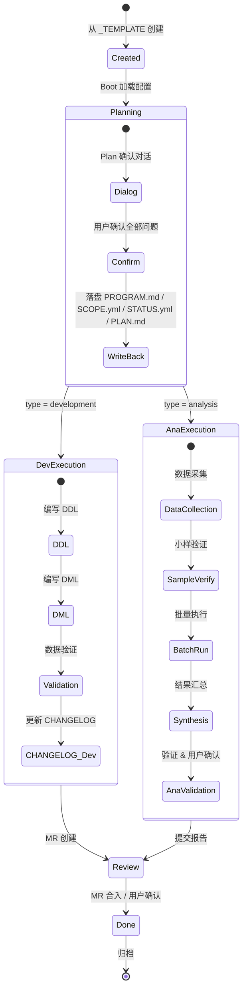

Program 是 AI 辅助数仓开发工作流中的**最小工作单元**——每一次需求交付、每一次数据分析、每一次问题排查，都以一个 Program 为载体进行。它既是任务的定义文件，也是 AI Agent 执行时的 "范围边界" 和 "记忆锚点"。理解 Program 的生命周期，是理解整个 AI 辅助开发体系运作方式的关键。

## Program 是什么

在传统的数仓开发中，一个需求通常散落在 Jira 工单、飞书消息、临时 SQL 脚本和口头约定中。Program 将这些碎片统一收拢为一个**结构化的、可追溯的、支持跨会话恢复**的工作目录。每个 Program 至少包含三份核心文件——`PROGRAM.md`（任务定义）、`SCOPE.yml`（写入范围控制）和 `STATUS.yml`（状态跟踪）——外加一个 `workspace/` 目录用于存放中间产物和最终交付物。

Program 的命名遵循 `P-YYYYMMDD-{简短描述}` 格式，日期前缀记录了创建时间，描述部分用英文连字符拼接关键词。例如 `P-20260521-firstpage-charge-anomaly` 一眼可知是 2026 年 5 月 21 日创建的首页充值异常排查任务。

Sources: [PROGRAM.md](orchestrator/PROGRAMS/_TEMPLATE/PROGRAM.md#L1-L3)

## Program 的两种类型

系统将 Program 分为两大类，分别对应不同的工作模式和执行规范：

| 维度 | 开发类（development） | 分析类（analysis） |
|------|----------------------|-------------------|
| **核心目标** | 产出 DDL/DML 代码，交付可运行的数据表 | 产出分析报告、诊断结论、结构化清单 |
| **典型场景** | 新建/修改数仓表、口径变更、代码格式化 | 数据质量问题排查、资产等级划分、血缘追踪 |
| **写入范围** | `starrocks/{layer}/` 下的 DDL/DML 文件 | 默认仅 `workspace/`，禁止修改 `starrocks/` |
| **阶段模型** | planning → in-progress → review → done | planning → data-collection → analysis → synthesis → review → done |
| **子类型** | 无（subtype: none） | batch / deep-dive / ad-hoc |

分析类的三个子类型决定了执行策略的差异：**batch**（批量分析）适用于大规模对象扫描，需要分批执行和中间汇报；**deep-dive**（深度排查）适用于根因分析，沿血缘链路逐层钻入；**ad-hoc**（临时分析）适用于一次性查询需求，交付轻量快速。

从已完成的 Program 实践来看，开发类典型如 `P-20260519-finebi-codeformat`（为 sql-codeformat skill 新增 FineBI 格式化脚本），分析类典型如 `P-20260521-firstpage-charge-anomaly`（充值金额异常暴涨 77.76% 的根因排查），两者在文件结构、执行节奏和验收标准上有显著差异。

Sources: [PROGRAM.md](orchestrator/PROGRAMS/_TEMPLATE/PROGRAM.md#L5-L9), [CORE.md](orchestrator/ALWAYS/CORE.md#L35-L39), [STATUS.yml](orchestrator/PROGRAMS/_TEMPLATE/STATUS.yml#L7-L11)

## 生命周期全景

下面这张 Mermaid 状态图展示了一个 Program 从创建到关闭的完整生命周期。图中左侧为开发类路径（蓝绿色），右侧为分析类路径（橙黄色），两类在 planning 阶段共享 Plan 确认对话协议，随后分叉进入各自的执行轨道。



Sources: [CORE.md](orchestrator/ALWAYS/CORE.md#L200-L216), [DEV-FLOW.md](orchestrator/ALWAYS/DEV-FLOW.md#L5-L8)

## Program 目录解剖

每个 Program 在 `orchestrator/PROGRAMS/` 下拥有一个独立目录，结构如下：

```
orchestrator/PROGRAMS/P-YYYYMMDD-{name}/
├── PROGRAM.md          ← 任务定义：类型、目标、方案、验收标准
├── SCOPE.yml           ← 写入范围控制：白名单 + 黑名单
├── STATUS.yml          ← 状态跟踪：阶段、任务列表、产物清单
└── workspace/          ← 工作区（中间产物 + 最终交付物）
    ├── PLAN.md         ← 详细方案（Plan 确认后生成）
    ├── CHECKPOINT.md   ← 快照（上下文紧张时写入）
    ├── HANDOFF.md      ← 交接文档（跨会话恢复）
    ├── RESULT.md       ← 最终成果总结（Program 完成时）
    ├── report.md       ← 分析报告（分析类）
    ├── data/           ← 采集的原始数据
    ├── analysis/       ← 逐对象分析中间产物
    ├── trace/          ← 血缘追踪中间结果
    └── output/         ← 结构化输出（CSV/JSON）
```

模板目录 `_TEMPLATE` 提供了新建 Program 所需的全部骨架文件。Agent 新建 Program 时，从模板目录复制三份核心文件（`PROGRAM.md`、`SCOPE.yml`、`STATUS.yml`），然后进入 Plan 模式与用户对话填充具体内容。

Sources: [PROGRAMS directory](orchestrator/PROGRAMS/_TEMPLATE/), [CORE.md](orchestrator/ALWAYS/CORE.md#L106-L112)

## 三大核心配置文件

### PROGRAM.md — 任务定义

PROGRAM.md 是 Program 的 "设计蓝图"。它通过 frontmatter 声明类型（`type: development | analysis`），包含目标、背景、方案概要、涉及表/分析范围、数据血缘、验收标准等章节。开发类 Program 必须列出新建/修改表清单、上游依赖表和下游影响表；分析类 Program 则需明确分析对象范围、使用的规则标准和产出物规格。

一个典型的开发类 PROGRAM.md 在方案概要中会包含分层归属、数据来源、关键设计决策和特殊处理说明；分析类则包含分析范围、评估框架、关键策略和数据分析采集方案。

Sources: [PROGRAM.md](orchestrator/PROGRAMS/_TEMPLATE/PROGRAM.md#L1-L126)

### SCOPE.yml — 写入范围控制

SCOPE.yml 是 AI Agent 的 "权限边界"。它定义了 Program 执行期间 Agent **可以**写入的文件路径（`write`）和**绝对不能**写入的路径（`forbidden`）。这是防止 Agent 越权修改代码的核心安全机制。

开发类 Program 的 `write` 范围以 `starrocks/{layer}/ddl/` 和 `starrocks/{layer}/dml/` 为主，精确到具体表文件；分析类 Program 默认仅开放 `workspace/`、`scripts/` 和 `documentation/`，`starrocks/` 下的 SQL 文件默认禁止写入。`forbidden` 列表则全局锁定 `orchestrator/ALWAYS/` 下的核心协议文件、`.env` 和 `.gitlab-ci.yml`。

Sources: [SCOPE.yml](orchestrator/PROGRAMS/_TEMPLATE/SCOPE.yml#L1-L44), [CORE.md](orchestrator/ALWAYS/CORE.md#L64-L70)

### STATUS.yml — 状态跟踪

STATUS.yml 是 Program 的 "进度仪表盘"。它记录了 Program 当前所处的阶段（`phase`）、整体状态（`status`）、任务列表（`tasks`）和产物清单（`artifacts`）。

每个 task 包含唯一 ID、名称、状态（pending / in-progress / done / blocked）、当前进度描述（`checkpoint`）、堵点（`blockers`）和下一步操作（`next_action`）。分析类 Program 还额外包含 `progress` 字段，用于跟踪 `total_objects`（总对象数）、`analyzed`（已分析数）和 `exceptions`（异常数）的统计进度。

以 `P-20260519-finebi-codeformat` 为例，其 STATUS.yml 经历了第一轮开发完成后又追加第二轮重构的任务列表，`phase` 从 `in-progress` 更新为 `redesign`，task ID 也从 t1~t7 扩展到 t8~t16，完整记录了 "发现架构缺陷 → 重构方案 → 重新验证" 的演进过程。

Sources: [STATUS.yml](orchestrator/PROGRAMS/_TEMPLATE/STATUS.yml#L1-L85), [P-20260519 STATUS.yml](orchestrator/PROGRAMS/P-20260519-finebi-codeformat/STATUS.yml#L1-L75)

## Boot 启动序列

当用户指定一个 Program（新建或已有）时，Agent 按以下固定序列加载配置，这个流程定义在 `orchestrator/ALWAYS/BOOT.md` 中：

**第一步：判断 Program 类型**。读取 `PROGRAM.md` 中的 `type` 字段——`development` 走开发类流程，`analysis` 走分析类流程。如果 PROGRAM.md 尚不存在（新建），则根据用户命令关键词推断。

**第二步：按类型加载规范文件**。所有类型通用加载 `ALWAYS/CORE.md`（Plan 确认清单自动按类型选取）。开发类额外加载 `ALWAYS/DEV-FLOW.md`（数仓开发流程）和 `ALWAYS/RESOURCE-MAP.yml`（资源索引）。分析类额外加载 `ALWAYS/DEV-FLOW.md`（参考命名规范和分层结构）、`ALWAYS/RESOURCE-MAP.yml` 以及 `SHARED/knowledge/` 目录下的分析规则文件（按需）。

**第三步：加载 Program 专属文件**。依次读取 `PROGRAM.md`（任务定义）、`STATUS.yml`（当前状态）和 `SCOPE.yml`（写入范围）。

**第四步：输出启动摘要**。Agent 以固定格式汇报：Program 名称、类型、目标、当前阶段和下一步行动。

**特殊情况处理**：如果 Program 目录不存在，询问用户是否从 `_TEMPLATE` 创建；如果存在 `workspace/CHECKPOINT.md`，优先读取恢复上下文；如果存在 `workspace/HANDOFF.md`，读取上次交接内容。

Sources: [BOOT.md](orchestrator/ALWAYS/BOOT.md#L1-L90)

## Plan 确认——执行前的必经之门

Plan 确认是 Program 生命周期中最关键的环节。**Agent 必须先进入 Plan 模式与用户对话，不可跳过直接写代码。** 对话围绕清单逐项确认，开发类 10 项、分析类 9 项：

| 开发类确认清单 | 分析类确认清单 |
|--------------|--------------|
| 需求理解（复述确认） | 分析目标（复述确认） |
| 目标层级（ods/dwd/dws/ads/dim） | 分析范围（schema / 表 / 对象、包含/排除条件） |
| 业务域归属 | 评估框架（规则/标准/维度） |
| 表命名（按规范生成候选） | 数据采集方案 |
| 上游表（数据来源、DDL 可参考性） | 分析粒度（逐表 / 按域 / 按分层） |
| 字段清单（来源和计算口径） | 产出物规格（报告 / 清单 / 标注 / 配置） |
| 粒度 & 周期（日/小时/全量/增量） | 小样验证（对象选取和验证标准） |
| 口径变更（新旧差异记录） | 验证标准（覆盖率 / 一致性 / 可复现性） |
| 回刷需求 | 后续动作（落盘 / 触发后续 Program） |
| 下游影响 | — |

对话达成一致后，Agent 将确认结果落盘写入 `PROGRAM.md`、`SCOPE.yml`、`STATUS.yml` 和 `workspace/PLAN.md`。PLAN.md 使用 `ALWAYS/PLAN-TEMPLATE.md` 的结构，按 Program 类型选取对应章节——开发类使用第 1-7 章，分析类使用第 1、4-8 章。用户确认 PROGRAM.md 和 SCOPE.yml 内容无误后，方可开始执行。

Sources: [CORE.md](orchestrator/ALWAYS/CORE.md#L5-L57), [PLAN-TEMPLATE.md](orchestrator/ALWAYS/PLAN-TEMPLATE.md#L1-L179)

## 双轨执行模型

Plan 确认完成后，开发类和分析类 Program 进入各自的执行轨道：

**开发类执行节奏**：DDL → DML → 数据验证 → CHANGELOG 更新 → MR 创建。核心原则包括：生产表禁止 DROP + CREATE（必须用 ALTER ADD COLUMN）、改 DML 前必须先看 DDL 确认表结构、CTE 名称和输出列名保持稳定避免破坏下游、口径变更必须在 Plan 中明确记录。

**分析类执行节奏**：数据采集 → 小样验证（3-5 个对象试跑）→ 批量执行（分批汇报中间结果）→ 汇总报告 → 验证确认。核心原则包括：规则驱动（每个结论有明确评判标准）、可追溯（结论格式：`结论 + 依据 + 置信度`）、增量交付（不要一次性跑完再汇报，给用户纠偏机会）、中间产物统一写入 `workspace/` 的子目录（`data/`、`analysis/`、`trace/`、`output/`）。

两种类型在 Scope 控制上有本质区别：开发类 Program 的 `write` 范围精确到具体 DDL/DML 文件路径；分析类 Program 默认**不允许修改 `starrocks/` 下的任何 SQL 文件**，除非 SCOPE.yml 明确授权——这从根本上防止了分析过程中的误修改。

Sources: [CORE.md](orchestrator/ALWAYS/CORE.md#L72-L139), [DEV-FLOW.md](orchestrator/ALWAYS/DEV-FLOW.md#L5-L90)

## 跨会话状态持久化

数仓开发任务往往跨越多次 AI 会话。系统的状态持久化机制确保跨会话零信息损失：

| 文件 | 写入时机 | 核心作用 |
|------|---------|---------|
| `STATUS.yml` | 持续更新 | 阶段进度、任务状态、堵点和下一步 |
| `CHECKPOINT.md` | 上下文紧张时 | 当前状态快照（已完成 / 进行中 / 关键决策 / 文件变更），便于恢复 |
| `HANDOFF.md` | 会话结束未完成时 | 交接文档（当前状态 / 分支信息 / 产出文件 / 关键决策 / 下一步 / 口径变更记录） |
| `RESULT.md` | Program 完成时 | 最终成果总结 |

HANDOFF.md 是跨会话恢复的核心。它包含当前状态摘要、Git 分支和 commit SHA、已产出的文件路径和修改内容、关键设计决策及其理由、以及明确的下一步操作清单。新会话启动时，Agent 在 Boot 阶段检测到 `workspace/HANDOFF.md` 会自动加载，用户只需说一句 "继续 P-YYYY-NNN" 即可无缝恢复。

CHECKPOINT.md 则用于上下文窗口紧张时的"抢救式"保存——当对话接近 token 上限，Agent 主动 commit 当前变更、更新 STATUS.yml 并写入 CHECKPOINT.md，然后由用户在新会话中继续。

Sources: [CORE.md](orchestrator/ALWAYS/CORE.md#L141-L198)

## CHANGELOG 集成：AI 赋能效率追踪

每个 Program 的开发过程通过仓库根目录的 `CHANGELOG.md` 进行条目化记录。每条日志以 `[AI]` 或 `[人工]` 标签开头，以 "可独立交付的单元" 为粒度记录具体工作内容。这个机制为最终统计分析 AI 赋能效率占比提供数据基础：

```markdown
## dev+xxx+xxx+xxx | 负责人: 张三 | 周期: 2026-05-10 ~ 2026-05-15

### 2026-05-10
- [AI] 扫描上游 ODS 表结构，生成 DWD 层 DDL 建表语句
- [人工] 确认字段映射关系和业务口径
- [AI] 根据字段映射编写 DWD 层 DML 数据加载脚本
- [AI] 改造下游 3 个 ADS/DWS 的 DML 文件，适配新字段
- [人工] 编写数据验证 SQL，对比新旧口径数据量级
```

CHANGELOG 的合并遵循追加规则：dev → stage 时，将 dev 分支的 section 追加到 stage 的 CHANGELOG.md 末尾；stage → master 时整体合入。最终 master 分支的 CHANGELOG.md 包含了所有历史需求的完整 AI/人工记录，可按成员、周期进行交叉统计分析。

Sources: [CHANGELOG-SPEC.md](orchestrator/ALWAYS/CHANGELOG-SPEC.md#L1-L136), [DEV-FLOW.md](orchestrator/ALWAYS/DEV-FLOW.md#L50-L68)

## Sub-Agent 委托机制

当用户明确要求 "委托" 时，主 Agent 可以将 Program 内的独立子任务派发给 Sub-Agent 并行执行。委托的核心原则是**文件通信**——Sub-Agent 之间通过 `workspace/` 下的文件传递数据，返回给主 Agent 的只有 4 行摘要（状态、报告路径、产出文件数、决策点），以此保护主 Agent 的上下文窗口不被大量中间数据淹没。

任务编号体系采用 `X.Y` 格式：`X.0` 为主 Agent 产出（规划决策），`X.1`、`X.2` 等为第 X 阶段可并行的 Sub-Agent 任务，X 递增表示串行依赖。委托仅在用户主动要求时启用，Agent 不会自动委托。

Sources: [SUB-AGENT.md](orchestrator/ALWAYS/SUB-AGENT.md#L1-L81)

## 实战案例速览

以下三个已完成 Program 展示了生命周期在实际场景中的运作方式：

| Program | 类型 | 关键特征 |
|---------|------|---------|
| `P-20260519-finebi-codeformat` | development | 经历两轮迭代——第一轮完成后发现架构缺陷（`${...}` 破坏解析），phase 更新为 `redesign`，task 从 7 个扩展到 16 个 |
| `P-20260521-firstpage-charge-anomaly` | analysis / deep-dive | 从 ads 层端到端追溯至 ods 层，7 个 task 覆盖诊断→修复→归档全流程，phase 从 planning → completed |
| `P-20260522-app-asset-grading` | analysis / ad-hoc | 逐批增量分析——用户每批指定 SQL 文件，Agent 追踪血缘并给出 P0~P4 定级建议，`progress` 统计 32 张表已定级 |

Sources: [P-20260519 PROGRAM.md](orchestrator/PROGRAMS/P-20260519-finebi-codeformat/PROGRAM.md#L1-L89), [P-20260521 PROGRAM.md](orchestrator/PROGRAMS/P-20260521-firstpage-charge-anomaly/PROGRAM.md#L1-L69), [P-20260522 STATUS.yml](orchestrator/PROGRAMS/P-20260522-app-asset-grading/STATUS.yml#L1-L63)

## 阅读建议

你已经理解了 Program 作为工作单元的完整生命周期。接下来建议按以下路径深入：

- **[Plan 确认流程与对话协议](13-plan-que-ren-liu-cheng-yu-dui-hua-xie-yi)**：深入 Plan 模式的对话细节和 PLAN-TEMPLATE.md 的结构化填写规范
- **[DDL 与 DML 开发规范](14-ddl-yu-dml-kai-fa-gui-fan)**：掌握开发类 Program 的核心产出——建表和数据加载脚本的编写标准
- **[分支管理与 CI/CD 集成](16-fen-zhi-guan-li-yu-ci-cd-ji-cheng)**：理解 Program 的代码如何通过 dev → stage → master 的分支模型流向生产
- **[跨会话上下文管理与 HANDOFF 机制](19-kua-hui-hua-shang-xia-wen-guan-li-yu-handoff-ji-zhi)**：深入理解 HANDOFF/CHECKPOINT 机制在长周期任务中的作用