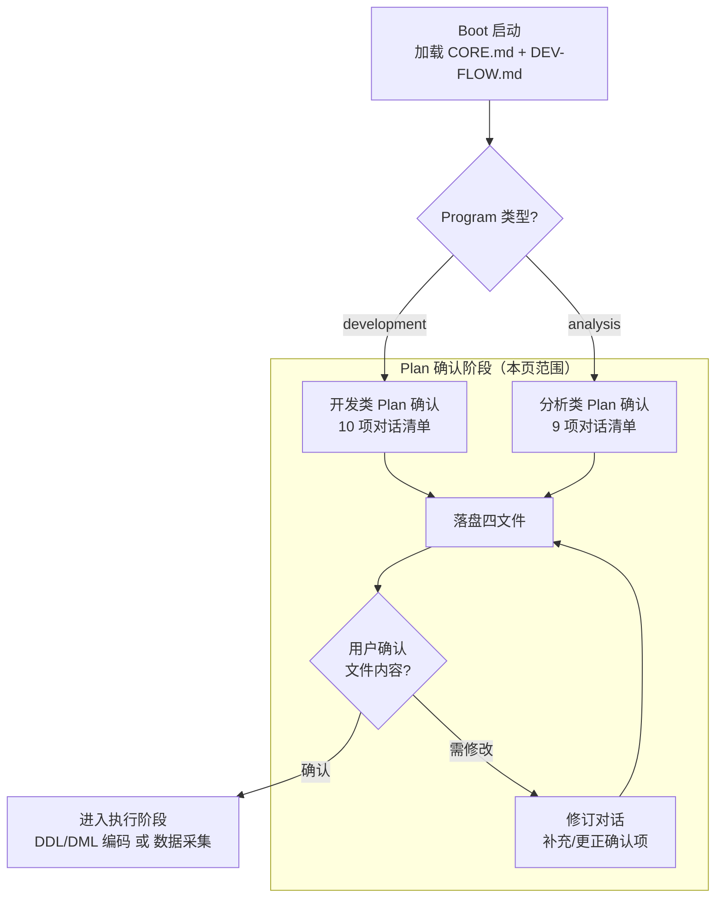
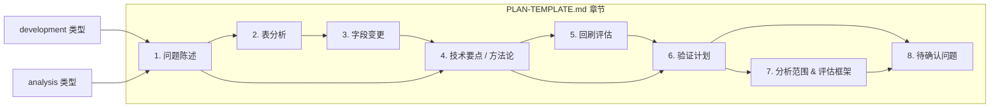
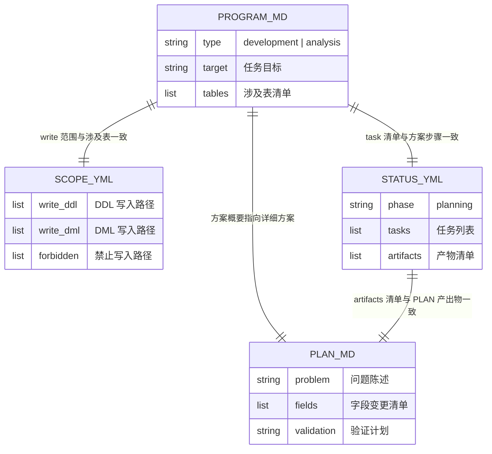

Plan 确认是 Program 生命周期中**执行前的最后一道闸门**——Agent 在接触任何代码文件之前，必须先进入 Plan 模式，通过结构化对话与用户达成完全共识，然后将共识落盘为四份可追溯的文件。这一机制设计的核心洞察是：**在 AI 辅助开发的场景下，沟通成本远低于返工成本**。一次 10 分钟的结构化对话可以避免数小时的错误编码和回滚操作，这种"先确认、后执行"的协议本质上是一种**风险前置策略**。

Sources: [CORE.md](orchestrator/ALWAYS/CORE.md#L5-L7), [DEV-FLOW.md](orchestrator/ALWAYS/DEV-FLOW.md#L10-L12)

## Plan 确认在整个 Program 生命周期中的定位

在 [Program 生命周期管理](12-program-sheng-ming-zhou-qi-guan-li) 的全景图中，Plan 确认位于 `Created → Planning → Execution` 这条路径的 Planning 阶段。它承接 Boot 序列加载的规范文件，产出一组落盘文件后，才将控制权移交给执行阶段。Plan 确认本身不产生任何 `starrocks/` 下的代码——它只产生**设计文档**和**范围声明**。



图中最关键的决策点是 `UserConfirm` 节点——用户必须**确认落盘文件内容无误**后，Agent 才能开始执行。这不是一个"看一眼通过"的仪式性环节，而是真正意义上的质量闸门：如果 PLAN.md 中列出的上游表不存在、字段口径描述含糊、或者回刷范围写错了，这些都会在执行阶段变成阻塞问题。

Sources: [WORKFLOW.md](WORKFLOW.md#L15-L24), [CORE.md](orchestrator/ALWAYS/CORE.md#L55-L57)

## 对话协议的核心规则

Plan 对话并非自由聊天，而是一套有固定节奏和顺序的**结构化协议**。Agent 在 Plan 模式下的行为受到以下规则约束：

**规则一：必须逐项确认，不可跳跃。** Agent 必须按照清单顺序逐项推进，不能因为某项"显而易见"就跳过。即使用户说"这些我都清楚，直接开始写代码"，Agent 也要至少完成需求复述和目标层级确认——因为"我清楚"和"Agent 理解一致"是两回事。

**规则二：Agent 必须复述，不可假设。** 每轮对话中，Agent 收到用户描述后，必须用自己的语言复述理解，然后等待用户确认。复述的格式为：`需求理解: {一句话复述}`。这与程序开发中的"回声确认"（echo confirmation）原理一致——如果 Agent 的理解有偏差，用户在这一步就能立即纠正。

**规则三：未确认前不可落盘。** Plan 对话过程中，Agent 不得写入 PROGRAM.md、SCOPE.yml、STATUS.yml 或 PLAN.md。只有当全部确认项达成共识后，Agent 才一次性写入这四份文件。

**规则四：已落盘不可擅自修改。** 落盘文件展示给用户后，只有用户明确要求修改时，Agent 才能编辑。这防止了 Agent 在"微调"中逐渐偏离原始共识。

Sources: [CORE.md](orchestrator/ALWAYS/CORE.md#L3-L5), [WORKFLOW.md](WORKFLOW.md#L121-L125)

## 开发类 Plan 确认清单（10 项）

开发类 Program（`type: development`）使用以下 10 项确认清单。每一项的确认深度和风险点各有不同：

| 序号 | 确认项 | 对话格式 | 不可跳过的原因 |
|------|--------|---------|--------------|
| 1 | **需求理解** | Agent 复述：`需求理解: {一句话}` | 如果理解错误，后续 9 项全部偏航 |
| 2 | **目标层级** | `目标层级: {ods/dwd/dws/ads/dim}` | 层级错了，表名、DDL 位置、DML 位置全错 |
| 3 | **业务域** | `业务域: {阅读/短剧/圣经/广告/...}` | 业务域决定命名前缀和归属目录 |
| 4 | **表命名** | Agent 生成候选表名，用户确认 | 按 `{层}_{业务域}_{主题}_{粒度}_{周期}` 规范生成 |
| 5 | **上游表** | 列出每张上游表的用途和 DDL 状态 | 上游 DDL 不存在则后续无法编写 DML |
| 6 | **字段清单** | 逐字段确认名称、类型、来源和计算口径 | 这是 DDL 和 DML 的直接输入 |
| 7 | **粒度 & 周期** | `粒度: {日/小时}，周期: {di/hi/df/ed}` | 决定分区策略和回刷窗口 |
| 8 | **口径变更** | 如有，记录旧口径→新口径的差异和原因 | 口径变更直接影响下游数据消费者的解读 |
| 9 | **回刷需求** | 是否需要回刷、回刷日期范围 | 需要回刷时 DML 必须使用 `bf_4_dt` 变量 |
| 10 | **下游影响** | 列出受影响的下游表及影响方式 | 避免"改了上游、炸了下游"的连锁故障 |

确认项 1-4 是**架构层决策**——它们定义了"表在哪里、叫什么、属于谁"；5-7 是**数据层决策**——它们定义了"数据从哪来、长什么样、多细的粒度"；8-10 是**影响面评估**——它们定义了"改多少、影响谁、要不要回填历史"。

Sources: [CORE.md](orchestrator/ALWAYS/CORE.md#L9-L20)

### 字段清单确认的深度要求

第 6 项"字段清单"是整个清单中信息密度最高的确认项。Agent 不能仅列出字段名和类型就结束——必须对每个字段的**来源表、关联键、计算逻辑和 NULL 处理策略**给出明确声明：

```
字段: user_active_days
类型: int
来源: dwd.dwd_user_login_log_di
计算逻辑: count(distinct dt) over last 30 days where login_status = 'success'
NULL 处理: coalesce(..., 0)  — 无登录记录的用户默认为 0
```

如果字段涉及复杂的 join 逻辑或窗口计算，Agent 需要在 PLAN.md 的"技术要点"章节中展开详细说明，而非在对话中塞入大段 SQL。对话阶段只确认语义正确性，语法正确性在编码阶段保证。

Sources: [PLAN-TEMPLATE.md](orchestrator/ALWAYS/PLAN-TEMPLATE.md#L49-L55), [CORE.md](orchestrator/ALWAYS/CORE.md#L74-L80)

## 分析类 Plan 确认清单（9 项）

分析类 Program（`type: analysis`）的对话结构与开发类有本质差异——分析类追求的是**结论的可靠性**而非代码的正确性。清单的设计围绕"如何确保分析结论经得起质疑"展开：

| 序号 | 确认项 | 对话格式 | 与开发类的关键差异 |
|------|--------|---------|-----------------|
| 1 | **分析目标** | 复述要回答的问题或达成的结论 | 目标不是"建一张表"，而是"回答一个问题" |
| 2 | **分析范围** | 列出 scope + 排除条件 | 范围的遗漏比代码 bug 更难发现——漏了就是结论不全 |
| 3 | **评估框架** | 引用 SHARED/knowledge 规则文件 | 规则是分析的"标尺"，标尺不准则结论全废 |
| 4 | **数据采集** | 来源和采集方式 | 数据采集可能涉及 StarRocks 查询，需确认执行窗口 |
| 5 | **分析粒度** | 逐表 / 按域 / 按分层 / 跨表对比 | 粒度选择错误会导致"结论正确但无意义" |
| 6 | **产出物** | 格式（报告/清单/CSV）+ 路径 | 产出物格式决定了后续处理链路的兼容性 |
| 7 | **小样验证** | 选哪几个对象试跑、验证标准 | 这是分析类的"需求复述"——用小样本验证框架合理性 |
| 8 | **验证标准** | 覆盖率/一致性/可复现性 | 分析类没有"编译通过"作为客观标准，必须人为定义 |
| 9 | **后续动作** | 结果是否需要落盘/触发后续 Program | 分析结论如果只停留在报告里，价值大打折扣 |

分析类清单的核心设计理念是**小样先行**（第 7 项）。在投入大量精力做全量分析之前，先用 3-5 个对象验证分析框架的合理性——评判标准是否覆盖了所有边界情况、数据采集方法是否可行、产出物格式是否满足需求。小样验证通过后，再启动批量执行，这类似于开发类中"DDL 先于 DML"的先后约束。

Sources: [CORE.md](orchestrator/ALWAYS/CORE.md#L23-L39)

## 对话协议的实际运作

下面通过三个真实对话示例展示 Plan 确认协议在实际交互中的运作方式。注意每种场景下 Agent 的推进节奏和用户确认的粒度。

### 场景一：新建开发类 Program

```
用户: 新 Program: ads 层新增一个用户活跃趋势表

Agent:
  需求理解: 在 ads 层新建日粒度表，统计用户每日活跃趋势

  接下来需要逐项确认以下内容——

  【1/10】目标层级确认为 ads，正确吗？
  【2/10】业务域推断为"用户行为"（表名前缀 ads_user_），确认吗？
  【3/10】候选表名: ads.ads_user_active_trend_di
  【4/10】需要确认上游数据来源。活跃用户的定义是什么？
         （从登录日志取？还是从行为日志取？活跃的判定标准是什么？）
  ...

用户确认每项后 → Agent 生成 PLAN.md，展示 PROGRAM.md / SCOPE.yml / STATUS.yml
用户确认文件无误 → Agent 开始编写 DDL
```

这个示例展示了 Plan 对话的**渐进确认**模式：Agent 不是一次性抛出 10 个问题轰炸用户，而是先做合理推断（"业务域推断为'用户行为'"），让用户只需确认或纠正，减少用户的认知负担。

Sources: [AGENTS.md](AGENTS.md#L98-L112)

### 场景二：新建分析类 Program

```
用户: 新分析: 对 ads 层做数据资产定级

Agent:
  分析目标: 对 ads 层所有表，按数据资产等级标准进行 P0~P4 定级

  接下来逐项确认：

  【1/9】分析范围确认为 starrocks/ads/ 下所有 DDL 定义的表，
         排除 _bak/_tmp/_test 后缀，正确吗？
  【2/9】评估框架使用 SHARED/knowledge/数据资产等级划分标准.md，
         需要我先读取并展示定级标准摘要吗？
  【3/9】数据采集方案：扫描 DDL 获取表清单 + 字段信息，
         是否需要查询 StarRocks 获取存储量级和查询频率？
  【4/9】小样验证建议选取 ads 层中涉及不同业务域的 3 张表试跑，
         确认定级框架的合理性。可以接受吗？
  ...

用户确认后 → 落盘 PROGRAM.md + SCOPE.yml + STATUS.yml + PLAN.md
```

分析类对话的关键差异在于**评估框架的确定**（第 3 项）——Agent 需要主动确认规则文件是否存在、是否需要帮助用户结构化规则、以及边界情况（规则覆盖不到的）的处理策略。

Sources: [AGENTS.md](AGENTS.md#L118-L132)

### 场景三：修改已有表（变更类）

```
用户: 新 Program: ads.ads_user_value_analysis 新增字段 user_ltv_7d

Agent:
  需求理解: 在 ads.ads_user_value_analysis 表中新增 user_ltv_7d 字段，
          统计用户 7 日 LTV

  【变更前检查】我先读取现有 DDL 确认表结构和字段顺序...

  (读取 DDL 后)
  当前表有 23 个字段，user_ltv_7d 建议放在 user_ltv_1d 之后（AFTER user_ltv_1d）。
  字段类型: decimal(18,4)，来源: dws.dws_user_ltv_di 表。

  接下来确认：
  1. 计算口径: sum(revenue) over 7 days / count(distinct user_id)，确认吗？
  2. 是否需要回刷历史？需要回刷到哪天？
  3. 该表的 DML 下游有 3 个引用（P_report_A, P_report_B, P_dashboard_C），
     新增字段不影响已有列的顺序和名称，下游无需修改。
```

变更类对话的独特之处在于**影响面评估是前置的**——Agent 在确认字段来源的同时，必须立即扫描下游引用，告知用户"这个变更会波及 A、B、C 三张表"。这避免了用户确认后又发现下游阻断的尴尬。

Sources: [WORKFLOW.md](WORKFLOW.md#L49-L67)

## PLAN-TEMPLATE.md 的章节结构与按类型选取

Plan 确认对话达成共识后，Agent 将共识结构化写入 `workspace/PLAN.md`。PLAN.md 使用 `orchestrator/ALWAYS/PLAN-TEMPLATE.md` 作为模板，根据 Program 类型自动选取对应章节：



开发类使用 1-7、8 章（1-7 为核心，第 8 章记录对话中未解决或需后续确认的遗留问题）。分析类使用 1、4、6、7、8 章（第 2、3 章的表分析和字段变更不适用于分析场景，第 4 章的方法论部分选取"分析类"子章节，第 6 章的验证计划选取"分析类"子章节）。

### 各章节的填写标准

| 章节 | 开发类填写内容 | 分析类填写内容 |
|------|-------------|-------------|
| **1. 问题陈述** | 一句话目标 + Program 类型 | 一句话目标 + Program 类型 + 分析子类型 |
| **2. 表分析** | 目标表属性 + 上游依赖 + 下游影响 | 不适用 |
| **3. 字段变更** | 新增字段清单（名称/类型/来源） + 口径变更记录 | 不适用 |
| **4. 技术要点** | Join 逻辑、数据质量措施、关键设计决策 | 分析步骤、分批策略、边界处理策略 |
| **5. 回刷评估** | 是否回刷、回刷范围、风险提示 | 不适用 |
| **6. 验证计划** | 量级检查 + 枚举值一致性 + 指标对比 SQL | 覆盖率/一致性/可复现性/边界处理的验证标准 |
| **7. 分析范围** | 不适用 | 目标分层/业务域/对象类型/筛选条件/数据采集方案/产出物规格 |
| **8. 待确认问题** | Plan 对话中暂未解决的遗留问题 | 同上 |

第 8 章"待确认问题"是一个**安全阀机制**——当 Plan 对话中某个问题暂时无法确认（比如需要向业务方确认口径、需要等上游表就绪），Agent 将问题记录在 PLAN.md 的待确认清单中，并标记 `STATUS.yml` 中对应 task 的状态为 `blocked`。这保证了 Program 不会因为一个未确认项而完全停滞。

Sources: [PLAN-TEMPLATE.md](orchestrator/ALWAYS/PLAN-TEMPLATE.md#L1-L179)

## 确认后落盘：四份文件的一致性保证

Plan 确认对话完成后，Agent 一次性写入四份文件。这四份文件之间存在严格的引用一致性约束：



**一致性约束的具体表现：**

- PROGRAM.md 中列出的每张表，其 DDL 和 DML 路径必须出现在 SCOPE.yml 的 `write` 列表中
- STATUS.yml 中 `tasks` 的每个 task 必须对应 PLAN.md 中描述的一个步骤
- STATUS.yml 中 `artifacts.plan` 必须指向 `workspace/PLAN.md`
- SCOPE.yml 中 `forbidden` 列表必须包含 `orchestrator/ALWAYS/CORE.md`、`DEV-FLOW.md`、`RESOURCE-MAP.yml` 等仓库级只读文件

以 `P-20260515-存储治理` 为例，其 PROGRAM.md 声明了 5 个涉及表（1 张新建 DWS 快照表 + 2 个 DML 改造 + 2 个下线视图），SCOPE.yml 的 `write.ddl` 和 `write.dml` 精确匹配这些表的 SQL 文件路径，STATUS.yml 的 9 个 task 覆盖从"梳理下游依赖"到"更新治理进展"的完整链路。三者之间不存在"PROGRAM.md 说改 A 表但 SCOPE.yml 没授权 A 表路径"的不一致。

Sources: [PROGRAM.md](orchestrator/PROGRAMS/P-20260515-存储治理/PROGRAM.md#L1-L87), [SCOPE.yml](orchestrator/PROGRAMS/P-20260515-存储治理/SCOPE.yml#L1-L38), [STATUS.yml](orchestrator/PROGRAMS/P-20260515-存储治理/STATUS.yml#L1-L105)

## Plan 确认与后续阶段的衔接

Plan 确认完成后，STATUS.yml 中 `phase` 字段从 `planning` 切换为下一阶段。开发类 Program 的典型阶段流转为：

```
planning → in-progress（DDL 编写 → DML 编写 → 数据验证）→ review → done
```

分析类 Program 的阶段流转为：

```
planning → data-collection → analysis（小样验证 → 批量执行 → 结果汇总）→ review → done
```

Plan 确认产出的 PLAN.md 在后继阶段中扮演**单一事实来源（Single Source of Truth）**的角色：DDL 编写时 Agent 查阅 PLAN.md 的字段清单；DML 编写时 Agent 查阅 PLAN.md 的上游依赖和计算逻辑；数据验证时 Agent 查阅 PLAN.md 的验证计划 SQL；口径变更回查时 Agent 查阅 PLAN.md 的口径变更记录表。

如果执行过程中发现 Plan 阶段遗漏了关键信息（比如编写 DML 时发现上游表缺少某个必需字段），Agent 必须**回退到 Plan 模式**——更新 PLAN.md 补充新发现的信息、更新 STATUS.yml 标记阻塞项、重新与用户确认后再继续编码。这不是"流程迂腐"，而是确保后续接手此 Program 的 Agent（可能是跨会话的另一个 Agent 实例）能从 PLAN.md 中获取完整上下文。

Sources: [CORE.md](orchestrator/ALWAYS/CORE.md#L200-L216), [DEV-FLOW.md](orchestrator/ALWAYS/DEV-FLOW.md#L5-L12)

## 对话协议的反面模式

理解"应该怎么做"之后，同样重要的是理解"不应该怎么做"。以下是 Plan 确认流程中常见的不良模式：

| 反面模式 | 表现 | 后果 |
|---------|------|------|
| **跳过 Plan 直接编码** | 用户说"新增一张表"，Agent 直接写 DDL | 表名错了、字段少了、上游表不存在——全部返工 |
| **跳跃确认** | Agent 一次抛出 10 个问题让用户填 | 用户认知过载，可能跳过关键确认项 |
| **模糊复述** | Agent 复述"您需要一张统计表"而非"ads 层日粒度用户活跃趋势表 ads.ads_user_active_trend_di" | 用户以为 Agent 理解了，但实际偏差很大 |
| **先落盘再确认** | Agent 写完了 PROGRAM.md 才展示给用户 | 用户发现大问题后需要推倒重来，落盘成本浪费 |
| **Plan 与执行脱节** | PLAN.md 写的是"日粒度"，但 DDL 建成了小时粒度 | 后续 Agent 据 PLAN.md 理解有误，口径漂移 |
| **跳过小样验证（分析类）** | 分析类 Program 直接全量跑 200 张表 | 分析框架有缺陷时，200 张表的分析结论全部作废 |

反面模式 1 和 5 是危害最大的两种——前者完全绕过了 Plan 确认机制，后者让 Plan 确认沦为形式主义。系统的约束力来自于 AI Agent 的启动序列（Boot 时强制加载 CORE.md）和 WORKFLOW.md 中"Plan 先行"的硬性声明，但最终的执行纪律仍然依赖于 Agent 的行为一致性。

Sources: [WORKFLOW.md](WORKFLOW.md#L121-L125), [CORE.md](orchestrator/ALWAYS/CORE.md#L3-L5)

## 阅读建议

你已经系统性地理解了 Plan 确认的对话协议、清单结构和落盘机制。在 Program 生命周期中，Plan 确认是"定义要做什么"的最后一步——接下来就是"怎么做到"。建议按以下路径继续：

- **[DDL 与 DML 开发规范](14-ddl-yu-dml-kai-fa-gui-fan)**：Plan 确认后，开发类 Program 的第一个执行步骤是编写 DDL 建表语句。了解 ALTER 优先原则、字段顺序约束和建表模板。
- **[SQL 编码风格与数据质量兜底](15-sql-bian-ma-feng-ge-yu-shu-ju-zhi-liang-dou-di)**：Plan 的字段清单定义了"写什么"，编码风格规范定义了"怎么写"——逗号前置、CTE 优先、NULL 兜底策略。
- **[跨会话上下文管理与 HANDOFF 机制](19-kua-hui-hua-shang-xia-wen-guan-li-yu-handoff-ji-zhi)**：当 Plan 确认和执行跨越多次会话时，HANDOFF/CHECKPOINT 机制保证 Plan 信息不丢失。
- **[数据资产等级划分与质量治理](22-shu-ju-zi-chan-deng-ji-hua-fen-yu-zhi-liang-zhi-li)**：了解分析类 Plan 清单中"评估框架"的实际应用案例——SHARED/knowledge 中的定级标准如何作为分析标尺。