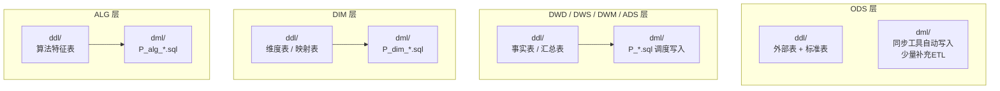
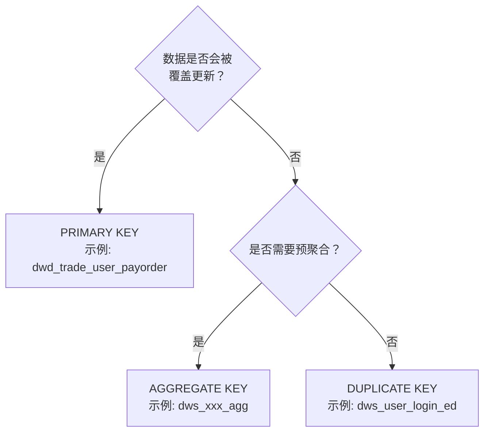

本文档定义 StarRocks 数仓各层的 DDL（建表）与 DML（数据写入）开发规范，覆盖命名约定、表模型选择、分区策略、属性配置、文件头格式、写入模式与调度变量等全流程标准。规范的设计起点是对仓库中 800+ 实际文件的模式提取——每一个约定背后都有可追溯的代码实例支撑。

## 总览：DDL/DML 文件的双轨结构

仓库中每个数据层（ODS → DWD → DWM/DWS → ADS，以及 DIM、ALG）均采用 **ddl/ + dml/** 双目录结构：`ddl/` 存放建表语句，`dml/` 存放数据写入逻辑。ODS 层是唯一的例外——其 DML 直接由数据同步工具（如 DataX/Routine Load）自动生成，因此仓库中 ODS 层的 dml/ 下仅有少量补充 ETL 脚本。



Sources: 仓库目录扫描结果 — 每层均存在 ddl/ 与 dml/ 子目录对。

---

## 表命名规范

表名由 **分层前缀** + **业务域/实体描述** + **粒度后缀** 三段组成，以下划线连接。命名是全仓库数据血缘可追溯性的第一道防线。

### 分层前缀

| 前缀 | 含义 | 示例 |
|------|------|------|
| `ods_` | 原始数据层，1:1 映射源端 | `ods_tidb_readernovel_tidb_userdata` |
| `dwd_` | 明细数据层，清洗标准化后的事实 | `dwd_trade_user_payorder` |
| `dws_` | 汇总数据层，按主题聚合的轻度汇总 | `dws_user_login_ed` |
| `dwm_` | 中间汇总层，介于 DWD 与 DWS 之间 | `dwm_ab_exp_accumulation_stat_di` |
| `ads_` | 应用数据层，面向报表/BI 的指标宽表 | `ads_bi_srsv_new_user_active_info_di` |
| `dim_` | 维度层，描述性参照数据 | `dim_user_account_info_view` |
| `alg_` | 算法层，特征工程与推荐数据 | `alg_short_video_series_feature_di` |

Sources:
[dwd_trade_user_payorder](starrocks/dwd/ddl/dwd_trade_user_payorder.sql#L1-L2)
[dws_user_login_ed](starrocks/dws/ddl/dws_user_login_ed.sql#L1-L2)
[ods_tidb_readernovel_tidb_userdata](starrocks/ods/ddl/ods_tidb_readernovel_tidb_userdata.sql#L17-L18)

### 粒度后缀

后缀约定是表设计中最关键的语义信号——它直接决定了 DML 的写入策略（DELETE+INSERT 还是纯 INSERT）。

| 后缀 | 全称 | 含义 | 典型写入策略 |
|------|------|------|-------------|
| `_di` | daily incremental | 日增量，每天一个分区，分区内数据不可变 | DELETE `${bf_1_dt}` + INSERT |
| `_df` | daily full | 日全量，每次覆盖全表 | INSERT OVERWRITE 或临时表替换 |
| `_da` | daily accumulation | 日累计，每天追加新数据，不删历史 | INSERT INTO |
| `_ed` | end-of-day | 日终全量快照 | DELETE `${bf_1_dt}` + INSERT |
| `_a` | accumulation | 累计表，持续追加 | INSERT INTO |
| `_hi` | hourly incremental | 小时增量 | DELETE 小时分区 + INSERT |
| `_mi` | monthly incremental | 月增量 | DELETE 月分区 + INSERT |
| `_p_di` | partitioned daily inc. | 分区日增量（强调分区语义） | 同 `_di` |
| `_p_da` | partitioned daily acc. | 分区日累计（强调分区语义） | 同 `_da` |

实际文件验证：
[dws_user_login_ed](starrocks/dws/ddl/dws_user_login_ed.sql#L1-L2) — `_ed` 后缀表，DML 使用 `delete from dws.dws_user_login_ed where dt = '${bf_1_dt}'` 后 `insert into`。
[dws_user_wide_active_ed](starrocks/dws/dml/P_dws_user_wide_active_ed.sql#L21-L23) — 同样 `_ed` 后缀，DML 直接 `insert into`（分"昨天"和"当天"两段，无删除——因为分区主键天然去重）。

### 视图后缀

视图统一以 `_view` 结尾，DDL 文件直接存放在对应层的 ddl/ 目录下。视图用于封装复杂 JOIN 或提供维度表的标准接口。

Sources: [dim_user_account_info_view](starrocks/dim/ddl/dim_user_account_info_view.sql) 等 dim_*_view 系列文件。

---

## DDL 开发标准

### 文件头规范

ODS 与 ODS_LOG 层 DDL 文件**必须**包含来源映射注释块，因为 ODS 表直接对接外部数据源，可追溯性是数据质量的底线：

```sql
----------------------------------------------------------------
-- 目标表：ods.ods_tidb_readernovel_tidb_userdata
-- 来源实例：xx-mysql-slave
-- 来源表：readernovel_tidb_fr.userdata 等
-- 来源负责人：未知
-- 开发人：050239
-- 开发日期：2026-05-15
----------------------------------------------------------------
```

Sources: [ods_tidb_readernovel_tidb_userdata](starrocks/ods/ddl/ods_tidb_readernovel_tidb_userdata.sql#L1-L16) 、[ods_sensors_cd_video_startwatching](starrocks/ods_log/ddl/ods_sensors_cd_video_startwatching.sql#L1-L9)

非 ODS 层（DWD/DWS/ADS/DIM/ALG）的 DDL 文件**不需要**此注释块，因为这些表的数据来源在上游 DML 中已有明确追溯。

### 表模型选择：决策矩阵

StarRocks 提供四种表模型，仓库实际使用以下三种。选择的首要原则是**根据数据写入模式和查询模式匹配模型**：

| 模型 | 适用场景 | 仓库使用比例 | 关键特征 |
|------|---------|-------------|---------|
| **PRIMARY KEY** | 需要 UPSERT 的事实表、维度表（占主导） | ~70% | 主键唯一，支持部分列更新 |
| **DUPLICATE KEY** | 仅追加的日志/事件明细表 | ~25% | 无主键约束，按排序键聚集 |
| **AGGREGATE KEY** | 需要预聚合的指标表 | ~5% | 按 key 列聚合，Replace/Sum/Max 等 |

**判断流程图**：



Sources:
PRIMARY KEY 示例 — [dwd_trade_user_payorder](starrocks/dwd/ddl/dwd_trade_user_payorder.sql#L32-L33): `primary key(dt, ProductId, AutoId)`
DUPLICATE KEY 示例 — [dws_user_login_ed](starrocks/dws/ddl/dws_user_login_ed.sql#L18-L19): `DUPLICATE KEY(dt, Productid)`

### 列定义格式规范

列定义遵循严格的纵向对齐规则，每列包含以下要素：

**对齐规则（从格式化工具规则中提取）**：
- 第一个列名前缩进 5 空格，后续列的前置逗号缩进 4 空格
- 数据类型以最长列名为基准对齐（额外空 1 格）
- 可空性/默认值以最长数据类型为基准对齐
- 注释 `comment "..."` 以最长的可空性/默认值组合为基准对齐
- `not null` 明确写，可空时省略 `null` 关键字

```sql
create table dim.dim_date (
     date_id               varchar(50) not null    comment "日期(yyyymmdd)"
    ,datestr               varchar(50) not null    comment "日期(yyyy-mm-dd)"
    ,date_name             varchar(50)             comment "日期名称中文"
    ,weekid                int(11)                 comment "周(0-6,周日~周六)"
    ...
    ,etl_time              datetime   default current_timestamp comment "处理时间"
)
```

Sources:
[dim_date](starrocks/dim/ddl/dim_date.sql#L1-L10) — 典型列对齐示例
[createTable-format-rules](orchestrator/SKILLS/sql-codeformat/references/createTable-format-rules.md#L43-L53) — 列定义对齐规则

### 列类型约定

| 实际写 | 不应写 | 原因 |
|--------|--------|------|
| `bigint` | `bigint(20)` | 无意义精度声明，格式化工具自动去除 |
| `int` | `int(11)` | 同上 |
| `string` | `varchar(65533)` | StarRocks 中 65533 是最大 varchar，语义等同于 string |
| `datetime` | — | 统一使用，不用 timestamp |
| `decimal(18, 2)` | — | 金额字段标准精度 |

Sources: [createTable-format-rules](orchestrator/SKILLS/sql-codeformat/references/createTable-format-rules.md#L47-L48)

### 标准 audit 列

每张表建议包含以下 ETL audit 列（ODS 层使用 `sr_createtime`/`sr_updatetime`，其他层使用 `etl_time`）：

| 列名 | 类型 | 用途 | 适用层 |
|------|------|------|--------|
| `etl_time` | `datetime default current_timestamp` | ETL 处理时间戳 | DWD/DWS/ADS/DIM |
| `sr_createtime` | `datetime default current_timestamp` | StarRocks 数据注入时间 | ODS |

Sources:
[dwd_trade_user_payorder](starrocks/dwd/ddl/dwd_trade_user_payorder.sql#L31): `etl_time datetime default current_timestamp comment "etl清洗时间"`
[ods_tidb_readernovel_tidb_userdata](starrocks/ods/ddl/ods_tidb_readernovel_tidb_userdata.sql#L94-L95): `sr_createtime` / `sr_updatetime`

### 分区策略

仓库中实际使用三种分区策略，按粒度从粗到细：

#### 策略一：`date_trunc` 表达式分区（推荐，简洁）

适用于 PRIMARY KEY 表且分区粒度明确为"天"的场景。最简洁，不需要维护分区列表。

```sql
partition by date_trunc('day', dt)
```

Sources: [dwd_trade_user_payorder](starrocks/dwd/ddl/dwd_trade_user_payorder.sql#L35)

#### 策略二：RANGE 分区 + 动态分区属性（大规模使用）

适用于多数 DWS/ADS 层大表。显式定义首批分区后，由 `dynamic_partition` 属性自动扩展。**分区粒度由 `dynamic_partition.time_unit` 决定**：

```sql
partition by range(dt)
(partition p202006 values [("2020-06-01"), ("2020-07-01")),
 ...
 partition p202608 values [("2026-08-01"), ("2026-09-01")))
distributed by hash(...) buckets 1
properties (
    "dynamic_partition.enable" = "true",
    "dynamic_partition.time_unit" = "month",  -- 或 "day"
    "dynamic_partition.time_zone" = "Asia/Shanghai",
    "dynamic_partition.start" = "-2147483648",
    "dynamic_partition.end" = "3",
    "dynamic_partition.prefix" = "p",
    ...
)
```

Sources:
[dws_user_login_ed](starrocks/dws/ddl/dws_user_login_ed.sql#L21-L113) — 按月 RANGE 分区 + dynamic_partition
[ods_sensors_cd_video_startwatching](starrocks/ods_log/ddl/ods_sensors_cd_video_startwatching.sql#L42-L51) — 按天 RANGE 分区 + dynamic_partition（ODS_LOG 层使用 DAY 粒度）

#### 策略三：无分区（小表/维度表）

DIM 层维度表和 ALG 层算法特征表通常不分区或仅简单分区。

Sources: [dim_date](starrocks/dim/ddl/dim_date.sql) — 无分区子句、[alg_novel_book_embedding](starrocks/alg/ddl/alg_novel_book_embedding.sql) — 无分区

### 分桶策略

分桶键选择原则：**高基数 + 查询高频列**。通常将主键中的核心 ID 列作为分桶键：

```sql
distributed by hash(product_id, id) buckets 20   -- ODS 大表，桶数较多
distributed by hash(dt, product_id, core) buckets 1  -- DWS/ADS 表，搭配 dynamic_partition.buckets
```

`buckets 1` 常见于已启用 dynamic_partition 的 ADS/DWS 表——此时分桶由动态分区属性 `dynamic_partition.buckets` 控制。

Sources:
[ods_tidb_readernovel_tidb_userdata](starrocks/ods/ddl/ods_tidb_readernovel_tidb_userdata.sql#L101): `buckets 20`
[ads_user_login_dau](starrocks/ads/ddl/ads_user_login_dau.sql#L59): `buckets 1`

### 标准 Properties 配置

生产表的标准 properties 块（三副本 + 持久化索引 + LZ4 压缩）：

```sql
properties (
    "replication_num" = "3",
    "bloom_filter_columns" = "UserId, CreateTime",
    "in_memory" = "false",
    "enable_persistent_index" = "true",
    "replicated_storage" = "true",
    "compression" = "LZ4"
)
```

ODS_LOG 层例外——使用 2 副本 + ZSTD 压缩以降低存储成本：

```sql
properties (
    "replication_num" = "2",
    ...
    "compression" = "ZSTD"
)
```

Sources:
[dwd_trade_user_payorder](starrocks/dwd/ddl/dwd_trade_user_payorder.sql#L37-L44) — 标准 properties
[ods_sensors_cd_video_startwatching](starrocks/ods_log/ddl/ods_sensors_cd_video_startwatching.sql#L46-L54) — ODS_LOG 层 2 副本 + ZSTD

### ODS 外部表（HIVE 引擎）

ODS 层对接 Hive 生态时使用 `ENGINE=HIVE` 外部表，通过 `PROPERTIES` 指定 Hive 连接信息：

```sql
CREATE EXTERNAL TABLE `ods_sensors_data_event_stream_new` (
  `_track_id` bigint NULL COMMENT "",
  `event` varchar(65533) NULL COMMENT "",
  `dt` varchar(65533) NULL COMMENT "分区"
) ENGINE=HIVE
COMMENT "PARTITION BY (dt)"
PROPERTIES (
"database" = "ods_loggateway",
"table" = "ods_sensors_data_event_stream_new",
"resource" = "hive0",
...
)
```

Sources: [ods_sensors_data_event_stream_new](starrocks/ods/ddl/ods_sensors_data_event_stream_new.sql#L1-L23)

---

## DML 开发标准

### 文件命名与组织

DML 文件统一以 `P_` 前缀命名（代表 Procedure/Process），存放于对应层的 `dml/` 子目录。文件名格式：`P_<target_table_name>.sql`。

| DDL 文件 | 对应 DML 文件 |
|----------|-------------|
| `starrocks/ads/ddl/ads_user_login_dau.sql` | `starrocks/ads/dml/P_ads_user_login_dau.sql` |
| `starrocks/dws/ddl/dws_user_login_ed.sql` | `starrocks/dws/dml/P_dws_user_login_ed.sql` |
| `starrocks/dim/ddl/dim_user_all_info.sql` | `starrocks/dim/dml/P_dim_user_all_info.sql` |

### DML 文件头规范

每个 DML 文件**必须**包含两段注释头：

**第一段：任务元数据块**（由 DolphinScheduler 自动生成/同步）：

```sql
----------------------------------------------------------------
-- project_name     : starrocks
-- workflow_name    : tbl_ads_user_login_dau
-- workflow_version : 6
-- create_user      : admin
-- task_name        : ads_user_login_dau
-- task_version     : 6
-- update_time      : 2025-04-07 18:41:39
-- sql_path         : \starrocks\tbl_ads_user_login_dau\ads_user_login_dau
----------------------------------------------------------------
```

**第二段：功能描述块**（开发者编写）：

```sql
----------------------------------------------------------------
-- 程序功能： 阅读线-用户域登录阅读充值消耗事件汇总活跃表
-- 程序名： P_dws_user_wide_active_ed
-- 目标表： dws.dws_user_wide_active_ed
-- 负责人： qhr
-- 开发日期： 2026-02-11
----------------------------------------------------------------
```

Sources:
[P_ads_user_login_dau](starrocks/ads/dml/P_ads_user_login_dau.sql#L1-L9) — 任务元数据块
[P_dws_user_wide_active_ed](starrocks/dws/dml/P_dws_user_wide_active_ed.sql#L13-L19) — 功能描述块

### 写入策略：两种模式

**模式一：DELETE + INSERT（idempotent daily）**

用于 `_di`、`_ed` 等日增量/日快照表。先删除目标分区已有数据，再写入新数据，保证幂等性。这是最常用的模式。

```sql
delete from dws.dws_user_login_ed where dt = '${bf_1_dt}';

insert into dws.dws_user_login_ed
select ...
from dwd.dwd_user_appstartlog a
left join dim.dim_user_account_info_view b on ...
where a.dt = '${bf_1_dt}' and userid > 0
group by 1,2,3,4,5,6,7,8,9,10,11,12
;
```

Sources: [P_dws_user_login_ed](starrocks/dws/dml/P_dws_user_login_ed.sql#L12-L27)

**模式二：纯 INSERT INTO（append-only / UPSERT by PK）**

用于 PRIMARY KEY 表——StarRocks 会自动按主键去重，无需显式 DELETE。也用于 `_da` 累计表和 `_a` 累计表。

```sql
insert into ads.ads_user_login_dau
select ...
from dws.dws_user_login_ed
where dt >= '${bf_1_dt}' and dt < '${dt}'
group by 1, 2, 3, 4, 5, 6, 7
;
```

Sources: [P_ads_user_login_dau](starrocks/ads/dml/P_ads_user_login_dau.sql#L12-L18)

### 调度变量

DML 中使用两类时间变量，由 DolphinScheduler 在运行时注入：

| 变量 | 含义 | 典型用法 |
|------|------|---------|
| `${dt}` | 当前调度日期 | 当天数据筛选：`where dt = '${dt}'` |
| `${bf_1_dt}` | 前一天（before 1 day） | 昨天数据筛选：`where dt = '${bf_1_dt}'` |

**双段 INSERT 模式**：对于需要同时写入"昨天"和"当天"的场景（如宽表），DML 文件包含两段独立的 INSERT 语句——第一段处理 `${bf_1_dt}` 的完整数据，第二段处理 `${dt}` 的增量数据。

Sources:
[P_dws_user_wide_active_ed](starrocks/dws/dml/P_dws_user_wide_active_ed.sql#L21-L131) — 第一段 `where dt = '${bf_1_dt}'`，第二段 `where dt = '${dt}'`

### CTE（WITH 子句）使用规范

复杂 DML 使用 CTE 分层组织逻辑，遵循以下约定：

- CTE 名称使用 `snake_case`，语义化命名
- 每个 CTE 内部独立缩进
- 多个 CTE 之间不空行（逗号分隔）
- CTE 定义与主查询之间无空行

```sql
insert into ads.ads_bi_srsv_new_user_active_info_di
with user_book_id as (
    select prodct_type, user_id, book_id
    from ads.ads_user_install_info_view a
    where product_id in (...)
    qualify row_number() over (partition by prodct_type, user_id order by install_date) = 1
),
book_info as (
    select 1 as prodct_type, book_id, book_code
    from dim.dim_shuangwen_book_read_consume_info
    union all
    select 2 as prodct_type, series_id as book_id, source_series_code as book_code
    from dim.dim_sv_series_hi
)
select ...
from (...) t
left join user_book_id t1 on ...
;
```

Sources: [P_ads_bi_srsv_new_user_active_info_di](starrocks/ads/dml/P_ads_bi_srsv_new_user_active_info_di.sql#L15-L50)

### 代码格式化规则概要

DML 格式化由 `sql-codeformat` 技能驱动，核心规则（详见 [SQL 编码风格与数据质量兜底](15-sql-bian-ma-feng-ge-yu-shu-ju-zhi-liang-dou-di)）：

| 规则项 | 规范 |
|--------|------|
| 关键字 | 全部小写（`select`, `from`, `where`, `join`, `and`, `case`, `when` 等） |
| 逗号风格 | **前置逗号**，缩进 `select_indent + 5` |
| 别名 | `as` 垂直对齐，不强制补 `as` |
| JOIN 缩进 | `from`/`join` 缩进 `select_indent + 2`；`on` 缩进 `join_indent + 2` |
| case when | `when` 与第一个 `when` 对齐，`end` 的 `d` 与 `case` 的 `e` 对齐 |
| union all | 不缩进（col 0），前后各一个空行 |
| 运算符 | 比较运算符左右各加一个空格 |

Sources: [dml-format-rules](orchestrator/SKILLS/sql-codeformat/references/dml-format-rules.md#L1-L206)

---

## 分层开发规范速查

### ODS 层

| 维度 | 规范 |
|------|------|
| 表模型 | PRIMARY KEY（按源表主键）或 ENGINE=HIVE（外部表） |
| 分区 | 通常不分区或简单 RANGE 分区 |
| DDL 文件头 | **必须**包含来源映射注释块 |
| DML | 由同步工具自动写入；仅少量补充 ETL 脚本存在于 dml/ |
| 特殊列 | `sr_createtime`、`sr_updatetime` 记录注入时间 |

### DWD 层

| 维度 | 规范 |
|------|------|
| 表模型 | PRIMARY KEY（按业务主键）或 DUPLICATE KEY（日志/事件） |
| 分区 | `date_trunc('day', dt)` 或 RANGE 按月 + dynamic_partition |
| DML 策略 | DELETE `${bf_1_dt}` + INSERT INTO（日增量）；纯 INSERT INTO（日志追加） |
| 数据来源 | 从 ODS 层读取，清洗标准化 |
| 关键要求 | 所有 ID 列类型统一、NULL 值处理明确、枚举值标准化 |

### DWS / DWM 层

| 维度 | 规范 |
|------|------|
| 表模型 | PRIMARY KEY 或 DUPLICATE KEY |
| 分区 | RANGE 按月 + dynamic_partition（大规模使用） |
| DML 策略 | DELETE `${bf_1_dt}` + INSERT INTO（单日覆盖）；双段 INSERT（昨天+当天） |
| 聚合粒度 | `_ed`（日终汇总）、`_a`（累计）、`_hi`（小时汇总） |
| 关键要求 | 聚合字段与 DDL 列顺序一致；复合指标建议保留中间计算列 |
| 典型数据来源 | 从 DWD 层读取，做 JOIN + GROUP BY 聚合 |

### ADS 层

| 维度 | 规范 |
|------|------|
| 表模型 | PRIMARY KEY（按报表维度组合） |
| 分区 | RANGE 按月 + dynamic_partition 或 `date_trunc('day', dt)` |
| DML 策略 | INSERT INTO（依赖 PRIMARY KEY 自动去重） |
| 关键要求 | 面向 BI 工具（FineBI/FineReport），字段命名需与业务口径一致 |
| 典型数据来源 | 从 DWS/DIM 层读取，做最终业务指标计算 |

### DIM 层

| 维度 | 规范 |
|------|------|
| 表模型 | PRIMARY KEY（按维度主键） |
| 分区 | 通常不分区 |
| DML 策略 | INSERT INTO（全量覆盖，借助 PRIMARY KEY 去重） |
| 关键要求 | 维度属性完整、历史拉链表需额外 `start_date`/`end_date` |
| 典型数据来源 | 从 ODS 层读取，做维度属性标准化 |

### ALG 层

| 维度 | 规范 |
|------|------|
| 表模型 | PRIMARY KEY 或 DUPLICATE KEY |
| 分区 | 通常不分区或简单分区 |
| DML 策略 | INSERT INTO |
| 关键要求 | 特征向量列可用 `string` 类型存储 JSON/序列化数据 |
| 典型数据来源 | 从 DWD/DWS 层读取，做特征工程计算 |

---

## 改表规范（ALTER vs DROP+CREATE）

从 CORE.md 中提炼的关键原则：

> **生产表禁止 DROP + CREATE（会丢数据）。新增字段用 `ALTER TABLE ... ADD COLUMN ... AFTER ...`。只有全新建表才用 CREATE TABLE。**

DDL 文件改动时遵循以下决策矩阵：

| 场景 | 操作 | 风险 |
|------|------|------|
| 新建表 | `CREATE TABLE` | 无 |
| 新增字段（末尾） | `ALTER TABLE ... ADD COLUMN` | 低 |
| 新增字段（指定位置） | `ALTER TABLE ... ADD COLUMN ... AFTER ...` | 低 |
| 修改字段类型 | 需评估兼容性，通常不可逆 | 高 |
| 删除字段 | 需评估下游影响 | 高 |

Sources: [CORE.md](orchestrator/ALWAYS/CORE.md#L46-L49)

DML 修改时，新增字段在 INSERT 语句中的位置**必须与 DDL 字段顺序一致**。修改 JOIN 逻辑时需检查是否会导致 fan-out（一对多膨胀）。

---

## 数据口径变更管理

口径变更（改字段来源/计算方式）是数仓开发中最敏感的操作。规范要求：

1. **Plan 阶段必须明确记录**：旧口径是什么，新口径是什么，为何变更
2. **DML 文件注释**：在变更处添加行内注释说明新旧差异
3. **回刷评估**：判断是否需要回刷历史分区
4. **下游影响分析**：确认哪些下游表依赖该字段，逐一评估

口径变更记录格式（写入 PROGRAM.md 或 HANDOFF.md）：

```
- {字段名}: 旧={来源A/计算方式A} → 新={来源B/计算方式B}
- 影响范围: {下游表清单}
- 回刷需求: {是/否，如是则回刷范围}
```

Sources: [CORE.md](orchestrator/ALWAYS/CORE.md#L52-L56)

---

## 推荐阅读路径

完成本文档后，建议按以下顺序深入：

1. **[SQL 编码风格与数据质量兜底](15-sql-bian-ma-feng-ge-yu-shu-ju-zhi-liang-dou-di)** — 了解格式化工具的具体规则和数据质量检查策略
2. **[StarRocks 表模型与分区策略](28-starrocks-biao-mo-xing-yu-fen-qu-ce-lue)** — 深入理解表模型选择和分区设计原理
3. **[DolphinScheduler 调度参数与任务编排](27-dolphinscheduler-diao-du-can-shu-yu-ren-wu-bian-pai)** — 了解 DML 脚本在调度系统中的运行方式和参数传递
4. **[分支管理与 CI/CD 集成](16-fen-zhi-guan-li-yu-ci-cd-ji-cheng)** — 掌握 DDL/DML 文件的版本控制和上线流程
5. **[DAS 元数据管理工具](29-das-yuan-shu-ju-guan-li-gong-ju)** — 了解 DAS 系统如何自动采集和管理表结构元数据