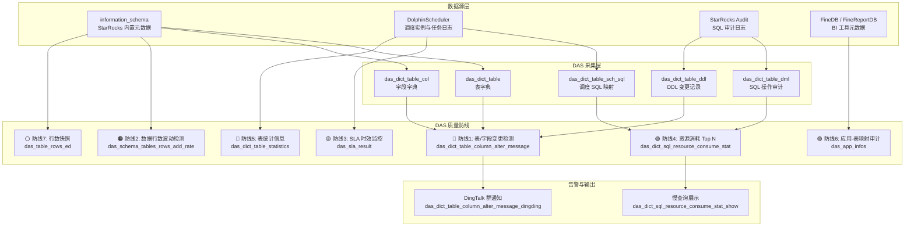

本页是开发工作流中的两个横切关注点：**SQL 编码风格**定义了仓库中三类 SQL 文件（DDL、DML、FineBI）的格式化标准与自动化工具链；**数据质量兜底**描述了 DAS（Data Asset System）元数据管理体系中每日自动运行的七道质量校验防线。前者保证代码可读性与一致性，后者保证数据正确性与时效性——二者共同构成"写得规范、跑得放心"的工程基座。

## SQL 编码风格：三类文件的格式化体系

仓库中约 300+ `.sql` 文件分布在 DDL、DML 和 FineBI 三个不同目录结构中。它们服务于不同的执行阶段（建表、ETL 写入、BI 查询），因此需要三套独立但共享核心原则的格式化策略。所有格式化均由确定性 Python 脚本执行，零 AI 参与，保证输出可重复、可校验。

Sources: [SKILL.md](orchestrator/SKILLS/sql-codeformat/SKILL.md#L1-L129)

### 格式化器触发矩阵

格式化器的选择由三个维度决定：文件所在目录、SQL 语句类型、文件名特征。以下矩阵给出了精确的匹配优先级——当多个条件同时满足时，选择匹配范围最窄的格式化器。

| 触发条件 | 格式化器 | 匹配优先级 |
|---|---|---|
| 文件位于 `ddl/` 目录，文件名不含 `view`，含 `create table` | `format_starrocks_create_table.py` | 最窄（仅 DDL） |
| 文件位于 `dml/` 目录，含 `insert into/overwrite` + `select`/`with` | `format_starrocks_insert_select.py` | 中等（DML 写入） |
| 路径含 `Application/FineBI`，含 `select`/`with` | `format_finebi.py` | 中等（BI 查询） |
| 以上均不匹配 | 手动格式化，保持语义不变 | 兜底 |

Sources: [SKILL.md](orchestrator/SKILLS/sql-codeformat/SKILL.md#L19-L22), [SKILL.md](.claude/skills/sql-codeformat/SKILL.md#L25-L31)

三种格式化器共享 **"保守策略"** 这一根本设计原则：不修改 SQL 语义、不改变字段顺序、不重写表达式、不触碰字符串字面量和调度变量（`${...}`）。它们只做"表面"格式化——关键字大小写、缩进、对齐、反引号处理——这些是纯粹的词法和布局变换，绝不会引入逻辑 bug。

### DDL 格式化器：建表语句的结构化重写

DDL 格式化器对 `create table` 语句进行最深度的重写，因为它处理的 DDL 在结构上是高度可预测的——列定义、键子句、分区、分桶、属性——每部分都有固定语法位置。

**触发门禁**（五条全部满足才执行）：
1. 目标文件是 `.sql` 文件
2. 父目录名为 `ddl`
3. 文件名不含 `view`（大小写不敏感）
4. SQL 内容包含 `create table`
5. 当前任务是格式化而非修改表结构语义

执行命令（以非 ODS 层为例）：
```bash
python orchestrator/SKILLS/sql-codeformat/scripts/format_starrocks_create_table.py path/to/file.sql --write
```

对于 `ods` / `ods_log` 层文件，标准头部需要来源信息，因此执行前必须向用户确认：
```bash
python orchestrator/SKILLS/sql-codeformat/scripts/format_starrocks_create_table.py path/to/ods_table.sql --write \
    --source-instance "..." --source-table "..." --source-owner "..." --developer "..."
```

Sources: [SKILL.md](orchestrator/SKILLS/sql-codeformat/SKILL.md#L28-L32), [format_starrocks_create_table.py](orchestrator/SKILLS/sql-codeformat/scripts/format_starrocks_create_table.py#L420-L536)

格式化后的 DDL 结构如下——以 DWD 层为例：

```sql
create table if not exists dwd.dwd_consume_user_consume (
     dt            date           not null                 comment "createtime 分区"
    ,product_id    int            not null                 comment "产品id"
    ,auto_id       bigint         not null                 comment "自增id"
    ,types         int            not null                 comment "1：阅币，2：礼券"
    ,user_id       bigint                                  comment "用户ID"
    ,etl_time      datetime       default current_timestamp comment "etl清洗时间"
)
primary key (dt, product_id, auto_id, types)
comment "消耗域用户消费事实表"
partition by range(dt)
(partition p20251201 values less than ("2025-12-02"))
distributed by hash (product_id, auto_id) buckets 5
properties (
    "replication_num" = "2",
    "dynamic_partition.enable" = "true",
    "dynamic_partition.time_unit" = "MONTH",
    ...
)
;
```

Sources: [dwd_consume_user_consume.sql](starrocks/dwd/ddl/dwd_consume_user_consume.sql#L1-L45)

核心变换规则如下表：

| 变换项 | 规则 | 示例 |
|---|---|---|
| `create table` | 统一改为 `create table if not exists` | 幂等建表 |
| 反引号 | 全部删除 | `` `dt` `` → `dt` |
| `engine` 子句 | 删除 StarRocks `engine=olap` | — |
| 关键字/数据类型 | 引号外统一小写 | `BIGINT(20)` → `bigint` |
| `bigint`/`int`/`tinyint` 长度 | 删除长度修饰 | `bigint(20)` → `bigint` |
| `varchar(65533)` | 改写为 `string` | `varchar(65533)` → `string` |
| 列名/类型/属性/注释 | 四段垂直对齐 | 见上方示例 |
| 前置逗号 | 第一个列无逗号，后续列前置逗号缩进 4 空格 | `,col2_name` |
| 表级子句顺序 | 键 → 注释 → 分区 → 分桶 → 属性 | 严格遵循 |

Sources: [createTable-format-rules.md](orchestrator/SKILLS/sql-codeformat/references/createTable-format-rules.md#L1-L82)

ODS 层文件的特殊之处在于，格式化器会为其自动生成标准头部注释块，记录数据来源的完整链路信息——来源实例、来源表、来源负责人、开发人、开发日期——这是数据血缘追溯的起点。

### DML 格式化器：INSERT SELECT 的缩进对齐体系

DML 格式化器处理的是仓库中最复杂的 SQL——多段 `union all`、多层嵌套子查询、`case when` 表达式——它必须在"不改变语义"的硬约束下实现视觉一致性。

**触发门禁**（五条全部满足）：
1. 目标文件是 `.sql` 文件
2. 父目录名为 `dml`
3. SQL 包含 `insert into` 或 `insert overwrite`
4. `insert` 主体是 `select` 或 `with ... select`
5. 当前任务是格式化而非修改 ETL 逻辑

执行命令：
```bash
# 已有文件头（含 "-- 程序功能" 注释块）——保留不变
python orchestrator/SKILLS/sql-codeformat/scripts/format_starrocks_insert_select.py path/to/file.sql --write

# 无文件头——需要提供功能和负责人
python orchestrator/SKILLS/sql-codeformat/scripts/format_starrocks_insert_select.py path/to/file.sql --write \
    --function "程序功能描述" --owner "负责人"
```

Sources: [SKILL.md](orchestrator/SKILLS/sql-codeformat/SKILL.md#L65-L73), [format_starrocks_insert_select.py](orchestrator/SKILLS/sql-codeformat/scripts/format_starrocks_insert_select.py#L858-L970)

DML 格式化采用 **基于 `select` 关键字的相对缩进体系**：所有子句的缩进位置都是 `select_indent` 的函数。下图展示了完整结构：

```
insert into db_name.table_name           -- col 0
select expr1                             -- col 0 (本段 select)
     , expr2                 as alias2   -- col 5 (前置逗号)
     , case lower(os) when 'ios' then 1  -- col 5
                      when 'android' then 4
                      else -99
            end               as os_id   -- end 的 'd' 对齐 case 的 'e'
  from source_table           as src     -- col 2 (select_indent + 2)
  left join other_table       as ot      -- col 2
    on src.key = ot.key                  -- col 4 (join_indent + 2)
   and src.key2 = ot.key2                -- col 3 (join_indent + 1)
 where cond                              -- col 1 (select_indent + 1)
   and cond2                             -- col 3 (where_indent + 2)
 group by 1, 2                           -- col 1
;

union all                                -- col 0, 前后各一空行

select ...
```

Sources: [dml-format-rules.md](orchestrator/SKILLS/sql-codeformat/references/dml-format-rules.md#L1-L206)

关键对齐规则的完整矩阵：

| 子句 | 缩进公式 | 说明 |
|---|---|---|
| `select` | `select_indent` | 基准缩进，本段第一个 `select` 为 col 0 |
| 前置逗号 | `select_indent + 5` | 逗号后紧跟列表达式 |
| `as` 垂直对齐 | `select_indent + 7 + max_before_as + 1` | 取同段有别名表达式的最大 `as` 前宽度 |
| `from` / `join` | `select_indent + 2` | 包括 `left join`、`right join`、`full join`、`cross join` |
| `on` | `join_indent + 2` | — |
| `and` / `or` | `join_indent + 1` | 使 `on cond` 与 `and cond` 视觉对齐 |
| `where` / `group by` / `order by` | `select_indent + 1` | — |
| `union all` | col 0 | 前后各一个空行 |
| 子查询 `(` | 紧跟 `from`/`join` 同行，1 空格 | — |
| 子查询内部 `select` | `(` 位置 + 1 | — |
| `case` 表达式 | 前置逗号 + 3（即 `end` 位置对齐 `case`） | `when`/`else` 与首 `when` 对齐 |

Sources: [dml-format-rules.md](orchestrator/SKILLS/sql-codeformat/references/dml-format-rules.md#L46-L184)

反引号处理遵循"中文保留、英文删除"原则：含中文字符的别名或列名保留反引号以避免解析歧义，不含中文的反引号全部删除。`inner join` 统一缩写为 `join`。所有 SQL 关键字、函数名、类型关键字统一小写。

### FineBI 格式化器：BI 查询的专用处理

FineBI 格式化器在 DML 格式化器的基础上增加了三项 BI 场景专用处理：CTE 注释标准化、隐式别名补全、`${...}` 参数变量保护。

**触发门禁**（四条全部满足）：
1. 目标文件是 `.sql` 文件
2. 路径包含 `Application/FineBI`（大小写不敏感）
3. SQL 内容包含 `select` 或 `with`
4. 当前任务是格式化而非修改业务逻辑

执行命令：
```bash
# 已有文件头（含 "-- 应用报表" 注释块）——保留不变
python orchestrator/SKILLS/sql-codeformat/scripts/format_finebi.py path/to/file.sql --write

# 无文件头——需要提供报表路径和名称
python orchestrator/SKILLS/sql-codeformat/scripts/format_finebi.py path/to/file.sql --write \
    --report-path "海剧-用户维度报表" --report-name "报表名称"
```

Sources: [SKILL.md](orchestrator/SKILLS/sql-codeformat/SKILL.md#L95-L115)

FineBI 独有的格式化规则：

| 规则 | 说明 |
|---|---|
| CTE 注释标准化 | `---xxx` → `-- xxx`，格式化后保留在对应 CTE 上方 |
| 首个 CTE | `with name as (` |
| 后续 CTE | `, name as (`（前置逗号） |
| CTE 体缩进 | 4 空格 |
| 隐式别名 | 自动补全 `as`（如 `Id id` → `Id as id`） |
| `between...and` | 保持在同一行 |
| `${...}` 参数 | 不修改，保护 FineBI 动态参数 |

Sources: [SKILL.md](orchestrator/SKILLS/sql-codeformat/SKILL.md#L120-L128), [format_finebi.py](orchestrator/SKILLS/sql-codeformat/scripts/format_finebi.py#L1-L80)

## 数据质量兜底：DAS 七道防线

数据质量兜底不是事后补救，而是通过 DAS（Data Asset System）元数据管理体系每日自动运行的七道质量校验任务。这些任务全部存储在 `starrocks/das/` 目录下，由 DolphinScheduler 调度执行，覆盖了从表结构变更到数据行数波动、从 SQL 资源消耗到调度 SLA 的全方位监控。

Sources: [starrocks/das/](starrocks/das/) 目录下共 22 个 SQL 文件

### 质量监控架构总览



### 防线 1：表/字段变更检测

这是最敏感的质量防线——当数仓核心层（dim、dws、ads）的表或字段发生新增/删除时，DAS 会自动推送 DingTalk 告警。

实现机制：
1. **每日快照**：`das_dict_table_column_snap` 对 `das_dict_table`（表级）和 `das_dict_table_col`（字段级）做每日快照，按 `md5_pri` 标记唯一性
2. **变更比对**：`das_dict_table_column_alter_message` 将当日快照与前一日快照做 `left join`，通过 `alter_status` 标记变更类型（0=新增，1=删除，2=修改，3=忽略）
3. **告警推送**：`das_dict_table_column_alter_message_dingding` 过滤出 `alter_status in (0,1)` 且库名为 `dim`、`dws`、`ads` 的变更，拼装告警消息

Sources: [P_das_dict_table_column_snap.sql](starrocks/das/P_das_dict_table_column_snap.sql#L1-L26), [P_das_dict_table_column_alter_message.sql](starrocks/das/P_das_dict_table_column_alter_message.sql#L1-L51), [P_das_dict_table_column_alter_message_dingding.sql](starrocks/das/P_das_dict_table_column_alter_message_dingding.sql#L1-L48)

```
📌 告警示例:
[新增] 表 dim.new_dim_table
[删除] 字段 dws.dws_user_login_ed.old_column
```

### 防线 2：数据行数波动检测

每日对比各表当日新增行数与过去 7 天均值，当波动超过 20% 时标记为异常。核心逻辑在 `das_schema_tables_rows_add_rate` 中：

```sql
-- 波动率 = |1 - 7日均值/当日值| * 100
if(partition_key = '`dt`',
   ifnull(abs(1 - avg_table_rows / table_rows) * 100, 0),
   ifnull(abs(1 - avg_add_rows / now_add_rows) * 100, 0)) as add_rows_rate

-- 标记阈值: > 20%
if(add_rows_rate > 20, 1, 0) as is_flag
```

对于有 `dt` 分区的表，使用分区行数做波动检测；对于无分区的全量表，使用当日新增行数做检测——两种策略自动适配。

Sources: [P_das_schema_tables_rows_add_rate.sql](starrocks/das/P_das_schema_tables_rows_add_rate.sql#L1-L60)

### 防线 3：SLA 时效监控

`das_sla_result` 是一张综合 SLA 报告表，每日汇总以下五个维度的指标：

| 指标 | 含义 | 计算方式 |
|---|---|---|
| `data_link_tm` | 数据链路平均延迟 | 取 dwd_data_quality_link_monitor 中前 95% 的 `receive_time - heartbeat_time` |
| `sal_cnt` | 总调度工作流运行次数 | `sch_all` 工作流 0-6 点实例数 |
| `total_task_cnt` | 0-6 点启动的任务总数 | DolphinScheduler 任务实例统计 |
| `ontime_task_cnt` | 0-6 点完成的任务数 | 按时完成的任务数 |
| `app_table_cnt` | 数仓核心表数量 | dim+dwd+dwm+dws+ads+alg 层的表总数 |
| `qiye_cnt` | 是否需要起夜值班 | 有异常告警则为 1 |

Sources: [P_das_sla_result.sql](starrocks/das/P_das_sla_result.sql#L1-L90)

### 防线 4：SQL 资源消耗 Top N

从 StarRocks Audit 日志中提取三类资源消耗的 Top 5 SQL，分别按**执行时长**、**CPU 耗时**、**内存消耗**排名，按写入场景（dolphin_writer）和查询场景（report_user、finebi_user）分别统计。结果写入 `das_dict_sql_resource_consume_stat`，另有 `_show` 和 `_show_log` 表提供可视化展示。

Sources: [P_das_dict_sql_resource_consume_stat.sql](starrocks/das/P_das_dict_sql_resource_consume_stat.sql#L1-L395)

### 防线 5：表统计信息聚合

`das_dict_table_statistics` 将多个维度的表级元数据聚合到一张宽表中：

| 字段 | 来源 | 说明 |
|---|---|---|
| `row_cnt` | `das_dict_table_tablet` | 最新分区行数 |
| `bf_1_data_size` | `das_dict_table_tablet` | 前一日数据增量 |
| `avg_data_size_7d` | 窗口函数 lag(7) | 7 日平均数据增量 |
| `last_qtime` | `das_dict_table_dml` | 最近一次查询时间 |
| `last_mtime` | `das_dict_table_dml` | 最近一次写入时间 |
| `q_cnt_7d` | `das_dict_table_dml` | 近 7 天查询次数 |
| `m_cnt_7d` | `das_dict_table_dml` | 近 7 天写入次数 |
| `avg_time_costs_10d` | `das_dict_table_dml` | 最近 10 次写入平均耗时 |

这张表是数据资产等级划分（见 [数据资产等级划分与质量治理](22-shu-ju-zi-chan-deng-ji-hua-fen-yu-zhi-liang-zhi-li)）的核心输入——表的查询/写入频率直接决定其资产等级。

Sources: [P_das_dict_table_statistics.sql](starrocks/das/P_das_dict_table_statistics.sql#L1-L53)

### 防线 6：应用-表映射审计

`das_app_infos` 维护了四类应用与 StarRocks 表的映射关系：**直连应用**（通过 dolphin_writer 操作符识别）、**FineBI**（从 FineDB 元数据解析）、**FineReport**（从 FineReportDB 解析）、**导入/导出任务**（从 DolphinScheduler 任务定义解析）。当一张表被下线时，可以通过这张映射表快速评估影响范围。

Sources: [P_das_app_infos.sql](starrocks/das/P_das_app_infos.sql#L1-L194)

### 防线 7：行数快照与分区检测

`das_table_rows_ed` 每日从 `information_schema.tables` 和 `information_schema.tables_config` 采集所有表的行数和分区配置，提供最基础的全量行数快照能力。

Sources: [P_das_table_rows_ed.sql](starrocks/das/P_das_table_rows_ed.sql#L1-L21)

## 嵌入式质量模式：写在 DML 代码里的防御逻辑

除了 DAS 的外部监控，质量兜底也体现在 DML 代码的内部模式中。以下三种模式贯穿 DWD 和 DWS 层的 DML 实现。

### 空值哨兵模式

对于来自 ODS 层的可能为 `null` 或空字符串的字段，DWD 层 DML 使用 `-99` 作为统一哨兵值：

```sql
if(UserId is null or UserId = '', -99, UserId) as user_id
```

`-99` 是一个在业务上不可能出现的 ID 值，下游分析时可以通过 `where user_id <> -99` 排除脏数据，同时保留了"这个字段曾经是空"的审计信息（区别于直接删除整行）。

Sources: [P_dwd_consume_user_consume.sql](starrocks/dwd/dml/P_dwd_consume_user_consume.sql#L15-L47)

### 标准审计列

DDL 模板要求每张表包含标准审计列。非 ODS 层表必须包含 `etl_time`（默认 `current_timestamp`）；ODS 层表额外包含 `sr_createtime`（StarRocks 入库时间）和 `sr_updatetime`：

```sql
,etl_time      datetime      default current_timestamp comment "etl清洗时间"
```

在 DDL 格式化规则中，`sr_createtime` 字段会被自动追加到 ODS 层表的列定义末尾，保证每张表都有完整的入库时间追踪。

Sources: [createTable-format-rules.md](orchestrator/SKILLS/sql-codeformat/references/createTable-format-rules.md#L15-L16), [dwd_consume_user_consume.sql](starrocks/dwd/ddl/dwd_consume_user_consume.sql#L18-L19)

### DELETE + INSERT 幂等写入

DAS 层的内部表大量使用"先删除再插入"的幂等模式，确保重跑不产生重复数据：

```sql
-- 前置SQL语句
delete from das.das_dict_table_column_alter_message where dt = '${dt}';

-- SQL语句
insert into das.das_dict_table_column_alter_message
select ...
```

这种模式在 DAS 的 22 个 SQL 文件中反复出现，是调度重跑容错的基本保障。

Sources: [P_das_dict_table_column_alter_message.sql](starrocks/das/P_das_dict_table_column_alter_message.sql#L15-L18), [P_das_schema_tables_rows_add_rate.sql](starrocks/das/P_das_schema_tables_rows_add_rate.sql#L14-L15)

## 两个体系的交汇：格式化 → 质量

SQL 编码风格与数据质量兜底在工程实践中是紧密咬合的。格式化工具保证 DDL/DML 文件遵循统一的结构规范，这为 DAS 的自动化元数据解析（如 `udf.parsesql2tablename` 从 SQL 文本中提取表名）提供了可预测的输入格式。当 DAS 检测到表结构变更时，变更通知中包含的 DDL 文件路径可以直接指向格式化后的标准 DDL，加速问题定位。

你可以通过以下页面深入这两个体系：
- [DDL 与 DML 开发规范](14-ddl-yu-dml-kai-fa-gui-fan) — DDL/DML 的命名、模型选择、分区策略等语义层面的规范
- [SQL 代码格式化技能](17-sql-dai-ma-ge-shi-hua-ji-neng) — 格式化工具的详细工作原理和使用指南
- [数据资产等级划分与质量治理](22-shu-ju-zi-chan-deng-ji-hua-fen-yu-zhi-liang-zhi-li) — DAS 质量数据的消费端：资产定级与治理策略
- [DAS 元数据管理工具](29-das-yuan-shu-ju-guan-li-gong-ju) — DAS 系统的完整架构与运维