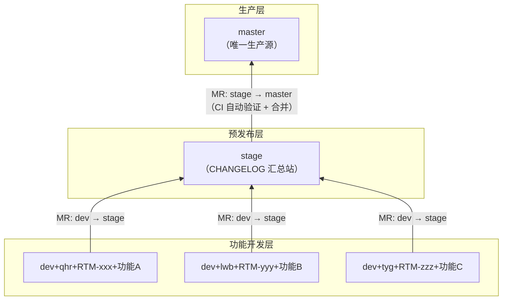
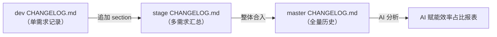
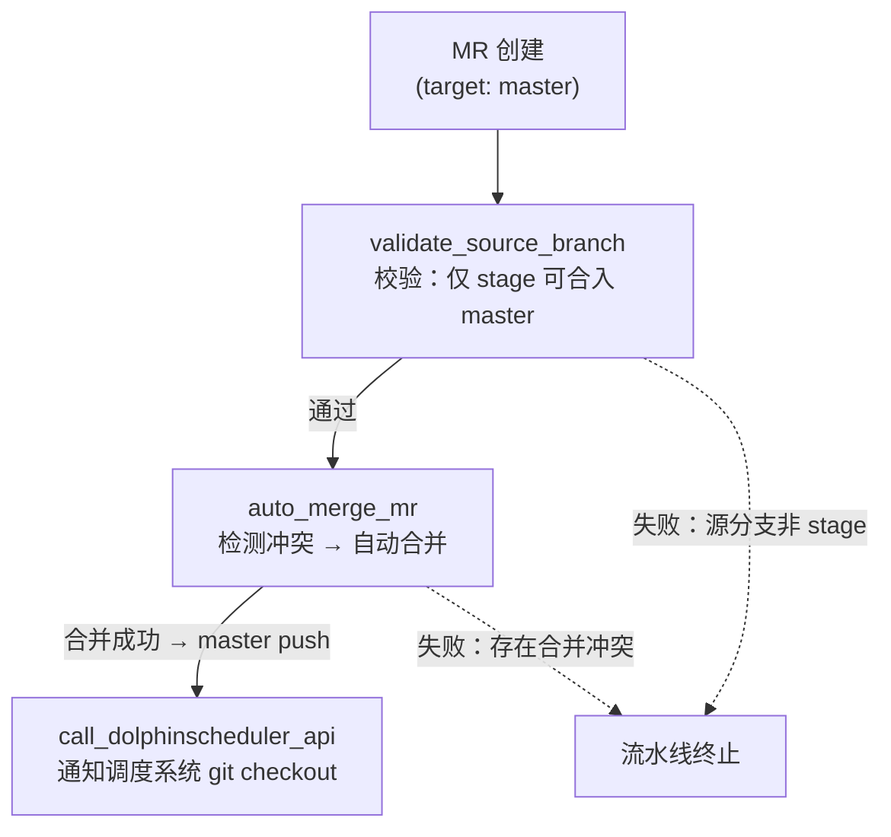
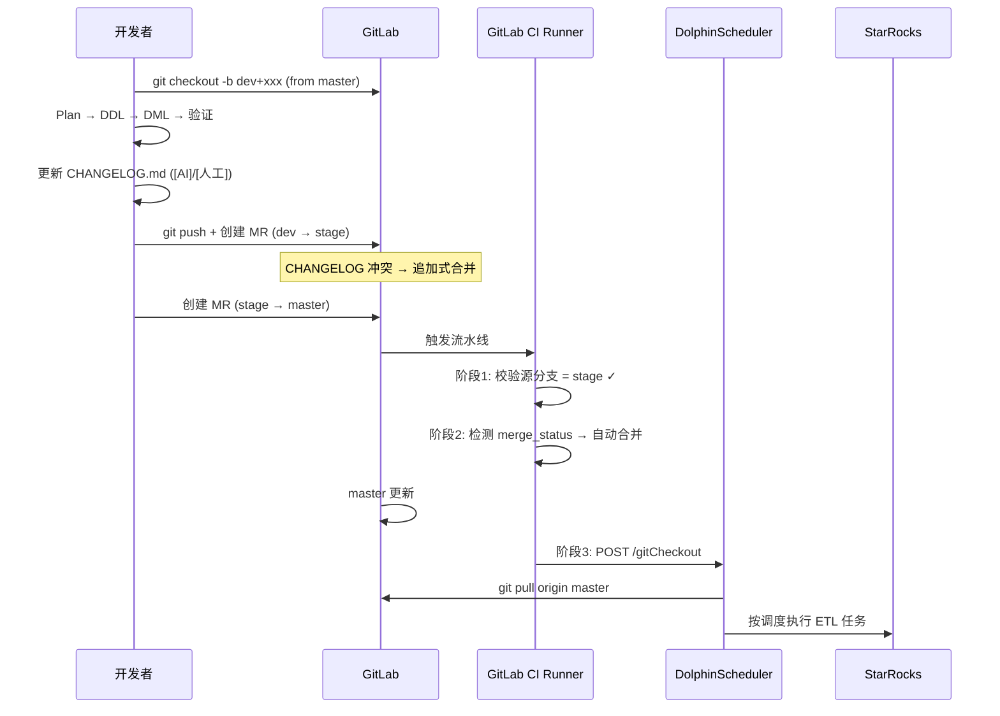

本文档描述 kunlun-dolphinscheduler 数仓项目的分支管理策略与 GitLab CI/CD 流水线集成方案。代码从开发分支出发，经由预发布分支验证，最终合入主干并自动触发调度系统，形成完整的端到端交付闭环。

## 分支模型总览

项目采用 **三阶分支金字塔模型**：主干 `master` 是唯一的生产就绪源，所有变更必须经由 `stage` 预发布分支中转方能抵达。功能分支直接从 `master` 拉出，合回时走 `dev → stage → master` 的单向升级路径。这一设计的核心在于 `stage` 充当"缓冲区"，让多个需求的 CHANGELOG 在此汇总、冲突在此消化，最终以整体快照的形式一次并入 master。



分支命名遵循统一模板 `dev+{owner}+{jira}+{desc}`。`owner` 为开发者拼音缩写（如 qhr、lwb、tyg），`jira` 为需求编号（如 RTM-40733），`desc` 为简短的中文描述。对于分析类 Program，jira 字段替换为 `ANALYSIS-{编号}`。

当前仓库中的远程分支分布印证了这一模式的一致性：

| 角色 | 分支示例 | 说明 |
|------|---------|------|
| 生产主干 | `master` | 唯一，受 CI 保护 |
| 预发布 | `stage` | 唯一，CI 验证入口 |
| 开发分支 | `dev+qhr+RTM-2026+0515存储治理` | 功能开发 |
| 开发分支 | `dev+lwb+RTM-40733+海阅海剧广告首次预加载ecpm链路优化` | 功能开发 |
| 开发分支 | `dev+tyg+RTM-40237+爽文书籍维表硬编码映射配置化重构` | 功能开发 |
| 分析分支 | `dev+qhr+app-asset-grading+数据资产等级划分分析` | 分析类 Program |
| 修复分支 | `dev+qhr+koc线上问题处理` | 线上修复 |

Sources: [orchestrator/ALWAYS/DEV-FLOW.md](orchestrator/ALWAYS/DEV-FLOW.md#L57-L76)

## 分支创建与提交流程

### 创建功能分支

一切从 master 出发，拉取最新代码后创建分支：

```bash
git checkout master
git pull origin master
git checkout -b "dev+{owner}+{jira}+{desc}"
```

此时分支继承 master 上的 `CHANGELOG.md`（可能为空或包含历史记录）。开发过程中，严格遵循 CHANGELOG-SPEC 规范持续更新 CHANGELOG.md——这是贯穿整个交付链路的"账本"，承载 AI/人工效率统计的原始数据。

### 提交规范

Commit message 采用约定式提交格式 `<type>(<scope>): <description>`，scope 使用数仓层级标识（ods、dwd、dws、dim、ads）。这一规范使 CI 日志和 git history 在视觉上保持一致的语义结构：

| Type | 说明 | 示例 |
|------|------|------|
| `feat` | 新增表/字段/指标 | `feat(ads): 新增用户流失趋势表` |
| `fix` | 修复数据口径/逻辑 Bug | `fix(ads): 修复重复计数` |
| `refactor` | 重构 SQL（不改口径） | `refactor(ads): 口径切换为新来源` |
| `perf` | 性能优化 | `perf(ads): 优化分桶策略` |
| `docs` | 文档/注释 | `docs(ads): 补充字段说明` |
| `chore` | 杂项 | `chore(sql): 移除废弃脚本` |

分析类 Program 额外支持 `analysis` type 和 `asset`、`lineage`、`quality` 等 scope，例如 `analysis(asset): 完成 ads 层数据资产定级`。

### 发起合并

在 Plan → DDL → DML → 验证的完整开发周期完成后，推送并创建 Merge Request。注意合并方向是 `dev → stage`，而非直接 `dev → master`：

```bash
git push origin HEAD
# 在 GitLab 创建 MR: dev+xxx → stage
```

Sources: [orchestrator/ALWAYS/DEV-FLOW.md](orchestrator/ALWAYS/DEV-FLOW.md#L57-L86), [orchestrator/ALWAYS/DEV-FLOW.md](orchestrator/ALWAYS/DEV-FLOW.md#L200-L228)

## CHANGELOG 合并规则

CHANGELOG.md 是多分支并行协作中最容易产生冲突的文件，项目为此制定了明确的逐级合并规则。

### dev → stage：追加式合并

当 dev 分支通过 MR 合并到 stage 时，CHANGELOG.md 必然冲突。解决方式是 **将 dev 分支的整个 section 追加到 stage CHANGELOG.md 末尾**，不改动 stage 上已有的其他 section。每个 section 之间以 `---` 分隔线隔开：

```markdown
# 变更日志 (Changelog)

---
## dev+qhr+RTM-20262+productid语言rule映射 | 负责人: qhr | 周期: 2026-05-13 ~ 2026-05-13
### 2026-05-13
- [人工] 向服务端确认映射关系
- [AI] 生成建表 DDL
...

---
## dev+lwb+RTM-40733+海阅海剧广告首次预加载ecpm链路优化 | 负责人: lwb | 周期: ...
### ...
```

### stage → master：整体合入

stage 向 master 合并时，将 stage 的 CHANGELOG.md 整体合入 master。正常情况（master 和 stage 在分叉前一致）下无冲突。如果 master 在 stage 存在期间被其他合入更新过，CHANGELOG.md 会产生冲突，此时同样采用"整体合入"策略。



Sources: [orchestrator/ALWAYS/CHANGELOG-SPEC.md](orchestrator/ALWAYS/CHANGELOG-SPEC.md#L57-L102)

## CI/CD 流水线详解

项目的 GitLab CI 配置定义在仓库根目录 `.gitlab-ci.yml` 中，分为三个串行阶段，形成"校验 → 合并 → 通知"的自动化链条。所有 Job 均运行在 `kunlun-runner` 标签指定的专用 Runner 上。



### 第一阶段：分支来源校验（test）

`validate_source_branch` 是 master 分支的守门人。在目标为 master 的 MR 场景下，它执行一条严格的规则：**仅允许 `stage` 分支合并到 `master`**。任何尝试从开发分支直接合入 master 的 MR 都会被拦截并输出明确的错误信息。该阶段的关键实现逻辑如下：

```yaml
validate_source_branch:
  stage: test
  script:
    - |
      if [ "$CI_MERGE_REQUEST_TARGET_BRANCH_NAME" = "master" ]; then
        if [[ ! "$CI_MERGE_REQUEST_SOURCE_BRANCH_NAME" = "stage" ]]; then
          echo "错误：仅允许从 stage 分支合并到 master！当前源分支：$CI_MERGE_REQUEST_SOURCE_BRANCH_NAME"
          exit 1
        fi
      fi
  only:
    refs:
      - merge_requests
    variables:
      - $CI_MERGE_REQUEST_TARGET_BRANCH_NAME == "master"
```

### 第二阶段：自动合并（auto-merge）

`auto_merge_mr` 在源分支校验通过后触发。它通过 GitLab API（项目 ID: 1156）检测 MR 的 `merge_status`，仅当状态为 `can_be_merged`（即不存在合并冲突）时，调用 API 执行带 `merge_when_pipeline_succeeds: true` 参数的自动合并。这一设计的精妙之处在于：GitLab 会等待当前流水线的所有阶段完成后再执行合并，而非立即合并——实际上构成了一层隐式的"合并前检查已完成"保障。

若存在合并冲突，Job 以 exit 1 终止，阻止不完整代码进入 master。

### 第三阶段：调度系统通知（notification）

`call_dolphinscheduler_api` 在 master 分支的流水线成功完成后触发。它向 DolphinScheduler 调度平台发送一个 HTTP POST 请求，调用 `/default/dolphinscheduler/gitCheckout` 接口，通知调度系统执行 git checkout 操作以同步最新的 master 代码。该阶段的设计意图明确：即使 API 调用失败（HTTP 状态码非 200），也不会导致流水线失败——因为合并已经成功，API 调用是附加的"尽力而为"操作，不应回滚已完成的合并。

```yaml
call_dolphinscheduler_api:
  stage: notification
  script:
    - |
      API_RESPONSE=$(curl -s -o /dev/null -w "%{http_code}" -X POST \
        "http://192.168.100.219:30667/default/dolphinscheduler/gitCheckout")
      if [ "$API_RESPONSE" = "200" ]; then
        echo "dolphinscheduler API调用成功"
      else
        echo "dolphinscheduler API调用失败，HTTP状态码: $API_RESPONSE"
      fi
  rules:
    - if: '$CI_COMMIT_BRANCH == "master"'
      when: on_success
```

Sources: [.gitlab-ci.yml](.gitlab-ci.yml#L1-L86)

## 端到端交付全景

以下时序图将分支管理、CHANGELOG 流转、CI 流水线和调度系统串联为完整的交付链路：



关键路径上的每个节点都有明确的成功/失败判定，不存在"静默失败"的灰色地带——这也是 `exit 1` 在流水线中的核心价值。

## 与 Program 生命周期的衔接

分支管理与 Program 是一一对应的关系。每个 Program（无论开发类还是分析类）对应一个独立的 dev 分支，这条分支承载着从 Plan 到 RESULT 的全部产出物。

Program 完成时的工作流收尾动作详见 [Program 生命周期管理](12-program-sheng-ming-zhou-qi-guan-li)。具体而言，`git commit` 不仅提交 DDL/DML 等 SQL 文件，还必须包含 Program 目录下的系列状态文件（`STATUS.yml`、`PLAN.md`、`HANDOFF.md` 等）和 `CHANGELOG.md`。提交后创建 MR 并入 stage，再经由 CI 自动化并入 master，最终触发 DolphinScheduler 使变更生效。

跨会话开发场景下，`HANDOFF.md` 中会记录当前所在分支和 commit SHA，确保下一会话的 Agent 能精确定位到上次停止的位置：

```markdown
### 分支
`dev+qhr+RTM-20262+productid语言rule映射` @ 1dd7067
```

这一设计使 AI Agent 的上下文恢复与 Git 版本管理无缝衔接。详见 [跨会话上下文管理与 HANDOFF 机制](19-kua-hui-hua-shang-xia-wen-guan-li-yu-handoff-ji-zhi)。

Sources: [orchestrator/ALWAYS/CORE.md](orchestrator/ALWAYS/CORE.md#L114-L143), [WORKFLOW.md](WORKFLOW.md#L58-L68)

## 安全与权限考量

CI 流水线中包含硬编码的 GitLab Private Token（`Bbh_-quZT5VeCYWNqtGh`）用于调用 GitLab API 执行自动合并。该 Token 应使用 GitLab CI/CD Variables 进行加密管理而非明文写入 `.gitlab-ci.yml`，以避免凭证泄露风险。DolphinScheduler API 地址 `http://192.168.100.219:30667` 为内网地址，确保调度系统调用仅限内网可达，形成网络层面的访问隔离。

## 下一步阅读

理解分支与 CI 体系后，建议深入以下相关专题：

- [Program 生命周期管理](12-program-sheng-ming-zhou-qi-guan-li) — 从 Program 创建到完成的全流程与状态管理
- [跨会话上下文管理与 HANDOFF 机制](19-kua-hui-hua-shang-xia-wen-guan-li-yu-handoff-ji-zhi) — 多会话协作时的状态持久化与恢复
- [DDL 与 DML 开发规范](14-ddl-yu-dml-kai-fa-gui-fan) — 表结构与数据加载脚本的编写标准
- [Plan 确认流程与对话协议](13-plan-que-ren-liu-cheng-yu-dui-hua-xie-yi) — 编码前的需求对齐与方案确认流程