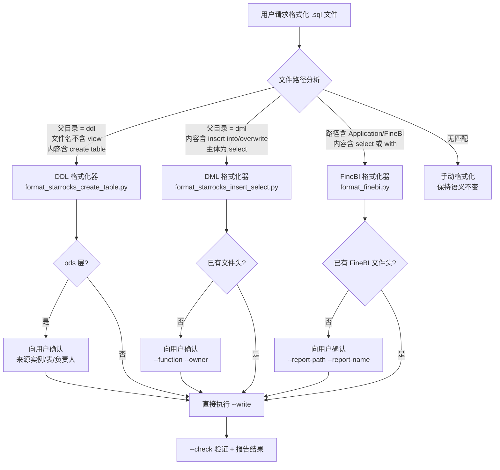

SQL 代码格式化技能（`sql-codeformat`）是项目中确定性脚本驱动的一体化 SQL 风格治理工具，通过三个专门的 Python 格式化器覆盖 StarRocks DDL、StarRocks DML 和 FineBI SQL 三类 SQL 场景。该技能的设计核心是"保守格式化"——在绝不修改 SQL 语义的前提下，对关键字、缩进、对齐、反引号、文件头等层面实施标准化，确保仓库中所有 SQL 文件呈现一致的视觉风格和可维护的结构。

Sources: [SKILL.md](orchestrator/SKILLS/sql-codeformat/SKILL.md#L1-L9)

## 架构总览：三个格式化器的分工与触发

技能内部采用"类型判定 → 条件匹配 → 脚本执行"的三段流水线架构。每当 AI Agent 或用户请求格式化一个 `.sql` 文件时，系统首先根据文件路径、目录名和 SQL 内容三个维度判定该文件属于哪种类型，然后调度到匹配范围最窄的格式化器执行。下图展示了完整的决策路由：



三种格式化器共享统一的保守策略哲学——保留列顺序、数据类型、注释、表达式语义，只修改格式层面的内容，解析失败时回退为仅做关键字小写和空格规范化，绝不冒险破坏 SQL 的可执行性。

Sources: [SKILL.md](orchestrator/SKILLS/sql-codeformat/SKILL.md#L12-L17), [SKILL.md](.claude/skills/sql-codeformat/SKILL.md#L18-L25)

## StarRocks CREATE TABLE DDL 格式化器

DDL 格式化器是整个仓库中建表语句的标准化入口，负责将原始 `create table` 语句转换为符合项目规范的格式。它作用于 `ddl/` 目录下、文件名不含 `view`、且内容包含 `create table` 语句的所有 `.sql` 文件。

### 触发条件与执行命令

所有触发条件必须同时满足，缺少任何一条都会阻止脚本自动执行：

| 条件 | 说明 |
|------|------|
| 文件扩展名 | `.sql` |
| 父目录名 | `ddl`（如 `starrocks/ads/ddl/`） |
| 文件名约束 | 不含 `view`（大小写不敏感），因为视图需要不同的处理逻辑 |
| SQL 内容 | 包含 `create table` 语句 |
| 任务类型 | 格式化/规范化，而非修改表结构语义 |

基础执行命令（仓库根目录下）：

```bash
python orchestrator/SKILLS/sql-codeformat/scripts/format_starrocks_create_table.py path/to/file.sql --write
```

对于 `ods` 和 `ods_log` 层的表，标准文件头需要额外的元数据信息，执行前必须先向用户确认：

```bash
python orchestrator/SKILLS/sql-codeformat/scripts/format_starrocks_create_table.py path/to/ods_table.sql --write \
  --source-instance "源实例名" --source-table "源表名" --source-owner "源负责人" --developer "开发人工号"
```

使用 `--check` 可只校验不写入，不传 `--write` 和 `--check` 时输出到 stdout。

Sources: [SKILL.md](orchestrator/SKILLS/sql-codeformat/SKILL.md#L19-L55)

### 格式化规则详解

DDL 格式化器的规则分为两大部分：语句整体结构和列定义块。

**语句整体结构**根据数据库层分为两种模板。ODS 层的建表语句会生成完整的文件头块（包含目标表、来源实例、来源表、来源负责人、开发人、开发日期），而其他层（DWD、DWS、ADS 等）只保留简洁的建表语句：

```sql
-- ODS 层模板（含文件头）
----------------------------------------------------------------
-- 目标表：ods.table_name
-- 来源实例：source_instance
-- 来源表：source_table
-- 来源负责人：source_owner
-- 开发人：developer
-- 开发日期：2025-01-01
----------------------------------------------------------------

create table ods.table_name (
     col1_name     col1_data_type [not null] comment "col1_comment"
    ,col2_name     col2_data_type [not null] comment "col2_comment"
)
primary key (col1_name)
comment "table_comment"
partition by date_trunc(...)
distributed by hash(col1_name)
properties (
    "key" = "value"
)
;
```

**列定义块**的格式化极为精细。每行列名缩进 5 个空格（首个列），后续列的前置逗号缩进 4 个空格。数据类型以最长列名为基准纵向对齐、额外间隔 1 个空格；可空性和默认值以最长数据类型为基准对齐；注释以最长属性组合为基准对齐。最终呈现出列名、类型、属性、注释四段式整齐排列的视觉效果。

数据类型层面，格式化器执行以下标准化操作：`bigint(20)`、`int(11)`、`tinyint(4)` 等会去掉长度部分；`varchar(65533)` 会被转换为 `string` 类型（StarRocks 中 varchar 最大为 65533，超过相当于 string）。

表选项严格遵循 StarRocks 方言顺序：键/模型子句 → 表注释 → 分区子句 → 分桶子句 → 属性块。对于分区子句，如果是 `partition by range(...)` 形式，格式化器会根据 `properties` 中 `dynamic_partition.time_unit` 的值自动生成合适的分区表达式（`day` → `pyyyyMMdd`，`month` → `pyyyyMM`）。`engine` 子句会被删除，反引号全部删除，引号外的关键字和数据类型统一转为小写。

Sources: [createTable-format-rules.md](orchestrator/SKILLS/sql-codeformat/references/createTable-format-rules.md#L1-L82)

### 保守策略与限制

DDL 格式化器明确保留以下内容不修改：列顺序、数据类型语义、注释文本、键定义中的列顺序、分区方式、分桶列、桶数和属性值。以下操作会被执行：删除反引号、删除 `engine` 子句、将 `create table` 改写为 `create table if not exists`、根据文件名前三个字符推导库名并将表名规范为 `db_name.file_stem` 格式。

此格式化器绝不应用于视图（文件名含 `view` 或内容为 `create view`），视图需要不同的处理逻辑。

Sources: [SKILL.md](orchestrator/SKILLS/sql-codeformat/SKILL.md#L45-L55), [format_starrocks_create_table.py](orchestrator/SKILLS/sql-codeformat/scripts/format_starrocks_create_table.py#L193-L198)

## StarRocks INSERT SELECT DML 格式化器

DML 格式化器处理 `dml/` 目录下所有的 `insert into ... select ...` 和 `insert overwrite ... select ...` 语句。这是仓库中最复杂的格式化器（970 行 Python 代码），内置了完整的词法分析器和递归下降解析器。

### 触发条件与执行命令

| 条件 | 说明 |
|------|------|
| 文件扩展名 | `.sql` |
| 父目录名 | `dml`（如 `starrocks/ads/dml/`） |
| SQL 内容 | 包含 `insert into` 或 `insert overwrite` |
| 主体结构 | `insert` 的主体是 `select` 或 `with ... select` |
| 任务类型 | 格式化/规范化，非修改 ETL 逻辑 |

文件头处理是 DML 格式化器的一个重要判断分支。若目标文件已有文件头（含 `-- 程序功能` 或 `-- 程序名` 注释块），格式化时保留不变，直接执行基础命令；若无文件头，则需向用户询问 `--function` 和 `--owner` 参数：

```bash
# 有文件头时
python orchestrator/SKILLS/sql-codeformat/scripts/format_starrocks_insert_select.py path/to/file.sql --write

# 无文件头时
python orchestrator/SKILLS/sql-codeformat/scripts/format_starrocks_insert_select.py path/to/file.sql --write \
  --function "ads_bi_ad_new_user_value_ed-广告推广纯新用户价值监控" --owner "张三"
```

自动生成的文件头格式如下：

```sql
----------------------------------------------------------------
-- 程序功能： {--function 参数值}
-- 程序名： {文件名（不含 .sql）}
-- 目标表： {层.表名（从路径推导）}
-- 负责人： {--owner 参数值}
-- 开发日期：{yyyy-MM-dd 系统日期}
----------------------------------------------------------------
```

Sources: [SKILL.md](orchestrator/SKILLS/sql-codeformat/SKILL.md#L57-L91), [dml-format-rules.md](orchestrator/SKILLS/sql-codeformat/references/dml-format-rules.md#L7-L22)

### 格式化规则详解

DML 格式化器的规则覆盖了 SQL `select` 语句的几乎所有子句，核心规则如下表：

| 格式化维度 | 规则描述 |
|-----------|---------|
| **整体结构** | `insert into` 单独一行；`select` 开始格式化主体；文件末尾单独一行 `;`；多段 `insert` 间空行分隔不合并 |
| **select 列表** | 前置逗号缩进 `select_indent + 5`；同段 `as` 垂直对齐（对齐列 = `select_indent + 7 + max_before_as + 1`）；无别名表达式不参与对齐 |
| **case when** | `when`/`else` 纵向对齐；`then` 与 `when condition` 同行；`end` 的 `d` 与 `case` 的 `e` 对齐；`end` 行的 `as` 参与同段对齐 |
| **from / join** | 缩进 `select_indent + 2`；`inner join` 自动缩写为 `join`；子查询 `(` 与 `from`/`join` 同行 |
| **子查询内部** | 内部 `select` 缩进 = `(` 位置 + 1；内部 `from` = 内部 `select_indent + 2`；内部 `where`/`group by` = 内部 `select_indent + 1`；`)` 与 `(` 垂直对齐 |
| **where / group by / order by** | 缩进 `select_indent + 1`；`and`/`or` 缩进 `where_indent + 2` |
| **union all** | 不缩进（col 0）；前后各一空行 |
| **关键字** | SQL 关键字、函数名、类型关键字统一小写；`inner join` → `join` |
| **运算符** | 比较运算符 `>=`, `<=`, `<>`, `!=`, `=`, `<`, `>` 左右各加一空格 |
| **反引号** | 别名含中文时保留反引号，不含中文则删除 |

下面是一个格式化前后的对比示例：

**格式化前：**
```sql
INSERT INTO ads.ads_bi_ad_new_user_value_ed
SELECT a.dt,a.product_id,round(a.reg_num,2) AS regNum,a.reg_num_new as reg_num_new
FROM dwd.dwd_ad_user_reg_di a
INNER JOIN dim.dim_product b ON a.product_id=b.product_id
WHERE a.dt>='${bf_3_dt}' AND a.product_id<>6833
GROUP BY 1,2,3,4;
```

**格式化后：**
```sql
insert into ads.ads_bi_ad_new_user_value_ed
select a.dt
     , a.product_id
     , round(a.reg_num, 2)              as reg_num
     , a.reg_num_new                    as reg_num_new
  from dwd.dwd_ad_user_reg_di           as a
  join dim.dim_product                  as b
    on a.product_id = b.product_id
 where a.dt >= '${bf_3_dt}'
   and a.product_id <> 6833
 group by 1, 2, 3, 4
;
```

Sources: [dml-format-rules.md](orchestrator/SKILLS/sql-codeformat/references/dml-format-rules.md#L25-L205)

### 保守策略

DML 格式化器明确不修改的内容包括：SQL 语义（字段顺序、别名、表达式逻辑）、字符串字面量、SQL 注释（`--` 和 `/* */`）、`${...}` 调度变量、目标字段列表。当遇到脚本无法可靠判断的复杂 SQL 时，解析器会保留原结构，回退为仅做关键字小写和空格规范化。

Sources: [dml-format-rules.md](orchestrator/SKILLS/sql-codeformat/references/dml-format-rules.md#L199-L206), [format_starrocks_insert_select.py](orchestrator/SKILLS/sql-codeformat/scripts/format_starrocks_insert_select.py#L1-L6)

## FineBI SQL 格式化器

FineBI 格式化器专门处理 `Application/FineBI` 路径下的报表 SQL 文件。它在 DML 格式化器的核心基础设施之上，增加了 FineBI 特有的功能：CTE 注释保留与标准化、`${...}` 参数变量保护、隐式别名 `as` 补全、`between...and` 同行保持等。

### 触发条件与执行命令

| 条件 | 说明 |
|------|------|
| 文件扩展名 | `.sql` |
| 路径特征 | 包含 `Application/FineBI`（大小写不敏感） |
| SQL 内容 | 包含 `select` 或 `with` |
| 任务类型 | 格式化/规范化，非修改业务逻辑 |

FineBI SQL 文件的文件头格式与其他两类不同，使用 `-- 应用报表：` 作为标识。有文件头时直接格式化，无文件头时需确认报表路径和名称：

```bash
# 有文件头时
python orchestrator/SKILLS/sql-codeformat/scripts/format_finebi.py Application/FineBI/海剧/xxx.sql --write

# 无文件头时
python orchestrator/SKILLS/sql-codeformat/scripts/format_finebi.py Application/FineBI/海剧/xxx.sql --write \
  --report-path "海剧-用户维度报表" --report-name "海剧用户留存报表"
```

Sources: [SKILL.md](orchestrator/SKILLS/sql-codeformat/SKILL.md#L92-L129)

### FineBI 特有规则

FineBI 格式化器在 DML 格式化器规则的基础上，增加了以下专有处理：

| 特性 | 规则描述 |
|------|---------|
| **`${...}` 参数保护** | FineBI 模板变量 `${维度}` 等被提取为占位符，格式化后再还原，确保变量内容不被修改 |
| **CTE 注释标准化** | `---xxx` 格式统一为 `-- xxx`，注释保留在对应 CTE 上方 |
| **CTE 格式** | 首个 CTE 用 `with name as (`，后续 CTE 用 `, name as (`；CTE 体缩进 4 空格 |
| **隐式别名补全** | `Id id` → `Id as id`，自动检测并补全 `as` 关键字（保留字除外） |
| **`between...and` 同行** | `between x and y` 始终合并在同一行，不换行 |
| **`where` 缩进** | `where` 条件首行与 `select` 对齐，续行额外缩进 2 空格 |

FineBI 格式化器会先提取 `${...}` 变量和 `cast(...)` 表达式为占位符，在格式化完成后再还原。这确保 FineBI 特有的模板参数变量不会被意外的空格规范化破坏。

Sources: [format_finebi.py](orchestrator/SKILLS/sql-codeformat/scripts/format_finebi.py#L61-L146), [SKILL.md](orchestrator/SKILLS/sql-codeformat/SKILL.md#L112-L128)

## 格式化器能力对比与选择指南

三种格式化器的核心能力和边界条件总结如下表，方便在实际场景中快速判断应使用哪个格式化器：

| 维度 | DDL 格式化器 | DML 格式化器 | FineBI 格式化器 |
|------|------------|------------|---------------|
| **目标路径** | `*/ddl/*.sql` | `*/dml/*.sql` | `*/Application/FineBI/*.sql` |
| **SQL 类型** | `create table` | `insert into/overwrite ... select` | `select` / `with ... select` |
| **文件头** | ODS 层自动生成 | 含 `-- 程序功能` 时保留 | 含 `-- 应用报表` 时保留 |
| **反引号** | 全部删除 | 含中文保留 | 含中文保留 |
| **关键字** | 小写 | 小写 + `inner join` → `join` | 小写 + `inner join` → `join` |
| **别名处理** | 不涉及 | 不补全 `as` | 自动补全隐式别名 |
| **特殊保护** | 注释、数据类型语义 | `${...}` 调度变量、注释 | `${...}` 变量、`cast()` 表达式 |
| **复杂度** | 536 行 Python | 970 行 Python | 708 行 Python |
| **解析器** | 手写 tokenizer | 词法分析 + 递归下降解析 | 复用 DML 解析器 + 扩展 |

Sources: [format_starrocks_create_table.py](orchestrator/SKILLS/sql-codeformat/scripts/format_starrocks_create_table.py#L1-L12), [format_starrocks_insert_select.py](orchestrator/SKILLS/sql-codeformat/scripts/format_starrocks_insert_select.py#L1-L6), [format_finebi.py](orchestrator/SKILLS/sql-codeformat/scripts/format_finebi.py#L1-L36)

## 使用工作流与最佳实践


格式化前务必确认目标文件符合对应格式化器的全部触发条件。对于 ODS 层 DDL、无文件头的 DML 和 FineBI 文件，需要提前收集用户提供的元数据信息（来源实例、功能描述、报表路径等）。格式化完成后始终使用 `--check` 参数进行二次验证，并向用户报告行数变化、格式类型等信息。对于脚本因保守策略保留的可疑语法（如复杂嵌套子查询中个别未对齐的部分），需在报告中主动说明。

Sources: [SKILL.md](.claude/skills/sql-codeformat/SKILL.md#L73-L78), [SKILL.md](orchestrator/SKILLS/sql-codeformat/SKILL.md#L73-L78)

## 架构设计要点

格式化器的技术实现体现了几个关键的架构决策。**共享核心基础设施**：FineBI 格式化器直接复用 DML 格式化器的 `tokenize`、`normalize_keywords_in_tokens`、`SelectBodyParser`、`fmt_select_list`、`fmt_case_when_multiline` 等核心函数，避免代码重复。**占位符保护机制**：FineBI 的 `${...}` 变量和 `cast()` 表达式在格式化前被提取为 `__FINEBI_VAR_{n}__` 和 `__CAST_EXPR_{n}__` 占位符，格式化完成后精确还原，确保业务参数不受影响。**保守回退策略**：所有三种格式化器在解析失败时都会回退到最小干预模式——仅做关键字小写和空格规范化，绝不冒险破坏 SQL 可执行性。

Sources: [format_finebi.py](orchestrator/SKILLS/sql-codeformat/scripts/format_finebi.py#L17-L36), [format_starrocks_insert_select.py](orchestrator/SKILLS/sql-codeformat/scripts/format_starrocks_insert_select.py#L17-L48)

## 进一步阅读

理解 SQL 格式化技能之后，建议继续阅读以下关联文档：

- [DDL 与 DML 开发规范](14-ddl-yu-dml-kai-fa-gui-fan) — 了解 DDL 和 DML 文件的编写规范与最佳实践
- [SQL 编码风格与数据质量兜底](15-sql-bian-ma-feng-ge-yu-shu-ju-zhi-liang-dou-di) — 深入理解格式化规则背后的编码风格理念
- [DolphinScheduler DAG 自动生成](18-dolphinscheduler-dag-zi-dong-sheng-cheng) — 了解如何将格式化后的 SQL 自动编排为调度 DAG
- [分层设计理念与数据流转](5-fen-ceng-she-ji-li-nian-yu-shu-ju-liu-zhuan) — 理解 ODS/DWD/DWS/ADS 各层建表语句的结构差异来源