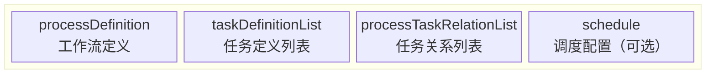
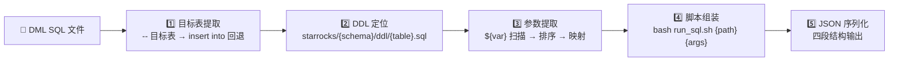
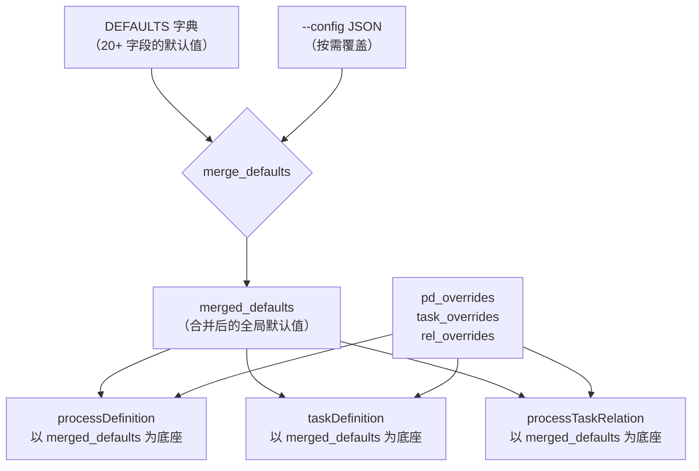
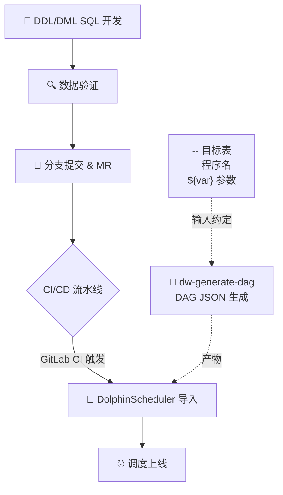

本页面系统阐述 `dw-generate-dag` 技能的设计原理、工作流程与集成方式——从 StarRocks DML SQL 文件出发，自动生成 DolphinScheduler 可导入的 DAG JSON 结构，打通数仓 SQL 开发到调度上线之间的最后一道自动化缺口。如果你正在寻找如何**批量将 DML SQL 转为调度任务**的具体操作方法，或者需要理解生成的 JSON 字段含义以实现自定义对接，这正是你要读的页面。

## 定位与价值

在 `kunlun-dolphinscheduler` 项目中，开发者完成 DML SQL 编写后，传统上需要手动在 DolphinScheduler 中创建 Workflow、配置 Shell 任务、逐个录入参数——这是一项枯燥易错且无法版本管控的手工工序。`dw-generate-dag` 技能作为 AI Agent 工具箱中的关键一环，以**自动化代码生成**为核心策略，将这一过程压缩为一行命令，让调度配置像 SQL 代码一样具备可追溯、可审计、可批量化的工程属性。

它的设计哲学遵循三条硬约束：**不重复表达**（DML 头部注释与 DDL 表注释即为唯一事实源）、**最小化人工录入**（参数自动提取、脚本自动组装）、**失败可诊断**（单文件报错明确、批量模式汇总报告）。最终输出的是 DolphinScheduler 标准导入 JSON——你可以直接通过 DolphinScheduler 管理界面的「导入」功能完成 Workflow 注册，也可以将其提交到 Git 仓库作为调度配置的版本化记录。

Sources: [SKILL.md](orchestrator/SKILLS/dw-generate-dag/SKILL.md#L1-L9)

## 输入输出契约

数据流模型极为简单：**DML SQL → Python 脚本 → DAG JSON**。但模型简单不意味着约束松散——每一个中间推理步骤都有明确的规则定义。

### 输入端：DML SQL 的结构约定

脚本的解析精度依赖于 DML SQL 头部注释的格式一致性。以下是一个符合约定的标准头部示例（取自 `P_ads_sv_beidou_series_daily_stat_di.sql`）：

```sql
----------------------------------------------------------------
-- 程序功能： 北斗短剧每日信息统计表
-- 程序名： P_ads_sv_beidou_series_daily_stat_di
-- 目标表： ads.ads_sv_beidou_series_daily_stat_di
-- 负责人： roger
-- 开发日期：2026-01-26
-- 版本号： v1.0
----------------------------------------------------------------
```

其中 `-- 目标表：` 行和 `-- 程序名：` 行是脚本解析的**硬依赖**——前者决定 DDL 定位路径和 DAG 命名，后者决定 DolphinScheduler 中的任务节点名称。如果缺失 `-- 目标表：`，脚本会回退到解析 `insert into` 语句；如果缺失 `-- 程序名：`，则回退到 SQL 文件名（不含扩展名）。两个回退都不可用时，单文件模式会直接报错退出。

Sources: [P_ads_sv_beidou_series_daily_stat_di.sql](starrocks/ads/dml/P_ads_sv_beidou_series_daily_stat_di.sql#L1-L8), [generate_dag_json.py](orchestrator/SKILLS/dw-generate-dag/scripts/generate_dag_json.py#L13-L28)

SQL 体中使用的 `${var}` 参数也全部纳入自动化处理范围。脚本会扫描全文，提取所有唯一的 `${var}` 变量名，按 `dt` 优先的规则排序后，映射为 DolphinScheduler 内置参数格式。日期类变量遵循特殊映射规则：

| SQL 变量 | DolphinScheduler 参数 | 含义 |
|---|---|---|
| `${dt}` | `$[yyyy-MM-dd]` | 当前执行日期 |
| `${bf_N_dt}` | `$[yyyy-MM-dd-N]` | 前推 N 天（如 `bf_4_dt` → 前 4 天） |
| `${af_N_dt}` | `$[yyyy-MM-dd+N]` | 后推 N 天 |
| 其他 `${var}` | `$[yyyy-MM-dd]` | 默认按日期处理 |

排序规则为 `dt` 优先于其他变量，其余按首次出现顺序排列，最终去重。这意味着生成的任务节点的 `localParams` 顺序与 SQL 中参数的语义优先级一致，而非简单的字母序。

Sources: [generate_dag_json.py](orchestrator/SKILLS/dw-generate-dag/scripts/generate_dag_json.py#L90-L115), [dag-json-spec.md](orchestrator/SKILLS/dw-generate-dag/references/dag-json-spec.md#L24-L31)

### 输出端：DAG JSON 四段结构

生成的 JSON 是一份 DolphinScheduler 标准导入文件，包含四个顶级字段：



每个字段的精确定义和默认值策略如下表：

| 字段 | 核心内容 | 来源 | 默认值 |
|---|---|---|---|
| `processDefinition.name` | `tbl_{table_name}` | 目标表表名 | — |
| `processDefinition.description` | 表中文说明 | DDL 表级 `comment` | 目标表名 |
| `taskDefinitionList[0].name` | 任务节点名称 | `-- 程序名` 或文件名 | — |
| `taskDefinitionList[0].taskType` | `SHELL` | 硬编码 | — |
| `taskDefinitionList[0].taskParams.rawScript` | `bash run_sql.sh {path} "k=${k}"` | 模板生成 | — |
| `taskDefinitionList[0].taskParams.localParams` | 参数列表 | SQL `${var}` 提取 | — |
| `processTaskRelationList[0]` | 单任务自身引用 | 即 preTaskCode=0, postTaskCode=0 | — |
| `schedule` | 调度配置 | `--config` 覆盖 | `null` |

对于**单表 DAG**（即目前脚本输出的一表一任务场景），`processTaskRelationList` 只有一条记录，`preTaskCode` 和 `postTaskCode` 均为 0，表示该任务无前后依赖。`schedule` 默认为 `null`，需要手动在 DolphinScheduler 中配置或通过 `--config` 注入。`id`、`code`、`version` 等导入时由 DolphinScheduler 重新分配的字段统一置 0。

Sources: [generate_dag_json.py](orchestrator/SKILLS/dw-generate-dag/scripts/generate_dag_json.py#L208-L303), [dag-json-spec.md](orchestrator/SKILLS/dw-generate-dag/references/dag-json-spec.md#L15-L22)

## 脚本管线：从 SQL 到 JSON 的五阶段流水线



### 阶段一：目标表提取与 DAG 命名

`extract_target_table()` 函数执行两级回退策略：首先用正则 `TARGET_TABLE_RE` 匹配 `-- 目标表：` 注释行，提取 `schema.table` 格式；如果未命中，回退到 `INSERT_INTO_RE` 从 SQL 的 `insert into` 语句中提取。两者都失败时抛出 `ValueError`。

从 `schema.table` 中拆分出 `schema`（如 `ads`）和 `table_name`（如 `ads_sv_beidou_series_daily_stat_di`），DAG 名称固定为 `tbl_{table_name}`——这是 DolphinScheduler 中的 Workflow Name。

Sources: [generate_dag_json.py](orchestrator/SKILLS/dw-generate-dag/scripts/generate_dag_json.py#L73-L80)

### 阶段二：DDL 定位与表注释提取

DDL 文件路径遵循固定规则：`starrocks/{schema}/ddl/{table_name}.sql`。如果文件不存在，抛 `FileNotFoundError`——这也是目录模式下最常见的报错原因（DDL 文件未创建或路径不一致）。

DDL 中表级注释通过 `DDL_TABLE_COMMENT_RE` 正则从 `engine ... comment "..."` 模式中提取。这个值最终写入 `processDefinition.description`，成为 DolphinScheduler 中 Workflow 的描述文字。例如，`ads_sv_beidou_series_daily_stat_di` 的 DDL 注释 `"北斗短剧-每日短剧信息统计表"` 就会直接成为 Workflow 描述。

Sources: [generate_dag_json.py](orchestrator/SKILLS/dw-generate-dag/scripts/generate_dag_json.py#L152-L156), [ads_sv_beidou_series_daily_stat_di.sql](starrocks/ads/ddl/ads_sv_beidou_series_daily_stat_di.sql#L58-L60)

### 阶段三：参数提取与 DolphinScheduler 映射

`extract_params()` 扫描 SQL 全文提取所有 `${var}` 模式，去重后按 `dt` 优先规则排序。`map_param_value()` 执行日期变量的特殊映射：`dt` → `$[yyyy-MM-dd]`，`bf_N_dt` → `$[yyyy-MM-dd-N]`，`af_N_dt` → `$[yyyy-MM-dd+N]`，其余变量统一映射为 `$[yyyy-MM-dd]`。

这一设计的前提是：DolphinScheduler 中 Shell 任务的 `${var}` 语法与 SQL 中的 `${var}` 语法形式上相同，但语义不同——前者是 DolphinScheduler 的自定义参数占位符，后者是 SQL 文本中的变量。因此生成的 `taskParams.rawScript` 需要用转义后的参数传递给 `run_sql.sh`，由 Shell 脚本在运行时完成替换。

Sources: [generate_dag_json.py](orchestrator/SKILLS/dw-generate-dag/scripts/generate_dag_json.py#L90-L115)

### 阶段四：脚本组装

`build_script()` 将相对路径和参数列表拼装为一行 bash 命令。无参数时：`bash run_sql.sh {sql_rel_path}`。有参数时参数以逗号分隔的双引号 key=value 对传递：`bash run_sql.sh {sql_rel_path} "k1=${k1}","k2=${k2}"`。

这里的关键设计决策是：**SQL 相对路径**随 JSON 一起固化。路径基于 `--repo-root` 参数计算（`sql_path.resolve().relative_to(repo_root.resolve())`），这意味着生成的 JSON 在不同环境间移植时，只要保证 `run_sql.sh` 对 SQL 文件的路径解析逻辑一致，就可以直接使用。

Sources: [generate_dag_json.py](orchestrator/SKILLS/dw-generate-dag/scripts/generate_dag_json.py#L118-L122), [generate_dag_json.py](orchestrator/SKILLS/dw-generate-dag/scripts/generate_dag_json.py#L159-L161)

### 阶段五：JSON 序列化与配置合并

`build_dag_json()` 组装完整的四段结构，同时执行配置合并。默认值来自 `DEFAULTS` 字典（包含 `projectCode: 0`、`failRetryTimes: 2`、`executionType: "PARALLEL"` 等 20+ 字段）。`--config` 参数支持两层覆盖：顶层 key 直接覆盖默认值，`defaults` 子块内的 key 也覆盖默认值，`processDefinition` / `taskDefinition` / `processTaskRelation` 子块则通过 `dict.update()` 覆盖对应段落的特定字段。



Sources: [generate_dag_json.py](orchestrator/SKILLS/dw-generate-dag/scripts/generate_dag_json.py#L33-L52), [generate_dag_json.py](orchestrator/SKILLS/dw-generate-dag/scripts/generate_dag_json.py#L136-L149)

## 运行模式与错误处理策略

脚本支持三种运行模式，通过命令行参数组合切换：

| 模式 | 触发条件 | 行为 | 典型场景 |
|---|---|---|---|
| **单文件** | `--input` 指向 `.sql` 文件 | 生成一份 JSON，严格报错 | 单个新表首次上线 |
| **批量目录** | `--input` 指向目录 | 遍历所有 `*.sql`，跳过错误文件并汇总 | 全层/全仓 DAG 批量生成 |
| **预览** | `--dry-run` | 解析但不写文件，stdout 输出 | CI 校验 / Plan 确认前预演 |

错误处理在两个维度上分化：

- **单文件模式**：任何解析失败（无法提取目标表、DDL 文件缺失等）直接抛异常退出。这是"快速失败"策略——开发者期望每个文件都能成功生成。
- **目录模式**：默认允许跳过错误文件，将失败信息记录到 stderr，最后汇总成功/失败数量。`--strict` 开关可以将目录模式也切换为快速失败。

`--report` 参数独立于上述模式——无论单文件还是批量，启用后都会生成一份结构化的执行报告 JSON，包含 `summary`（成功/失败/总计）和 `records`（逐文件状态、路径、错误原因），适合在 CI/CD 流水线中作为产物归档。

Sources: [generate_dag_json.py](orchestrator/SKILLS/dw-generate-dag/scripts/generate_dag_json.py#L331-L414)

## 配置注入与默认值策略

`--config` 接受 JSON 文件路径或内联 JSON 字符串，用于覆盖默认调度参数。推荐的最小配置如下：

```json
{
  "defaults": {
    "projectCode": 10857427255392,
    "userId": 120032,
    "environmentCode": 18255652448032,
    "resourceIds": "120201,120042",
    "resourceList": [{"id": 120042}, {"id": 120201}]
  }
}
```

`projectCode` 和 `userId` 是 DolphinScheduler 导入时的必要字段——如果不通过 `--config` 注入，默认为 0，导入后需要在 DolphinScheduler 界面中手动修改。`environmentCode` 决定任务执行的环境（如开发/测试/生产），`resourceIds` 和 `resourceList` 则关联 DolphinScheduler 资源中心的 Shell 脚本资源。

其他可覆盖的关键字段：

| 默认值字段 | 默认值 | 建议覆盖场景 |
|---|---|---|
| `failRetryTimes` | `2` | 按任务重要性调整重试次数 |
| `workerGroup` | `"default"` | 不同层级使用不同 worker 组 |
| `executionType` | `"PARALLEL"` | 有严格串行依赖时改为 `SERIAL_WAIT` |
| `timeout` | `0`（不限制） | 大表处理设置超时保护 |
| `taskPriority` | `"MEDIUM"` | 核心链路任务设为 `HIGH` |

Sources: [dag-json-spec.md](orchestrator/SKILLS/dw-generate-dag/references/dag-json-spec.md#L45-L75), [generate_dag_json.py](orchestrator/SKILLS/dw-generate-dag/scripts/generate_dag_json.py#L33-L52)

## 在开发工作流中的位置

`dw-generate-dag` 不是孤立工具，它嵌入在数仓开发的完整生命周期中。理解它在流程中的位置，才能正确使用：



关键约束：DML SQL 必须符合头部注释规范（`-- 目标表：`、`-- 程序名：`）才能被脚本正确解析。这一规范在 [DDL 与 DML 开发规范](14-ddl-yu-dml-kai-fa-gui-fan) 中有详细定义，而调度参数（`${dt}`、`${bf_N_dt}` 等）的使用约定则在 [DolphinScheduler 调度参数与任务编排](27-dolphinscheduler-diao-du-can-shu-yu-ren-wu-bian-pai) 中详细说明。

在实际操作中，脚本生成的 JSON 通常通过 GitLab CI 自动导入 DolphinScheduler（参见 [分支管理与 CI/CD 集成](16-fen-zhi-guan-li-yu-ci-cd-ji-cheng)），实现从代码提交到调度上线的全链路自动化。

## 验证清单与常见问题

每次生成 DAG JSON 后，建议按以下清单验证：

1. **结构完整性**：输出 JSON 必须包含 `processDefinition`、`processTaskRelationList`、`taskDefinitionList`、`schedule` 四个顶级字段。
2. **参数一致性**：`taskParams.rawScript` 中出现的参数与 SQL 中的 `${var}` 完全一致，无遗漏无多余。
3. **DDL 可定位**：确认 `starrocks/{schema}/ddl/{table_name}.sql` 存在且包含有效的表级 `comment`。
4. **路径正确性**：`rawScript` 中的 SQL 相对路径与仓库结构一致，`run_sql.sh` 可访问。

常见问题与解决方案：

| 问题现象 | 原因 | 解决方向 |
|---|---|---|
| `无法从 SQL 提取目标表` | DML 缺少 `-- 目标表：` 注释，且 `insert into` 语句无法匹配 | 按规范补全头部注释 |
| `未找到 DDL 文件` | DDL 文件路径不符合 `starrocks/{schema}/ddl/{table}.sql` | 检查 schema 名和文件名是否与目标表一致 |
| 参数未被提取 | `${var}` 语法不规范（如使用 `${ var }` 带空格） | 确保使用 `${variable_name}` 格式 |
| 导入 DolphinScheduler 失败 | `projectCode` / `userId` 为 0 或与目标环境不匹配 | 使用 `--config` 注入正确的环境参数 |
| 批量模式大量文件失败 | DDL 文件整体缺失或命名不一致 | 先用 `--dry-run --report` 扫描，再逐个修复 |

## 技能架构与扩展点

技能的组织遵循 `SKILL.md` 入口 → `scripts/` 可执行脚本 → `references/` 规范文档的标准结构，确保 AI Agent 和人类开发者共享同一套知识和工具：

```
orchestrator/SKILLS/dw-generate-dag/
├── SKILL.md              ← AI Agent 入口：使用说明、命令模板、验证清单
├── agents/
│   └── openai.yaml       ← 子 Agent 配置（display_name + default_prompt）
├── references/
│   └── dag-json-spec.md  ← 字段映射规范、配置示例、DDL 定位规则
└── scripts/
    └── generate_dag_json.py  ← 可独立运行的 Python 脚本
```

当前版本的局限性在于：**仅生成单表、单任务 DAG**——每个 DAG 只有一条 `taskDefinitionList` 和一条 `processTaskRelationList`（`preTaskCode=postTaskCode=0`）。对于有上下游依赖的多表 DAG，目前需要手动在 DolphinScheduler 中建立连线。这是设计权衡而非缺陷——单表单任务模型覆盖了该项目 90% 以上的场景（每张 ADS/DWD/DIM 表对应一个独立的 DML 定时任务），且显著降低了生成逻辑的复杂度。

如果需要扩展支持多任务 DAG，可能的路径包括：解析 DML 中 CTE 的依赖关系推断上下游、在 SQL 头部增加 `-- 依赖表：` 注释显式声明、或者通过外部 DAG 编排配置文件驱动生成。

Sources: [SKILL.md](orchestrator/SKILLS/dw-generate-dag/SKILL.md#L1-L59), [dag-json-spec.md](orchestrator/SKILLS/dw-generate-dag/references/dag-json-spec.md#L1-L96)

## 继续阅读

- 了解 SQL 注释规范与命名约定：[DDL 与 DML 开发规范](14-ddl-yu-dml-kai-fa-gui-fan)
- 理解调度参数的运行时语义：[DolphinScheduler 调度参数与任务编排](27-dolphinscheduler-diao-du-can-shu-yu-ren-wu-bian-pai)
- 查看 CI/CD 中如何集成 DAG 生成：[分支管理与 CI/CD 集成](16-fen-zhi-guan-li-yu-ci-cd-ji-cheng)
- 了解另一项自动化技能：[SQL 代码格式化技能](17-sql-dai-ma-ge-shi-hua-ji-neng)
- 理解 AI Agent 如何调用此技能：[跨会话上下文管理与 HANDOFF 机制](19-kua-hui-hua-shang-xia-wen-guan-li-yu-handoff-ji-zhi)