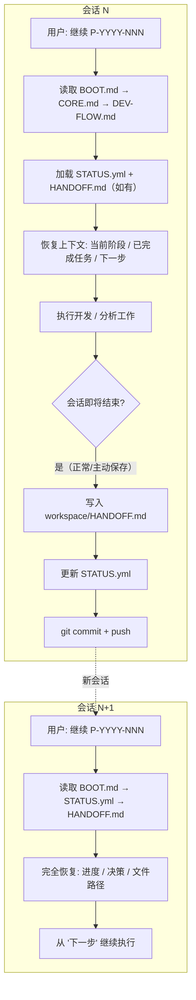
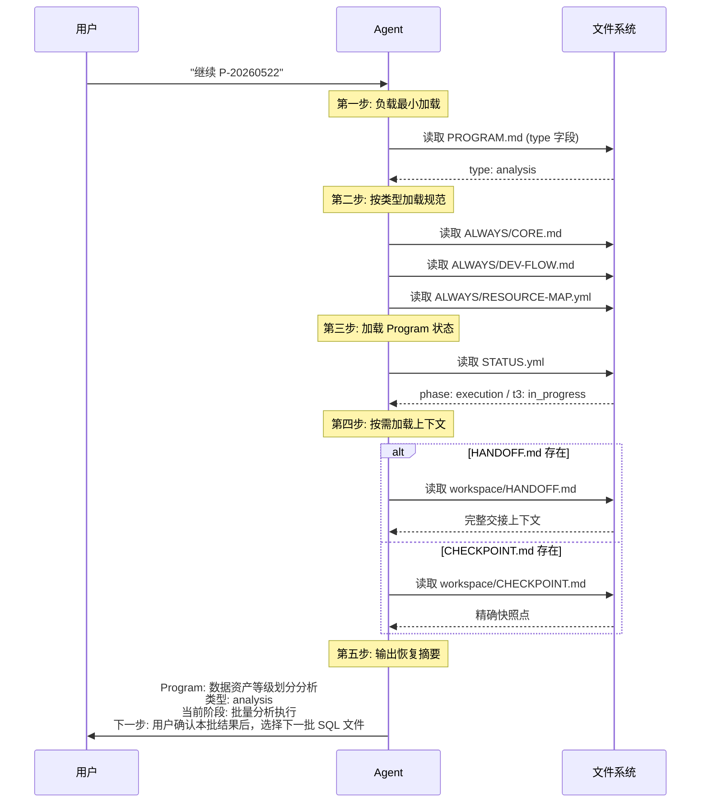
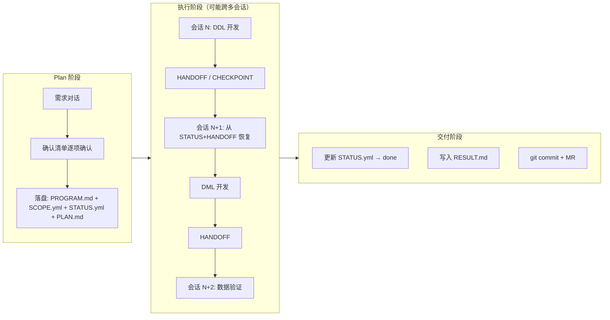

本文档深入剖析本项目中 AI Agent 的跨会话上下文管理体系——当单次 AI 会话无法完成大型任务时，Agent 如何通过文件驱动的状态持久化、HANDOFF 交接协议和 CHECKPOINT 快照机制，实现跨多次会话的零信息损失续接。

## 为什么需要跨会话上下文管理

AI Coding Agent 的核心约束在于**上下文窗口是有限且昂贵的**。在数仓开发场景中，一个 Program 可能涉及数十张上游表的 DDL 扫描、字段口径确认、DDL/DML 编码、数据验证和 CHANGELOG 编写——这些操作产生的上下文远超出单次会话的承载能力。本项目的解决思路非常明确：**不依赖会话记忆，而是用文件系统作为 Agent 的持久化大脑**。

核心设计包含三层递进式持久化：`STATUS.yml` 维护机器可读的任务状态机，`HANDOFF.md` 提供人类友好的会话交接说明书，`CHECKPOINT.md` 则是在上下文极端紧张时主动触发的快照保护。这三者共同构成了从"会话崩溃"到"无缝续接"的安全网。

Sources: [CORE.md](orchestrator/ALWAYS/CORE.md#L120-L156)

## 上下文管理体系全景

下图展示了跨会话上下文管理的完整生命周期——从会话启动、状态恢复、工作执行到会话结束时 HANDOFF 的生成，再到下次启动的循环。



### 关键设计点

| 设计要素 | 说明 |
|----------|------|
| **文件优先** | 所有状态通过文件系统持久化，会话之间零内存共享 |
| **Git 锚定** | HANDOFF 中记录 commit SHA，确保新会话可精确恢复代码状态 |
| **渐进式恢复** | 启动时先加载轻量的 STATUS.yml，再按需加载 HANDOFF/CHECKPOINT |
| **人机双读** | STATUS.yml 面向机器解析，HANDOFF.md 面向人类和 Agent 双重可读 |

## 三大持久化文件详解

### STATUS.yml — 任务状态机

`STATUS.yml` 是整个上下文管理体系中最基础也最频繁更新的文件。它记录 Program 的宏观阶段（`phase`）和每个子任务的微观状态（`status: pending / in-progress / done / blocked`），是 Agent 启动恢复时的**首选加载源**。

开发类和分析类使用不同的阶段定义：

| 阶段 | 开发类 | 分析类 |
|------|--------|--------|
| 规划 | `planning` | `planning` |
| 执行 | `in-progress` | `data-collection` → `analysis` |
| 汇总 | — | `synthesis` |
| 评审 | `review` | `review` |
| 完成 | `done` | `done` |

每个 task 条目都包含 `checkpoint`（当前进度描述）、`blockers`（阻塞原因）和 `next_action`（下一步具体操作）三个字段。当 Agent 在新会话中读取 STATUS.yml 时，只需找到第一个 `status: in-progress` 的任务，就能精确知道从哪里继续。

Sources: [STATUS.yml](orchestrator/PROGRAMS/_TEMPLATE/STATUS.yml#L1-L56)

以下是一个真实的 STATUS.yml 示例，展示了分析类 Program 在批量执行中途的状态：

```yml
program: P-20260522-app-asset-grading
type: analysis
phase: execution
status: active

tasks:
  - id: t1
    name: Plan 确认 & 框架建立
    status: done
  - id: t2
    name: 小样验证
    status: done
  - id: t3
    name: 批量分析执行
    status: in_progress
    checkpoint: 20260522-广告基建策略，2张表均为P4（已废弃/无DML），用户确认中
    next_action: 用户确认本批结果后，选择下一批 SQL 文件
  - id: t4
    name: 结果汇总
    status: pending
```

从 `t3` 的 `next_action` 字段，新会话的 Agent 可以直接知道"等待用户确认当前批次结果"——这比从零开始重新理解状态要高效得多。

Sources: [STATUS.yml](orchestrator/PROGRAMS/P-20260522-app-asset-grading/STATUS.yml#L1-L63)

### HANDOFF.md — 会话交接协议

HANDOFF 是本项目上下文管理体系的核心创新。它不是简单的状态快照，而是一份**结构化交接文档**，确保下一个会话的 Agent（可能是同一模型的另一实例）能像"同一个 Agent 刚离开一分钟"一样无缝接续。

HANDOFF 的规范格式由 CORE.md 明确定义，包含六个关键部分：

| 字段 | 作用 | 典型内容 |
|------|------|----------|
| 当前状态 | 快速定位进度 | "已完成: t1-t5；进行中: t6（进度70%，卡在 save_skill 调用）" |
| 分支 | Git 上下文恢复 | `dev+qhr+RTM-20262+sql-codeformat优化 @ <commit-sha>` |
| 产出/修改文件 | 文件清单 | 所有修改过的文件的完整路径和变更摘要 |
| 关键决策 | 设计推理保留 | 为什么选择方案 A 而非方案 B，边界情况的处理策略 |
| 下一步 | 精确续接指令 | 具体的后续操作步骤，优先于 STATUS.yml 的通用 next_action |
| 口径变更记录 | 开发类专属 | 字段级的新旧口径对比和变更原因 |

Sources: [CORE.md](orchestrator/ALWAYS/CORE.md#L131-L156)

让我们看一个真实的 HANDOFF 实例——来自 `P-20260518-sql-codeformat-update` 的交接文档：

```markdown
## HANDOFF — P-20260518-sql-codeformat-update

**保存时间**: 2026-05-19
**当前阶段**: T6（同步系统级 skill）进行中，T7（CHANGELOG）待做

## 本轮修复的 2 个 Bug

1. **HEADER_PATTERN 未使用 re.MULTILINE**：文件头检测正则 `^\s*--\s*程序功能` 中的 `^`
   只匹配字符串开头，当 SQL 以分隔线 `----` 开头时检测失败导致重复生成文件头。
   已加 `re.MULTILINE` 修复。

2. **子查询别名解析吞掉 `as` 关键词**：`parse_join_source` 中 `) as a` 场景下，
   解析器直接把 `as` 当别名读走，真正的别名 `a` 丢失。已添加 `as` 关键词检测修复。

## 脚本文件路径

- 主脚本: `orchestrator/SKILLS/sql-codeformat/scripts/format_starrocks_insert_select.py` (970 行)
- 参考文档: `orchestrator/SKILLS/sql-codeformat/references/dml-format-rules.md`

## 下一步 (T6 续)

调用 `save_skill` 将更新后的 SKILL.md 内容同步到 Cowork 系统级 sql-codeformat skill。

## 下一步 (T7)

更新仓库级 CHANGELOG，记录本次 DML 格式化器的完整重写变更。
```

这个 HANDOFF 的价值在于：它不仅告诉下一个 Agent "做到哪了"，还传递了**两个隐蔽 bug 的根因分析**——这些诊断信息如果丢失，下一个 Agent 可能需要花大量时间重新定位问题。

Sources: [HANDOFF.md](orchestrator/PROGRAMS/P-20260518-sql-codeformat-update/workspace/HANDOFF.md#L1-L35)

再看一个分析类 Program 的 HANDOFF 示例，展示了对分析结论和修正记录的传递：

```markdown
## HANDOFF — P-20260522-app-asset-grading

### 当前状态
- 已完成: t1 Plan 确认 & 框架建立, t2 小样验证
- 进行中: t3 批量分析执行 — 第二批次已完成，累计分析 2 个 Application SQL 文件，32 张表

### 关键决策（修订后）
- 两张表均定为 P4：**修正了初判中"无DML"的错误**。DML 确实存在且逻辑复杂
  （含 DELETE+INSERT、基建/补位/席位计算引擎），但核心判定依据不变——
  唯一的下游消费者已废弃，数据在生产但无人消费
- 初判将 spend_data_result 误认为 spend_data 的 DML 写入目标——
  实际两者是独立表，spend_data_result 同时又以 spend_data 为上游做二次计算

### 下一步
1. 用户确认本批 P4 定级结果
2. 继续第三批：分析其他 Application SQL 文件
```

这里特别值得关注的是"修正初判错误"的记录——它防止了下一个 Agent 重复犯同样的分析错误。

Sources: [HANDOFF.md](orchestrator/PROGRAMS/P-20260522-app-asset-grading/workspace/HANDOFF.md#L1-L32)

### CHECKPOINT.md — 上下文快照

CHECKPOINT 与 HANDOFF 的区别在于**触发时机和粒度**。HANDOFF 是会话正常结束时的交接文档，而 CHECKPOINT 是在**上下文窗口紧张时主动触发**的快照。它的格式更精简，聚焦于"当前卡在哪里"：

```markdown
## CHECKPOINT

### 目标
当前 Program 的目标（一句话）

### 已完成
- [x] 任务 1
- [x] 任务 2

### 进行中
- [ ] 任务 3（进度：60%，卡在 xxx）

### 关键决策
- 选择方案 A 因为 yyy

### 文件变更/产出
- `{path}` — 改了什么/产出了什么
```

CHECKPOINT 的典型使用场景：Agent 在执行复杂 DML 编写时，已经读取了 15 张上游表的 DDL，上下文窗口接近饱和。此时写入 CHECKPOINT.md 保存当前工作快照，然后用户在新会话中说"继续 P-YYYY-NNN"，Agent 从 CHECKPOINT 恢复——直接跳到 DML 编写的 60% 进度处继续，而不是重新扫描上游 DDL。

Sources: [CORE.md](orchestrator/ALWAYS/CORE.md#L158-L175)

### 三文件对比

| 维度 | STATUS.yml | HANDOFF.md | CHECKPOINT.md |
|------|-----------|------------|---------------|
| **触发时机** | 持续更新 | 会话结束时 | 上下文紧张时 |
| **读取优先级** | 每次启动必读 | 存在则读取 | 存在则读取（优先级高于 HANDOFF） |
| **内容粒度** | 任务级状态 | 完整交接上下文 | 精确快照点 |
| **生命周期** | Program 全程 | 一次会话周期 | 一次卡点周期 |
| **主要读者** | Agent 程序解析 | Agent + 人类 | Agent 程序解析 |

## 启动恢复流程

当用户在新会话中说"继续 P-YYYY-NNN"时，Agent 执行的是精心编排的恢复流程。这个流程的核心思想是**渐进式加载**——先加载最小的必要信息集，再根据上下文窗口余量按需扩展。



加载顺序的设计遵循"先通用后专用、先轻量后重量"原则：`CORE.md` 和 `DEV-FLOW.md` 是全局规范，每次必读；`STATUS.yml` 是 Program 级状态，体积小、信息密度高；`HANDOFF.md` 体积最大，但只在需要深度上下文恢复时才读取。

Sources: [BOOT.md](orchestrator/ALWAYS/BOOT.md#L24-L63)

## 文件通信原则：保护上下文窗口

上下文管理的另一面是**主动防御**——在会话进行中避免上下文窗口被低价值信息填满。本项目的核心策略是文件通信原则：

> 大段 SQL、分析报告、采集数据写入文件，不要塞进对话。引用文件路径而非复制内容。

这在 SUB-AGENT 规范中体现得最为极致。Sub-Agent 返回给主 Agent 的信息被严格限制为 4 行：

```
状态：已完成 / 失败 / 需要决策
报告：workspace/X.Y-xxx.md
产出：N 个文件（列出路径）
决策点：[如有，一句话描述]
```

不允许返回完整代码、大段文档或原始数据。主 Agent 通过文件路径读取 Sub-Agent 的产出，而非通过对话消息传递。这是"文件系统即通信总线"思想的直接应用。

Sources: [SUB-AGENT.md](orchestrator/ALWAYS/SUB-AGENT.md#L19-L32)

### 上下文消耗对比

| 通信方式 | 消耗上下文 | 适用场景 |
|----------|-----------|----------|
| 对话消息中传递完整 SQL | 高（数百行 → 数万 tokens） | 仅极小片段 |
| 对话消息中引用文件路径 | 低（数十 tokens） | 首选方式 |
| 文件写入 + 路径引用 | 极低 | DML/DDL/Analysis 等所有重量产出 |

## Sub-Agent 委托与 HANDOFF

当用户说"委托: xxx"时，主 Agent 可以将子任务分发给 Sub-Agent 并行执行。Sub-Agent 之间的 HANDOFF 机制与主 Agent 的跨会话机制共享相同的文件通信理念，但执行模式不同：

| 维度 | 主 Agent HANDOFF | Sub-Agent HANDOFF |
|------|------------------|-------------------|
| **触发方式** | 会话结束 | 任务完成 |
| **交接方向** | 当前 Agent → 未来 Agent | Sub-Agent → 主 Agent |
| **内容格式** | 完整 HANDOFF.md | 4 行精简摘要 |
| **编号体系** | 无 | X.Y 层级编号（同 X 可并行） |

Sub-Agent 的编号体系是其并行执行的基础：

- `X.0` — 主 Agent 产出（规划、决策）
- `X.1, X.2...` — 第 X 阶段的 Sub-Agent 任务（**同一 X 可并行**）
- `X 递增` — 串行依赖（X+1 依赖 X 的产出）

这种编号方式使得主 Agent 可以在 HANDOFF 中清晰地描述"哪些任务可以并行、哪些必须串行"。

Sources: [SUB-AGENT.md](orchestrator/ALWAYS/SUB-AGENT.md#L1-L81)

## 开发类与分析类的上下文管理差异

两类 Program 对上下文管理的需求有显著差异，体现在持久化策略的不同侧重上：

| 维度 | 开发类 | 分析类 |
|------|--------|--------|
| **状态粒度** | 粗粒度（t1-t5） | 细粒度（含 progress 统计） |
| **中间产物** | DDL/DML 代码文件 | workspace 子目录（data/analysis/trace/output） |
| **HANDOFF 重点** | 分支 SHA、口径变更 | 分析结论、修正记录、边界标记 |
| **上下文压力** | 集中在 DDL 扫描阶段 | 集中在批量分析阶段 |
| **恢复成本** | 需重新读取上游 DDL | 可从 workspace 中间产物恢复 |

分析类的特殊性在于它会生成大量中间产物——每批对象的分析结论、血缘追踪结果、结构化 CSV 输出——这些都被组织在 `workspace/` 的子目录结构中。Agent 在新会话恢复时，可以直接读取这些中间产物来定位进度，而不需要重新执行分析逻辑。

Sources: [CORE.md](orchestrator/ALWAYS/CORE.md#L100-L119)

## 完整工作流中的上下文管理

将上下文管理机制嵌入到 Program 的完整生命周期中，可以看到它如何支撑整个数仓开发流程：



关键观察：在 Plan 阶段的落盘操作，实际上就是为后续跨会话执行铺设的"路标"。`PLAN.md` 详细记录了所有设计决策，使得后续任何会话的 Agent 都能通过读取它来理解"为什么要这样做"，而不需要重新与用户确认。

## 最佳实践与反模式

基于项目中的实际使用经验，总结以下上下文管理的最佳实践：

### 推荐做法

| 实践 | 说明 |
|------|------|
| **主动保存** | 在上下文开始变得冗长时主动写 HANDOFF，不要等到会话被强制截断 |
| **记录决策而非事实** | HANDOFF 中记录"为什么选方案 A"比记录"做了什么"更有价值 |
| **路径永远精确** | 文件路径使用相对于仓库根目录的路径，保证跨环境可复现 |
| **commit 后写 HANDOFF** | HANDOFF 中记录的 commit SHA 是精确恢复的锚点 |
| **CHECKPOINT 要快** | 上下文紧张时 CHECKPOINT 以最小成本保存关键信息 |

### 反模式

| 反模式 | 风险 |
|--------|------|
| **依赖对话记忆** | 新会话 Agent 完全没有上一会话的记忆 |
| **HANDOFF 中嵌入大段代码** | 浪费上下文窗口，也违反文件通信原则 |
| **STATUS.yml 不更新** | 失去精确的状态追踪，恢复时只能靠 HANDOFF |
| **关键决策不记录** | 新会话 Agent 可能做出不同的、矛盾的设计选择 |

## 与其他页面的关联

上下文管理机制是整个 AI Agent 工作流的基础设施，与多个其他主题存在紧密关联：

- **[AI Agent 工作流入门](4-ai-agent-gong-zuo-liu-ru-men)** — 从用户视角理解 Agent 的启动和 HANDOFF 使用
- **[Program 生命周期管理](12-program-sheng-ming-zhou-qi-guan-li)** — 理解 STATUS.yml 在不同阶段的状态流转
- **[Plan 确认流程与对话协议](13-plan-que-ren-liu-cheng-yu-dui-hua-xie-yi)** — PLAN.md 如何作为跨会话的设计决策载体
- **[分支管理与 CI/CD 集成](16-fen-zhi-guan-li-yu-ci-cd-ji-cheng)** — HANDOFF 中的分支 SHA 锚定如何与 Git 工作流配合