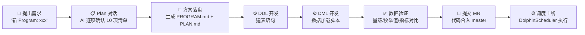
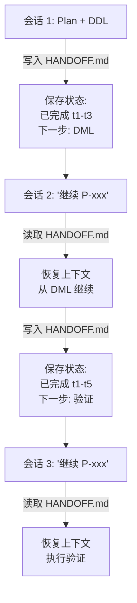
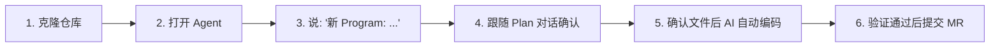

欢迎来到 kunlun-dolphinscheduler 数据仓库项目。本文档将引导你从零开始，在 **15 分钟内** 完成第一次 AI 辅助的数据开发体验——无论你是刚接手数仓维护的新同学，还是需要快速交付一个统计需求的分析师。

本项目的核心工作方式是 **与 AI Agent 对话**：你描述需求，AI 引导你完成 Plan 确认、自动生成 SQL 代码、编写数据验证脚本，最后通过 GitLab CI + DolphinScheduler 上线。整个过程围绕一个名为 **Program** 的基本工作单元展开。

Sources: [AGENTS.md](AGENTS.md#L1-L15)

## 开始之前：你需要什么

开始之前，确保你已经具备以下环境：

| 条件 | 说明 | 检查方式 |
|------|------|----------|
| Git 仓库访问 | 能够 clone 并推送代码到本项目仓库 | `git clone` 成功后执行 `git log --oneline -1` |
| StarRocks 查询权限 | 可以连接集群执行 SELECT 和 SHOW 语句 | 使用 DBeaver/DataGrip 等工具验证连接 |
| DolphinScheduler 访问 | 能够查看和操作调度任务（上线阶段需要） | 浏览器登录 DS 控制台 |
| AI Coding Agent | 支持读取本地文件、执行命令的 AI 编码助手 | 能够正常启动 Agent 会话 |

如果你是新加入团队的成员，前两项通常由管理员在入职时分配。如果不确定自己是否具备条件，联系你的团队 lead 确认。

Sources: [RESOURCE-MAP.yml](orchestrator/ALWAYS/RESOURCE-MAP.yml#L72-L96)

## 认识项目结构：两张地图

开始工作之前，先建立对仓库的宏观认知。整个项目可以拆分成"两块地图"——你日常打交道的主要是这两块。

### 地图一：代码区 `starrocks/` —— 你产出的代码放在这里

这是数仓 SQL 代码的物理存放位置，按分层组织。你的每一个开发任务，最终都会在这个目录下产生文件。

```
starrocks/
├── ods/          ← 原始数据接入层（DDL + DML）
├── ods_log/      ← 日志数据接入层
├── dwd/          ← 明细数据清洗层
├── dwm/          ← 轻度汇总中间层
├── dws/          ← 主题宽表层
├── dim/          ← 维度层（维表定义）
├── ads/          ← 应用统计层 ← 你的大部分需求落在这里
│   ├── ddl/      ← 建表语句：{table_name}.sql
│   └── dml/      ← 数据加载：P_{table_name}.sql
└── alg/          ← 算法特征层
```

每一层内部的 `ddl/` 子目录放表定义，`dml/` 子目录放数据加载脚本。当你新建一张表时，通常需要同时创建这两个文件。

Sources: [RESOURCE-MAP.yml](orchestrator/ALWAYS/RESOURCE-MAP.yml#L30-L68), [AGENTS.md](AGENTS.md#L51-L73)

### 地图二：编排区 `orchestrator/` —— AI 的工作引擎

这是 AI Agent 读取和写入元数据的地方，你的任务状态、设计方案、验证脚本都在这里管理。

```
orchestrator/
├── ALWAYS/                 ← AI 每次启动必读的核心规范
│   ├── BOOT.md             ← 启动加载顺序
│   ├── CORE.md             ← 工作协议（Plan 确认清单）
│   ├── DEV-FLOW.md         ← SQL 开发流程规范
│   └── RESOURCE-MAP.yml    ← 仓库基础设施索引
├── PROGRAMS/               ← 你的任务目录（每个需求一个子目录）
│   └── P-YYYY-NNN-name/
│       ├── PROGRAM.md      ← 任务定义
│       ├── STATUS.yml      ← 当前进度
│       ├── SCOPE.yml       ← 写入权限范围
│       └── workspace/      ← 设计方案、验证脚本、交接文档
└── SKILLS/                 ← AI 可调用的自动化技能
```

**你不需要手动编辑 `orchestrator/ALWAYS/` 下的文件**。这些是 AI Agent 的"知识库"，每次启动时自动加载。你只需要关注 `PROGRAMS/` 下自己任务的子目录。

Sources: [AGENTS.md](AGENTS.md#L37-L49), [BOOT.md](orchestrator/ALWAYS/BOOT.md#L1-L12)

## 工作全貌：一条需求的生命线

在深入具体操作之前，用一张图建立端到端的工作全景：



这个流程的核心设计理念是 **Plan 先行**——AI 在写任何一行 SQL 之前，必须与你逐项确认需求、表名、字段口径、上游依赖。这避免了"写完了才发现理解错了"的返工。

Sources: [WORKFLOW.md](WORKFLOW.md#L1-L15), [DEV-FLOW.md](orchestrator/ALWAYS/DEV-FLOW.md#L5-L8)

## 两种入口：新任务 vs 继续任务

你每次打开 AI Agent 会话时，只有两种入口。根据你的情况选择其一。

### 入口一：开始一个新需求

当你有一个新的开发需求时（比如"ADS 层新增一张用户留存统计表"），直接告诉 AI：

```
新 Program: ads 层新增用户留存统计表，按日和产品维度统计次日/7日/30日留存
```

AI 会立刻进入 **Plan 对话模式**，依次向你确认以下 10 项内容：

| 序号 | AI 会问什么 | 你需要准备什么 |
|------|------------|---------------|
| 1 | 需求理解复述 | 确认 AI 理解是否正确 |
| 2 | 目标分层（ods/dwd/dws/ads/dim） | 知道新表属于哪一层 |
| 3 | 业务域归属 | 知道这属于哪个业务领域 |
| 4 | 表名候选 | 确认命名是否符合规范 |
| 5 | 上游数据来源 | 知道数据从哪些表来 |
| 6 | 字段清单 & 计算口径 | 清楚每个字段的含义和计算方式 |
| 7 | 数据粒度 & 周期（日/小时/全量/增量） | 确认统计粒度 |
| 8 | 是否有口径变更 | 如果改旧表，说明新旧差异 |
| 9 | 是否需要回刷历史 | 是否需要补历史数据 |
| 10 | 下游影响评估 | 改现有表时，是否影响下游 |

AI 不会跳过任何一项。**如果某个问题你暂时无法回答，直接说"不确定"**——AI 会根据上下文给出建议方案，你确认即可。

Sources: [CORE.md](orchestrator/ALWAYS/CORE.md#L6-L29), [DEV-FLOW.md](orchestrator/ALWAYS/DEV-FLOW.md#L12-L26)

### Plan 对话示例

以下是真实对话模式（简化版），帮你建立预期：

```
👤 你: 新 Program: ads 层新增用户活跃趋势表，按日统计 DAU/WAU/MAU

🤖 AI: 需求理解：在 ads 层新建一张日粒度表，统计每日、每周、每月的活跃用户数。
       目标层级: ads
       业务域: 推断为"用户行为"，确认吗？
       候选表名: ads.ads_user_active_trend_di，确认吗？

       接下来需要确认：
       1. 上游数据来源是哪张表？dws.dws_user_login_ed？
       2. 除了 DAU/WAU/MAU，还需要其他指标吗？
       3. 是否需要回刷历史数据？

👤 你: 1. 是的，上游是 dws.dws_user_login_ed
       2. 再加一个"新增用户数"
       3. 需要回刷近 90 天

🤖 AI: 明白了。我汇总一下方案：
       - 表名：ads.ads_user_active_trend_di
       - 粒度：日（di）
       - 字段：dt, product_id, dau, wau, mau, new_users, etl_time
       - 上游：dws.dws_user_login_ed
       - 回刷：90 天
       确认后我就写入 PLAN.md。

👤 你: 确认

🤖 AI: [写入 PROGRAM.md + SCOPE.yml + STATUS.yml + PLAN.md]
       方案文件已生成，请确认后我开始写 DDL。
```

确认完成后，AI 将依次完成 DDL 编写 → DML 编写 → 数据验证 → 提交 MR。整个过程你只需要在关键节点确认，具体编码由 AI 完成。

Sources: [AGENTS.md](AGENTS.md#L84-L100), [WORKFLOW.md](WORKFLOW.md#L17-L43)

### 入口二：继续一个已有任务

如果你的任务跨越了多个会话（大需求通常如此），重新打开 Agent 后只需说：

```
继续 P-20260515-存储治理
```

AI 会自动加载该 Program 的 `STATUS.yml` 和 `HANDOFF.md`（如果有的话），然后输出当前状态：

```
Program: 集群存储治理
类型: development
当前阶段: coding
已完成: t1(梳理下游依赖), t2(方案设计), t3(DDL), t4(DML), t5(DML改造)
下一步: 等待快照表初始化完成后执行 t6(数据验证)
```

你可以无缝接续上次的进度，不会丢失任何上下文。

Sources: [WORKFLOW.md](WORKFLOW.md#L90-L108), [BOOT.md](orchestrator/ALWAYS/BOOT.md#L56-L65)

## 两种任务类型：开发 vs 分析

项目支持两种 Program 类型，AI 会根据你的指令自动分流：

| 维度 | 开发类（development） | 分析类（analysis） |
|------|----------------------|-------------------|
| **触发指令** | "新 Program: xxx" | "新分析: xxx" |
| **典型场景** | 新建表、新增字段、口径变更、SQL 重构 | 数据资产定级、血缘梳理、质量审计、架构评估 |
| **核心产物** | SQL 文件（DDL + DML） | 分析报告 + 结构化清单 |
| **确认清单** | 10 项（分层、表名、字段、口径...） | 9 项（分析目标、范围、框架、产出物...） |
| **是否修改 starrocks/** | 是 | 默认不允许（除非 SCOPE.yml 授权） |

如果你不确定自己的需求属于哪种，直接描述需求即可——AI 会自动判断并选择对应流程。

Sources: [AGENTS.md](AGENTS.md#L18-L26), [CORE.md](orchestrator/ALWAYS/CORE.md#L31-L41)

## 日常高频命令

以下是工作中最常用的 5 条命令，记住它们就够了：

| 命令 | 场景 | 示例 |
|------|------|------|
| `新 Program: xxx` | 开始一个新的开发任务 | `新 Program: dwd 层新增用户行为清洗表` |
| `新分析: xxx` | 开始一个新的分析任务 | `新分析: 对 dim 层做数据资产定级` |
| `继续 P-YYYY-NNN` | 恢复一个未完成的任务 | `继续 P-20260515-存储治理` |
| `保存进度` | 当前会话快结束时保存状态 | `保存进度` |
| `规范化 xxx.sql` | 格式化 SQL 文件使其符合编码规范 | `规范化 starrocks/ads/dml/P_ads_xxx.sql` |

其中"保存进度"是一条重要习惯——当你预感当前会话即将结束时，主动要求 AI 保存进度。AI 会写入 `HANDOFF.md`，确保下次"继续"时零信息损失。

Sources: [AGENTS.md](AGENTS.md#L75-L81), [CORE.md](orchestrator/ALWAYS/CORE.md#L106-L113)

## 代码产出物速览

当你完成一个开发类 Program 后，典型的产物文件如下：

### DDL 文件（建表语句）

位于 `starrocks/{layer}/ddl/{table_name}.sql`。使用 StarRocks 主键模型，按日期分区，哈希分布：

```sql
create table if not exists ads.ads_user_active_trend_di (
     dt          date     not null comment "日期"
    ,product_id  int      not null comment "产品id"
    ,dau         bigint   null     comment "日活用户数"
    ,wau         bigint   null     comment "周活用户数"
    ,mau         bigint   null     comment "月活用户数"
    ,new_users   bigint   null     comment "新增用户数"
    ,etl_time    datetime null     comment "处理时间"
)
primary key(dt, product_id)
comment "用户活跃趋势日统计表"
partition by date_trunc("day", dt)
distributed by hash(dt, product_id)
properties (
    "replication_num" = "3"
    ,"compression" = "LZ4"
)
;
```

Sources: [DEV-FLOW.md](orchestrator/ALWAYS/DEV-FLOW.md#L76-L96), [ads_user_login_dau.sql](starrocks/ads/ddl/ads_user_login_dau.sql#L1-L89)

### DML 文件（数据加载脚本）

位于 `starrocks/{layer}/dml/P_{table_name}.sql`。文件头带注释元信息，主体使用 CTE 风格组织查询：

```sql
----------------------------------------------------------------
-- 程序功能： 用户活跃趋势日统计
-- 程序名： P_ads_user_active_trend_di
-- 目标表： ads.ads_user_active_trend_di
-- 负责人： xxx
-- 开发日期：2026-05-25
----------------------------------------------------------------

insert into ads.ads_user_active_trend_di
with base_login as (
    select dt, product_id, userid
    from dws.dws_user_login_ed
    where dt >= '${bf_30_dt}' and dt < '${dt}'
)
, dau_stat as (
    select dt, product_id, count(distinct userid) as dau
    from base_login
    group by 1, 2
)
select
     a.dt
    ,a.product_id
    ,a.dau
    ,null as wau   -- 待后续迭代
    ,null as mau   -- 待后续迭代
    ,null as new_users
    ,now() as etl_time
from dau_stat a
;
```

注意 `${dt}` 和 `${bf_30_dt}` 是 DolphinScheduler 调度变量——在调度平台中会被自动替换为实际日期。本地调试时需手动替换为具体日期值。

Sources: [DEV-FLOW.md](orchestrator/ALWAYS/DEV-FLOW.md#L98-L119), [P_ads_user_login_dau.sql](starrocks/ads/dml/P_ads_user_login_dau.sql#L1-L81)

## SQL 编码风格速记

项目有统一的编码规范，AI 会自动遵循。作为开发者，你只需要了解以下关键约定：

| 规则 | 示例 | 说明 |
|------|------|------|
| 关键字小写 | `select`, `from`, `left join` | 不使用大写 SQL |
| 逗号前置 | `,field2` | 逗号在字段前，便于增删 |
| 4 空格缩进 | `    select` | 不用 Tab |
| GROUP BY 数字 | `group by 1, 2, 3` | 引用 SELECT 中的列位置 |
| CTE 优先 | `with cte as (...)` | 优先于嵌套子查询 |
| NULL 兜底 | `coalesce(field, 0)` | 防止 NULL 导致计算异常 |

如果你的 SQL 文件风格不符合规范，对 AI 说 `规范化 starrocks/ads/dml/P_xxx.sql` 即可自动格式化。

Sources: [DEV-FLOW.md](orchestrator/ALWAYS/DEV-FLOW.md#L121-L130), [RESOURCE-MAP.yml](orchestrator/ALWAYS/RESOURCE-MAP.yml#L98-L107)

## 分支命名与提交

每个需求对应一个独立的开发分支，命名格式为：

```
dev+{你的名字}+{需求编号}+{简短描述}
```

例如：`dev+haoran+RTM-2026+user-active-trend`

提交信息遵循约定式格式：

| 前缀 | 场景 |
|------|------|
| `feat(ads): xxx` | 新建表/字段/指标 |
| `fix(dwd): xxx` | 修复数据口径/逻辑 bug |
| `refactor(dws): xxx` | 重构 SQL（不改口径） |
| `perf(ads): xxx` | 性能优化（分区/分桶/索引） |

Scope 使用数仓层级：`ods`、`dwd`、`dws`、`dim`、`ads`。

Sources: [DEV-FLOW.md](orchestrator/ALWAYS/DEV-FLOW.md#L47-L62)

## 数据质量验证三件套

每个开发任务完成后，AI 会生成以下三类验证 SQL，确保数据质量：

| 验证类型 | 检查内容 | 示例 |
|----------|----------|------|
| **数据量级检查** | 确认每天数据量在合理范围 | `select dt, count(*) from ads.xxx group by dt order by dt desc limit 7` |
| **枚举值一致性** | 确认维度字段的值符合预期 | `select distinct product_id from ads.xxx where dt = '2026-05-25'` |
| **指标对比** | 新旧口径数据一致性（口径变更时） | `select a.dt, a.dau, b.dau from old a join new b on ... where a.dau <> b.dau` |

验证通过后，AI 才会提交代码。你也可以在 Plan 阶段提出额外的验证需求。

Sources: [DEV-FLOW.md](orchestrator/ALWAYS/DEV-FLOW.md#L135-L149)

## 跨会话不丢进度：HANDOFF 机制

大型需求通常跨越多个会话。项目通过 HANDOFF 机制确保会话间无缝衔接：



**养成习惯**：每次会话快结束时说一句"保存进度"，让 AI 写入 HANDOFF.md。下次新会话只需说"继续 P-xxx"，就能无缝接上。

Sources: [CORE.md](orchestrator/ALWAYS/CORE.md#L106-L113), [WORKFLOW.md](WORKFLOW.md#L90-L108)

## 你的第一个 Program：从克隆到提交

如果你已经准备好了环境，按以下步骤完成你的第一个端到端体验：



**第 1 步**：克隆仓库并创建分支
```bash
git clone {仓库地址}
cd kunlun-dolphinscheduler
git checkout -b "dev+{你的名字}+INIT-001+first-program"
```

**第 2 步**：用 AI Coding Agent 打开项目目录

**第 3 步**：在 Agent 对话中说（替换为你的真实需求描述）：
```
新 Program: ads 层新增一张测试表，统计每天各产品的登录用户数。
数据来源是 dws.dws_user_login_ed，不需要回刷。
```

**第 4-6 步**：跟随 AI 的引导，完成 Plan 确认 → 自动编码 → 数据验证 → 提交。

这个过程中你会完整经历 Plan 对话、方案落盘、DDL/DML 开发、验证、提交的全链路。预计 **10-15 分钟**完成（不含等待 Review 的时间）。

## 下一步

完成快速上手后，建议按以下顺序继续阅读：

1. **[仓库结构总览](3-cang-ku-jie-gou-zong-lan)** — 深入理解目录结构和各层职责，建议 10 分钟
2. **[AI Agent 工作流入门](4-ai-agent-gong-zuo-liu-ru-men)** — 了解 Agent 的启动流程和上下文管理，建议 8 分钟
3. **[Program 生命周期管理](12-program-sheng-ming-zhou-qi-guan-li)** — 掌握 Program 的完整状态机和文件体系，建议 15 分钟

当你需要编写具体代码时，**[DDL 与 DML 开发规范](14-ddl-yu-dml-kai-fa-gui-fan)** 和 **[SQL 编码风格与数据质量兜底](15-sql-bian-ma-feng-ge-yu-shu-ju-zhi-liang-dou-di)** 是你的常备参考。

遇到问题时，记住最有效的求助方式是直接对 AI 说 `新 Program: xxx`——AI 会引导你一步步理清需求并完成交付。