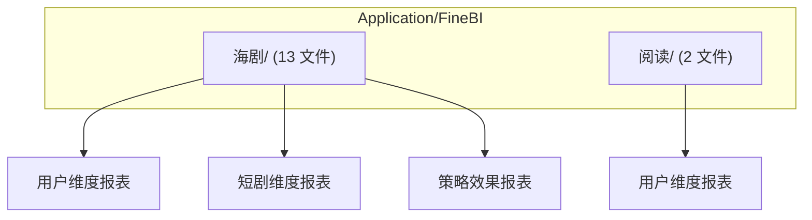
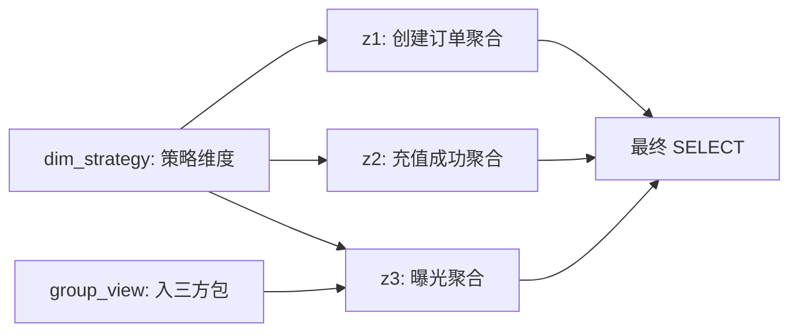
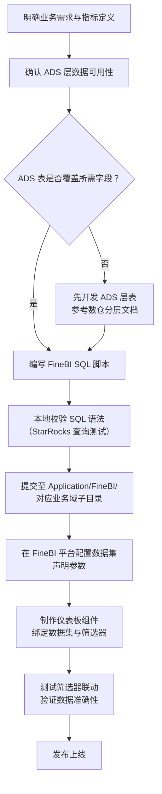
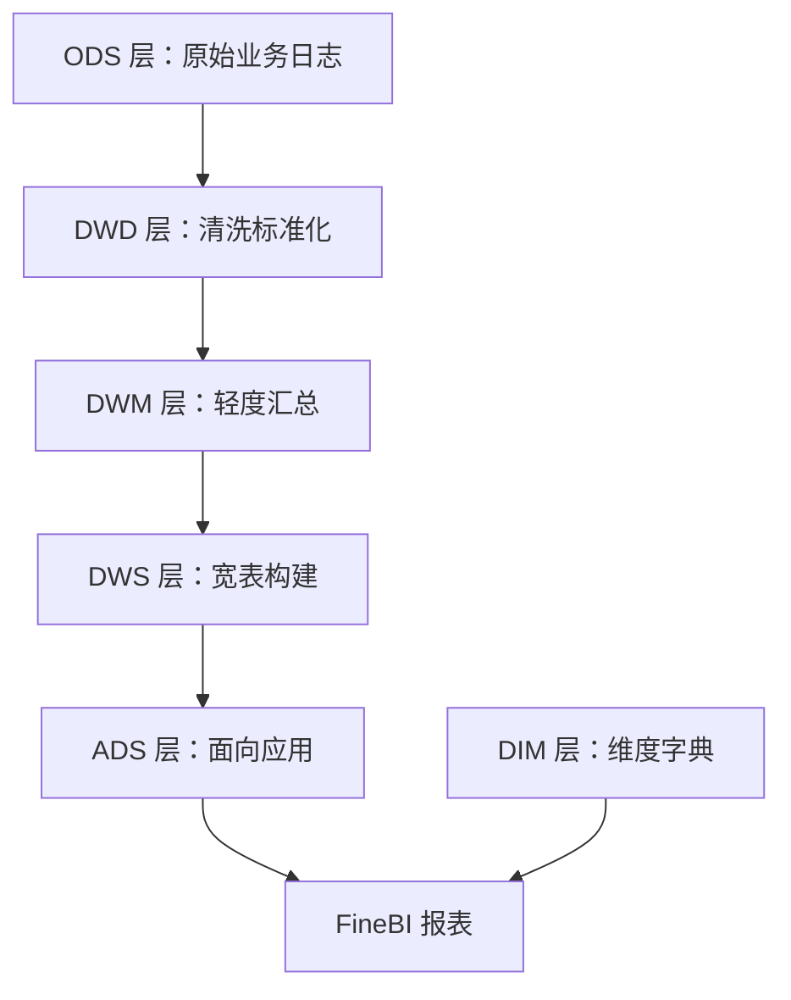

FineBI 是帆软旗下的一款自助式 BI 分析工具，在本项目中承载了绝大部分业务报表的可视化与分析需求。`Application/FineBI/` 目录下按业务域组织 SQL 查询脚本，这些脚本直接嵌入 FineBI 数据集中，通过 FineBI 的参数化语法实现灵活的多维筛选，最终呈现在看板中供运营、产品、财务等角色使用。

Sources: [2、海剧三方支付漏斗链路报表V4.sql](Application/FineBI/海剧/2、海剧三方支付漏斗链路报表V4.sql#L1-L5)

## 目录结构与业务域划分

FineBI 报表 SQL 按业务域分为两个子目录，每个子目录下的 SQL 文件对应 FineBI 中的一张数据集或一个报表组件。



**海剧（Short Drama）** 子目录包含 13 个 SQL 文件，是当前最活跃的报表域，覆盖三大报表分类：

| 分类 | 文件 | 说明 |
|------|------|------|
| 用户维度报表 | `海剧用户留存V6.sql` | 新用户 1-180 日留存分析 |
| 用户维度报表 | `海剧用户长期价值报表V2.sql` | 用户 LTV0-LTV120 累计估算 |
| 用户维度报表 | `海剧用户长期价值报表-趋势V2.sql` | LTV 趋势分析 |
| 用户维度报表 | `收入【海阅+海剧+国剧】V6.sql` | 跨产品线收入汇总 |
| 用户维度报表 | `2、海剧三方支付漏斗链路报表V4.sql` | 曝光→下单→充值漏斗 |
| 短剧维度报表 | `海外短剧消费统计表V3.sql` | 剧维度消费汇总 |
| 短剧维度报表 | `海外短剧消费统计表-天维度V2.sql` | 剧维度按日消费明细 |
| 短剧维度报表 | `短剧消费统计表v2-汇总.sql` | 消费汇总（含分桶统计） |
| 短剧维度报表 | `短剧维度广告收益报表.sql` | 剧维度广告收益 |
| 短剧维度报表 | `广告基建策略.sql` | 每日广告基建上限 |
| 短剧维度报表 | `模板&剧维度基建上限.sql` | 模板&剧维度基建分析 |
| 策略效果报表 | `海剧PUSH下发监控报表V7.sql` | PUSH 触达全链路监控 |
| 策略效果报表 | `海剧push下发监控报表v5.sql` | PUSH 监控（旧版） |

**阅读（Reading）** 子目录包含 2 个 SQL 文件：

| 分类 | 文件 | 说明 |
|------|------|------|
| 用户维度报表 | `海阅三方支付漏斗链路报表V3.sql` | 阅读端三方支付漏斗 |
| 用户维度报表 | `海阅续订.sql` | 订阅续订明细分析 |

Sources: [海剧](Application/FineBI/海剧/) | [阅读](Application/FineBI/阅读/)

## FineBI 参数化语法

FineBI 数据集 SQL 支持一套特有的参数注入语法，使得同一段 SQL 可以根据用户在仪表板中的筛选条件动态调整查询逻辑。这套语法是 FineBI SQL 开发的核心。

### 基础参数引用

所有 FineBI 参数使用 `${参数名}` 语法引用，在 FineBI 数据集配置中声明参数后，平台会自动将仪表板筛选器的值注入 SQL。最常见的两个参数是时间范围：

```sql
where dt between '${开始时间}' and '${结束时间}'
```

中文参数名是项目约定，因为最终报表面向中文用户，参数名直接对应筛选器标签，降低配置错误率。

Sources: [2、海剧三方支付漏斗链路报表V4.sql](Application/FineBI/海剧/2、海剧三方支付漏斗链路报表V4.sql#L42-L43)

### 条件过滤模式

当筛选器未选择任何值时，参数默认为空字符串。项目使用 `${if()}` 宏实现"可选筛选器"模式——筛选器为空时跳过过滤条件：

```
${if(len(参数名) == 0,"","and 字段 in ('" + 参数名 + "')")}
```

这段宏的逻辑是：如果参数长度为零（即用户未选择），返回空字符串；否则拼接出 `and 字段 in (...)` 条件。以 `CORE` 参数为例：

```sql
${if(len(CORE) == 0,"","and core in ('" + CORE + "')")}
```

当用户在仪表板中选择了 `core1,core2` 时，实际注入后的 SQL 为：

```sql
and core in ('core1','core2')
```

Sources: [短剧消费统计表v2-汇总.sql](Application/FineBI/海剧/短剧消费统计表v2-汇总.sql#L37-L38)

### 三级条件分支

对于需要三态逻辑的参数（如"全部"/"是"/"否"），项目使用嵌套 `if()` 实现三级分支：

```sql
${if(是否引流=='全部用户',"and is_toufang=0",
  if(是否引流=='引流用户',"and is_toufang=1"," and is_toufang=2") )}
```

当选择"全部用户"时过滤 `is_toufang=0`（非引流），选择"引流用户"时过滤 `is_toufang=1`（引流），不选时过滤 `is_toufang=2`（无效值，等价于全选）。

Sources: [短剧消费统计表v2-汇总.sql](Application/FineBI/海剧/短剧消费统计表v2-汇总.sql#L35-L36)

### 多值参数的正则表达式匹配

当参数值包含多个枚举（如支付渠道选择了多个），标准的 `in ('...')` 语法因 FineBI 将多值拼接为 `'A','B'` 格式而失效。项目中使用 `regexp` + 预计算 CTE 的方案：

```sql
with x as (
    select replace("${支付渠道}", "'&'", "|") as zfqd
)
-- 后续使用:
${if(len(支付渠道) == 0,"","and regexp(zfqd,(select zfqd from x) )")}
```

FineBI 的多选值以 `'A'&'B'&'C'` 格式拼接，通过 `replace` 将 `'&'` 转为 `|` 后形成正则表达式 `A|B|C`，再用 `regexp()` 进行匹配。这是 FineBI 多选参数与 StarRocks 之间的一层适配桥接。

Sources: [2、海剧三方支付漏斗链路报表V4.sql](Application/FineBI/海剧/2、海剧三方支付漏斗链路报表V4.sql#L109-L116)

## SQL 结构模式

FineBI SQL 脚本遵循一套稳定的结构化模式，通过分析仓库内所有脚本，可归纳出以下核心模式。

### 头部注释规范

每个文件的头部注释声明该报表在 FineBI 中的归属路径，格式为：

```sql
-------------------------------------------------
-- 应用报表：{业务域}-{报表分类}/{报表名称}
-------------------------------------------------
```

例如：
- `应用报表：海剧-用户维度报表/海剧三方支付漏斗链路报表`
- `应用报表：海剧-策略效果报表/海剧PUSH下发监控报表`
- `应用报表：阅读-用户维度报表/海阅订阅续订报表`

这份注释同时是 FineBI 数据集名称的直接映射，便于在 FineBI 中通过名称反查对应的 SQL 源文件。

Sources: [海剧PUSH下发监控报表V7.sql](Application/FineBI/海剧/海剧PUSH下发监控报表V7.sql#L1-L3) | [海阅续订.sql](Application/FineBI/阅读/海阅续订.sql#L1-L3)

### CTE 多步转换架构

所有 FineBI SQL 大量使用 CTE（Common Table Expression，即 `WITH ... AS` 子句）将复杂分析拆解为命名步骤。这是项目最显著的 SQL 结构特征：



每个 CTE 负责一个独立的数据加工步骤，命名上采用 `z1, z2, z3...` 或 `dim_xxx, group_xxx` 等前缀。CTE 之间通过 `JOIN` 在最终查询中关联，而非嵌套子查询。这种模式显著提升了 SQL 的可读性和可维护性——当报表出现问题时，可以逐个 CTE 独立调试。

Sources: [2、海剧三方支付漏斗链路报表V4.sql](Application/FineBI/海剧/2、海剧三方支付漏斗链路报表V4.sql#L7-L171)

### 维度字典关联

维度枚举值的可读化通过 `dim.dim_dic` 字典表完成。这是数仓 DIM 层提供的标准能力：

```sql
left join dim.dim_dic dic_lang
  on t1.series_language = dic_lang.enum_id
 and dic_lang.table_name = 'dim_producttype'
 and dic_lang.dic_column = 'language_id'
```

`dim.dim_dic` 是一个通用的字典映射表，通过 `table_name` 和 `dic_column` 定位具体枚举域，`enum_id` 存储原始编码值，`remarks`（或 `enum_name`）存储可读名称。项目中最常用的字典关联包括：

| dic_column | table_name | 用途 |
|------------|-----------|------|
| `language_id` | `dim_producttype` | 注册/投放语言编码→名称 |
| `mt` | `dim_user_accountinfo_df` | 终端类型编码→"iOS"/"Android" |
| `product_id` | `dwd_consume_user_consume_di` | 产品ID→产品名称 |

Sources: [短剧消费统计表v2-汇总.sql](Application/FineBI/海剧/短剧消费统计表v2-汇总.sql#L21-L25) | [海外短剧消费统计表-天维度V2.sql](Application/FineBI/海剧/海外短剧消费统计表-天维度V2.sql#L17-L22)

### 业务隔离与 product_id

海剧和阅读通过 `product_id` 实现业务隔离。海剧的 `product_id = 6833`，阅读则通过不同的 product_id 区分。在每个查询中，product_id 是强制的过滤条件：

```sql
WHERE product_id = 6833
  and dt >= '${开始时间}' and dt <= '${结束时间}'
```

这种模式确保了同一张 ADS 层宽表（如 `ads_bi_short_video_consume_stat`）可以被不同业务线的报表复用，同时保持数据隔离。

Sources: [短剧消费统计表v2-汇总.sql](Application/FineBI/海剧/短剧消费统计表v2-汇总.sql#L33-L34)

### 中文字段别名

所有最终 SELECT 输出的列均使用中文别名，这些别名直接对应 FineBI 图表中的字段名：

```sql
select z3.dt                  as `日期`
     , z3.recharge_source     as `充值来源`
     , `曝光UV`
     , `入包UV`
     , `原生下单UV`
     , `三方下单UV`
     , `充值金额`
```

当列名已在 CTE 内部定义为中文别名时，外层直接使用反引号引用。这种"一次性命名"策略避免了重复 AS 定义，但要求读者回溯 CTE 定位列的来源。

Sources: [2、海剧三方支付漏斗链路报表V4.sql](Application/FineBI/海剧/2、海剧三方支付漏斗链路报表V4.sql#L172-L196)

## 常见报表类型与数据源映射

FineBI 报表依赖的底层数据表全部来自 StarRocks 的 ADS 层。以下按报表类型梳理核心数据源：

### 用户留存与活跃

**核心表**: `ads.ads_bi_wide_user_retention_info`

该表存储按日、产品、用户维度切片的 1-180 日留存数据。FineBI SQL 通过 `SUM(CASE WHEN reg_days = N THEN retention_num END)` 的模式将纵向的留存天数展开为横向的多列输出。

```sql
sum(case when reg_days = 1 then retention_num end)  as retention_num1,
sum(case when reg_days = 7 then retention_num end)  as retention_num7,
sum(case when reg_days = 30 then retention_num end) as retention_num30
```

Sources: [海剧用户留存V6.sql](Application/FineBI/海剧/海剧用户留存V6.sql#L119-L121)

### 三方支付漏斗

**核心表族**: `ads.ads_sv_third_party_payment_funnel_*` 系列

三方支付漏斗报表是项目中逻辑最复杂的报表类型，涉及四张关键表：

| 表名 | 漏斗步骤 | 关键指标 |
|------|---------|---------|
| `ads_sv_third_party_payment_funnel_exposure` | 曝光 | 曝光UV/PV、入包UV |
| `ads_sv_third_party_payment_funnel_create_order` | 创建订单 | 原生/三方下单UV |
| `ads_sv_third_party_payment_funnel_recharge` | 充值成功 | 充值人数/金额、支付时长 |
| `ads_user_short_video_group_user_log_view` + `crowd_log` | 入三方包 | 用户入包标识 |

这些表通过 `strategy_id` 关联策略维度，通过 `dt` 和 `user_id` 关联用户粒度。报表最终通过多 CTE 分别聚合各漏斗步骤，再通过 FULL JOIN 合并输出。

Sources: [2、海剧三方支付漏斗链路报表V4.sql](Application/FineBI/海剧/2、海剧三方支付漏斗链路报表V4.sql#L38-L171)

### 短剧消费统计

**核心表**: `ads.ads_bi_short_video_consume_stat`（消费）、`ads.ads_bi_short_video_action_stat`（行为）

消费统计使用 StarRocks 的 Bitmap 聚合函数进行去重计数，这是项目区别于传统 `COUNT(DISTINCT)` 的性能优化手段：

```sql
bitmap_union_count(video_consume_user_bitmap) consume_user,
bitmap_union_count(video_coin_consume_user_bitmap) consume_user_coin,
sum(video_consume_amt) consume_amount,
sum(video_coin_consume_amt) consume_amount_coin
```

`bitmap_union_count()` 对 Bitmap 列进行合并去重计数，在亿级用户规模下可显著降低内存消耗和计算延迟。ADS 层表预先将用户标识聚合为 Bitmap，FineBI 报表再通过 `bitmap_union_count` 进行跨分组的二次聚合。

Sources: [短剧消费统计表v2-汇总.sql](Application/FineBI/海剧/短剧消费统计表v2-汇总.sql#L11-L16)

### 订阅续订

**核心表**: `ads.ads_bi_trade_user_subscribe_di`

订阅续订报表关联多张维度表（注册语言、用户活跃期、用户归因队列、书籍信息）以还原首订用户的完整画像。关键逻辑是通过 `subscribe_status <> 2` 过滤首订，再关联 `subscribe_status = 2` 的同一用户获取续订次数：

```sql
left join (
    select dt, user_id, item_id, autoRenew_times
    from ads.ads_bi_trade_user_subscribe_di
    where subscribe_status = 2  -- 续订记录
) t2 on t1.user_id = t2.user_id and t1.item_id = t2.item_id and t1.dt <= t2.dt
```

Sources: [海阅续订.sql](Application/FineBI/阅读/海阅续订.sql#L108-L115)

## FineBI vs FineReport：两种应用模式的区分

项目同时使用 FineBI 和 FineReport 作为数据展示工具，二者的 SQL 存放在不同目录且开发模式有本质区别：

| 维度 | FineBI | FineReport |
|------|--------|------------|
| SQL 目录 | `Application/FineBI/` | `Application/FineReport/` |
| 头部注释 | `应用报表：域-分类/名称` | `frm路径：数据源/目录/报表名` |
| 参数语法 | `${参数名}` | `${参数名}`（相同） |
| 组织方式 | 一个 SQL 文件对应一个数据集 | 一个 SQL 文件可含多段（用分隔线区隔） |
| 适用场景 | 自助分析、多维钻取、探索式看板 | 固定格式报表、大屏、周期性导出 |
| 复杂度 | 高（多CTE、多维度） | 中（偏聚合查询） |

FineReport SQL 文件（如 `首页.sql`）使用 `-- frm路径：` 头部注释，单个文件可能包含多个独立的数据集查询，用 `---` 注释行分隔。如对 FineReport 需要更深入了解，请参考 [FineReport 数据看板与问题排查](21-finereport-shu-ju-kan-ban-yu-wen-ti-pai-cha)。

Sources: [首页.sql](Application/FineReport/首页.sql#L1-L3)

## 新增 FineBI 报表的开发流程

以下流程图描述了从业务需求到 FineBI 上线的标准步骤：



### 关键开发规范

**1. 参数声明顺序**

FineBI 数据集的参数必须在 SQL 中全部使用到，且参数名称需与仪表板筛选器名称严格一致。建议先确定筛选器清单，再编写 SQL：`${开始时间}`, `${结束时间}`, `${CORE}`, `${终端}`, `${用户类型}` 等。

**2. 避免 SELECT \***

FineBI 要求数据集列名稳定可预测，严禁使用 `SELECT *`。所有列必须显式命名，最终输出列使用中文别名。

**3. 时间参数恒存在**

`${开始时间}` 和 `${结束时间}` 是每个 FineBI 数据集的必选参数，不存在为空的情况，因此不需要 `${if(len(...)==0,...)}` 包裹，直接使用：

```sql
where dt between '${开始时间}' and '${结束时间}'
```

**4. 维度字典 JOIN 的标准写法**

关联 `dim.dim_dic` 时，必须同时指定 `table_name` 和 `dic_column` 以精准定位枚举域，否则可能返回多条匹配结果导致数据膨胀：

```sql
left join dim.dim_dic dic_mt
  on t1.mt = dic_mt.enum_id
 and dic_mt.table_name = 'dim_user_accountinfo_df'
 and dic_mt.dic_column = 'mt'
```

Sources: [短剧消费统计表v2-汇总.sql](Application/FineBI/海剧/短剧消费统计表v2-汇总.sql#L22-L25)

**5. 文件版本管理**

文件名中的 V 后缀（如 `V6`、`V7`）标记版本迭代。当报表逻辑发生重大变更时，创建新版本文件（递增版本号），旧版本文件保留作为历史参考。Git 历史记录完整保留每次变更的上下文。

## 常见问题排查

| 问题现象 | 可能原因 | 排查方法 |
|---------|---------|---------|
| FineBI 筛选器无数据 | 参数名与 SQL 中 `${参数名}` 不匹配 | 检查数据集参数声明是否与 SQL 完全一致 |
| 多选筛选器返回空 | 使用了 `in ('${参数}')` 而非 `regexp` 方案 | 改用 `regexp()` + `replace("${参数}","'&'","\|")` 模式 |
| 数据翻倍 | `dim.dim_dic` JOIN 缺少 `dic_column` 条件 | 检查字典关联是否同时指定了 `table_name` 和 `dic_column` |
| 报表加载超时 | Bitmap 聚合未下推到 ADS 层 | 确认 ADS 层表是否预聚合了 Bitmap 列；考虑在 ADS 层增加中间表 |
| 日期参数不生效 | 使用了 `${if()}` 包裹日期条件 | `${开始时间}` 和 `${结束时间}` 不应放在 `${if()}` 内 |

### 调试技巧

由于 FineBI SQL 内嵌参数宏，直接在 StarRocks 客户端执行会因 `${...}` 语法报错。推荐的本地调试方式是将参数手动替换为常量后再执行测试——例如将 `${开始时间}` 替换为 `'2025-01-01'`，将 `${if(len(CORE)==0,"","and core in ('" + CORE + "')")}` 替换为 `and core in ('core1','core2')`。也可以先从简入手，逐个 CTE 独立验证输出是否符合预期，再组合测试全链路。

## 与数仓分层的衔接

FineBI 报表 SQL 是数仓分层架构的"消费端"。理解分层关系对于报表开发至关重要：



FineBI SQL 直接查询 `ads.*` 和 `dim.*` 层的表，不直接访问 ODS/DWD/DWM/DWS 层。这保证了报表查询的响应速度（ADS 层已预聚合），同时隔离了底层表的变更影响。如需了解各层的详细设计，请参阅：

- [分层设计理念与数据流转](5-fen-ceng-she-ji-li-nian-yu-shu-ju-liu-zhuan)
- [ADS 层：面向业务的应用统计](9-ads-ceng-mian-xiang-ye-wu-de-ying-yong-tong-ji)
- [DIM 层：维度建模与维表管理](10-dim-ceng-wei-du-jian-mo-yu-wei-biao-guan-li)
- [DDL 与 DML 开发规范](14-ddl-yu-dml-kai-fa-gui-fan)

## 下一步阅读建议

完成本文档后，建议按以下路径深入：

1. **[FineReport 数据看板与问题排查](21-finereport-shu-ju-kan-ban-yu-wen-ti-pai-cha)** — 了解 FineReport 的 SQL 开发模式与 FineBI 的差异
2. **[ADS 层：面向业务的应用统计](9-ads-ceng-mian-xiang-ye-wu-de-ying-yong-tong-ji)** — 熟悉 FineBI 直接依赖的 ADS 层表结构和设计原则
3. **[SQL 编码风格与数据质量兜底](15-sql-bian-ma-feng-ge-yu-shu-ju-zhi-liang-dou-di)** — 掌握项目统一 SQL 编码规范和质量保障机制