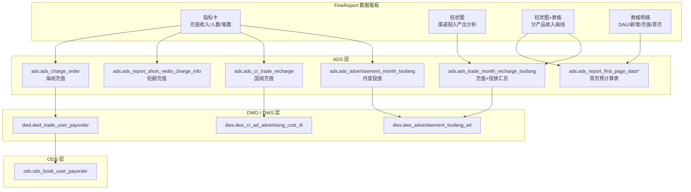
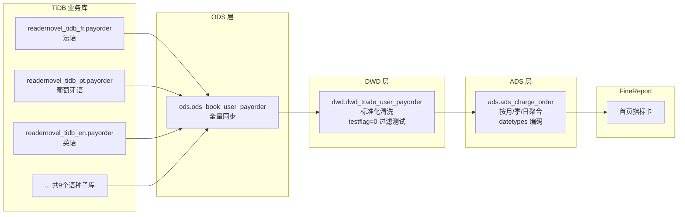

FineReport 首页数据看板是本项目的核心业务可视化出口，承载了海外阅读、海外短剧、国内短剧、国内阅读四大业务线的日常经营数据监控。本页文档系统阐述看板的 SQL 架构、数据流转链路、datetypes 编码体系以及数据问题的标准化排查流程。

## 看板整体架构

FineReport 首页看板按**业务线 + 图表组件**两个维度组织 SQL 查询，每个业务线下包含四类可视化组件：指标卡（关键数据即时比对）、柱状图（渠道投放 ROI 趋势）、柱状图+表格（分产品按月收入曲线）以及表格明细（日粒度运营数据）。看板 SQL 直接查询 StarRocks 的 ADS 层表，通过 `datetypes` 字段实现一次查询返回多时间周期数据，避免 FineReport 端发起多次请求。



Sources: [首页.sql](Application/FineReport/首页.sql#L1-L8)

## 四大业务线及其数据源映射

看板覆盖五个视图分区（"全部"汇总 + 四个业务线），每个业务线使用不同的 ADS 表作为数据源，核心区分维度是 `product_id`。

| 视图分区 | 业务名称 | 充值数据表 | 投放数据表 | 关键 product_id |
|---|---|---|---|---|
| 全部 | 全业务汇总 | 三表 UNION ALL | ads_advertisement_month_toufang + 天表 | — |
| 海外阅读 | 海阅 | ads.ads_charge_order | ads_advertisement_month_toufang | 3311,3322,3333,3366,3371,3388,3501,3511,3399 |
| 海外短剧 | 海剧 | ads.ads_report_short_vedio_charge_info | ads_advertisement_month_toufang | 6833 |
| 国内短剧 | 国剧自营+分销+星图+小程序 | ads.ads_report_short_vedio_charge_info | ads_advertisement_month_toufang | 6883 |
| 国内阅读 | 国阅 | ads.ads_cr_trade_recharge | dws.dws_cr_ad_advertising_cost_di | 6773 |

**"全部"视图的特殊性**：需要将三张不同结构的充值表通过 `UNION ALL` 合并，统一 `datetypes` 口径后汇总。投放数据同样需要合并 `dws.dws_advertisement_toufang_ed`（海阅/海剧/国剧）和 `dws.dws_cr_ad_advertising_cost_di`（国阅）两张表。这种多源合并的设计决定了"全部"视图是数据一致性校验的关键观察点。

Sources: [首页.sql](Application/FineReport/首页.sql#L10-L189)

## datetypes 编码体系：多产品时间周期的统一抽象

`datetypes` 是贯穿整个看板设计的核心编码字段。它将**时间周期**（今日/昨日、本月/上月、本季度/上季度）与**产品维度**（海剧自营、国剧自营、分销、星图、小程序）压缩到一个整数字段中，使指标卡 SQL 只需一条查询即可覆盖全部业务场景。

### 编码规则总览

| 时间周期 | 海剧 | 国剧自营 | 分销 | 星图 | 小程序 | 海阅 | 国阅 |
|---|---|---|---|---|---|---|---|
| **今日** | 1 | 7 | 13 | 22 | 28 | 1 | `'today'` |
| **昨日同期** | 2 | 8 | 14 | 23 | 29 | 2 | `'last_day'` |
| **本月** | 3 | 9 | 15 | 24 | 30 | 3 | `'cur_month'` |
| **上月同期** | 4 | 10 | 16 | 25 | 31 | 4 | `'last_month'` |
| **本季度** | 5 | 11 | 17 | 26 | 32 | 5 | `'cur_quarter'` |
| **上季度同期** | 6 | 12 | 18 | 27 | 33 | 6 | `'last_quarter'` |
| **上个完整季度** | 21 | 19 | 20 | 34 | 35 | 7 | `'last_whole_quarter'` |

### 设计原理

海阅和国阅使用独立的表结构，因此 datetypes 编码空间可以复用（1-7）。短剧四种子类型（海剧自营、国剧自营、分销、星图、小程序）共享 `ads_report_short_vedio_charge_info` 表，通过 datetypes 的偏移量区分：海剧基数为 0、国剧自营基数为 6、分销基数为 12、星图基数为 21、小程序基数为 27。国阅则进一步使用字符串类型的 `date_types` 字段（`'today'`、`'cur_month'` 等），因为其数据源 `ads_cr_trade_recharge` 采用了不同的设计范式。

在"全部"视图中，UNION ALL 合并时使用 `CASE WHEN` 将各产品的 datetypes 归一到统一的时间轴：

```sql
select (case when datetypes in (1, 7, 13, 22, 28) then 1 else 2 end) as datetypes
```

这种归并逻辑确保了"全部"指标卡中，今日/昨日、本月/上月等时间对比的语义一致性。

Sources: [首页.sql](Application/FineReport/首页.sql#L10-L139)

## 可视化组件与 SQL 模式

### 指标卡（Indicator Card）

指标卡是首页最核心的监控组件，展示四个关键指标：**充值收入**（`charge_money`）、**人民币充值收入**（`charge_money_rmb`）、**充值笔数**（`charge_order`）、**充值人数**（`charge_num`）。每个业务线按时间周期维度分为三组查询：月粒度（本月 vs 上月）、日粒度（今日 vs 昨日）、季度粒度（本季度 vs 上季度）。投放指标卡独立查询，展示对应周期的总投放金额。

各组查询的结构高度一致：从 ADS 表按 datetypes 过滤后直接返回，FineReport 端按 `datetypes` 分行渲染为对比卡片。关键差异在于国阅的投放使用 `dws_cr_ad_advertising_cost_di`（字段 `cost_amt`），而其他业务线使用 `dws_advertisement_toufang_ed`（字段 `spend`）。

Sources: [首页.sql](Application/FineReport/首页.sql#L231-L285)

### 柱状图：渠道投入产出分析

该组件展示按月维度的充值收入与推广费用的投入产出关系，核心指标包括：

| 指标 | 计算逻辑 | 业务含义 |
|---|---|---|
| 充值 | `sum(charge_itemcount)` | 充值总金额（原始口径） |
| 分成后充值 | `sum(charge_money)` | 扣除渠道分成后的净收入 |
| 推广费用 | `sum(spend)` | 广告投放总支出 |
| 投放比 | `sum(spend) / sum(charge_money)` | 每单位分成收入对应的投放成本 |
| 扣除推广后充值 | `sum(charge_money) - sum(spend)` | 分成收入减去推广费用的净贡献 |

数据来源为 `ads.ads_trade_month_recharge_toufang`，该表由 `dws.dws_trade_user_recharge_30d`（充值汇总）与 `dws.dws_advertisement_toufang_30d`（投放汇总）按月 + product_id JOIN 生成。查询按 `product_id` 过滤区分业务线，时间范围为近一年（`month >= date_format(date_sub(curdate(), interval 1 year), '%Y%m')`）。

Sources: [首页.sql](Application/FineReport/首页.sql#L297-L310), [P_ads_trade_month_recharge_toufang.sql](starrocks/ads/dml/P_ads_trade_month_recharge_toufang.sql#L12-L28)

### 柱状图+表格：分产品按月收入曲线

该组件提供更细粒度的产品维度拆分（如海阅下的不同语种），使用预计算的 `ads_report_first_page_data*` 系列表：

| 业务线 | 表名 |
|---|---|
| 全部 | `ads.ads_report_first_page_data32` |
| 海外阅读 | `ads.ads_report_first_page_data6` |
| 国内短剧 | `ads.ads_report_first_page_data10` |
| 国内阅读 | `ads.ads_report_first_page_data23` |

海外短剧在此组件中未使用预计算表，而是直接查询 `ads.ads_trade_month_recharge_toufang` 并 JOIN `dim.DIM_ProductType` 获取产品名称，这反映了不同业务线数据成熟度的差异。

Sources: [首页.sql](Application/FineReport/首页.sql#L203-L217), [首页.sql](Application/FineReport/首页.sql#L427-L441)

### 表格明细

日粒度明细表提供 DAU、新增用户数、充值人数、充值金额、首充用户数五项基础运营指标，同样按业务线使用独立的预计算表（如海阅用 `ads_report_first_page_data2`，国剧用 `ads_report_first_page_data14`）。

Sources: [首页.sql](Application/FineReport/首页.sql#L219-L228)

## 数据流转链路：从业务库到看板

看板数据的端到端链路遵循数仓标准分层，以海外阅读充值数据为例：



关键节点说明：ODS 层通过 `productid` 字段（如 3311 代表法语、3322 代表葡萄牙语）区分语种；DWD 层统一 `testflag=0` 过滤掉测试订单；ADS 层按时间周期聚合并赋予 datetypes 编码，`charge_money_rmb` 使用固定汇率 6.5（海阅）或 7.0（短剧）将本地货币换算为人民币。投放数据链路则从 `dim.dim_FbAdDailyInsight_view` 和 `dim.dim_LtvDailyInsight_view` 等维度视图出发，经 DWD 视图汇总后进入 ADS。

Sources: [首页数据问题排查sop.sql](Application/FineReport/首页数据问题排查sop.sql#L12-L27), [P_ads_charge_order.sql](starrocks/ads/dml/P_ads_charge_order.sql#L10-L18)

## 数据问题排查 SOP

`首页数据问题排查sop.sql` 定义了一套**自顶向下逐层穿透**的排查方法论，以海外阅读充值数据为例：

### 排查步骤

| 步骤 | 查询层级 | 目的 | 关键过滤条件 |
|---|---|---|---|
| 1 | `ads.ads_charge_order` | 确认 ADS 层数据是否异常 | `datetypes in (1,2,3,4)` |
| 2 | `dwd.dwd_trade_user_payorder` | 验证 DWD 聚合是否与 ADS 一致 | `productid in (3311,...,3399)` |
| 3 | `ods.ods_book_user_payorder` | 检查 ODS 数据量和分布 | `productid in (...)` and `testflag=0` |
| 4 | 各 TiDB 源库 `payorder` 表 | 确认源头数据是否正常 | 按语种分别查询，按 `createtime` 过滤 |

### 排查逻辑

当看板指标出现异常波动时，应当按照 ADS → DWD → ODS → 源库的链路逐层验证。每一步的核心动作是对比上下两层的数据量（`count(1)`）和金额汇总（`sum(baseamount)`），定位数据偏差首次出现的层级。如果是 ADS 层数据正常但看板显示异常，问题在 FineReport 端的数据集配置或缓存；如果 DWD 正常但 ADS 异常，检查 ADS 的 ETL 调度是否正常执行；如果 ODS 正常但 DWD 异常，排查 DWD 清洗逻辑的 `testflag` 过滤或 JOIN 条件；如果 ODS 已异常，追溯数据同步管道或源库写入。

针对多 product_id 的业务线，排查时应按 `productid` 分组统计，以快速定位具体是哪个语种/产品线出了问题：

```sql
select productid, count(1)
from ods.ods_book_user_payorder
where productid in (3311,3322,3333,3366,3371,3388,3501,3511,3399)
group by 1;
```

Sources: [首页数据问题排查sop.sql](Application/FineReport/首页数据问题排查sop.sql#L1-L47)

### 常见问题类型与定位方法

| 问题类型 | 典型表现 | 排查入口 | 根因方向 |
|---|---|---|---|
| 数据延迟 | 今日数据为 0 或显著偏低 | 检查 ADS ETL 最近执行时间 | DolphinScheduler 调度延迟、上游表产出延迟 |
| 数据量突变 | 充值人数/笔数异常飙升或骤降 | 按 product_id 分组对比历史同期 | 源库数据异常、新增/下线产品线 |
| 汇率偏差 | charge_money_rmb 与预期不符 | 核对 ADS 中的固定汇率常量 | 汇率更新未同步到 SQL |
| 跨表不一致 | "全部"视图与子业务线之和不匹配 | 逐业务线对比 UNION ALL 各部分 | datetypes 归并逻辑错误、过滤条件遗漏 |
| 历史数据回刷 | 历史月份数据变化 | 检查 DWD/ODS 层是否发生重跑 | 上游数据修正、分区覆盖 |

## FineReport 数据集配置要点

首页 SQL 文件头部标注了 FineReport 中的数据集路径 `starrocks数据源/畅读海外/首页测试_240605`，说明该看板使用的 FineReport 数据连接指向 StarRocks。在 FineReport 中配置数据集时需注意：

- **参数化查询**：datetypes 作为 FineReport 参数传递，实现单个数据集服务于多个指标卡组件
- **时间函数依赖**：SQL 中大量使用 `curdate()`、`date_sub()` 等 MySQL 兼容函数，依赖 StarRocks 的 MySQL 协议兼容层
- **汇率硬编码**：`charge_money_rmb` 的计算使用固定乘数（海阅 6.5，短剧 7.0），如需动态汇率需改为 JOIN 汇率表
- **product_id 过滤**：各业务线的 product_id 列表硬编码在 WHERE 条件中，新增产品线需同步更新所有相关 SQL

Sources: [首页.sql](Application/FineReport/首页.sql#L1)

## 与数仓分层的衔接

FineReport 首页看板完全构建在 ADS 层之上，遵循了本项目[分层设计理念与数据流转](5-fen-ceng-she-ji-li-nian-yu-shu-ju-liu-zhuan)中定义的架构原则。ADS 层表如 `ads_charge_order`、`ads_report_short_vedio_charge_info` 的 DML 逻辑位于 `starrocks/ads/dml/` 目录，通过 DolphinScheduler 调度执行。理解这些 DML 的聚合逻辑和调度时序，对于排查数据延迟问题至关重要——详见 [DolphinScheduler 调度参数与任务编排](27-dolphinscheduler-diao-du-can-shu-yu-ren-wu-bian-pai)。

排查过程中涉及 ODS → DWD 的数据质量校验时，可参考 [SQL 编码风格与数据质量兜底](15-sql-bian-ma-feng-ge-yu-shu-ju-zhi-liang-dou-di) 中定义的数据质量检查规则。对于元数据层面的字段溯源和表依赖关系分析，DAS 工具集（`starrocks/das/` 目录）提供了系统化的元数据管理能力，详见 [DAS 元数据管理工具](29-das-yuan-shu-ju-guan-li-gong-ju)。

## 建议阅读路径

完成本篇后，建议按以下顺序深入：

1. **[DolphinScheduler 调度参数与任务编排](27-dolphinscheduler-diao-du-can-shu-yu-ren-wu-bian-pai)** — 理解 ADS 表的 ETL 调度时序，是排查数据延迟的前提
2. **[ADS 层：面向业务的应用统计](9-ads-ceng-mian-xiang-ye-wu-de-ying-yong-tong-ji)** — 了解所有 ADS 层表的设计理念和命名规范
3. **[StarRocks 表模型与分区策略](28-starrocks-biao-mo-xing-yu-fen-qu-ce-lue)** — 理解 StarRocks 表结构对查询性能的影响
4. **[DAS 元数据管理工具](29-das-yuan-shu-ju-guan-li-gong-ju)** — 当排查需要字段级血缘追踪时的核心工具
5. **[数据资产等级划分与质量治理](22-shu-ju-zi-chan-deng-ji-hua-fen-yu-zhi-liang-zhi-li)** — 建立数据问题的优先级评估框架