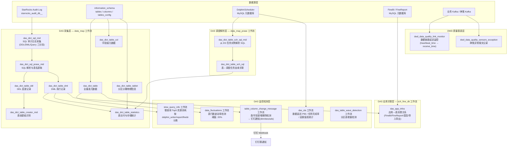
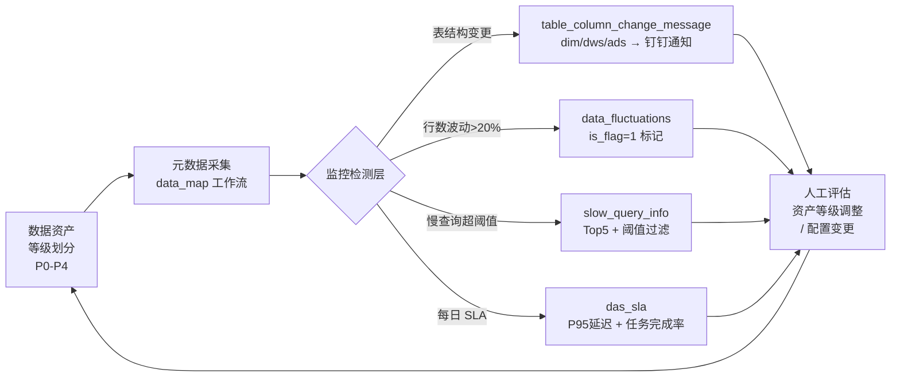

本页系统性地阐述昆仑数仓的数据资产分级标准与 DAS（Data Asset System）质量治理体系的架构设计与运行机制，涵盖从资产等级定义到元数据采集、数据链路监控、表结构变更追踪、资源消耗审计及 SLA 度量的全链路质量保障闭环。

Sources: [orchestrator/SHARED/knowledge/数据资产等级划分标准.md](orchestrator/SHARED/knowledge/数据资产等级划分标准.md#L1-L31)

## 数据资产等级划分标准

数据资产等级划分是整个质量治理体系的基础标尺，决定了每张表应享有的监控强度、SLA 保障等级及变更管控策略。本仓库采用 P0 至 P4 五级等级体系，等级的锚定依据数据的**决策影响面**、**合规敏感度**、**线上耦合度**及**下游衍生范围**四个维度综合判定。

| 等级 | 定位 | 典型场景 | 监控强度 |
|------|------|----------|----------|
| **P0** | 组织核心可信数据资产 | 核心指标看板、监管合规报备、线上用户交互（搜索/广告/促销/AB 实验）、ML 模型与欺诈检测、衍生其他 P0 数据集的源表 | 最高—全链路 SLA + 实时告警 |
| **P1** | 公司重要业务数据集 | 重要业务指标与产品看板、重要合规报告、次要线上交互场景（用户活跃度/行为分析）、衍生 P1 数据集的源表 | 高—链路监控 + 波动检测 |
| **P2** | 部门/团队级数据集 | 产品指标与看板、内部运营指标跟踪、衍生 P2 数据集的源表 | 中—变更通知 |
| **P3** | 团队级数据集 | 团队决策看板、团队所属内部系统运营指标、衍生 P3 数据集的源表 | 低—快照记录 |
| **P4** | 私有/闲置数据资产 | 无归属主体且过去 60 天内未被使用的数据资产、归个人所有且无团队归属的数据资产 | 最低—仅元数据记录 |

等级划分的实践意义在于，当前 DAS 的表结构变更钉钉通知仅针对 **dim、dws、ads** 三个面向下游消费的高价值分层，而数据波动率阈值（20%）和 SLA 延迟百分位（P95）则为所有等级提供统一基线，高等级表可根据业务需要收紧阈值。

Sources: [orchestrator/SHARED/knowledge/数据资产等级划分标准.md](orchestrator/SHARED/knowledge/数据资产等级划分标准.md#L1-L31) | [P_das_dict_table_column_alter_message_dingding.sql](starrocks/das/P_das_dict_table_column_alter_message_dingding.sql#L28-L37)

## DAS 质量治理架构总览

DAS 系统由 **8 个 DolphinScheduler 工作流** 和 **2 张 DWD 层质量基表** 构成，共同形成"采集→检测→统计→告警→归档"的闭环。以下架构图展示各组件之间的数据流转与控制依赖：

该架构的设计哲学遵循"**数据资产首先被看见，然后被度量，最后被治理**"：`data_map` 工作流解决"看见"——让每张表、每个字段、每条 SQL 都可被检索；监控检测层解决"度量"——波动、延迟、资源消耗均可量化；而等级标准与通知机制解决"治理"——让异常被及时感知与响应。

## 数据地图（data_map）— 元数据基座

`data_map` 是整个 DAS 系统中体量最大、依赖最深的工作流，承担从 StarRocks 审计日志和 `information_schema` 中持续采集元数据的核心职责。它由 10 个任务组成，按采集链路可分为三条流水线。

### SQL 审计采集流水线

StarRocks 的 `starrocks_audit_db__.starrocks_audit_tbl__` 表记录了集群中每条 SQL 的执行详情，`das_dict_sql_mid` 将其按操作类型分三路接入：

| 类型 | 操作范围 | 过滤条件 |
|------|----------|----------|
| `opreate_type=1` (DDL) | truncate/drop/alter/create table/view | 排除 set/select @@/use/show 语句，create 类需同时包含 `from` 子句 |
| `opreate_type=2` (DML) | delete/insert/update | 排除含 values 的 insert（非 insert-select 模式），排除 set/select @@/use/show |
| `opreate_type=3` (Query) | select ... from ... | 排除 insert/create/set/select @@/use/show |

每类采集均过滤 `state='ERR'` 的失败语句和 `db='shenglong'` 的内部库，且对超长 SQL 做 65533 字符截断以防止字段溢出。

Sources: [P_das_dict_sql_mid.sql](starrocks/das/P_das_dict_sql_mid.sql#L14-L27)

采集后的 SQL 文本通过自定义 UDF `parsesql2tablename()` 解析出目标表名，`das_dict_sql_prase_mid` 将其分为写操作（`opreate_type=1`，提取 `insertTableName`）和读操作（`opreate_type=2`，提取 `fromTableName`）两类，为后续 DDL/DML 记录和血缘追踪提供结构化输入。

Sources: [P_das_dict_sql_prase_mid.sql](starrocks/das/P_das_dict_sql_prase_mid.sql#L11-L18)

### 表与字段元数据流水线

`das_dict_table` 是数仓中所有表的全量目录，通过 `information_schema.tables` 与自身历史快照做 **full join** 实现增量更新：新表自动入库（`is_delete=0`），已删除的表标记 `is_delete=1`，同时合并当天 ALTER 语句的 `operation_time` 以保证 `utime` 的时效性。其覆盖范围限定在 `ods / dwd / dim / dws / ads / alg / dwm / ods_log` 八个 Schema。

Sources: [P_das_dict_table.sql](starrocks/das/P_das_dict_table.sql#L14-L53)

`das_dict_table_col` 则深入到字段级别，不仅采集列名、类型、注释和默认值，还关联 `information_schema.tables_config` 以标记每个字段是否为主键（`is_pri`）、分区键（`is_par`）或分桶键（`is_dis`）。同样通过 full join 实现增量变更检测——当字段的注释、默认值、主键/分区/分桶标记任一发生变化时，`utime` 会被更新为当前时间戳。

Sources: [P_das_dict_table_col.sql](starrocks/das/P_das_dict_table_col.sql#L14-L76)

### 表统计与物理信息流水线

`das_dict_table_tablet` 每日快照每张表的行数、数据大小、表模型（主键/聚合/明细/更新/视图/外表）、分桶数和 tablet 数。`das_dict_table_statistics` 在此基础上关联 DML 审计记录，计算表的 **7 天查询次数**（`q_cnt_7d`）、**7 天写入次数**（`m_cnt_7d`）、**最近 10 次写入的平均耗时**（`avg_time_costs_10d`）、**日增量数据大小**（`bf_1_data_size`）及 **7 日平均增量**（`avg_data_size_7d`），为资产热度评估和资源治理提供量化依据。

Sources: [P_das_dict_table_statistics.sql](starrocks/das/P_das_dict_table_statistics.sql#L14-L53) | [P_das_dict_table_tablet.sql](starrocks/das/P_das_dict_table_tablet.sql#L13-L40)

`das_dict_table_creator_mid` 则通过 DolphinScheduler 任务实例的执行者信息（`user_name`）和 DDL 记录中的 `operator` 字段双源匹配，以优先级策略（DS 解析结果 > DDL 操作者）识别每张表的创建者，为资产归属认定提供数据支撑。

Sources: [P_das_dict_table_creator_mid.sql](starrocks/das/P_das_dict_table_creator_mid.sql#L13-L64)

## 调度血缘解析（data_map_prase）— 表与任务的关联

数据质量问题排查时，最常遇到的场景是"这张表是谁写入的？上游任务是什么？"。`data_map_prase` 工作流通过解析 DolphinScheduler 任务实例中的 `task_params` JSON 字段，提取每个 SQL 任务的执行 SQL（含前置 SQL `prev_sql` 和后置 SQL `next_sql`），再经 `parsesql2tablename()` UDF 解析出目标表名，建立 **表 ↔ 工作流 ↔ 任务** 的映射关系。

`das_dict_table_sch_sql` 进一步将解析结果去重（按 `task_nm` 取最新 `sch_time`），并补充 `information_schema.views` 中的视图定义，形成完整的调度血缘视图。这张表是慢查询资源消耗统计中 `route` 字段（格式：`工作流名.任务名/任务名/...`）的数据源。

Sources: [P_das_dict_table_sch_sql_mid.sql](starrocks/das/P_das_dict_table_sch_sql_mid.sql#L13-L60) | [P_das_dict_table_sch_sql.sql](starrocks/das/P_das_dict_table_sch_sql.sql#L13-L35)

## 数据波动检测（data_fluctuations）— 行数异常预警

数据波动的检测链路分两步：`das_schema_tables_config_info` 首先每日快照所有 StarRocks 表的行数、存储大小、表模型、分区键等配置信息，然后 `das_schema_tables_rows_add_rate` 对比当日与过去 7 天的数据，计算波动率。

波动率的计算逻辑根据表的分区策略自适应调整：

- **含 `dt` 分区键的表**：对比当日分区行数与 7 日内分区均值行数的偏差率
- **无 `dt` 分区键的表**（全量表/维度表）：对比当日新增行数与 7 日内日均新增行数的偏差率

**阈值设定为 20%**，超过即标记 `is_flag=1`。这一阈值对所有等级的表统一适用，高等级表（P0/P1）建议额外配置人工复核流程。

Sources: [P_das_schema_tables_config_info.sql](starrocks/das/P_das_schema_tables_config_info.sql#L16-L49) | [P_das_schema_tables_rows_add_rate.sql](starrocks/das/P_das_schema_tables_rows_add_rate.sql#L16-L60)

## 表结构变更监控（table_column_change_message）— 从快照到钉钉

表结构的非预期变更是数据质量事故的高发根源。该工作流通过"**每日快照 → 差分对比 → 分类通知**"的三段式设计实现自动化监控：

1. **快照**：`das_dict_table_column_snap` 每日将 `das_dict_table`（表级）和 `das_dict_table_col`（字段级）的数据打入快照表，排除 `_bck` 后缀的备份表
2. **差分**：`das_dict_table_column_alter_message` 将当日快照与前一日快照做 left join，按四种状态分类：
   - `alter_status=0`：新增（当日有、前日无，且 `is_delete=0`）
   - `alter_status=1`：删除（当日无、前日有，且前日 `is_delete=0`）
   - `alter_status=2`：修改（两日都有，但注释/默认值/键标记有变化）
   - `alter_status=3`：存量无变化（`utime` 早于前日）
3. **通知**：`das_dict_table_column_alter_message_dingding` 仅对 **dim、dws、ads** 三个分层的 `alter_status in (0,1)` 记录生成钉钉通知，格式为"新增/删除表/字段 `db.table.column`"。同时做了去噪处理——如果一张表本身已在表级变更中被捕获（新增/删除整表），则不再重复通知其字段级变更。

Sources: [P_das_dict_table_column_snap.sql](starrocks/das/P_das_dict_table_column_snap.sql#L13-L26) | [P_das_dict_table_column_alter_message.sql](starrocks/das/P_das_dict_table_column_alter_message.sql#L15-L51) | [P_das_dict_table_column_alter_message_dingding.sql](starrocks/das/P_das_dict_table_column_alter_message_dingding.sql#L15-L48)

## 慢查询与资源消耗审计（slow_query_info）

该工作流从 `das_dict_table_dml` 中按三类用户角色分别统计前一天 Top 5 资源消耗的表和 SQL，为性能治理提供靶向清单：

| 用户角色 | 过滤条件 | 监控维度 |
|----------|----------|----------|
| `dolphin_writer` | `operator='dolphin_writer'`，`opreate_type=1`（写入），含 `insert` | 执行时长(s)、CPU 时长(s)、内存消耗(MB) |
| `report_user` | `operator='report_user'`，`opreate_type=2`（查询），不含 `insert` | 同上 |
| `finebi_user` | `operator='finebi_user'`，`opreate_type=2`（查询），不含 `insert` | 同上 |

每个角色的三个维度各自取 Top 5，最终合并为最多 45 条（3 角色 × 3 维度 × 5 条）监控记录。`das_dict_sql_resource_consume_stat_show` 进一步按阈值过滤出需要关注的慢查询——dolphin_writer 的 200s/5000MB 阈值远高于 report/finebi 的 100s/2500MB，反映了对 ETL 写入和用户查询不同的容忍度。已推送的记录写入 `das_dict_sql_resource_consume_stat_show_log` 防止重复通知。

Sources: [P_das_dict_sql_resource_consume_stat.sql](starrocks/das/P_das_dict_sql_resource_consume_stat.sql#L14-L395) | [P_das_dict_sql_resource_consume_stat_show.sql](starrocks/das/P_das_dict_sql_resource_consume_stat_show.sql#L23-L37)

## SLA 度量（das_sla）— 数据时效性的量化标尺

`das_sla_result` 是每日数据质量 SLA 的核心产出表，汇总五项关键指标：

| 指标 | 含义 | 计算口径 |
|------|------|----------|
| `data_link_tm` | 平均数据链路延迟 | `dwd_data_quality_link_monitor` 中取 `date_tp=1`（业务数据）的 `receive_time - heartbeat_time`，排序后取 P95 以内的平均值 |
| `sal_cnt` | 总调度任务流实例运行次数 | `sch_all` 工作流在 0—6 点的运行次数（正常为 1） |
| `total_task_cnt` | 总任务数 | `sch_all` 下所有在 0—6 点启动的任务定义数 |
| `ontime_task_cnt` | 按时完成任务数 | 上述任务中在 6 点前完成的数量 |
| `app_table_cnt` | 应用表总数 | `das_dict_table` 中非 ODS/ODS_LOG、非视图、未下线的表数量 |
| `qiye_cnt` | 起夜值班标记 | `ods.dolphin_task_fail_info` 中当天 `if_qiye=1` 的记录数 |

延迟计算采用了去极值策略——仅取排名前 95% 的延迟记录计算均值，有效排除了个别极端延迟记录的干扰。SLA 结果表是数据平台健康度的每日"体检报告"，可配合 [DolphinScheduler 调度参数与任务编排](27-dolphinscheduler-diao-du-can-shu-yu-ren-wu-bian-pai) 中的调度监控视图使用。

Sources: [P_das_sla_result.sql](starrocks/das/P_das_sla_result.sql#L15-L90)

## DWD 层质量基表

两张 DWD 表构成了数据质量监控的底层数据源：

**`dwd_data_quality_link_monitor`** 是数据链路延迟监控的基石。它从 Kafka 各节点采集心跳时间（`heartbeat_time`，数据产生时间）和接收时间（`receive_time`，数据到达各节点的时刻），通过 `kafka_tp` 区分链路类型——业务数据 Kafka（=1）、自建 Kafka（=2）、神策 Kafka（=3），同时用 `date_tp` 区分业务数据（=1）与日志数据（=2）。该表采用主键模型（`PRIMARY KEY(dt, kafka_tp, kafka_par, kafka_off)`），以 Kafka offset 为唯一键保证幂等写入。

Sources: [dwd_data_quality_link_monitor.sql](starrocks/dwd/ddl/dwd_data_quality_link_monitor.sql#L1-L70)

**`dwd_data_quality_sensors_exception`** 记录神策埋点上报中的异常报文，包含 `event`（事件名）、`app_version`（应用版本）、`lib`（来源库）、`alljson`（原始报文）和 `error_info`（解析错误原因），用于排查埋点数据质量问题（如字段缺失、格式错误、版本不兼容等）。

Sources: [dwd_data_quality_sensors_exception.sql](starrocks/dwd/ddl/dwd_data_quality_sensors_exception.sql#L1-L65)

## 应用-数据消费关联（sch_fine_db）— 影响面分析基础设施

当一张表需要下线或变更时，评估影响面的第一步是确定"谁在用这张表"。`das_app_infos` 从四个数据源汇聚应用与表的消费关系：

| 来源 | 采集方式 | 应用类型 |
|------|----------|----------|
| StarRocks 审计日志 | 从 `das_dict_table_dml` 中提取前一天所有成功执行的 DML，按 `operator` 映射到应用 | 直连（`app_tp='直连'`） |
| FineBI 元数据库 | 解析 `finebi_d_entryconfig_en` 中的 SQL 和 `dbTableName`，关联目录树路径 | FineBI（`app_tp='FineBi'`） |
| FineReport 元数据库 | 解析 `finerepodb_from_file_execute_sql` 中的 SQL，通过 UDF 提取表名，关联报表路径 | Report（`app_tp='report'`） |
| DolphinScheduler 任务定义 | 从 `description` JSON 字段中提取 `app_nm`/`table_nm`/`db_nm` | 导入（`app_tp='import'`）/ 导出（`app_tp='export'`） |

这张表回答了治理中最关键的问题之一——"这张表下游有哪些看板/报表/应用在使用？"，是数据资产下线评估和变更影响分析的核心输入。

Sources: [P_das_app_infos.sql](starrocks/das/P_das_app_infos.sql#L14-L194)

## 治理闭环：等级驱动与自动化响应

将上述所有组件串联，形成以下治理闭环：

等级标准（P0-P4）决定了每张表被监控的强度和通知的渠道——当前 dim/dws/ads 的表结构变更会触发钉钉通知，正是由于这些层的表通常对应 P1 及以上等级。随着治理体系的成熟，监控策略可以进一步按等级细化：例如 P0 表增加实时链路延迟告警、P4 表降低波动检测频率等。

对于希望深入了解各分层设计理念的读者，建议从 [分层设计理念与数据流转](5-fen-ceng-she-ji-li-nian-yu-shu-ju-liu-zhuan) 开始建立全局视图；需要操作 DAS 工具进行数据地图查询或元数据探查的读者，可参阅 [DAS 元数据管理工具](29-das-yuan-shu-ju-guan-li-gong-ju)；关注 SQL 编码层面的质量保障措施，可参阅 [SQL 编码风格与数据质量兜底](15-sql-bian-ma-feng-ge-yu-shu-ju-zhi-liang-dou-di)。