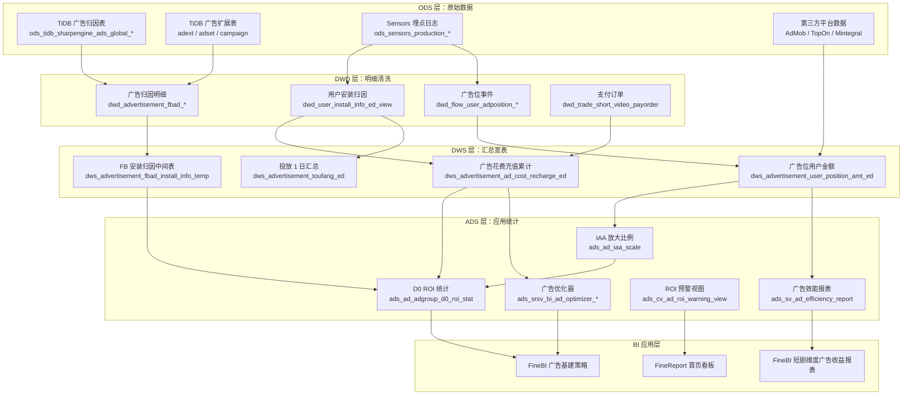
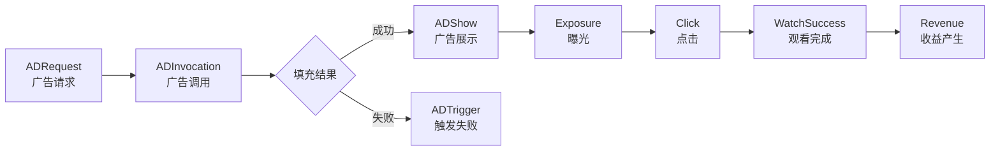

本节系统阐述数据仓库中广告投放与 ROI 分析的数据架构，涵盖从原始数据接入到应用层报表的完整链路，帮助开发者理解广告数据的流转路径、核心 ROI 计算逻辑以及自动化优化体系。

## 整体架构概览

广告投放数据架构横跨 ODS → DWD → DWS → ADS 四个核心层级，最终服务于 FineBI 报表与自动化决策系统。整个体系可划分为三个分析域：**阅读广告域**（海阅，product_id ≠ 6833/6883）、**短剧广告域**（海剧/海外短剧，product_id = 6833）和**国剧广告域**（国内短剧，product_id = 6883）。三者共享底层归因与花费数据，但在收入口径和投放策略上各有侧重。

Sources: [ads_ad_adgroup_d0_roi_stat.sql](starrocks/ads/ddl/ads_ad_adgroup_d0_roi_stat.sql#L1-L21) | [ads_sv_ad_efficiency_report.sql](starrocks/ads/ddl/ads_sv_ad_efficiency_report.sql#L1-L55) | [dws_advertisement_ad_cost_recharge_ed.sql](starrocks/dws/ddl/dws_advertisement_ad_cost_recharge_ed.sql#L1-L165)

## 广告数据源与归因体系

广告投放的数据源头来自多个外部平台的 Daily Insight API 回传以及自有归因系统的 Install Referrer 数据。ODS 层以 TiDB 同步表为核心载体，命名遵循 `ods_tidb_sharpengine_ads_global_*` 模式。

### 核心归因表

| 表名 | 功能描述 | 关键字段 |
|---|---|---|
| `ods_tidb_sharpengine_ads_global_fbadroiinstallreferrer` | Facebook 广告 ROI 安装归因主表 | AdSetId, CostAmount, Day0Amount, ProductId, Core, Mt |
| `ods_tidb_sharpengine_ads_global_FbAdRoiInstallReferrerDcCore2` | DC Core2 归因数据 | AdId, Impressions, LinkClicks, Installs, CostAmount |
| `ods_tidb_sharpengine_ads_global_adext` | 广告扩展信息 | ad_id, ad_set_id, ad_camp_id, fb_account, product_id |
| `ods_tidb_sharpengine_ads_global_AdMobScale` | AdMob 收入放大比例配置 | ProductId, Mt, Core, Ratio, AmountDateStr |
| `ods_tidb_sharpengine_ads_global_BookRoiStdCfg` | 书籍 ROI 标准配置 | BookId, Mt, R0_std, R7_std, put_product_id |
| `ods_tidb_sharpengine_ads_global_AdsAdAutoRule` | 广告自动化规则 | Name, Status, Operate, CreateBy |

Sources: [P_ads_ad_adgroup_d0_roi_stat.sql](starrocks/ads/dml/P_ads_ad_adgroup_d0_roi_stat.sql#L15-L39) | [ads_FbAdRoiInstallReferrerDcCore2_view.sql](starrocks/ads/ddl/ads_FbAdRoiInstallReferrerDcCore2_view.sql#L1-L2) | [ads_book_roi_std_cfg_view.sql](starrocks/ads/ddl/ads_book_roi_std_cfg_view.sql#L1-L3)

### 归因数据链路

用户安装归因是 ROI 计算的基础。以 DWD 层 `dwd_user_install_info_ed_view` 为核心，该视图记录每个用户的安装日期、归因广告 ID、是否再营销标记、Core 与 Mt 等维度信息。数据从 Sensors 埋点的 Install Referrer 日志经 DWD 清洗后，在 DWS 层形成 `dws_advertisement_fbad_install_info_temp`，按产品、国家、来源渠道、书籍 ID 聚合注册数与充值金额，支撑后续的 D0~D90 各周期 ROI 计算。

Sources: [P_ads_advertisement_fbad_sv_cost_charge_info.sql](starrocks/ads/dml/P_ads_advertisement_fbad_sv_cost_charge_info.sql#L17-L65) | [ads_advertisement_roi_early_warning_view.sql](starrocks/ads/ddl/ads_advertisement_roi_early_warning_view.sql#L13-L22)

## ROI 计算模型

ROI 计算的数学核心在 DWS 层 `dws_advertisement_ad_cost_recharge_ed` 中得到集中体现。该表以广告投放日期（dt）为锚点，记录每个广告的当日花费（cost_amount）以及 Day0 到 Day120 各时间窗口的累计充值收入（day0_amount ~ day120_amount），形成完整的 LTV 收入曲线。

### D0 ROI 即时统计

ADS 层 `ads_ad_adgroup_d0_roi_stat` 实现广告组粒度的 D0 ROI 计算。其核心公式为：

**D0 ROI = (D0 充值收入 + D0 广告收入 × 放大系数) / 当日花费**

其中广告收入需要乘以 IAA 放大比例（`AdMobScale.Ratio`），因为 SDK 上报的广告收入是抽样估算值，需要通过真实收入与预估收入的比例进行校准。计算时过滤花费 ≤ 1000 的广告组以减少噪声，并排除 Core 为 2 或 3 的异常数据。

Sources: [P_ads_ad_adgroup_d0_roi_stat.sql](starrocks/ads/dml/P_ads_ad_adgroup_d0_roi_stat.sql#L12-L69)

### IAA 收入放大比例

`ads_ad_iaa_scale` 表按 ProductId、Mt、Core 三个维度，每天计算 AdMob 和 AppLovin MAX 两种广告平台的真实收入与预估收入之间的比例。比例 = 真实广告收入 / 预估广告收入，当比值超过 2 或任一收入为 0 时默认设为 1，防止极端值污染 ROI 计算。真实收入来自海剧的 `ads_bi_ad_video_income` 和海阅的 `ads_bi_read_adv_income_report_advdata`，预估收入取自 `dws_advertisement_user_position_amt_ed`。

Sources: [P_ads_ad_iaa_scale.sql](starrocks/ads/dml/P_ads_ad_iaa_scale.sql#L24-L132) | [ads_ad_iaa_scale.sql](starrocks/ads/ddl/ads_ad_iaa_scale.sql#L1-L26)

### 长期 ROI 与 LTV 估算

`dws_advertisement_ad_cost_recharge_ed` 支持的 LTV 观测窗口覆盖 Day0 到 Day120，并在 ADS 层有多张 LTV 估算表。`ads_bi_charge_ltv_est` 系列表对用户充值生命周期价值进行建模估算，区分不同的充值类型（首次充值、续费充值），为广告投放决策提供长周期 ROI 参考。

## 广告转化漏斗与效能分析

### 广告位事件链路

广告转化漏斗覆盖从请求到收益的完整事件链：**ADRequest → ADInvocation → ADShow → ADTrigger（失败） → 曝光/点击 → 观看完成 → 收益产生**。这一链路在 DWD 层通过 Sensors 埋点事件拆解，在 DWS 层通过 `dws_ad_srsv_ad_position_request_df` 和 `dws_advertisement_user_position_amt_ed` 进行聚合，最终在 ADS 层的 `ads_sv_ad_conversion_detail` 中实现多维度转化分析。

Sources: [P_ads_sv_ad_conversion_detail.sql](starrocks/ads/dml/P_ads_sv_ad_conversion_detail.sql#L12-L150) | [dws_ad_srsv_ad_position_request_df.sql](starrocks/dws/ddl/dws_ad_srsv_ad_position_request_df.sql)

### 短剧广告效能汇总

`ads_sv_ad_efficiency_report` 是海剧广告效能分析的核心表，按统计周期类型（CTT 拉新 / RMT 拉活）聚合每个用户在广告位粒度上的曝光、点击、观看成功、解锁、广告收益和充值金额。该表以 `period_type + product_id + user_id` 为 Duplicate Key，面向 FineBI 的短剧维度广告收益报表提供数据支撑。

Sources: [ads_sv_ad_efficiency_report.sql](starrocks/ads/ddl/ads_sv_ad_efficiency_report.sql#L1-L55)

### 用户广告位转化明细

`ads_ad_user_space_conversion` 和 `ads_ad_user_space_conversion_detail` 两张表从用户维度追踪广告位级别的转化漏斗。它们将曝光（exposure）、广告展示（ad_show）、点击（click）、观看完成（VTC）、收益（rev）等事件的 PV 和金额按广告位 ID、策略 ID、广告类型（原生广告/H5广告/任务广告）进行归一化，支持国家等级、终端、Core 等多维下钻。

Sources: [ads_ad_user_space_conversion.sql](starrocks/ads/ddl/ads_ad_user_space_conversion.sql#L1-L29) | [P_ads_ad_user_space_conversion_detail.sql](starrocks/ads/dml/P_ads_ad_user_space_conversion_detail.sql#L12-L200)

## 广告优化器与自动化决策

### 投放优化器（Ad Optimizer）

`ads_srsv_bi_ad_optimizer` 系列表是广告投放自动化的核心引擎，实现基于历史数据的基建（广告组数量）上限推荐。系统通过以下关键指标进行决策：

| 指标 | 含义 | 计算逻辑 |
|---|---|---|
| R0_新 | D0 新标准达标率 | `d0_amt_pow / std_amt_pow` |
| R0_老 | D0 老标准达标率 | `d0_amt_pow_old / std_amt_pow_old` |
| 增幅底数 | 综合 ROI 基准 | 新旧 ROI 按 new_r0_rate 加权 |
| 增幅指数 | 投放规模弹性系数 | `log(log_num) - log(adset_num) + exp_a + lang_rate + N收入占比` |
| 基建3 | 最终广告组建议数 | `max(2, 增幅倍数 × 星期系数 × 平均花费系数 × adset_num)` |

优化器还实现了**补位逻辑**：当某个优化师组在投人数为 0 时，从无投放小组中自动补全初始基建，确保书籍/短剧不因人员缺失而断投。**控本类型**字段区分"花费上限"（成熟期控制成本）和"基建上限"（成长期放开投放）两种策略模式。

Sources: [P_ads_srsv_bi_ad_optimizer_target_data_result.sql](starrocks/ads/dml/P_ads_srsv_bi_ad_optimizer_target_data_result.sql#L17-L200) | [广告基建策略.sql](Application/FineBI/海剧/广告基建策略.sql#L1-L60)

### 自动化复盘穷举规则

`ads_automation_replay_exhaustive_rule` 表存储自动化复盘的穷举规则配置，每条规则定义了产品、语言、来源渠道、星期、花费区间、R0 区间、D0 CAC 区间等多维度条件组合。系统按 `sort_id` 优先级遍历规则，命中后执行对应操作（关闭/开启广告组或广告系列，或仅通知）。

Sources: [ads_automation_replay_exhaustive_rule.sql](starrocks/ads/ddl/ads_automation_replay_exhaustive_rule.sql#L1-L42)

### 广告自动规则

`ads_ad_auto_rule_view` 从 TiDB 同步广告自动规则配置，每条规则包含名称、状态（运行/关闭）、操作类型（0-关闭广告组、1-开启广告组、2-关闭广告系列、3-开启广告系列、4-仅通知）和创建者信息。

Sources: [ads_ad_auto_rule_view.sql](starrocks/ads/ddl/ads_ad_auto_rule_view.sql#L1-L2)

## ROI 实时预警

`ads_cv_ad_roi_warning_view`（国剧）和 `ads_advertisement_roi_early_warning_view`（海剧）两套预警视图实现近实时（小时级）的广告消耗与 ROI 监控。预警逻辑：

1. **小时消耗统计**：从 `dwd_advertisement_video_cn_dailyinsightbyhour_snap_view` 快照表取最新小时与前一小时的 spend 差值
2. **全天消耗参考**：从 `dwd_advertisement_video_cn_dailyinsightbyhour_view` 汇总当日累计 spend
3. **小时充值收入**：关联 `dwd_trade_video_cn_payorder_view`，取当前小时内的充值金额，按用户安装归因关联到广告
4. **小时广告收入**：关联 `ods_tidb_cdvideo_tidb_xcx_sync_ad_reward_video_log_da`，取近两天的激励视频广告 eCPM 收入
5. **综合判定**：输出统计区间内的消耗、充值收入、广告收入和预估全天数据，当消耗异常增长或 ROI 偏离阈值时触发 DingDing 告警

Sources: [ads_cv_ad_roi_warning_view.sql](starrocks/ads/ddl/ads_cv_ad_roi_warning_view.sql#L1-L38) | [ads_advertisement_roi_early_warning_view.sql](starrocks/ads/ddl/ads_advertisement_roi_early_warning_view.sql#L1-L31)

## KOC 归因与投放 ROI

KOC（Key Opinion Consumer）归因体系通过 `dwd_srsv_advertisement_koc_attribution_record_view` 记录用户与 KOC 推广内容的关联关系。`ads_srsv_ads_koc_attribution_result_data` 按日期、产品、广告 ID、KOC 编码等维度聚合归因结果，计算：

- **激活设备数**（dev_unt / new_dev_unt / active_dev_unt）：区分新设备和活跃设备
- **KOC 收入**（koc_amt / koc_amt_after）：归因后 24 小时内的充值金额，以及扣除退款后的净收入
- **14 天归因收入**（koc_amt_14d）：归因后 14 天窗口的累计收入
- **广告收入**（ad_amt）：归因用户的广告变现收入

对于同用户一天内存在多个归因记录的情况，系统通过窗口函数 `lead(begin_time)` 获取下一条归因的开始时间，取当前归因结束时间与下一条开始时间的最小值作为有效归因窗口，避免收入重复归因。

Sources: [P_ads_srsv_ads_koc_attribution_result_data.sql](starrocks/ads/dml/P_ads_srsv_ads_koc_attribution_result_data.sql#L30-L80)

## 财务对账与投放成本核验

`ads_ad_finance_promotion_reconciliation` 实现广告投放花费与财务系统的对账，覆盖四种账户来源：

| 账户来源 | 说明 | 数据源 |
|---|---|---|
| FbAccount（source=0） | Facebook 标准广告账户 | `dwd_advertisement_fbad_country_daily_insight_view` |
| AdsAccount（source=1） | Google Ads 账户 | `dwd_advertisement_ltv_country_daily_insight_view` |
| TiktokAdsAccount（source=2） | TikTok 广告账户 | `dwd_advertisement_ltv_country_daily_insight_view` |
| ThirdAdAccount（source=3） | 其他第三方广告平台 | 多平台联合查询 |

对账逻辑将各平台 Daily Insight 中的 spend 数据按二级代理商（level2）、行业主体（company_id）、国家（country）和优化师（ad_optimizer_uid）进行聚合，与财务系统记录的账户主体归属关系交叉验证，识别投放花费与财务结算之间的差异。

Sources: [P_ads_ad_finance_promotion_reconciliation.sql](starrocks/ads/dml/P_ads_ad_finance_promotion_reconciliation.sql#L12-L200)

## 素材血缘关系与效果追踪

`ads_ad_material_blood_relationship_effect` 表追踪广告素材的复刻血缘关系。当一个素材（asset_guid）被复刻生成新素材时，`fission_parent_id` 记录父级素材 ID，`is_replica` 标记是否为复刻。表内聚合每个素材的广告组数、花费、收入、激活数、展示数和链接点击数，支持素材级别的 ROI 评估和创意效果归因。

Sources: [ads_ad_material_blood_relationship_effect.sql](starrocks/ads/ddl/ads_ad_material_blood_relationship_effect.sql#L1-L27)

## 广告商业化指标总览

`ads_ad_bi_commercialize_target_di` 整合海阅和海剧的广告商业化核心指标，按日期、项目类型和 Core 维度输出：

- **用户规模指标**：DAU、DEU（日广告曝光用户数）、激励视频 DEU
- **广告收入指标**：广告收入（战报口径/预估口径）、展示次数、点击次数
- **转化指标**：广告解锁用户数、全广告渗透用户数
- **时间维度**：日度、周度（含周区间）、季度

该表采用 T+4 清洗策略（数据延迟 4 天），确保第三方广告平台数据充分回传后再进行统计。

Sources: [P_ads_ad_bi_commercialize_target_di.sql](starrocks/ads/dml/P_ads_ad_bi_commercialize_target_di.sql#L1-L200)

## 关键维表支撑

DIM 层为广告分析提供了丰富的维度映射：

| 维表 | 用途 |
|---|---|
| `dim_FbAccount_view` | Facebook 广告账户与产品映射 |
| `dim_ads_role_users_view` | 优化师角色与用户关联 |
| `dim_advertisement_third_ad_campaign_view` | 第三方广告平台系列映射 |
| `dim_advertisement_third_ad_account_view` | 第三方广告平台账户信息 |
| `dim_kpi_user_info_view` | KPI 考核用户与钉钉 ID 关联 |
| `dim_sr_ads_position_view` | 阅读端广告位定义与类型映射 |
| `dim_sv_ads_position_view` | 短剧端广告位定义 |
| `dim_optimizergroups` | 优化师分组管理 |
| `dim_srsv_ad_prduct_lang_rate` | 产品-语言投放系数（用于基建模型） |
| `dim_srsv_ad_prduct_source_rate` | 产品-媒体来源系数（用于基建模型） |
| `dim_book_roi_std_cfg` | 书籍 ROI 标准配置 |

Sources: [starrocks/dim/ddl/](starrocks/dim/ddl/) | [ads_advertisement_roi_early_warning_view.sql](starrocks/ads/ddl/ads_advertisement_roi_early_warning_view.sql#L24-L30)

## 阅读延伸

广告投放分析的数据基础依赖于数仓各层设计，建议结合以下页面深入理解：

- [分层设计理念与数据流转](5-fen-ceng-she-ji-li-nian-yu-shu-ju-liu-zhuan) — 理解 ODS → DWD → DWS → ADS 的分层设计原则
- [DWD 层：明细数据清洗与标准化](7-dwd-ceng-ming-xi-shu-ju-qing-xi-yu-biao-zhun-hua) — 广告归因与用户安装数据的清洗流程
- [DWM 与 DWS 层：汇总与宽表构建](8-dwm-yu-dws-ceng-hui-zong-yu-kuan-biao-gou-jian) — 广告花费汇总与 LTV 宽表设计
- [ADS 层：面向业务的应用统计](9-ads-ceng-mian-xiang-ye-wu-de-ying-yong-tong-ji) — ADS 层报表设计规范
- [FineBI 报表应用开发](20-finebi-bao-biao-ying-yong-kai-fa) — 广告基建策略与收益报表的 BI 实现
- [A/B 实验与推荐算法评估](26-a-b-shi-yan-yu-tui-jian-suan-fa-ping-gu) — 广告投放 A/B 实验框架