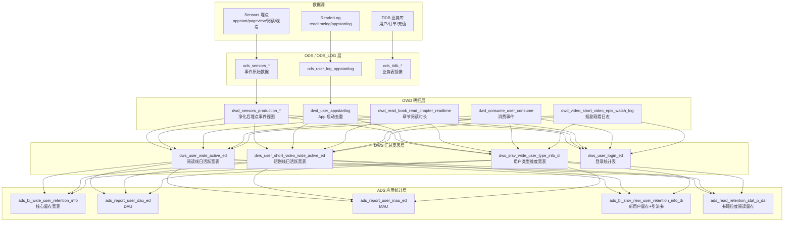
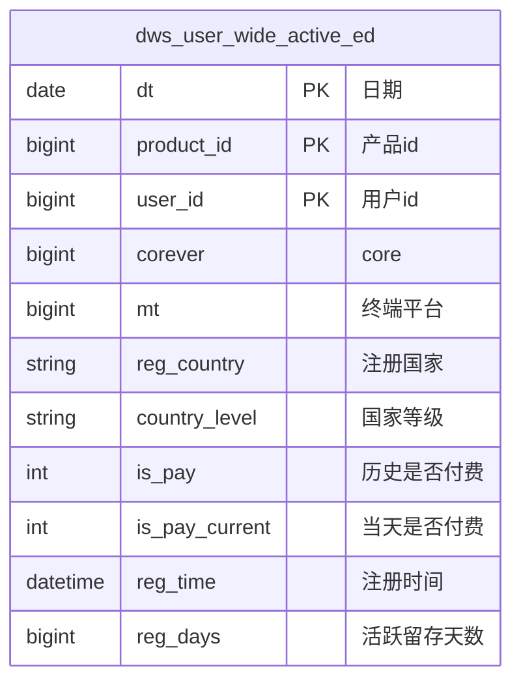
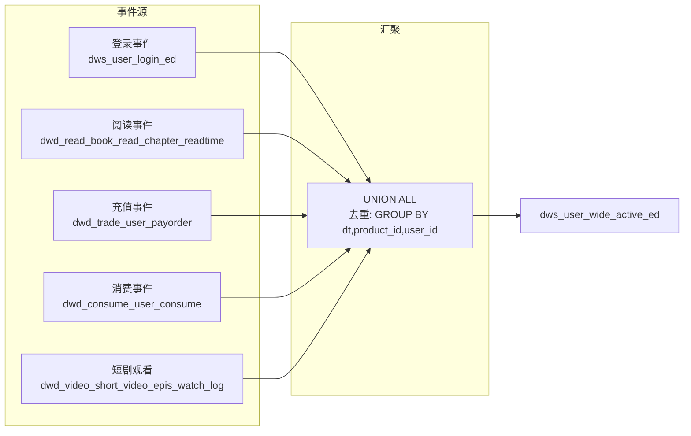
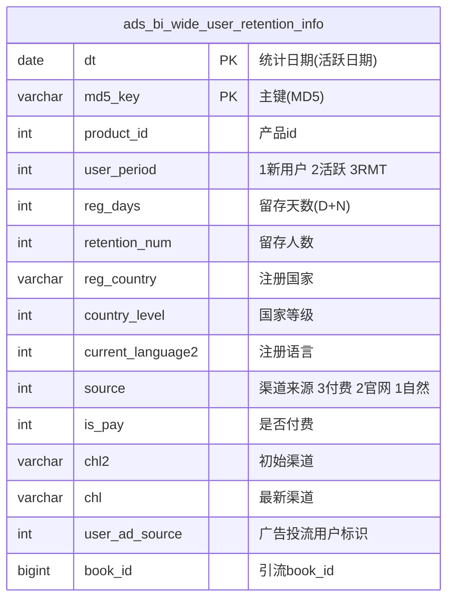
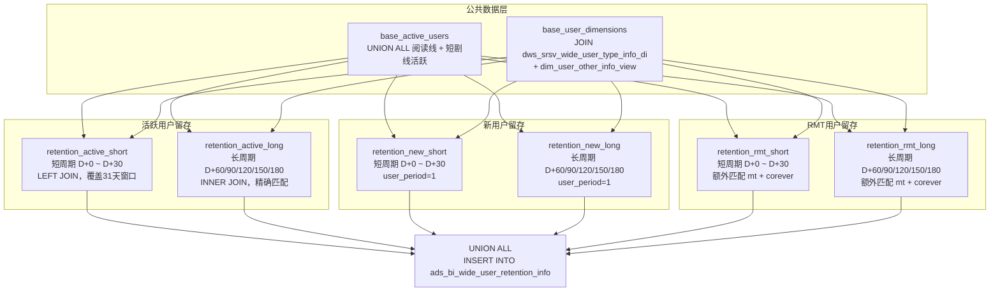
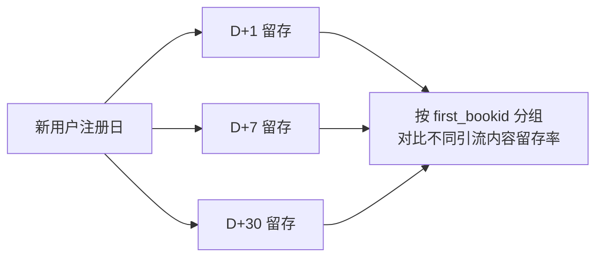

本章系统阐述昆仑数据仓库中用户行为追踪与留存分析的数据架构，涵盖从原始埋点日志采集到 ADS 层留存指标产出的完整数据流转链路，以及多维度、多周期的留存计算引擎设计。

## 整体架构概览

用户行为与留存分析的数据链路遵循标准数仓分层架构，从端侧埋点事件经 Kafka 与 TiDB Binlog 进入 ODS 层，依次经过 DWD 清洗标准化、DWS 汇总宽表构建，最终在 ADS 层产出面向业务的多维留存指标。



数据流向的核心驱动力：Sensors 埋点覆盖全端用户行为（启动、浏览、点击、曝光、阅读/观看、充值等），ReaderLog 补充阅读域的细粒度行为数据（阅读时长、章节解锁），TiDB 业务库提供用户账户、订单等交易侧事实。三者在 DWS 层汇聚为**日活跃宽表**，最终驱动留存计算。

Sources: [dws_user_wide_active_ed.sql](starrocks/dws/ddl/dws_user_wide_active_ed.sql#L1-L45), [dws_user_short_video_wide_active_ed.sql](starrocks/dws/ddl/dws_user_short_video_wide_active_ed.sql#L1-L45), [dwd_read_book_read_chapter_readtime.sql](starrocks/dwd/ddl/dwd_read_book_read_chapter_readtime.sql#L1-L83)

## 用户行为事件采集体系

用户行为数据来自两个独立的埋点体系——**Sensors 神策分析**与**ReaderLog 自建日志**——二者在事件粒度、覆盖范围上互补。

### Sensors 事件体系

Sensors 埋点覆盖阅读端（`project_id=5`）与短剧端（`project_id=2`）的全部关键事件，以 Kafka 实时写入 ODS_LOG 层，经 DWD 视图清洗后供下游消费。

| 事件域 | 核心事件 | DWD 视图 |
|--------|---------|----------|
| 启动 | `AppStart` | `dwd_sensors_production_appstart_view` |
| 页面浏览 | `AppViewScreen`, `PageView` | `dwd_sensors_production_appviewscreen_view` |
| 元素曝光 | `ElementExpose` | `dwd_sensors_production_element_expose_view` |
| 元素点击 | `ElementClick` | `dwd_sensors_production_element_click_view` |
| 物品曝光 | `ItemExposure` | `dwd_sensors_production_itemexposure_view` |
| 物品点击 | `ItemClick` | `dwd_sensors_production_itemclick_view` |
| 运营位曝光 | `OperationPositionExposure` | `dwd_sensors_production_operationpositionexposure_view` |
| 开始阅读 | `StartReadingChapter` | `dwd_sensors_production_startreadingchapter_view` |
| 结束阅读 | `EndReadingChapter` | `dwd_sensors_production_endreadingchapter_view` |
| 解锁章节 | `UnlockChapter` | `dwd_sensors_production_unlockchapter_view` |
| 下单 | `OrderCreateAction` | `dwd_sensors_production_ordercreateaction_view` |
| 支付成功 | `OrderSuccess` | `dwd_sensors_production_ordersuccess_view` |
| 充值曝光 | `RechargeExposure` | `dwd_sensors_production_rechargeexposure_view` |
| Push 点击 | `PushClick` | `dwd_sensors_production_pushclick_view` |

每个 Sensors DWD 视图本质上是对 ODS_LOG 中原始 Kafka 数据的轻量清洗——过滤 `project_id`、补全 `identity_login_id` 作为 user_id、提取 `event_tm` 时间戳。

Sources: [dwd_sensors_production_appstart_view.sql](starrocks/dwd/ddl/dwd_sensors_production_appstart_view.sql#L1-L5), [P_ods_sensors_production_itemclick.sql](starrocks/ods/dml/P_ods_sensors_production_itemclick.sql)

### ReaderLog 自有埋点

ReaderLog 提供 Sensors 之外的行为补充，主要包括阅读时长日志和通用行为日志，通过 TiDB 同步进入 ODS 层。

| 日志表 | DWD 目标表 | 关键字段 |
|--------|-----------|---------|
| `ods_book_log_usermoneylog` | `dwd_consume_book_log_usermoneylog` | user_id, book_id, chapter_id, amount |
| `ods_readerlog_readtimelog` | `dwd_read_book_read_chapter_readtime` | user_id, book_id, chapter_id, read_time |
| `ods_user_log_appstartlog` | `dwd_user_appstartlog` | user_id, product_id, mt, chl, ver |

**App 启动日志**（`dwd_user_appstartlog`）使用了 `row_number() OVER (PARTITION BY product_id, user_id, create_time ORDER BY id DESC)` 做去重，确保同用户同一秒内只保留一条启动记录。

Sources: [P_dwd_user_appstartlog.sql](starrocks/dwd/dml/P_dwd_user_appstartlog.sql#L14-L28), [dwd_read_book_read_chapter_readtime.sql](starrocks/dwd/ddl/dwd_read_book_read_chapter_readtime.sql#L1-L26)

## DWS 层：日活跃宽表——留存计算的基石

DWS 层是整个用户行为与留存分析体系的枢纽，它将分散在 DWD 层的登录、阅读、观看、充值、消费等多源事件**聚合为每日每用户一条的活跃记录**——这是后续所有留存计算的基础。

### 阅读线活跃宽表

`dws_user_wide_active_ed` 汇总阅读产品线（product_id 覆盖 3311/3322/3333/3366/3371/3388/3501/3511）的日活跃状态。其 PRIMARY KEY 为 `(dt, product_id, user_id)`，每条记录代表一个用户在某个产品某天是否活跃。



表采用 **PRIMARY KEY（主键模型）** 以保证同一用户同一天只有一条记录，支持 Upsert 语义。Bloom Filter 建在 `reg_time` 和 `reg_days` 列上以加速留存 JOIN 查询。动态分区按月滚动，单副本 Bucket 数为 1，存储介质为 SSD。

Sources: [dws_user_wide_active_ed.sql](starrocks/dws/ddl/dws_user_wide_active_ed.sql#L1-L45)

### 短剧线活跃宽表

`dws_user_short_video_wide_active_ed` 汇总短剧产品线（product_id=6833）的日活跃状态。与阅读线核心差异在于其 `user_id` 为 `string` 类型（短剧端使用字符串型用户标识），且增加了 `is_acc_login`（是否登录用户）、`is_has_email`（是否绑邮箱）、`popularize_series_code`（推广剧编号）等短剧特有维度。

Sources: [dws_user_short_video_wide_active_ed.sql](starrocks/dws/ddl/dws_user_short_video_wide_active_ed.sql#L1-L45)

### 用户类型维度宽表

`dws_srsv_wide_user_type_info_di` 是留存计算中最关键的维度表。它定义了三类用户周期类型：

| user_period | 含义 | 判定逻辑 |
|-------------|------|---------|
| 1 | **新用户** | 注册时间 = 活跃日期 |
| 2 | **活跃用户** | 非新用户、非 RMT 的活跃 |
| 3 | **RMT（拉活用户）** | 再营销安装回流用户 |

该表同时携带 `source`（渠道来源：付费/官网/自然）、`is_pay`（历史是否付费）、`chl2`（初始渠道）、`chl`（最新渠道）、`country_level`（国家等级）、`current_language2`（注册语言）等核心维度，为留存的多维下钻提供数据基础。

Sources: [dws_srsv_wide_user_type_info_di.sql](starrocks/dws/ddl/dws_srsv_wide_user_type_info_di.sql#L1-L43)

### 活跃宽表生成逻辑

DWS 活跃宽表的 DML 采用 **UNION ALL 多事件源合并** 策略：



只要用户在当天有**任一**事件（登录/阅读/充值/消费），即被标记为当日活跃。这种"宽口径"活跃定义比单纯登录活跃更能真实反映用户的参与深度。

Sources: [dws_user_wide_active_ed.sql](starrocks/dws/ddl/dws_user_wide_active_ed.sql#L3-L4)

## ADS 层：留存计算引擎

### 核心留存宽表

`ads_bi_wide_user_retention_info` 是整个留存分析体系的**中心产出表**，存储了按天 × 用户类型 × 全维度的留存人数。其 DDL 注释明确标注为"海阅、海剧，不同用户类型的留存数据"。



表采用 **PRIMARY KEY 模型** + **动态月分区**，以 `(dt, md5_key)` 为主键，使用 BITMAP 索引加速 `user_period`、`current_language2`、`product_id` 的过滤查询。存储配置为 SSD + ZSTD 压缩，3 副本。

Sources: [ads_bi_wide_user_retention_info.sql](starrocks/ads/ddl/ads_bi_wide_user_retention_info.sql#L1-L120)

### 留存计算逻辑详解

核心 DML `P_ads_bi_wide_user_retention_info` 采用 **CTE 分层计算** 架构，将复杂逻辑拆解为六个独立的留存计算模块。



#### 短周期留存（D+0 ~ D+30）

使用 **LEFT JOIN** 而非 INNER JOIN，确保 D+0（当日留存）也被纳入统计。计算公式：

```
retention_num = COUNT(DISTINCT b.user_id)
WHERE b.dt >= a.dt AND b.dt <= DATE_ADD(a.dt, INTERVAL 31 DAY)
  AND b.dt >= DATE_SUB('${bf_1_dt}', INTERVAL 31 DAY)
```

> **关键设计**：`base_user_dimensions` 中的每条用户记录（锚点日期 a.dt）与 `base_active_users` 中该用户在未来 31 天内的所有活跃日期（b.dt）做 LEFT JOIN，`datediff(b.dt, a.dt)` 即为 `reg_days`（留存天数），GROUP BY 后 `COUNT(DISTINCT b.user_id)` 得到该维度下该天的留存人数。

#### 长周期留存（D+60/90/120/150/180）

使用 **INNER JOIN** 精确匹配锚点日期与目标日期的特定间隔：

```sql
b.dt = '${bf_1_dt}'  -- 目标日期为调度日
AND (
    a.dt = date_sub(b.dt, interval 60 day) OR
    a.dt = date_sub(b.dt, interval 90 day) OR
    ...
)
```

这种设计避免了全量 180 天窗口的计算开销，只在指定的 5 个长周期节点（60/90/120/150/180 天）做精确匹配。

#### RMT 用户的特殊处理

RMT（拉活）用户的留存 JOIN 条件比新用户和活跃用户更严格——**额外要求 mt 和 corever 匹配**：

```sql
on a.product_id = b.product_id
   and a.user_id = b.user_id
   and a.mt = b.mt          -- RMT特有
   and a.corever = b.corever  -- RMT特有
   and b.dt >= a.dt ...
```

这反映了业务规则：RMT 用户必须在**同一终端平台和 corever** 下再次活跃，才算真正的"拉活留存"。

Sources: [P_ads_bi_wide_user_retention_info.sql](starrocks/ads/dml/P_ads_bi_wide_user_retention_info.sql#L1-L487)

### MD5 主键生成策略

每条留存记录的 `md5_key` 由所有维度列拼接后取 MD5：

```sql
md5(concat_ws('_', dt, product_id, corever, mt, reg_country, country_level,
    current_language2, source, last_source, user_period, is_pay,
    datediff(b.dt, a.dt), chl2, chl, user_ad_source, book_id))
```

这确保了**每个维度组合 × 每个留存天数**在每张分区中有且仅有一条记录，避免 Upsert 主键冲突。

Sources: [P_ads_bi_wide_user_retention_info.sql](starrocks/ads/dml/P_ads_bi_wide_user_retention_info.sql#L47-L49)

### DAU / MAU / WAU 指标表

活跃用户数指标由三张独立的 ADS 表承载：

| 表名 | 粒度 | 聚合方式 | 特殊字段 |
|------|------|---------|---------|
| `ads_report_user_dau_ed` | 日 | BITMAP_UNION | `user_types`: 0=新用户, 1=老用户 |
| `ads_report_user_wau_ed` | 周 | BITMAP_UNION | 同理 |
| `ads_report_user_mau_ed` | 月 | BITMAP_UNION | 同理 |

这三张表均从 `dws_user_wide_active_ed` 直接聚合，核心 SQL 模式为：

```sql
SELECT dt, product_id, ..., 
       CASE WHEN dt = date(reg_time) THEN 0 ELSE 1 END as user_types,
       BITMAP_UNION(to_bitmap(user_id)) as user_id
FROM dws.dws_user_wide_active_ed
WHERE dt = '${bf_1_dt}'
GROUP BY ...
```

`user_types` 字段通过比较活跃日期与注册日期来区分新老用户——`dt = date(reg_time)` 即为新用户（0），否则为老用户（1）。**BITMAP_UNION** 聚合使得该表可以在不丢失用户明细的情况下支持任意维度的去重计数。

Sources: [P_ads_report_user_dau_ed.sql](starrocks/ads/dml/P_ads_report_user_dau_ed.sql#L13-L32), [ads_report_user_dau_ed.sql](starrocks/ads/ddl/ads_report_user_dau_ed.sql#L1-L113)

### 新用户留存 + 首次引流内容

`ads_bi_srsv_new_user_retention_info_di` 专注于**新用户留存**，相比核心留存宽表增加了 `first_bookid`（首次引流书籍/剧 ID）和 `book_code`（书籍/剧代号）两个关键字段，用于衡量不同引流内容的用户留存质量。



此表对广告投放优化具有关键意义：它回答了"通过哪个 Book ID 引入的用户在 7 天/30 天后仍然活跃？"这一问题，是投放素材效果评估的数据基础。

Sources: [ads_bi_srsv_new_user_retention_info_di.sql](starrocks/ads/ddl/ads_bi_srsv_new_user_retention_info_di.sql#L1-L114)

### 书籍粒度阅读留存

`ads_read_retention_stat_p_da` 从内容维度分析阅读留存，粒度精细到 **(dt, lang_id, book_id, mt, source_user_tp, date_stat_type)**。它使用 **AGGREGATE KEY 模型**（聚合模型），核心指标全部以 BITMAP 聚合存储：

| 字段 | 聚合类型 | 含义 |
|------|---------|------|
| `first_read_users` | BITMAP_UNION | 首次阅读该书的用户集合 |
| `read_users` | BITMAP_UNION | 阅读该书的全部用户集合 |
| `consume_amount` | SUM | 阅币消耗总额 |
| `consume_users` | BITMAP_UNION | 消耗阅币的用户集合 |
| `d7_read_users` | BITMAP_UNION | 7 天内阅读指定天数的用户集合 |
| `d7_consume_users` | BITMAP_UNION | 7 天内消耗指定天数的用户集合 |

`date_stat_type` 字段（0~7）控制统计窗口偏移——0 表示 dt 当天，1~7 表示 dt 后第 1~7 天——实现了在单张聚合表中灵活计算不同窗口的阅读留存。

Sources: [ads_read_retention_stat_p_da.sql](starrocks/ads/ddl/ads_read_retention_stat_p_da.sql#L1-L40)

## 维度体系与下钻路径

留存分析依托一套完善的维度体系，支持从宏观到微观的逐层下钻。

### 用户生命周期维度

| 维度 | 来源 | 说明 |
|------|------|------|
| `user_period` | `dws_srsv_wide_user_type_info_di` | 1=新用户, 2=活跃, 3=RMT |
| `reg_days` | 计算列 `datediff()` | 活跃日期与注册/RMT 时间差 |
| `is_pay` | 历史累计标记 | 1=曾付费, 0=从未付费 |
| `is_pay_current` | `dws_user_wide_active_ed` | 当日是否付费 |

### 渠道与归因维度

| 维度 | 说明 |
|------|------|
| `source` | 三级分类：3=付费渠道（fbs2s/facebook/tt 等），2=官网，1=自然量 |
| `chl2` / `chl` | 初始渠道值 / 最新渠道值，用于渠道迁移分析 |
| `user_ad_source` | 广告投流用户标记（`dim_user_other_info_view`） |
| `book_id` | 广告引流书籍/剧 ID |

### 地域与设备维度

| 维度 | 说明 |
|------|------|
| `reg_country` | 注册时国家 |
| `country_level` | 国家等级（`dim_countrylevel`） |
| `mt` | 终端平台：1=iPhone, 4=Android, 9=书城, 7=iPad |
| `corever` | 服务端版本号 |
| `current_language2` | 注册时语言 |

所有这些维度在 `ads_bi_wide_user_retention_info` 中被扁平化为单表列，使得业务分析人员可以通过 FineBI 直接按任意维度组合查询留存指标，无需再编写复杂 JOIN。

Sources: [ads_bi_wide_user_retention_info.sql](starrocks/ads/ddl/ads_bi_wide_user_retention_info.sql#L1-L36), [dws_srsv_wide_user_type_info_di.sql](starrocks/dws/ddl/dws_srsv_wide_user_type_info_di.sql#L3-L28)

## 数据质量与调度依赖

留存计算的准确性依赖上游 DWS 活跃宽表的数据完整性。调度链路遵循严格的层级依赖：


ADS 层留存 DML 使用 `${bf_1_dt}` 参数（调度日期的前一天），回溯 31 天窗口计算短周期留存，并精确匹配 5 个长周期节点。调度频率为 T+1 日度。

多产品线数据通过 UNION ALL 合并而非分表存储，体现在 `base_active_users` CTE 中阅读线（8 个 product_id）+ 短剧线（1 个 product_id）的统一处理。这保证了跨产品线的留存数据口径一致。

Sources: [P_ads_bi_wide_user_retention_info.sql](starrocks/ads/dml/P_ads_bi_wide_user_retention_info.sql#L21-L36)

## 阅读指引

理解用户行为与留存分析体系后，建议按以下路径继续深入：

- **[内容消费与商业化分析](25-nei-rong-xiao-fei-yu-shang-ye-hua-fen-xi)**：深入阅读/短剧消费行为与付费转化链路，理解留存与商业化的关联
- **[广告投放与 ROI 分析](23-yan-gao-tou-fang-yu-roi-fen-xi)**：理解渠道归因如何影响用户留存质量评估
- **[DWS 与 DWM 层：汇总与宽表构建](8-dwm-yu-dws-ceng-hui-zong-yu-kuan-biao-gou-jian)**：了解活跃宽表的 DML 实现细节
- **[StarRocks 表模型与分区策略](28-starrocks-biao-mo-xing-yu-fen-qu-ce-lue)**：掌握 PRIMARY KEY 与 AGGREGATE KEY 模型的选择依据
- **[FineBI 报表应用开发](20-finebi-bao-biao-ying-yong-kai-fa)**：了解留存数据如何通过 FineBI 呈现给业务方