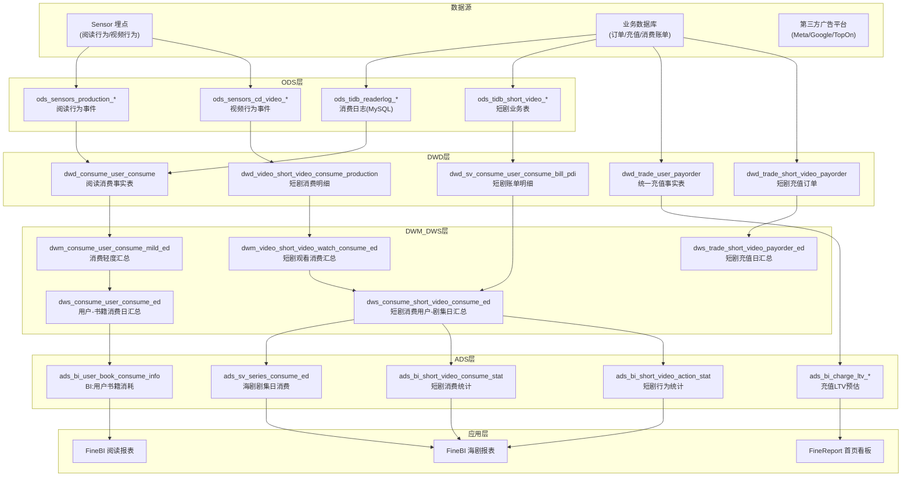
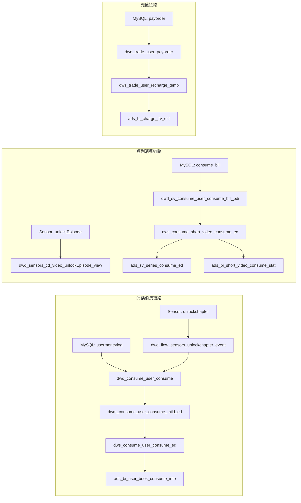

内容消费与商业化分析是数据仓库核心业务域之一，覆盖**阅读（小说）** 与**短剧（海外视频）** 两条主要产品线的用户消费行为追踪、充值付费链路、广告变现效率以及内容供给侧（作者/译者/版权方）的报酬结算分析。本页面向高阶开发者，从数仓分层设计、核心表结构、ETL 数据流转及业务应用四个维度展开。

## 业务域全景架构

内容消费与商业化分析的数据流从用户端的传感器埋点事件和业务数据库出发，经 ODS 接入、DWD 清洗标准化、DWM 轻度汇总、DWS 宽表构建，最终落地到 ADS 层供 FineBI/FineReport 报表消费，同时 ALG 层为推荐算法提供特征工程数据。

Sources: [dwd_consume_user_consume](starrocks/dwd/ddl/dwd_consume_user_consume.sql#L1-L45), [dwd_sv_consume_user_consume_bill_pdi](starrocks/dwd/ddl/dwd_sv_consume_user_consume_bill_pdi.sql#L1-L51), [dwd_video_short_video_consume_production](starrocks/dwd/ddl/dwd_video_short_video_consume_production.sql#L1-L20), [dwd_trade_user_payorder](starrocks/dwd/ddl/dwd_trade_user_payorder.sql#L1-L49)

## 消费域核心数据模型

### 阅读消费：`types` 虚拟币体系

阅读产品的消费体系基于四种虚拟货币类型，统一记录在 `dwd_consume_user_consume` 事实表中。`types` 字段定义了消费的币种语义：`1` 代表阅币（用户付费购买的虚拟币），`2` 代表礼券（活动赠送的抵扣券），`3` 代表赠送币（平台发放的免费币），`4` 代表 VIP 权益消费。该表以 `(dt, product_id, auto_id, types)` 为主键，通过 `auto_id` 唯一标识每笔消费流水，同时关联 `book_id`（书籍）、`chapter_ids`（章节）、`pay_type`（支付方式）等维度。

Sources: [dwd_consume_user_consume](starrocks/dwd/ddl/dwd_consume_user_consume.sql#L3-L15)

DWS 层的 `dws_consume_user_consume_ed` 以 **用户-书籍-类型** 为粒度对当日消费进行聚合，核心度量包括 `amount`（消费金额）、`con_chapter_nums`（消费章节数）。其上游数据源为 DWM 层的 `dwm_consume_user_consume_mild_ed`，通过 GROUP BY 汇总出用户画像属性（注册国家、语言、性别、终端平台）与消费行为的关联。该表同时通过 UNION ALL 引入了 `types=5` 的补充消费类型（覆盖 VIP 续费等场景）。

Sources: [dws_consume_user_consume_ed](starrocks/dws/ddl/dws_consume_user_consume_ed.sql#L1-L48), [P_dws_consume_user_consume_ed](starrocks/dws/dml/P_dws_consume_user_consume_ed.sql#L15-L70)

`dws_consume_book_consume_ed` 则以**书籍**为粒度汇总每日消费，按 `types`、`book_id`、`site_id`（语言站点）聚合 `amount`，直接支撑单书消耗排行榜、书籍 ROI 评估等分析场景。

Sources: [dws_consume_book_consume_ed](starrocks/dws/ddl/dws_consume_book_consume_ed.sql#L1-L21)

### 短剧消费：代币与赠币双轨制

短剧产品使用 **代币（coin）+ 赠币（bonus）** 双轨消费体系。DWD 层的 `dwd_sv_consume_user_consume_bill_pdi` 以账单级粒度记录每笔解锁行为：`consume_type` 区分代币（0）与赠币（1），`consume_type2` 进一步区分解锁方式——普通解锁（0/1）、超前点播（2/3）、批量购买（4）、整剧购买（5）、打包购买（6）、跨集批量解锁（7）。`consume_value` 记录消费的代币/赠币数量，`series_id` 和 `epis_id` 锚定到具体剧集。

Sources: [dwd_sv_consume_user_consume_bill_pdi](starrocks/dwd/ddl/dwd_sv_consume_user_consume_bill_pdi.sql#L1-L51)

此外，`dwd_video_short_video_consume_production` 同时承载消费和充值两类流水（通过 `type` 字段区分：`0` 为消费、`1` 为充值），用于版权方收入统计的"消费+充值"双口径核算。

Sources: [dwd_video_short_video_consume_production](starrocks/dwd/ddl/dwd_video_short_video_consume_production.sql#L1-L20)

DWS 层 `dws_consume_short_video_consume_ed` 以 **用户-剧集** 粒度汇总每日消费，度量包括 `consume_amt`（消费金额）和 `consume_cnt`（消费次数），并附带用户画像（注册国家、语言、性别）。ADS 层 `ads_sv_series_consume_ed` 则以剧为粒度汇总 `consume_coin` 和 `consume_bonus`，支撑剧集维度的消费排行和 ROI 分析。

Sources: [dws_consume_short_video_consume_ed](starrocks/dws/ddl/dws_consume_short_video_consume_ed.sql#L1-L20), [ads_sv_series_consume_ed](starrocks/ads/ddl/ads_sv_series_consume_ed.sql#L1-L25)

### 阅读 vs 短剧消费模型对比

| 维度 | 阅读（Novel） | 短剧（Short Video） |
|---|---|---|
| 消费主体 | 书籍章节 (book_id, chapter_ids) | 剧集 (series_id, epis_id) |
| 虚拟币类型 | 阅币(1) / 礼券(2) / 赠送币(3) / VIP(4) | 代币(0) / 赠币(1) |
| DWD 事实表 | `dwd_consume_user_consume` | `dwd_sv_consume_user_consume_bill_pdi` / `dwd_video_short_video_consume_production` |
| 解锁方式 | 按章扣币 | 普通解锁 / 超前点播 / 批量购买 / 整剧购买 / 打包购买 |
| DWS 汇总粒度 | 用户-书籍-天 | 用户-剧集-天 |
| ADS 业务表 | `ads_bi_user_book_consume_info` | `ads_sv_series_consume_ed` / `ads_bi_short_video_consume_stat` |

## 交易域：充值付费与 LTV

### 统一充值事实表

`dwd_trade_user_payorder` 是阅读与游戏产品线共用的充值事实表，记录每笔订单的 `ItemCount`（充值金额）、`RealMoney`（到账阅币数）、`AwardMoney`（赠送币数量）、`ShopItem`（充值类型：月卡/VIP/签到卡等）、`SubPayType`（子支付渠道）等核心字段。`BaseAmount` 为分成后的实际收入金额，直接关联财务核算。

Sources: [dwd_trade_user_payorder](starrocks/dwd/ddl/dwd_trade_user_payorder.sql#L1-L49)

短剧产品线另有独立的 `dwd_trade_short_video_payorder`（以及 DWS 层的 `dws_trade_short_video_payorder_ed`），核心度量包括 `pay_amt`（分成前充值总额）、`received_amt`（分成后充值总额）、`refund_amt`（退款总额），实现充值-退款的全口径追踪。

Sources: [dws_trade_short_video_payorder_ed](starrocks/dws/ddl/dws_trade_short_video_payorder_ed.sql#L1-L27)

### 充值 LTV 预估

ADS 层围绕用户充值生命周期价值（LTV）建立了多组预估表：`ads_bi_charge_ltv_est`、`ads_bi_charge_ltv_view` 等，通过对用户首充后的累计充值行为建模，支撑投放 ROI 核算和用户价值分层。相关中间计算逻辑由 `dws_trade_user_recharge_temp`（首充信息）、`ads_trade_user_type_ltv_est_mid`（分用户类型 LTV 预估中间表）等表承接。

Sources: [dws_trade_user_recharge_temp](starrocks/dws/ddl/dws_trade_user_recharge_temp.sql#L1-L23)

### 第三方支付与付费墙

针对三方支付场景（如 Stripe、PayPal 等外部支付网关），`ads_bi_sr_third_payment_exposure_pv_di` 追踪支付曝光到成单的转化漏斗。短剧侧 `dwd_traffic_sv_paywall_strategy_hit_event_di` 记录付费墙策略命中事件，用于分析不同定价策略和付费墙触发时机的转化效果。

## 用户行为：观看与阅读分析

### 短剧行为事件体系

短剧产品的用户行为通过 Sensor 埋点采集，DWD 层按事件类型独立建模：

| 事件表 | 事件类型 | 核心度量 |
|---|---|---|
| `dwd_sensors_cd_video_startwatching_view` | 开始观看 | 观看启动次数 |
| `dwd_sensors_cd_video_endwatching_view` | 结束观看 | 观看时长 |
| `dwd_sensors_cd_video_itemexposure_view` | 剧集曝光 | 曝光次数 |
| `dwd_sensors_cd_video_itemclick_view` | 剧集点击 | CTR |
| `dwd_sensors_cd_video_unlockEpisode_view` | 解锁剧集 | 解锁量 |
| `dwd_sensors_cd_video_rechargeexposure_view` | 充值入口曝光 | 充值曝光 |

这些 DWD 层视图向上汇总到 ADS 层的 `ads_bi_short_video_action_stat`（行为统计表）和 `ads_bi_short_video_consume_stat`（消费统计表），两者均使用 Bitmap 聚合技术对用户去重，以 `series_id` 为粒度提供曝光明细、点击转化、解锁转化、观看用户数等核心指标。

Sources: [dwd_sensors_cd_video_startwatching_view](starrocks/dwd/ddl/dwd_sensors_cd_video_startwatching_view.sql), [海外短剧消费统计表V3](Application/FineBI/海剧/海外短剧消费统计表V3.sql#L1-L80)

### 阅读行为事件体系

阅读产品的行为采集同样基于 Sensor 埋点，关键事件包括 `startreadingchapter`（开始阅读章节）、`endreadingchapter`（结束阅读章节）、`unlockchapter`（解锁章节）、`readingtimeevent`（阅读时长事件）。DWD 层 `dwd_read_book_read_chapter_readtime` 记录了**用户-书籍-章节**粒度的阅读时长明细。

Sources: [dwd_read_book_read_chapter_readtime](starrocks/dwd/ddl/dwd_read_book_read_chapter_readtime.sql)

DWS 层的 `dws_read_user_read_book_info_ed` 以**用户-书籍**粒度汇总阅读时长、阅读章节数、首次/末次阅读时间等指标，为留存分析和用户画像构建提供基础数据。`dws_video_user_watch_a` 则在短剧侧汇总用户观看行为（观看剧集数、观看时长），支撑内容推荐与用户分层。

## 商业化：广告变现与 ROI

### 广告收入多平台接入

广告数据从多个第三方平台（Meta/Facebook Ads、Google AdMob、TopOn、AppLovin MAX、Mintegral 等）汇入 ODS 层，经 DWD 标准化后进入 DWS 和 ADS 层。关键链路包括：

- **Meta 广告**：`ods_tidb_sharpengine_ads_global_FbAdDailyInsight` → `dwd_advertisement_fbad_daily_insight_view` → `dws_advertisement_book_cost_amt_ed`（书籍广告成本）、`dws_advertisement_user_position_amt_ed`（用户广告位收入）
- **AdMob 收入**：`dwd_advertisement_admob_income` → `dws_advertisement_admob_income_ed`
- **TopOn**：`dwd_advertisement_toponfullreport_view` → `dws_advertisement_topon_rixengine_income_ed`

广告收入与消费数据的交叉分析在 ADS 层体现：`ads_bi_read_adv_income_report_advdata`（阅读广告收入报表）和 `ads_sv_ad_conversion_detail`（短剧广告转化明细）将广告曝光、点击、收入与用户消费行为关联，计算广告 CPM、用户 ARPU 等效率指标。

### 投放 ROI 闭环

广告投放 ROI 分析从**归因→成本→收入**三个环节构建闭环：

1. **归因**：`ods_tidb_sharpengine_ads_global_FbAdRoiInstallReferrerTimeZoneV3` 等归因表将广告点击与用户安装关联
2. **成本**：`dws_advertisement_book_cost_amt_ed` 按书籍/剧集维度汇总各渠道投放成本
3. **收入**：关联用户充值 (`dwd_trade_user_payorder`) 和广告收入 (`dws_advertisement_admob_income_ed`)，计算 ROI

`ads_ad_adgroup_d0_roi_stat` 和 `ads_sv_series_roi_growth_metrics` 分别在广告组和剧集维度提供 D0/D7/D30 的分时段 ROI 指标。

## FineBI 报表应用

### 海剧（短剧）报表体系

Application/FineBI/海剧 目录下包含 13 个报表 SQL，覆盖短剧业务的分析全景：

| 报表文件 | 分析维度 | 核心指标 |
|---|---|---|
| `海外短剧消费统计表V3.sql` | 剧集维度 | 消费用户数、代币/赠币消费金额、观看用户数、剧集解锁量 |
| `短剧消费统计表v2-汇总.sql` | 全局汇总 | 总消费金额、总用户数 |
| `海剧用户留存V6.sql` | 用户留存 | 次日/7日/30日留存率 |
| `海剧用户长期价值报表V2.sql` | LTV | 分渠道用户累计充值 |
| `海剧PUSH下发监控报表V7.sql` | Push 运营 | Push 触达率、转化率 |
| `海剧三方支付漏斗链路报表V4.sql` | 支付转化 | 三方支付各环节转化率 |
| `收入【海阅+海剧+国剧】V6.sql` | 总收入 | 多产品线收入汇总 |
| `短剧维度广告收益报表.sql` | 广告变现 | 剧集维度广告收入 |
| `广告基建策略.sql` | 广告投放 | 基建组合效率分析 |

Sources: [海外短剧消费统计表V3](Application/FineBI/海剧/海外短剧消费统计表V3.sql#L1-L80)

### 阅读报表体系

Application/FineBI/阅读 目录下包含 2 个报表 SQL：

- **海阅三方支付漏斗链路报表V3**：追踪三方支付从用户入组、支付曝光、发起支付到支付成功的完整漏斗转化链路。参数化支持按国家、语言、终端、CORE 版本等维度下钻分析。
- **海阅续订**：追踪订阅用户的续订行为，支撑订阅收入预测和流失预警。

Sources: [海阅三方支付漏斗链路报表V3](Application/FineBI/阅读/海阅三方支付漏斗链路报表V3.sql#L1-L60)

## 算法特征工程：ALG 层

ALG 层为推荐系统提供特征工程数据，消费行为是核心特征来源：

- **首充预测**：`alg_user_first_pay_feature_1d` 和 `alg_shortvideo_firstpay_sample` 基于用户的阅读/观看行为、历史消费构建首充预测特征
- **复充预测**：`alg_novel_repay_user_feature_1d` 和 `alg_short_video_repay_user_feature_1d` 针对已充值用户建模复充概率
- **协同过滤**：`alg_short_video_itemcf_reco_list` 基于用户-剧集消费矩阵生成 ItemCF 推荐列表
- **内容 Embedding**：`alg_novel_book_embedding` 和 `alg_short_video_series_emb` 生成书籍和剧集的向量表征
- **用户画像**：`alg_short_video_user_like_category` 基于用户的消费偏好生成品类偏好画像

Sources: [alg_firstpay_feature](starrocks/alg/ddl/alg_firstpay_feature.sql), [alg_short_video_itemcf_reco_list](starrocks/alg/ddl/alg_short_video_itemcf_reco_list.sql)

## 数据流转关键路径

从原始事件到业务报表的关键 ETL 链路如下：

Sources: [P_dws_consume_user_consume_ed](starrocks/dws/dml/P_dws_consume_user_consume_ed.sql#L15-L70), [ads_bi_user_book_consume_info](starrocks/ads/ddl/ads_bi_user_book_consume_info.sql#L1-L33)

## 关联阅读建议

消费与商业化分析是连接用户行为、收入模型和内容策略的核心枢纽。建议按以下路径深入：

- 消费行为的上游数据来源 → [ODS 层：原始数据接入](6-ods-ceng-yuan-shi-shu-ju-jie-ru) 和 [DWD 层：明细数据清洗与标准化](7-dwd-ceng-ming-xi-shu-ju-qing-xi-yu-biao-zhun-hua)
- 消费数据如何汇总为宽表 → [DWM 与 DWS 层：汇总与宽表构建](8-dwm-yu-dws-ceng-hui-zong-yu-kuan-biao-gou-jian)
- 广告投放变现分析 → [广告投放与 ROI 分析](23-yan-gao-tou-fang-yu-roi-fen-xi)
- 用户留存与消费的关联分析 → [用户行为与留存分析](24-yong-hu-xing-wei-yu-liu-cun-fen-xi)
- 推荐算法如何消费这些数据 → [ALG 层：算法特征工程与推荐数据](11-alg-ceng-suan-fa-te-zheng-gong-cheng-yu-tui-jian-shu-ju) 和 [A/B 实验与推荐算法评估](26-a-b-shi-yan-yu-tui-jian-suan-fa-ping-gu)
- 报表应用开发细节 → [FineBI 报表应用开发](20-finebi-bao-biao-ying-yong-kai-fa) 和 [FineReport 数据看板与问题排查](21-finereport-shu-ju-kan-ban-yu-wen-ti-pai-cha)