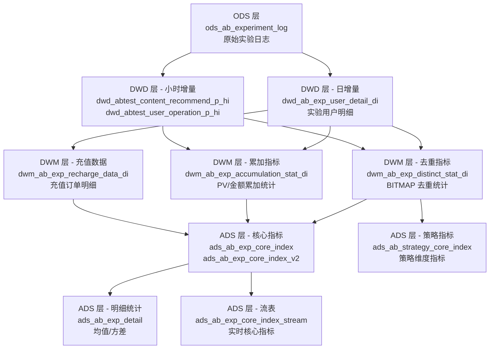
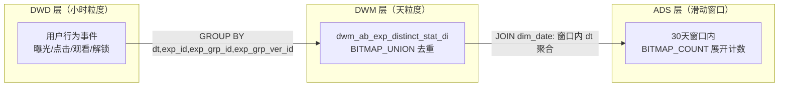
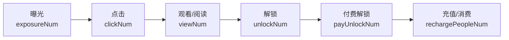
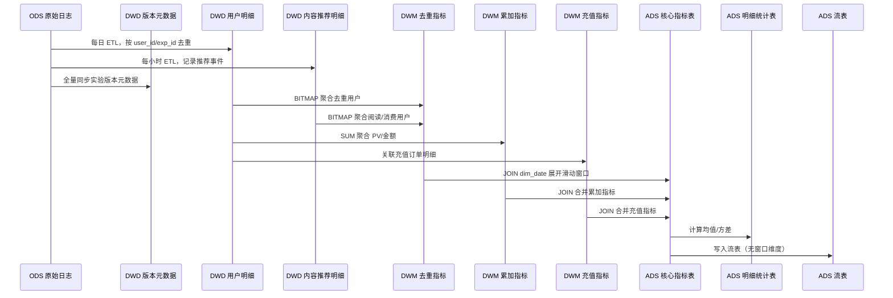

本文档系统阐述昆仑数据仓库中 A/B 实验平台与推荐算法评估体系的数据架构、核心指标设计与端到端数据流转。该体系覆盖阅读（海阅）与短剧（海剧）两大业务线，横跨用户运营实验与内容推荐实验两大场景，形成从实验分流、指标加工到效果评估的完整闭环。

## 架构总览：A/B 实验数据分层体系

A/B 实验数据采用经典的数仓分层架构，自下而上分为四层，每层承担明确的职责边界。

这一分层设计的核心思想是**指标可累加与不可累加的分离**：`dwm_ab_exp_distinct_stat_di` 使用 StarRocks BITMAP 聚合类型存储去重用户 ID（如曝光人数、点击人数），而 `dwm_ab_exp_accumulation_stat_di` 存储可简单累加的 PV 类指标（如曝光次数、充值金额）。两者在 ADS 层汇合，通过滑动窗口计算多时间粒度的复合指标。

Sources: [dwm_ab_exp_distinct_stat_di.sql](starrocks/dwm/ddl/dwm_ab_exp_distinct_stat_di.sql#L1-L39), [dwm_ab_exp_accumulation_stat_di.sql](starrocks/dwm/ddl/dwm_ab_exp_accumulation_stat_di.sql#L1-L48)

## 业务域与实验分类

A/B 实验系统覆盖**四个项目域**，按实验目标分为两大类别。

| 维度 | 取值与说明 |
|---|---|
| **项目 (project_id)** | 1-阅读（海阅）、2-国内短剧、3-海外短剧、4-其他 |
| **实验大类** | 用户运营实验、内容推荐实验 |
| **实验组类型 (exp_grp_type)** | 1-对照组、2-实验组 |
| **版本粒度** | 实验 → 实验组 → 实验组版本（exp_grp_ver_id） |

**用户运营实验**关注单用户级别的策略效果，如流失预测模型（predict=`loss`）、千字定价策略（predict=`price`）、充值档位推荐（predict=`ltv`）。其明细表 `dwd_abtest_user_operation_p_hi` 以小时为粒度记录每个用户进入哪个实验组、命中了哪个策略。

Sources: [dwd_abtest_user_operation_p_hi.sql](starrocks/dwd/ddl/dwd_abtest_user_operation_p_hi.sql#L1-L73)

**内容推荐实验**关注推荐位级别的算法效果，支持按推荐场景（书城猜你喜欢、频道分页、退出弹窗、串书/串剧等）和实验子类型（exp_sub_type：书城、cnxh 等）进行细分。其明细表 `dwd_abtest_content_recommend_p_hi` 额外记录了推荐位序（position_index）和内容对象 ID（object_id），便于进行位置偏差分析和内容级别的效果归因。

Sources: [dwd_abtest_content_recommend_p_hi.sql](starrocks/dwd/ddl/dwd_abtest_content_recommend_p_hi.sql#L1-L46)

## 核心指标矩阵

`ads_ab_exp_core_index` 是 AB 实验最核心的指标看板表，承载了从分流到变现的完整漏斗指标。主键设计为 `(experimentId, experimentGroupId, dt, projectId, trackficVersion, windowNum)`，支持按**滑动窗口**（过去 N 天）灵活查看累计效果。

### 漏斗指标族

实验效果通过逐层漏斗衡量，下表列出核心漏斗指标及其计算逻辑。

| 指标 | 含义 | 计算方式 |
|---|---|---|
| `divideTrafficNum` | 分流人数 | 实验组版本内的去重用户数（BITMAP） |
| `strategyHitNum` | 策略命中人数 | 实际命中推荐策略的去重用户数 |
| `exposureNum` | 曝光人数 | 推荐内容曝光的去重用户数 |
| `clickNum` | 点击人数 | 点击推荐内容的去重用户数 |
| `viewNum` | 观看/阅读人数 | 开始观看（短剧）或阅读（书籍）的去重用户数 |
| `unlockNum` | 解锁人数 | 解锁剧集/章节的去重用户数 |
| `payUnlockNum` | 付费解锁人数 | 使用付费方式解锁的去重用户数 |

Sources: [ads_ab_exp_core_index.sql](starrocks/ads/ddl/ads_ab_exp_core_index.sql#L1-L98)

### 收入与 ARPU 指标族

系统从多个维度评估实验组的变现效率，构建了层次化的 ARPU 指标体系。

| 指标 | 含义 |
|---|---|
| `arpu` | ARPU = 充值金额（分成后）/ 策略命中人数 |
| `arppu` | ARPPU = 充值金额 / 充值人数 |
| `unitPrice` | 客单价 = 充值金额 / 充值次数 |
| `rechargeAvg` | 人均充值次数 |
| `totalArppu` | 总消费 ARPPU =（阅币消费 + 礼券消费）/ 消费人数 |
| `adverArpu` | 广告 ARPU = 广告收入 / 策略命中人数 |
| `oneExposureArpu` | 单人曝光 ARPU = 充值金额 / 曝光人数 |
| `predictARPU` | 预估 ARPU = 单人曝光 ARPU + 单人曝光 ARPU(订阅) × 0.36 |

**预估收益 (estimatedRevenue)** 的计算公式为：充值金额（分成后）+ 广告收入 + 三方 H5 收入。该字段反映实验组的综合收益水平。

Sources: [P_ads_ab_exp_core_index.sql](starrocks/ads/dml/P_ads_ab_exp_core_index.sql#L83-L120)

### 转化率指标族

| 指标 | 含义 |
|---|---|
| `payRate` | 付费率 = 充值人数 / 曝光人数 |
| `consumeRate` | 消费率 = 消费人数 / 策略命中人数 |
| `adverUnlockRate` | 广告解锁率 = 广告解锁人数 / 策略命中人数 |
| `orderCreateRate` | 订单创建率 = 订单创建人数 / 曝光人数 |
| `ctr` | CTR = 点击 PV / 曝光 PV |
| `clickCTR` | 点击率 CTR = 点击 UV / 曝光 UV |

Sources: [ads_ab_exp_core_index.sql](starrocks/ads/ddl/ads_ab_exp_core_index.sql#L74-L93)

## DWM 中间层：两阶段聚合设计

DWM 层承担了从 DWD 明细到 ADS 指标的核心计算任务，采用**去重与累加分离**的两表设计。

### 去重指标表

`dwm_ab_exp_distinct_stat_di` 使用 StarRocks 的 **AGGREGATE KEY + BITMAP_UNION** 模型，将用户 ID 编码为 BITMAP 进行高效去重合并。它从小时级数据向上汇总为天级，再由 ADS 层按滑动窗口聚合。

BITMAP 的使用使得多天窗口内的去重计数无需回退到明细数据，极大降低计算开销。例如"过去 7 天曝光人数"只需将 7 天的 BITMAP 合并后计数即可。

Sources: [dwm_ab_exp_distinct_stat_di.sql](starrocks/dwm/ddl/dwm_ab_exp_distinct_stat_di.sql#L1-L39)

### 累加指标表

`dwm_ab_exp_accumulation_stat_di` 存储可直接累加的指标：曝光 PV、点击 PV、观看集数、解锁集数、充值金额、广告收入等。这些指标在 ADS 层通过 SUM + CASE WHEN 按窗口过滤后直接累加。

Sources: [dwm_ab_exp_accumulation_stat_di.sql](starrocks/dwm/ddl/dwm_ab_exp_accumulation_stat_di.sql#L1-L48)

## 实验版本管理与元数据

`dwd_ab_exp_version_detail` 是全量实验版本的元数据快照表，记录每个实验组版本的生命周期信息。

| 字段 | 含义 |
|---|---|
| `project_id` | 项目 ID（1-阅读，2-国内短剧，3-海外短剧，4-其他） |
| `exp_id` | 实验 ID |
| `exp_grp_id` | 实验组 ID |
| `exp_grp_type` | 实验组类型（1-对照组，2-实验组） |
| `exp_grp_ver_id` | 实验组版本 ID |
| `exp_start_time / exp_end_time` | 实验整体起止时间 |
| `start_time / end_time` | 该版本起止时间 |

实验版本之间存在时间线重叠的可能性——同一实验组在不同时间段可能使用不同的策略版本，通过 `exp_grp_ver_id` 区分。核心指标表 `ads_ab_exp_core_index` 的主键中包含 `trackficVersion`（对应 `exp_grp_ver_id`），确保每个版本的效果可独立评估。

Sources: [dwd_ab_exp_version_detail.sql](starrocks/dwd/ddl/dwd_ab_exp_version_detail.sql#L1-L27)

用户进入实验的明细记录在 `dwd_ab_exp_user_detail_di` 中，数据源来自 `ods_ab_experiment_log`，按天分区记录每个用户进入的实验、实验组和版本。

Sources: [dwd_ab_exp_user_detail_di.sql](starrocks/dwd/ddl/dwd_ab_exp_user_detail_di.sql#L1-L47), [P_dwd_ab_exp_user_detail_di.sql](starrocks/dwd/dml/P_dwd_ab_exp_user_detail_di.sql#L1-L24)

## 推荐算法效果评估

推荐算法评估与 A/B 实验深度耦合，通过实验分组对比不同算法策略的效果差异。

### 阅读推荐 AB 报告

`novel_reco_ab_report_data`（ALG 层）和 `series_reco_ab_report_data` 分别服务于阅读和短剧的推荐效果评估。

| 指标 | 阅读表 | 短剧表 |
|---|---|---|
| 推荐人数 | `uv` | `uv` |
| 阅读/看剧转化 | `read_uv` → `read_cvr` | `read_uv` → `read_cvr` |
| 消费转化 | `csum_uv` → `csum_cvr` | `csum_uv` → `csum_cvr` |
| 人均消费 | `avg_csum`（书币） | `avg_csum`（金额） |

两张表的主键均为 `(dt, page_id, lang_id/exp_grp_name)`，按推荐资源位和实验分组维度统计转化漏斗。`read_cvr` 为阅读转化率（阅读人数/推荐人数），`csum_cvr` 为消费转化率（消费人数/阅读人数），二者构成推荐效果的二级漏斗。

Sources: [novel_reco_ab_report_data.sql](starrocks/alg/ddl/novel_reco_ab_report_data.sql#L1-L25), [series_reco_ab_report_data.sql](starrocks/alg/ddl/series_reco_ab_report_data.sql#L1-L24)

### 算法实验 3.0 指标表

`ads_report_AB_experiment_mul` 是算法实验 3.0 的通用指标表，覆盖**五种推荐来源类型**（types）：榜单-猜你喜欢（1）、频道-猜你喜欢（2）、退出弹窗（3）、串书（4）、章末推（5）。该表使用 ARRAY 类型字段存储用户在单日内经历的多个实验分组（`group_ids`）和页面信息，通过 `is_read` 标识是否发生阅读行为，结合 `consume_amount`、`charge_money` 等字段完成从曝光到变现的全链路归因。

Sources: [ads_report_AB_experiment_mul.sql](starrocks/ads/ddl/ads_report_AB_experiment_mul.sql#L1-L77)

短剧侧的对应表 `ads_report_sv_AB_experiment_mul` 拥有更丰富的推荐来源枚举（多达 30 种场景），并增加了 `push_type`（推剧 vs 推素材）和 `is_toufang`（是否引流用户）维度，支持对算法推荐空间进行更精细的切片分析。

Sources: [ads_report_sv_AB_experiment_mul.sql](starrocks/ads/ddl/ads_report_sv_AB_experiment_mul.sql#L1-L75)

### 推荐转化漏斗

推荐效果通过标准转化漏斗进行评估：

`ads_bi_sr_recommendation_conversion_funnel`（阅读）和 `ads_bi_sv_recommendation_conversion_funnel`（短剧）分别承载了推荐页维度的转化漏斗报表。阅读侧关注书籍推荐场景，短剧侧关注剧集推荐场景，两者均按频道（channel_id）、榜单（list_id）、策略（event_strategy_id）、方案（programme_id）四层结构组织推荐资源位信息，形成从"谁被推荐了什么"到"谁付费了"的完整归因链条。

Sources: [ads_bi_sr_recommendation_conversion_funnel.sql](starrocks/ads/ddl/ads_bi_sr_recommendation_conversion_funnel.sql#L1-L40), [ads_bi_sv_recommendation_conversion_funnel.sql](starrocks/ads/ddl/ads_bi_sv_recommendation_conversion_funnel.sql#L1-L50)

## LTV 长期价值追踪

A/B 实验不仅关注短期转化，也通过 LTV 表追踪实验组的长期价值差异。`ads_report_AB_experiment_ltv` 按类型（types：1-消耗，2-充值）和实验分组，追踪从 D0 到 D120 的累计价值。该表的关键设计在于**按首次推荐日期为锚点**，将用户在后续 N 天内产生的消费/充值累加到对应的实验组上，从而评估推荐算法的长期质量——一个短期 CTR 高但长期留存差的算法组会在 LTV 曲线上暴露问题。

Sources: [ads_report_AB_experiment_ltv.sql](starrocks/ads/ddl/ads_report_AB_experiment_ltv.sql#L1-L75)

对应的 LTV 中间计算链路通过 `ads_report_AB_experiment_ltv_mid1` 和 `ads_report_AB_experiment_ltv_mid2` 两阶段完成从用户级消费明细到实验组级 LTV 汇总的计算。

## 落地页 AB 测试

投放侧的落地页 AB 测试独立于应用内推荐实验，通过 `dwd_sr_read_abtest_pageid_detail_di`（明细）和 `ads_sr_read_abtest_pageid_summery_di`（汇总）两表完成。明细表以 `trace_id` 为唯一标识，记录每个用户在落地页的访问时间、点击时间、章节序号，以及 h24/D3/D7 等时间窗口内的收入与订单数。汇总表则按产品、媒体源、广告、落地页 ID 和 AB 测试页面编号维度聚合，直接服务于投放优化决策。

Sources: [dwd_sr_read_abtest_pageid_detail_di.sql](starrocks/dwd/ddl/dwd_sr_read_abtest_pageid_detail_di.sql#L1-L74), [ads_sr_read_abtest_pageid_summery_di.sql](starrocks/ads/ddl/ads_sr_read_abtest_pageid_summery_di.sql#L1-L82)

## 策略级评估与算法实验报告

`ads_ab_strategy_core_index` 将评估粒度下沉到策略（strategy）级别，支持按 `statisticType` 进行三种粒度的统计：日期维度（1）、日期+策略类型（2）、日期+策略类型+策略（3）。该表继承了核心指标表的完整指标体系，同时增加了 `strategyType` 和 `strategySecondType` 两个维度，使得同一实验内不同策略的效果可以横向对比。

Sources: [ads_ab_strategy_core_index.sql](starrocks/ads/ddl/ads_ab_strategy_core_index.sql#L1-L74)

在 ALG 层，`alg_short_video_exp_group_report_v1` 到 `v9` 共九个版本迭代，记录了短剧推荐实验的分组报告，包含 UV、付费总金额、消费转化率（csum_cvr）、付费转化率（pay_cvr）、人均付费次数、人均消费和人均付费等核心指标。这些表直接对接算法团队的实验分析需求。

Sources: [alg_short_video_exp_group_report_v1.sql](starrocks/alg/ddl/alg_short_video_exp_group_report_v1.sql#L1-L21)

## 数据流转与依赖关系

完整的 A/B 实验数据处理链路如下：

**滑动窗口机制**是核心指标表的关键设计：ADS 层的 ETL 通过 `JOIN dim_date` 将 DWM 天级数据展开为多窗口（windowNum 从 1 到 31+），每条记录代表某个实验组版本在某个日期、过去 N 天窗口内的累计指标。这使得业务方可以在 BI 工具中灵活选择窗口大小，无需回算。

Sources: [P_ads_ab_exp_core_index.sql](starrocks/ads/dml/P_ads_ab_exp_core_index.sql#L11-L68)

## 流表与准实时指标

`ads_ab_exp_core_index_stream` 是核心指标表的流式版本，去掉了 `dt`（日期分区）和 `windowNum`（窗口大小）两个维度，仅保留 `(experimentId, experimentGroupId, projectId, trackficVersion)` 作为主键。这意味着流表存储的是**从实验开始到当前时刻的累计全量指标**，并新增了 L14 和 L30 时间窗口的付费率、ARPU 等指标。流表的设计使得业务方可以快速获取实验的"当前状态"而无需关心时间窗口的选择。

Sources: [ads_ab_exp_core_index_stream.sql](starrocks/ads/ddl/ads_ab_exp_core_index_stream.sql#L1-L92)

## 关键文件索引

| 层级 | 文件 | 用途 |
|---|---|---|
| **DWD** | `dwd_ab_exp_user_detail_di` | 实验用户明细（日增量） |
| **DWD** | `dwd_ab_exp_version_detail` | 实验版本元数据 |
| **DWD** | `dwd_abtest_content_recommend_p_hi` | 内容推荐实验明细（小时增量） |
| **DWD** | `dwd_abtest_user_operation_p_hi` | 用户运营实验明细（小时增量） |
| **DWM** | `dwm_ab_exp_distinct_stat_di` | 去重指标中间表 |
| **DWM** | `dwm_ab_exp_accumulation_stat_di` | 累加指标中间表 |
| **DWM** | `dwm_ab_exp_recharge_data_di` | 充值数据中间表 |
| **ADS** | `ads_ab_exp_core_index` | AB 实验核心指标表 |
| **ADS** | `ads_ab_exp_core_index_v2` | AB 实验核心指标表 V2 |
| **ADS** | `ads_ab_exp_detail` | AB 实验明细统计表（均值/方差） |
| **ADS** | `ads_ab_exp_core_index_stream` | AB 实验流表 |
| **ADS** | `ads_ab_strategy_core_index` | 策略级核心指标表 |
| **ADS** | `ads_report_AB_experiment_mul` | 阅读算法实验 3.0 指标表 |
| **ADS** | `ads_report_sv_AB_experiment_mul` | 短剧算法实验指标表 |
| **ADS** | `ads_report_AB_experiment_ltv` | 实验 LTV 追踪表 |
| **ALG** | `novel_reco_ab_report_data` | 阅读推荐 AB 报告 |
| **ALG** | `series_reco_ab_report_data` | 短剧推荐 AB 报告 |
| **ALG** | `alg_short_video_exp_group_report_v1~v9` | 短剧实验分组报告 |

## 阅读建议

理解 A/B 实验体系后，建议按以下路径深入：

- 实验的底层数据来源与清洗规范见 [DWD 层：明细数据清洗与标准化](7-dwd-ceng-ming-xi-shu-ju-qing-xi-yu-biao-zhun-hua)，了解传感器埋点数据如何转化为可分析的实验事件
- 实验指标依赖的汇总层设计见 [DWM 与 DWS 层：汇总与宽表构建](8-dwm-yu-dws-ceng-hui-zong-yu-kuan-biao-gou-jian)，理解 BITMAP 聚合与累加指标的分层逻辑
- 推荐算法的特征工程上游见 [ALG 层：算法特征工程与推荐数据](11-alg-ceng-suan-fa-te-zheng-gong-cheng-yu-tui-jian-shu-ju)，了解推荐模型的特征数据如何生产
- 实验报表在 BI 工具中的呈现见 [FineBI 报表应用开发](20-finebi-bao-biao-ying-yong-kai-fa) 和 [FineReport 数据看板与问题排查](21-finereport-shu-ju-kan-ban-yu-wen-ti-pai-cha)