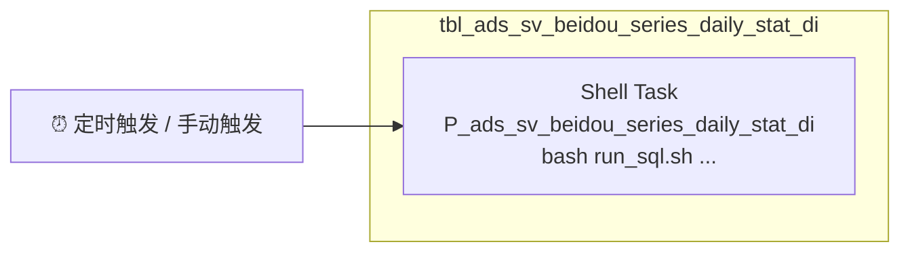

本页面聚焦 DolphinScheduler 中调度参数的运行时语义、任务编排的实战模式以及 DAG 配置的策略权衡——从 SQL 中的 `${dt}` 变量出发，追踪参数如何在调度执行链中流转，最终落地到 Shell 任务的 `rawScript`。如果你正在寻找**如何从 SQL 自动生成 DAG JSON**（即 `dw-generate-dag` 技能的使用方法），请阅读 [DolphinScheduler DAG 自动生成](18-dolphinscheduler-dag-zi-dong-sheng-cheng)。本页面假设你已经有了 DAG JSON 的基础概念，转而深入调度运行时的工作原理。

## 调度参数体系

在 `kunlun-dolphinscheduler` 项目中，DolphinScheduler 承担着 StarRocks 数仓全链路 SQL 的定时调度职责。每一条 DML SQL 在被部署为 DolphinScheduler 任务时，都需要回答一个核心问题：**这个任务处理的是哪一天的数据**？调度参数体系就是这一问题的答案载体。

整个参数体系分为三个层次，形成逐层映射的传递链：

```mermaid
flowchart TD
    subgraph SQL层["📝 SQL 文本层"]
        A["${dt}<br/>${bf_N_dt}<br/>${af_N_dt}<br/>${自定义变量}"]
    end
    subgraph DS层["🔧 DolphinScheduler 参数层"]
        B["自定义参数<br/>localParams/taskParamMap"]
        C["内置日期参数<br/>$&#91;yyyy-MM-dd&#93;<br/>$&#91;yyyy-MM-dd-N&#93;<br/>$&#91;yyyy-MM-dd+N&#93;"]
    end
    subgraph 脚本层["🚀 Shell 执行层"]
        D["bash run_sql.sh {path}<br/>\"dt=${dt}\"<br/>\"bf_1_dt=${bf_1_dt}\""]
    end
    A -->|"参数提取与映射"| B
    B -->|"引用内置参数"| C
    C -->|"运行时替换"| D
    D -->|"参数传递给 SQL"| A
```

**第一层：SQL 文本中的 `${var}` 占位符**。开发者在 DML SQL 中直接使用的 `${variable_name}` 语法，例如 `${dt}` 表示业务日期、`${bf_1_dt}` 表示前一天。这些占位符在 SQL 提交到 DolphinScheduler 时会被提取为任务参数。

**第二层：DolphinScheduler 的参数系统**。任务定义中的 `localParams`、`taskParamList` 和 `taskParamMap` 三个字段协同工作：`localParams` 定义参数的元数据（名称、类型、方向、默认值），`taskParamMap` 是运行时键值对缓存，而 `taskParamList` 在 3.x 版本中作为 `localParams` 的等效存在。其中参数值字段（`value`）引用 DolphinScheduler 内置日期变量，格式为 `$[yyyy-MM-dd(+/-N)]`。

**第三层：Shell 脚本执行层**。DolphinScheduler Worker 在执行 Shell 任务前，会将 `localParams` 中的参数注入为 Shell 环境变量，然后执行 `rawScript`。`run_sql.sh` 脚本接收参数后，最终将其替换回 SQL 语句中，提交给 StarRocks 执行。

Sources: [generate_dag_json.py](orchestrator/SKILLS/dw-generate-dag/scripts/generate_dag_json.py#L208-L303), [dag-json-spec.md](orchestrator/SKILLS/dw-generate-dag/references/dag-json-spec.md#L24-L31)

### 三类参数详解

项目实际使用的调度参数可以分为三类，各有不同的语义和映射规则：

| 参数类别 | SQL 写法示例 | DS 内置参数格式 | 语义 | 典型场景 |
|---|---|---|---|---|
| 当前日期 | `${dt}` | `$[yyyy-MM-dd]` | 任务调度执行的业务日期 | 几乎所有 DML 的 WHERE 条件 |
| 前推 N 天 | `${bf_1_dt}` `${bf_4_dt}` | `$[yyyy-MM-dd-1]` `$[yyyy-MM-dd-4]` | 调度日期向前偏移 N 天 | 窗口函数范围、分区筛选边界 |
| 后推 N 天 | `${af_1_dt}` | `$[yyyy-MM-dd+1]` | 调度日期向后偏移 N 天 | 未来数据预计算场景（较少使用） |
| 自定义变量 | `${product_id}` 等 | `$[yyyy-MM-dd]`（默认） | 业务自定义参数，默认按日期处理 | 非日期型参数需手动配置 |

Sources: [generate_dag_json.py](orchestrator/SKILLS/dw-generate-dag/scripts/generate_dag_json.py#L90-L115)

`bf_N_dt` 是项目中最普遍使用的参数类型。以 `P_ads_sv_beidou_series_daily_stat_di.sql` 为例，其 SQL 中同时使用了 `${dt}` 和 `${bf_4_dt}` 来构建一个 5 天的滑动窗口：`bf_4_dt` 用于 `epis_watch_view` CTE 的 `where ew.dt >= '${bf_4_dt}'` 起止条件，`dt` 用于终边界 `and ew.dt <= '${dt}'`——这是典型的活动用户行为统计窗口模式，通过前推 4 天来捕获跨日的观看行为。

Sources: [P_ads_sv_beidou_series_daily_stat_di.sql](starrocks/ads/dml/P_ads_sv_beidou_series_daily_stat_di.sql#L56-L57)

而对于增量日更新的简单场景，通常只需 `${bf_1_dt}` 一个参数即可。例如 `P_ads_report_user_dau_ed.sql` 仅使用 `${bf_1_dt}` 来删除昨天分区数据并重新插入：

```sql
delete from ads.ads_report_user_dau_ed where dt ='${bf_1_dt}';
...
where a.dt = '${bf_1_dt}'
```

Source: [P_ads_report_user_dau_ed.sql](starrocks/ads/dml/P_ads_report_user_dau_ed.sql#L3-L33)

## 参数映射机制

当 `dw-generate-dag` 脚本扫描 DML SQL 时，参数提取并非简单的正则匹配后列出来，而是遵循一条精密的映射管线。

### 提取与排序规则

`extract_params()` 函数按以下规则处理 SQL 中所有 `${var}` 模式：首先按首次出现的顺序记录每个唯一变量名，然后**强制将 `dt` 提升到列表首位**（如果存在），其余变量保持首次出现顺序。这一顺序直接决定了 DolphinScheduler 任务界面中参数的展示顺序——`dt` 永远排在第一位，符合开发者直觉。

Sources: [generate_dag_json.py](orchestrator/SKILLS/dw-generate-dag/scripts/generate_dag_json.py#L90-L101)

### 日期变量的映射逻辑

`map_param_value()` 函数实现了变量名到 DolphinScheduler 内置参数的精确映射：

```mermaid
flowchart TD
    A["检查参数名"] --> B{"param == 'dt'?"}
    B -->|是| C["$&#91;yyyy-MM-dd&#93;"]
    B -->|否| D{"匹配 bf_N_dt?"}
    D -->|是| E["$&#91;yyyy-MM-dd-N&#93;"]
    D -->|否| F{"匹配 af_N_dt?"}
    F -->|是| G["$&#91;yyyy-MM-dd+N&#93;"]
    F -->|否| H["$&#91;yyyy-MM-dd&#93;<br/>（默认回退）"]
```



这一映射设计的关键约束在于：`bf_N_dt` 的正则匹配使用 `^bf_(\d+)_dt$` 锚定模式，要求以 `bf_` 开头、`_dt` 结尾，中间为数字。这意味着 `bf_abc_dt` 不会命中此规则，会回退到默认的日期映射。对于项目中未按此命名规范的旧参数，建议逐步迁移到标准格式。

Sources: [generate_dag_json.py](orchestrator/SKILLS/dw-generate-dag/scripts/generate_dag_json.py#L104-L115)

### 参数在任务 JSON 中的三重存在

每个提取的参数在生成的 DAG JSON 中同时存在于三个位置，这是 DolphinScheduler 3.x 数据模型的兼容性要求：

| JSON 路径 | 示例 | 用途 |
|---|---|---|
| `taskParams.localParams` | `[{"prop":"dt","direct":"IN","type":"VARCHAR","value":"$[yyyy-MM-dd]"}]` | 参数元数据定义 |
| `taskParamList` | 同 `localParams` | 3.x 版本等效字段 |
| `taskParamMap` | `{"dt":"$[yyyy-MM-dd]"}` | 运行时键值对缓存 |
| `taskParams.rawScript` | `"bash run_sql.sh ... \"dt=${dt}\""` | 实际执行的 Shell 命令 |

`rawScript` 中参数以 `"key=${key}"` 的格式用逗号拼接传递，其中 `${key}` 是 Shell 变量引用——DolphinScheduler Worker 在执行前会将 `localParams` 中定义的参数注入为同名的 Shell 环境变量。

Sources: [generate_dag_json.py](orchestrator/SKILLS/dw-generate-dag/scripts/generate_dag_json.py#L163-L178), [generate_dag_json.py](orchestrator/SKILLS/dw-generate-dag/scripts/generate_dag_json.py#L118-L122)

## 任务编排模式

项目中的 DolphinScheduler 任务遵循以 **Shell 任务**为唯一任务类型的设计范式。所有 DML SQL 通过 `bash run_sql.sh` 脚本统一执行入口，这带来了集中的日志管理、错误处理和连接池控制能力。

### 模式一：单表单任务 DAG（主流模式）

这是当前项目中最普遍的编排模式——一个 DAG（Workflow）包含恰好一个 Shell 任务节点，该任务执行一条 DML SQL 的完整逻辑（包括 CTE 链、多步 UNION ALL 等）。DAG 的 `processTaskRelationList` 中仅有一条记录，`preTaskCode` 和 `postTaskCode` 均为 0，表示该节点是 DAG 的唯一可调度单元。



这种模式适用于绝大多数 ADS/DWS/DWD 层的日增量更新场景——数据来源是上游已完成的分区数据，不存在同 DAG 内的依赖等待。

### 模式二：Delete + Insert 两步任务

部分表在处理前需要先清理目标分区，避免重复执行导致数据翻倍。这些 SQL 在文件头部的 `-- SQL语句` 注释区域会包含一条 `delete` 语句和一条 `insert` 语句。例如：

```
-- SQL语句
delete from ads.ads_bi_user_read_book_info where dt = '${bf_1_dt}';
---
-- SQL语句
insert into ads.ads_bi_user_read_book_info ...
```

Source: [P_ads_bi_user_read_book_info.sql](starrocks/ads/dml/P_ads_bi_user_read_book_info.sql#L1-L13)

在 DolphinScheduler 中，这种模式对应两种实现方式：（1）将 delete 和 insert 合并为同一个 Shell 任务的两个 SQL 语句（当前默认生成的单任务模式）；（2）拆分为两个独立任务节点，通过连线建立串行依赖——delete 成功后 insert 才执行。方式一实现简单但缺乏细粒度的失败处理，方式二提供了更好的可观测性但增加了 DAG 复杂度。

### 模式三：跨 DAG 依赖编排

对于存在跨表数据依赖的场景，下游 DAG 通常通过 DolphinScheduler 的**跨工作流依赖节点**（Depends on Workflow）或**时间触发偏移**来实现。例如，ADS 层的 `P_ads_report_user_dau_ed_external.sql` 直接引用同层 `ads_report_user_dau_ed` 表的数据，其调度时间应晚于上游 DAG 的预计完成时间。

Source: [P_ads_report_user_dau_ed_external.sql](starrocks/ads/dml/P_ads_report_user_dau_ed_external.sql#L1-L14)

当前 `dw-generate-dag` 脚本仅生成单表单任务 DAG，多任务 DAG 的编排需要在 DolphinScheduler 界面中手动建立连线。对于未来可能的扩展方向，参见 [DolphinScheduler DAG 自动生成](18-dolphinscheduler-dag-zi-dong-sheng-cheng) 中的"技能架构与扩展点"章节。

### Shell 脚本约定

所有 DAG 任务统一通过 `bash run_sql.sh` 执行，参数以逗号分隔的键值对形式传递：

```
# 无参数
bash run_sql.sh starrocks/ads/dml/P_ads_etl_ready_log.sql

# 有参数
bash run_sql.sh starrocks/ads/dml/P_ads_sv_beidou_series_daily_stat_di.sql "dt=${dt}","bf_4_dt=${bf_4_dt}"
```

`run_sql.sh` 脚本接收两个核心输入：SQL 文件的仓库相对路径和参数列表。脚本内部负责将参数替换回 SQL 文本并提交 StarRocks 执行。SQL 相对路径由 `--repo-root` 参数计算，基于 `sql_path.resolve().relative_to(repo_root.resolve())` 生成，确保路径与具体的部署环境解耦。

Sources: [generate_dag_json.py](orchestrator/SKILLS/dw-generate-dag/scripts/generate_dag_json.py#L118-L122), [generate_dag_json.py](orchestrator/SKILLS/dw-generate-dag/scripts/generate_dag_json.py#L159-L161)

## DAG 运行时配置

DAG JSON 中的运行时配置决定了任务在 DolphinScheduler Worker 上的执行行为。这些配置在 `dw-generate-dag` 脚本中通过 `DEFAULTS` 字典提供预设值，并可通过 `--config` 参数按需覆盖。

### 核心运行时参数

| 参数 | 默认值 | 含义 | 调优建议 |
|---|---|---|---|
| `executionType` | `PARALLEL` | 多任务并行执行 | 有严格串行依赖时改为 `SERIAL_WAIT` |
| `failRetryTimes` | `2` | 失败自动重试次数 | 核心链路表可设为 3，非关键表可为 0 |
| `failRetryInterval` | `1`（分钟） | 重试间隔 | 资源竞争型任务适当增大 |
| `timeoutFlag` | `CLOSE` | 超时控制开关 | 大表处理建议 `OPEN` 并设置合理 `timeout` |
| `timeout` | `0`（不限制） | 超时阈值（分钟） | 按历史执行时长 × 2~3 设置 |
| `taskPriority` | `MEDIUM` | 任务优先级 | 核心链路 `HIGH`，低优先级 `LOW` |
| `workerGroup` | `default` | Worker 分组 | 按层级或资源需求划分不同 Worker 组 |
| `taskExecuteType` | `BATCH` | 执行类型 | 批量任务保持 `BATCH` |

Sources: [generate_dag_json.py](orchestrator/SKILLS/dw-generate-dag/scripts/generate_dag_json.py#L33-L52)

### 环境标识

`environmentCode` 指定任务执行的目标环境。在 DolphinScheduler 中，不同环境对应不同的数据源配置、资源配额和权限策略。`projectCode` 标识所属项目空间，`userId` 指定任务的责任人。这两个字段是 DolphinScheduler 导入时的**必要字段**——如果通过脚本生成时未通过 `--config` 注入（默认为 0），导入后必须在 DolphinScheduler 界面中手动填写。

Sources: [dag-json-spec.md](orchestrator/SKILLS/dw-generate-dag/references/dag-json-spec.md#L45-L75)

### 资源与脚本依赖

`resourceIds` 和 `resourceList` 指向 DolphinScheduler 资源中心中 `run_sql.sh` 脚本及其依赖文件。这些资源在任务执行前会被 Worker 下载到本地工作目录。当前配置示例中引用了两个资源 ID（120042 和 120201），分别对应核心脚本和通用工具库。

### 配置覆盖策略

`--config` 支持两层覆盖机制：顶层 key 直接覆盖 `DEFAULTS` 中的对应值，`defaults` 子块实现批量覆盖。此外，`processDefinition`、`taskDefinition`、`processTaskRelation` 三个子块允许对 DAG JSON 的具体字段进行细粒度覆盖：

```json
{
  "defaults": {
    "projectCode": 10857427255392,
    "userId": 120032,
    "environmentCode": 18255652448032
  },
  "taskDefinition": {
    "failRetryTimes": 3
  }
}
```

这种分层覆盖设计允许团队在 CI/CD 流水线中根据目标环境（开发/测试/生产）注入不同的配置，而无需修改生成的 DAG JSON 本身。

Sources: [generate_dag_json.py](orchestrator/SKILLS/dw-generate-dag/scripts/generate_dag_json.py#L136-L149), [dag-json-spec.md](orchestrator/SKILLS/dw-generate-dag/references/dag-json-spec.md#L76-L88)

## 调度与触发策略

DAG JSON 的 `schedule` 字段默认为 `null`，这意味着生成的 DAG 在导入后处于"仅手动触发"状态。生产环境的调度配置通常直接在 DolphinScheduler 界面中设置，或在 CI/CD 导入流程中通过 API 自动配置。

### 常见调度策略

| 策略 | 适用层级 | 典型 Cron | 说明 |
|---|---|---|---|
| 日调度（T+1 凌晨） | ADS/DWS 层 | `0 3 * * *` | 依赖上游 T 日数据全部就绪后触发 |
| 日调度（T 日上午） | DWD 层 | `0 8 * * *` | 处理前一日的增量日志数据 |
| 小时调度 | 实时汇总层 | `0 * * * *` | 每小时聚合一次 |
| 周调度 | 周报汇总表 | `0 2 * * 1` | 每周一凌晨执行 |

调度时间的选择核心原则是：**确保上游数据分区已完全就绪**。对于依赖多张上游表的 ADS 任务，通常设置在最晚上游表完成后 1-2 小时执行。

### 调度发布状态

`processDefinition.releaseState` 默认为 `OFFLINE`，导入后需要手动上线。`scheduleReleaseState` 控制调度本身的启停状态。这些字段在 CI/CD 自动化流程中通常由导入脚本或 API 调用统一管理。

## 注释约定与参数溯源

项目中 DML SQL 文件的头部注释遵循两种风格，它们在参数溯源和 DAG 生成时扮演不同的角色：

### 新风格注释（推荐）

以 `-- 程序名：` 和 `-- 目标表：` 为核心的规范格式，直接为 `dw-generate-dag` 脚本提供解析锚点：

```sql
----------------------------------------------------------------
-- 程序功能： 北斗短剧每日信息统计表
-- 程序名： P_ads_sv_beidou_series_daily_stat_di
-- 目标表： ads.ads_sv_beidou_series_daily_stat_di
-- 负责人： roger
-- 开发日期：2026-01-26
-- 版本号： v1.0
----------------------------------------------------------------
```

`-- 程序名：` 决定 DolphinScheduler 任务节点的名称，`-- 目标表：` 决定 DAG 名称（`tbl_{table_name}`）和 DDL 定位路径。这两个字段是脚本解析的硬依赖。

Source: [P_ads_sv_beidou_series_daily_stat_di.sql](starrocks/ads/dml/P_ads_sv_beidou_series_daily_stat_di.sql#L1-L8)

### 旧风格注释（遗留兼容）

较早开发的 SQL 使用 `-- project_name`、`-- workflow_name`、`-- task_name` 格式，带有明确的版本号和路径信息：

```sql
----------------------------------------------------------------
-- project_name     : starrocks
-- workflow_name    : tbl_ads_report_user_dau_ed
-- workflow_version : 14
-- create_user      : yanxh
-- task_name        : tbl_ads_report_user_dau_ed
-- task_version     : 8
-- sql_path         : \starrocks\tbl_ads_report_user_dau_ed\tbl_ads_report_user_dau_ed
----------------------------------------------------------------
```

Source: [P_ads_report_user_dau_ed.sql](starrocks/ads/dml/P_ads_report_user_dau_ed.sql#L1-L10)

旧风格缺少 `-- 目标表：` 行，`dw-generate-dag` 脚本会回退到从 `insert into` 语句提取目标表。两种风格的混存是项目演进的自然产物——新开发的 DML 应统一使用新风格注释。DDL 与 DML 的完整注释规范参见 [DDL 与 DML 开发规范](14-ddl-yu-dml-kai-fa-gui-fan)。

### 参数在 SQL 中的使用模式

从代码考古的角度观察，项目中的参数使用呈现三种典型模式：

| 模式 | 参数组合 | 示例 SQL | 说明 |
|---|---|---|---|
| 单日窗口 | `${bf_1_dt}` 或 `${dt}` | `P_ads_report_user_dau_ed.sql` | 处理单个日期的分区数据，最简单也最常见 |
| 多日滑动窗口 | `${dt}` + `${bf_4_dt}` | `P_ads_sv_beidou_series_daily_stat_di.sql` | 构建 N+1 天的分析窗口，用于行为留存、漏斗统计 |
| 区间范围 | `${dt}` + `${bf_1_dt}` | `P_ads_bi_sv_recharge_user_detail_di.sql` | 统计从昨天到今天的累计区间数据 |

Source: [P_ads_bi_sv_recharge_user_detail_di.sql](starrocks/ads/dml/P_ads_bi_sv_recharge_user_detail_di.sql#L21-L22)

## 最佳实践与故障排查

### 参数设计原则

**最小化参数数量**。每个参数都增加了任务配置的复杂度和出错风险。优先使用 DolphinScheduler 内置的日期函数（如 `$[yyyy-MM-dd]`）覆盖日期需求，只在确实需要业务自定义参数时才引入额外变量。

**参数命名一致性**。在整个项目中，`dt` 永远表示调度日期，`bf_N_dt` 永远表示前推 N 天。不要使用 `yesterday`、`prev_date` 等别名——虽然它们在 DolphinScheduler 中可以映射到相同的内置参数，但会破坏 `dw-generate-dag` 的参数映射逻辑，导致生成的 JSON 出现不一致。

**日期边界闭合**。当使用 `bf_N_dt` 和 `dt` 构建区间时，确保 SQL 的 WHERE 条件使用正确的比较运算符：对于日期分区字段，区间查询通常使用 `>= '${bf_N_dt}' and <= '${dt}'`（双闭区间），而非 `>` 或 `<`。

### 常见故障与诊断

| 故障现象 | 可能原因 | 诊断方法 | 修复方向 |
|---|---|---|---|
| 任务执行成功但数据为空 | `${bf_N_dt}` 映射错误导致查询了错误日期 | 检查 `taskParamMap` 中参数值，对比实际 SQL 执行日期 | 确认 `bf_N_dt` 的 N 值与预期一致 |
| 参数未生效，SQL 中仍是 `${var}` 字面量 | `run_sql.sh` 未正确替换参数，或参数名不匹配 | 查看 DolphinScheduler 任务日志中的实际执行命令 | 确保 `rawScript` 中的参数名与 SQL 中完全一致 |
| DAG JSON 导入失败 | `projectCode` 或 `userId` 为 0 | 检查导入报错信息中的字段名 | 使用 `--config` 注入正确的项目环境参数 |
| DDL 文件定位失败 | 目标表 schema 或 table_name 与文件路径不匹配 | 检查 DDL 文件是否存在：`starrocks/{schema}/ddl/{table}.sql` | 确保 `-- 目标表：` 注释中的 schema.table 与文件路径一致 |
| 重复执行导致数据翻倍 | 缺少 delete 前置语句或使用了 `insert into`（非 `insert overwrite`） | 检查目标表分区是否有重复数据 | 添加 delete 前置语句或使用分区覆盖写入 |

## 继续阅读

- 了解 DAG JSON 的自动生成工具链：[DolphinScheduler DAG 自动生成](18-dolphinscheduler-dag-zi-dong-sheng-cheng)
- 查看 DDL/DML 注释规范与命名约定：[DDL 与 DML 开发规范](14-ddl-yu-dml-kai-fa-gui-fan)
- 理解 CI/CD 中如何集成调度部署：[分支管理与 CI/CD 集成](16-fen-zhi-guan-li-yu-ci-cd-ji-cheng)
- 掌握 StarRocks 表模型与分区设计：[StarRocks 表模型与分区策略](28-starrocks-biao-mo-xing-yu-fen-qu-ce-lue)
- 了解 SQL 编码中的数据质量兜底：[SQL 编码风格与数据质量兜底](15-sql-bian-ma-feng-ge-yu-shu-ju-zhi-liang-dou-di)