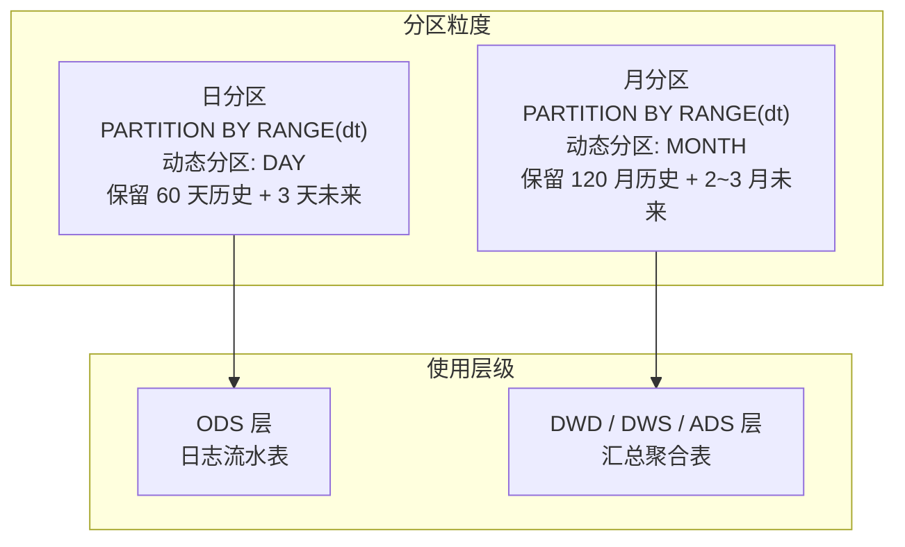

本页深入解析项目中 StarRocks 表的建模范式与分区策略。你将理解从 ODS 到 ADS 各层表的建表规律、主键模型的选择逻辑、动态分区参数的设计意图，以及这些决策如何支撑数仓的日常增量写入与查询性能。

## 表模型全景：Primary Key 一统天下

项目在所有数仓分层中**统一采用 StarRocks 的 Primary Key（主键）模型**，未见 Duplicate Key 或 Aggregate Key 模型的使用痕迹。这不是巧合——Primary Key 模型提供了" Upsert 即正确"的语义：当新数据与已有数据主键冲突时，StarRocks 自动以新覆旧，完美契合了本项目"全量快照 + 增量覆盖"的数据接入模式。

**Primary Key 模型的核心价值**：

| 能力 | 说明 | 对项目的意义 |
|------|------|-------------|
| Upsert 语义 | 相同主键自动更新 | DML 直接 INSERT INTO，无需 DELETE+INSERT |
| 主键去重 | 物理层保证主键唯一 | 重跑任务不会产生重复数据 |
| 持久化索引 | `enable_persistent_index = "true"` | 主键查找走磁盘索引而非全表扫描 |
| 列式更新 | 只覆写变化的列 | 增量更新维度宽表时开销可控 |

> **为什么不用 Aggregate Key？** Aggregate Key 模型需要在建表时声明聚合函数（SUM/REPLACE/MAX 等），适合固定的预聚合场景。而本项目的数据聚合逻辑全部在 DML 的 SQL 中显式完成，使用 Primary Key 模型存储聚合结果更灵活——聚合逻辑变更时只需改 DML，无需重建表结构。

Sources: [ods_ab_experiment_log.sql](starrocks/ods/ddl/ods_ab_experiment_log.sql#L1-L30)

## 主键设计原则：业务键 + 时间分区

从 ODS 到 ADS，主键设计遵循一条清晰规律：**时间分区字段 `dt` 领衔 + 业务标识字段紧随其后**。

**各层主键设计对比**：

| 层级 | 典型主键 | 设计意图 |
|------|---------|---------|
| ODS | `(id, dt)` | 源系统自增 ID + 分区日期，保证增量去重 |
| DWD | `(dt, product_id, auto_id, types)` | 分区 + 产品 + 业务主键 + 类型枚举，精确定位每条事实 |
| DWS | `(dt, types, book_id, site_id)` | 分区 + 类型 + 实体 + 站点，日粒度汇总唯一 |
| ADS | `(dt, Id)` 或 `(md5_key)` | 分区 + 业务 ID，面向报表的最终宽表 |
| DIM | `(product_id, user_id)` 或 `(date_id, datestr)` | 纯业务键，无时间分区——维度表存全量快照 |

ODS 层的主键看似简单（`id` + `dt`），实则承担了关键的**幂等写入**职责：同一批次数据重复执行 DML 时，`(id, dt)` 组合确保不会插入重复行，而是原地覆写。

DWD 层的主键典型地细化为 4~5 元组。以 `dwd_consume_user_consume` 为例，`(dt, product_id, auto_id, types)` 精确捕获了"某天某产品下某条消费记录的类型维度"，为后续上卷到 DWS 提供不重不漏的事实基础。

DIM 层的主键最特殊——**不含时间字段**。`dim_user_all_info` 以 `(product_id, user_id)` 为主键、无分区、无动态分区配置，每次 ETL 全量覆写整表。这是因为维度表需要保存每个实体的"当前最新状态"，而非历史切片。

Sources: [ods_ab_experiment_log.sql](starrocks/ods/ddl/ods_ab_experiment_log.sql#L1-L27) · [dwd_consume_user_consume.sql](starrocks/dwd/ddl/dwd_consume_user_consume.sql#L1-L22) · [dim_user_all_info.sql](starrocks/dim/ddl/dim_user_all_info.sql#L1-L96) · [dws_consume_book_consume_ed.sql](starrocks/dws/ddl/dws_consume_book_consume_ed.sql#L1-L13)

## 分区策略：两种粒度支撑全链路

项目采用 **RANGE 分区 + 动态分区（Dynamic Partition）** 的组合策略，按时间粒度分为两级：



### 日分区：ODS 层的时序底座

ODS 日志表采用**日级别 RANGE 分区**。以 `ods_ab_experiment_log` 为例：

```sql
PARTITION BY RANGE(`dt`)
(PARTITION p20260315 VALUES [("2026-03-15"), ("2026-03-16")),
 PARTITION p20260316 VALUES [("2026-03-16"), ("2026-03-17")),
 ...
)
```

动态分区参数设定为 `start = "-60"`, `end = "3"`——保留 60 天历史（自动删除更早分区），预创建 3 天空分区，确保写入任务不会因分区缺失而失败。

> **设计意图**：ODS 日志表每天入库百万级原始事件，日分区确保单分区数据量可控，分区裁剪后查询只扫描目标日期范围，避免全表扫描。

Sources: [ods_ab_experiment_log.sql](starrocks/ods/ddl/ods_ab_experiment_log.sql#L28-L92)

### 月分区：汇总层的存储优化

DWD 及以上层的汇总表统一采用**月级别 RANGE 分区**。以 `dwd_ab_exp_user_detail_di` 为例：

```sql
PARTITION BY RANGE(`dt`)
(PARTITION p202502 VALUES [("2025-02-01"), ("2025-03-01")),
 PARTITION p202503 VALUES [("2025-03-01"), ("2025-04-01")),
 ...
)
```

动态分区参数 `start = "-120"`, `end = "2"`, `start_day_of_month = "1"`——保留 10 年历史，每月 1 号起算。对于历史数据无限保留的需求（如 `dws_advertisement_user_amt`），`start = "-2147483648"`（Int32 最小值）实现"永不过期"效果。

> **为什么用月而非日？** DWD/DWS/ADS 表经过聚合后，单日数据量已大幅缩减。月分区减少分区元数据开销，同时分区裁剪粒度对报表查询（通常按月/周取数）依然有效。

Sources: [dwd_ab_exp_user_detail_di.sql](starrocks/dwd/ddl/dwd_ab_exp_user_detail_di.sql#L19-L38) · [dws_advertisement_user_amt.sql](starrocks/dws/ddl/dws_advertisement_user_amt.sql#L17-L71)

### 无分区表：维度快照与固定宽表

两类表不设分区：

| 类型 | 代表表 | 特征 |
|------|--------|------|
| 维度表 | `dim_date`, `dim_user_all_info` | 全量快照，每次 ETL 整体覆写 |
| 非时序宽表 | `ads_bi_charge_ltv_est` | 以 `md5_key` 为主键，不按时间组织 |

维度表每次 INSERT INTO 就是一次全量替换，无需分区管理。LTV 估算表以计算出的哈希值为唯一标识，数据量固定，分区无收益。

Sources: [dim_date.sql](starrocks/dim/ddl/dim_date.sql#L1-L44) · [dim_user_all_info.sql](starrocks/dim/ddl/dim_user_all_info.sql#L94-L99) · [ads_bi_charge_ltv_est.sql](starrocks/ads/ddl/ads_bi_charge_ltv_est.sql#L93-L99)

## 数据分布：HASH 分桶与 Colocate 优化

所有表使用 `DISTRIBUTED BY HASH` 进行数据分桶，分桶键选择遵循"高频 JOIN 键 + 高基数"原则：

| 表类型 | 典型分桶键 | Buckets | 设计意图 |
|--------|-----------|---------|---------|
| ODS 日志 | `id` | 3 | 自增 ID 分布均匀 |
| DWD 事实 | `product_id, auto_id` | 5 | 产品维度 + 单调递增键 |
| DWS 汇总 | `book_id, site_id` | 1~5 | 实体键分布，小表可单桶 |
| ADS 报表 | `dt, Id` | 7 | 复合键打散，避免热点 |
| DIM 维度 | `product_id, user_id` | 3 | 与 `colocate_with` 配合 |
| ALG 特征 | `series_id` | 50 | 大表多桶并行计算 |

**Bucket 数量选择**直接受数据量影响。ODS/DWD/DIM 表通常在 3~5 桶之间；ALG 层的机器学习特征表（如 `alg_short_video_dnn_feature`）使用 50 桶，支撑大规模并行特征计算。

维度表 `dim_user_all_info` 使用了 `colocate_with = "productid_userid_group"` 属性——这意味着同一个 Colocation Group 内的表，相同分桶键的数据一定会落在同一 BE 节点上，JOIN 时无需跨节点数据传输，大幅降低 shuffle 开销。

Sources: [dim_user_all_info.sql](starrocks/dim/ddl/dim_user_all_info.sql#L96-L99) · [alg_short_video_dnn_feature.sql](starrocks/alg/ddl/alg_short_video_dnn_feature.sql#L29) · [ods_ab_experiment_log.sql](starrocks/ods/ddl/ods_ab_experiment_log.sql#L93) · [ads_MarketingPlan.sql](starrocks/ads/ddl/ads_MarketingPlan.sql#L49)

## 索引与存储属性：查询加速三板斧

### Bloom Filter：高基数列的精确查找加速

对于 `user_id`、`book_id`、`create_tm_account` 等高频 WHERE 条件列，建表时声明 Bloom Filter 索引。StarRocks 在每个数据文件中维护这些列的 Bloom Filter 位图，查询时先通过位图快速排除不包含目标值的文件，再对少量候选文件做精确扫描。

```sql
PROPERTIES (
    "bloom_filter_columns" = "user_id, create_tm_account"
)
```

典型使用场景：`WHERE user_id = 123456`——Bloom Filter 在秒级内判定 99% 的数据文件不包含此用户，仅扫描命中文件。

Sources: [ods_ab_experiment_log.sql](starrocks/ods/ddl/ods_ab_experiment_log.sql#L98) · [dwd_ab_exp_user_detail_di.sql](starrocks/dwd/ddl/dwd_ab_exp_user_detail_di.sql#L42)

### BITMAP 索引：低基数列的快速过滤

对于 `types`（消费类型，枚举值 1~4）这类低基数列，使用 BITMAP 索引。每个枚举值对应一个位图，过滤时直接做位图 AND/OR 运算，效率远超逐行比较。

```sql
INDEX index_types (`types`) USING BITMAP COMMENT 'index_types'
```

Sources: [dws_consume_book_consume_ed.sql](starrocks/dws/ddl/dws_consume_book_consume_ed.sql#L10)

### 持久化索引与副本存储

所有表统一配置以下存储属性：

| 属性 | 值 | 含义 |
|------|----|------|
| `enable_persistent_index` | `true` | 主键索引持久化到磁盘，BE 重启无需重建 |
| `replicated_storage` | `true` | 三副本独立存储，任一 BE 宕机不影响读写 |
| `replication_num` | `3`（部分 `2`） | 三副本保证高可用，非核心表可降为两副本 |
| `compression` | `LZ4` | 高速压缩算法，平衡压缩率与解压速度 |

`replication_num = "2"` 出现在部分 DWD 宽表（如 `dwd_consume_user_consume`）中——这些表数据量大但容忍短暂不可用，双副本节省 33% 存储成本。

Sources: [dwd_consume_user_consume.sql](starrocks/dwd/ddl/dwd_consume_user_consume.sql#L34-L44)

## 特殊表类型：外部表与视图

### Hive 外部表：联邦查询传感器原始数据

ODS 层中存在 Hive 外部表，用于直接查询 HDFS 上的 Parquet 原始数据而无需导入：

```sql
CREATE EXTERNAL TABLE `ods_sensors_data_event_stream_new` (...)
ENGINE=HIVE
PROPERTIES (
    "database" = "ods_loggateway",
    "resource" = "hive0",
    "hive.metastore.uris" = "thrift://node21:9083,thrift://node22:9083"
);
```

这些外部表是 StarRocks 联邦查询能力的体现——神策埋点的原始 JSON 事件以 Parquet 格式存储在 Hive 中，StarRocks 通过 Hive Catalog 直接读取，避免数据冗余存储。

Sources: [ods_sensors_data_event_stream_new.sql](starrocks/ods/ddl/ods_sensors_data_event_stream_new.sql#L1-L23)

### 逻辑视图：封装跨库查询

DWD 层存在部分 View 定义，将 ODS_LOG 库的神策事件表封装为业务视图：

```sql
CREATE VIEW `dwd_sensors_production_appstart_view` (...) 
AS SELECT ... FROM `ods_log`.`ods_sensors_cd_video_production_AppStart`
WHERE `project_id` = 5;
```

视图在此承担**逻辑抽象层**角色——上层 DML 通过视图读取，底层表结构变更时只需修改视图定义，无需逐表调整。

Sources: [dwd_sensors_production_appstart_view.sql](starrocks/dwd/ddl/dwd_sensors_production_appstart_view.sql#L1-L4)

## DML 写入模式：INSERT INTO 即 Upsert

所有 DML 文件统一采用 `INSERT INTO` 语法。由于 Primary Key 模型的 Upsert 语义，无需显式的 `DELETE` + `INSERT` 或 `MERGE` 语句——当目标表中已存在相同主键的行时，新数据直接覆写。

以 `P_dwd_consume_user_consume` 为例，DML 通过 UNION ALL 将 4 种消费类型（阅币、礼券、赠送币、VIP）从 ODS_LOG 层汇聚到 DWD 层：

```sql
INSERT INTO dwd.dwd_consume_user_consume
SELECT ... 1 AS types ... FROM ods_log.ods_book_log_usermoneylog   -- 阅币
UNION ALL
SELECT ... 2 AS types ... FROM ods_log.ods_book_log_usergiftmoneylog -- 礼券
UNION ALL
SELECT ... 3 AS types ... FROM ods_log.ods_book_log_userawardmoneylog -- 赠送币
UNION ALL
SELECT ... 4 AS types ... FROM ods_log.ods_book_log_userviplog       -- VIP
```

DML 中广泛使用 DolphinScheduler 调度变量（`${dt}`、`${bf_1_dt}`）控制分区范围，多数任务取 `dt >= '${bf_1_dt}' AND dt <= '${dt}'` 的昨日至今数据，实现增量更新。

Sources: [P_dwd_consume_user_consume.sql](starrocks/dwd/dml/P_dwd_consume_user_consume.sql#L12-L50) · [P_ads_MarketingPlan.sql](starrocks/ads/dml/P_ads_MarketingPlan.sql#L1-L50)

## 模型决策速查表

以下汇总表帮助你在新建表时快速做出建表决策：

| 决策点 | ODS 日志表 | DWD/DWS/ADS 表 | DIM 维度表 | ALG 特征表 |
|--------|-----------|----------------|-----------|-----------|
| 表模型 | PRIMARY KEY | PRIMARY KEY | PRIMARY KEY | PRIMARY KEY |
| 分区粒度 | 日分区 (DAY) | 月分区 (MONTH) | 无分区 | 视数据量而定 |
| 动态分区保留 | -60 ~ +3 天 | -120 ~ +2 月 | 不适用 | 按需 |
| 分桶键 | `id` | 核心业务键 | 实体主键 | 计算密集型键 |
| Buckets | 3~5 | 1~7 | 3 | 50 |
| Bloom Filter | `user_id` | 高频过滤列 | 实体 ID | 不需要 |
| BITMAP 索引 | 不需要 | 低基数枚举列 | 不需要 | 不需要 |
| Colocate | 不需要 | 不需要 | 需要时配置 | 不需要 |

## 阅读建议

你已经理解了 StarRocks 表模型的底层设计，接下来可以深入以下相关主题：

- [分层设计理念与数据流转](5-fen-ceng-she-ji-li-nian-yu-shu-ju-liu-zhuan) — 理解各层表的定位与数据流转路径
- [DDL 与 DML 开发规范](14-ddl-yu-dml-kai-fa-gui-fan) — 新建表时的命名与结构规范
- [DolphinScheduler 调度参数与任务编排](27-dolphinscheduler-diao-du-can-shu-yu-ren-wu-bian-pai) — 调度变量 `${dt}` 如何在 DML 中生效
- [DAS 元数据管理工具](29-das-yuan-shu-ju-guan-li-gong-ju) — 表结构变更监控与元数据治理