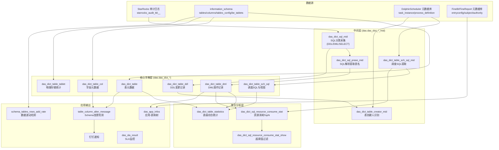
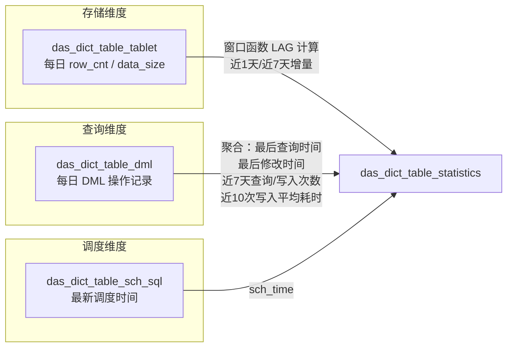

DAS（Data Asset System）是一套内建于 DolphinScheduler 上的 StarRocks 数仓元数据管理与数据质量监控系统。它通过定时采集 StarRocks 审计日志、`information_schema` 系统表以及上下游业务元数据（FineBI、FineReport、DolphinScheduler），构建起覆盖**表级字典**、**字段血缘**、**SQL 资源消耗**、**Schema 变更检测**、**数据波动告警**和 **SLA 监控**六大领域的全链路元数据治理体系。

## 总体架构与数据流转

DAS 的数据处理遵循"采集 → 解析 → 聚合 → 应用"四层架构。底层从 StarRocks 审计日志和系统表拉取原始数据，中间层借助 UDF `parsesql2tablename` 解析 SQL 提取表名，聚合层按天计算资源消耗 TopN 和表级统计指标，最上层对接钉钉通知和业务报表。

DAS 覆盖的目标数据库范围为数仓七层：`ods`、`ods_log`、`dwd`、`dim`、`dwm`、`dws`、`ads`、`alg`，这是所有采集任务中统一的过滤条件。

Sources: [P_das_dict_table.sql](starrocks/das/P_das_dict_table.sql#L48-L49), [P_das_dict_table_col.sql](starrocks/das/P_das_dict_table_col.sql#L39-L39)

## 核心字典子系统：表与字段元数据

表元数据 `das_dict_table` 是 DAS 的基石，通过 `information_schema.tables` 与存量数据的 **FULL JOIN** 实现每日全量同步。这种设计既捕获新增表（`table_nm IS NULL` 判定），也通过 `is_delete` 标记已下线表。同时，它 LEFT JOIN `das_dict_table_ddl` 中前一天的 ALTER 语句，以便感知 `utime`（最后修改时间）的变化——如果当天有 ALTER 操作且操作时间晚于 `UPDATE_TIME`，则采纳操作时间。

字段元数据 `das_dict_table_col` 更进一步，不仅采集了 `COLUMN_NAME`、`DATA_TYPE`、`COLUMN_COMMENT` 等基础属性，还通过关联 `information_schema.tables_config` 计算出每个字段的三个关键角色标记：

| 标记字段 | 含义 | 来源 |
|---|---|---|
| `is_pri` | 是否主键列 | `tables_config.PRIMARY_KEY` 拆分后匹配 |
| `is_par` | 是否分区列 | `tables_config.PARTITION_KEY` 拆分后匹配 |
| `is_dis` | 是否分桶列 | `tables_config.DISTRIBUTE_KEY` 拆分后匹配 |

这三个标记对理解 StarRocks 表的数据分布和查询性能至关重要。字段变更检测同样精细：当 `comment`、`default_val`、`is_pri`、`is_dis`、`is_par` 中任一值发生变化时，`utime` 更新为当前时间。

Sources: [P_das_dict_table.sql](starrocks/das/P_das_dict_table.sql#L14-L52), [P_das_dict_table_col.sql](starrocks/das/P_das_dict_table_col.sql#L10-L75)

## SQL 审计采集与分类

DAS 从 StarRocks 审计表 `starrocks_audit_db__.starrocks_audit_tbl__` 采集所有成功执行的 SQL（`state != 'ERR'`），按操作类型分为三类写入 `das_dict_sql_mid`：

| `opreate_type` | SQL 类型 | 典型语句 | 用途 |
|---|---|---|---|
| 1 | DDL | `CREATE TABLE/VIEW`、`TRUNCATE`、`DROP`、`ALTER` | 追踪表结构变更，生成 DDL 字典 |
| 2 | DML（写） | `INSERT`（排除含 `VALUES` 的）、`DELETE`、`UPDATE` | 追踪数据写入，关联资源消耗 |
| 3 | SELECT（读） | `SELECT ... FROM` | 解析读取链路，关联 FineBI/Report 查询 |

三类 SQL 的采集包含完整的资源消耗指标：`queryTime`（执行时长 ms）、`scanBytes`（扫描字节）、`scanRows`（扫描行数）、`cpuCostNs`（CPU 耗时纳秒）、`memCostBytes`（内存消耗字节），为后续的慢查询分析和资源治理提供数据基础。采集时对超长 SQL 进行了截断处理（DDL/DML 截断至 65533 字符，SELECT 截断至 60000 字符），防止元数据表字段溢出。

Sources: [P_das_dict_sql_mid.sql](starrocks/das/P_das_dict_sql_mid.sql#L11-L35), [P_das_dict_sql_mid.sql](starrocks/das/P_das_dict_sql_mid.sql#L38-L50), [P_das_dict_sql_mid.sql](starrocks/das/P_das_dict_sql_mid.sql#L52-L76)

## UDF SQL 解析与血缘构建

`das_dict_sql_prase_mid` 是 DAS 血缘能力的核心——它调用自定义 UDF `udf.parsesql2tablename(stmt)` 解析每条 SQL，返回一个 JSON 对象，其中包含 `$.insertTableName`（写入目标表）和 `$.fromTableName`（读取源表）。解析逻辑分为两支：

- **type2（INSERT 解析）**：对 `opreate_type = 2` 的 DML，提取 `$.insertTableName` 作为写入目标；同时若该 INSERT 语句包含 `SELECT ... FROM` 子查询（排除 `INSERT ... VALUES`），则额外提取 `$.fromTableName` 作为读取源，形成完整的**读写血缘对**。
- **type1（SELECT 解析）**：对 `opreate_type = 3` 的 SELECT，提取 `$.fromTableName`，用于追踪 FineBI/FineReport 等应用对表的读取依赖。

所有解析出的表名同时计算 MD5 哈希值 `md5_table_nm`，用于后续去重和关联。

Sources: [P_das_dict_sql_prase_mid.sql](starrocks/das/P_das_dict_sql_prase_mid.sql#L11-L60)

## DDL 与 DML 分离存储

DAS 将解析后的 SQL 语句分别写入两张目标表：

- **`das_dict_table_ddl`**：从 `das_dict_sql_mid`（`opreate_type = 1`）中提取，利用 UDF 解析 `$.insertTableName`，按数据库前缀（`ods`、`dwd` 等）过滤，同时处理 `ods_log` 的特殊前缀（前 7 位而非 3 位）——因为 `ods_log` 的表名格式为 `ods_log_xxx`。

- **`das_dict_table_dml`**：由两个独立任务写入。type1 处理 `opreate_type = 1`（即 `CREATE TABLE AS SELECT` 类操作，这类操作既是 DDL 也是 DML），直接取单表名；type2 处理 `opreate_type = 2`（INSERT/DELETE/UPDATE），对多表操作（`table_nms` 字段包含逗号分隔的表列表）通过 `unnest` 炸裂为多行，确保每行对应一张表的单次操作。

DML 表记录了完整的操作上下文：`operator`（操作用户）、`operation_time`、`client_ip`、`resource_group`、执行状态、以及全部资源消耗指标（`query_time`、`scan_bytes`、`scan_rows`、`cpu_cost_ns`、`mem_cost_bytes`），是后续统计分析的数据源。

Sources: [P_das_dict_table_ddl.sql](starrocks/das/P_das_dict_table_ddl.sql#L10-L31), [P_das_dict_table_dml.sql](starrocks/das/P_das_dict_table_dml.sql#L10-L78)

## 调度 SQL 采集与视图关联

`das_dict_table_sch_sql_mid` 从 DolphinScheduler 元数据库（通过 `das_mysql_dolphinscheduler_t_ds_task_instance` 等外部表）中提取 `project_code = '10857427255392'` 且类型为 `SQL`、状态为成功（`state = 7`）的任务实例。通过正则解析 `task_params` JSON 字段，提取出 `sql`（主体 SQL）、`preStatements`（前置 SQL）和 `postStatements`（后置 SQL）。然后再次调用 `udf.parsesql2tablename` 解析主 SQL 的 `$.insertTableName`，建立任务与目标表的关联。

`das_dict_table_sch_sql` 在此基础上做去重（取每个任务最新一次调度），并 **UNION ALL** 了 `information_schema.views` 中的视图定义——为视图拼接出 `CREATE VIEW xxx AS ...` 语句，使得视图也能纳入数据血缘追踪。

Sources: [P_das_dict_table_sch_sql_mid.sql](starrocks/das/P_das_dict_table_sch_sql_mid.sql#L10-L63), [P_das_dict_table_sch_sql.sql](starrocks/das/P_das_dict_table_sch_sql.sql#L10-L36)

## 表创建人识别

`das_dict_table_creator_mid` 采用**双路合并 + 优先级投票**机制识别每张表的创建者：

1. **DolphinScheduler 任务作者**（优先级 ranks=2）：从调度任务实例中解析 SQL 的 `$.insertTableName`，取对应工作流定义中的 `user_id`，通过 `t_ds_user` 表映射为开发者简称。
2. **DDL 审计日志中的 operator**（优先级 ranks=1）：从 `das_dict_table_ddl` 中取 `CREATE` 语句的 `operator` 字段。

两者 UNION ALL 后按 `table_nm` 分组，取 `ranks` 最低（即优先级最高）的记录。这种设计优先信任 DDL 审计日志（因为它是实际执行者），DolphinScheduler 任务作者作为补充。用户映射表硬编码了团队成员的简称对照（如 `doupz → dpz`、`zhengtt → ztt`）。

Sources: [P_das_dict_table_creator_mid.sql](starrocks/das/P_das_dict_table_creator_mid.sql#L10-L64)

## 物理存储统计

`das_dict_table_tablet` 每日快照每张表的物理存储指标，整合了三张 `information_schema` 表的数据：

| 指标 | 来源 | 说明 |
|---|---|---|
| `row_cnt` | `tables.TABLE_ROWS` | 表行数估算 |
| `data_size` | `tables.DATA_LENGTH` | 数据占用字节 |
| `table_md` | `tables_config.TABLE_MODEL` | 表模型中文名（主键/聚合/明细/更新/视图/外表） |
| `bucket_cnt` | `tables_config.DISTRIBUTE_BUCKET` | 分桶数 |
| `partition_cnt` | `be_tablets` 聚合 | 分区数 |
| `tablet_cnt` | `be_tablets` 聚合 | Tablet 总数 |

表模型的中文映射关系：`PRIMARY_KEYS → 主键`、`AGG_KEYS → 聚合`、`DUP_KEYS → 明细`、`UNIQUE_KEYS → 更新`。

Sources: [P_das_dict_table_tablet.sql](starrocks/das/P_das_dict_table_tablet.sql#L10-L40)

## 表级综合统计

`das_dict_table_statistics` 是 DAS 统计能力的集大成者，通过三路 LEFT JOIN 将存储、查询、调度信息聚合为一张宽表：

具体指标包括：`row_cnt`（当前行数）、`bf_1_data_size`（近 1 天数据增量）、`avg_data_size_7d`（近 7 天日均增量）、`last_qtime`（最后查询时间）、`last_mtime`（最后写入时间）、`last_schtime`（最后调度时间）、`q_cnt_7d`（近 7 天查询次数）、`m_cnt_7d`（近 7 天写入次数）、`avg_time_costs_10d`（近 10 次写入平均耗时）。这些指标为数据资产等级评定和生命周期管理提供了量化依据。

Sources: [P_das_dict_table_statistics.sql](starrocks/das/P_das_dict_table_statistics.sql#L10-L53)

## 慢查询与资源消耗监控

`das_dict_sql_resource_consume_stat` 是整个 DAS 中体量最大的单文件（395 行），采用 **CTE + UNION ALL** 模式对三类用户分别统计 Top 5 高消耗查询：

| 用户类型 | operator 过滤 | 说明 | 路线标识 |
|---|---|---|---|
| `dolphin_writer` | `operator = 'dolphin_writer'` 且含 INSERT | ETL 写入任务 | 关联 `das_dict_table_sch_sql_mid` 解析出 `wf_nm.task_nm` |
| `report_user` | `operator = 'report_user'` 且不含 INSERT | FineReport 查询 | 固定 `'report'` |
| `finebi_user` | `operator = 'finebi_user'` 且不含 INSERT | FineBI 查询 | 固定 `'finebi'` |

每种用户类型按三个维度分别排名：**执行时长（s）**、**CPU 执行时长（s）**、**内存消耗量（MB）**，共计 3 用户 × 3 维度 = **9 组 Top 5**。对于 `report_user` 和 `finebi_user`，由于一条 SQL 可能涉及多张表，先通过 `array_agg` + `array_sort` + `array_join` 将表名聚合为排序后的字符串，作为唯一标识。

`das_dict_sql_resource_consume_stat_show` 在此基础上施加**阈值过滤**，仅保留超过阈值的记录：

| 用户类型 | 执行时长阈值 | 内存消耗阈值 | CPU 阈值 |
|---|---|---|---|
| dolphin_writer | ≥ 200s | ≥ 5000 MB | ≥ 30s |
| finebi_user / report_user | ≥ 100s | ≥ 2500 MB | ≥ 15s |

通过 `das_dict_sql_resource_consume_stat_show_log` 做**增量去重**——已通知过的表-维度组合不再重复输出，确保钉钉通知只发送新发现的慢查询。

Sources: [P_das_dict_sql_resource_consume_stat.sql](starrocks/das/P_das_dict_sql_resource_consume_stat.sql#L10-L395), [P_das_dict_sql_resource_consume_stat_show.sql](starrocks/das/P_das_dict_sql_resource_consume_stat_show.sql#L10-L38), [P_das_dict_sql_resource_consume_stat_show_log.sql](starrocks/das/P_das_dict_sql_resource_consume_stat_show_log.sql#L10-L15)

## Schema 变更检测与钉钉通知

Schema 变更检测系统由三个任务组成一条处理链：

**Step 1 — 快照 `das_dict_table_column_snap`**：每日将 `das_dict_table`（表级）和 `das_dict_table_col`（字段级）UNION ALL 为统一快照。`message_type = 0` 表示表，`message_type = 1` 表示字段。快照记录了 `ctime`（创建时间）、`utime`（最后修改时间）和 `is_delete`，为后续变更检测提供基线。

**Step 2 — 变更判定 `das_dict_table_column_alter_message`**：将当天快照（T 日）与前一天快照（T-1 日）按 `massage_nm`（即表名或"库名.表名.字段名"）进行 LEFT JOIN，判定四种状态：

| `alter_status` | 含义 | 判定条件 |
|---|---|---|
| 0 | 新增 | T 日存在，`ctime` 为昨天且 `is_delete = 0` |
| 1 | 删除 | T 日存在且 `is_delete = 1`，T-1 日存在且 `is_delete = 0` |
| 2 | 变更 | 不在 0/1/3 范围内（即正常捕获的修改） |
| 3 | 稳定 | `utime` 早于昨天（说明很久没变了） |

**Step 3 — 钉钉通知 `das_dict_table_column_alter_message_dingding`**：只关注 `alter_status IN (0, 1)`（新增/删除），且限定在 `dim`、`dws`、`ads` 三层。对于字段级变更，额外排除同时发生了表级变更的情况（避免重复通知"新增表"时再逐字段通知）。最终构造出 "新增表 `dim.xxx`"、"删除字段 `dws.yyy.col`" 等人类可读的通知文案。

Sources: [P_das_dict_table_column_snap.sql](starrocks/das/P_das_dict_table_column_snap.sql#L10-L26), [P_das_dict_table_column_alter_message.sql](starrocks/das/P_das_dict_table_column_alter_message.sql#L10-L50), [P_das_dict_table_column_alter_message_dingding.sql](starrocks/das/P_das_dict_table_column_alter_message_dingding.sql#L10-L47)

## 数据波动检测

`das_schema_tables_rows_add_rate` 通过 8 天滑动窗口检测每张表的数据波动。先以 `LAG(table_rows, 1)` 计算相邻两天的行数增量 `add_rows`，然后分两种策略计算波动率：

- **分区键为 `dt` 的表**：使用分区均值 `avg_table_rows` 与当天分区数据 `table_rows` 的偏差比例（这类表每日分区独立，更适合用自身波动衡量）。
- **非 `dt` 分区的表**：使用近 7 天日均增量 `avg_add_rows` 与当天增量 `now_add_rows` 的偏差比例。

当波动率超过 **20%** 时标记 `is_flag = 1`。前置依赖 `das_schema_tables_config_info`，该表整合了 `information_schema.tables`、`tables_config` 和 `das_schema_tables_rows`，为波动计算提供完整的表结构和行数历史。

Sources: [P_das_schema_tables_rows_add_rate.sql](starrocks/das/P_das_schema_tables_rows_add_rate.sql#L10-L59), [P_das_schema_tables_config_info.sql](starrocks/das/P_das_schema_tables_config_info.sql#L10-L48)

## SLA 监控

`das_sla_result` 从多源数据综合计算每日数仓 SLA 五项指标：

| 指标 | 含义 | 数据源 |
|---|---|---|
| `sal_cnt` | `sch_all` 总调度在前一天 0–6 点完成的实例数 | `das_mysql_dolphinscheduler_t_ds_process_instance` |
| `total_task_cnt` | `sch_all` 下在 0–6 点启动的全部任务数 | DolphinScheduler 任务实例表 |
| `ontime_task_cnt` | 其中在 6 点前完成的任务数 | 同上，`end_time ≤ 06:00` |
| `app_table_cnt` | 非 ODS/视图的正式表数量 | `das_dict_table`（排除 `ods`、`ods_log`、视图） |
| `data_link_tm` | 业务数据链路延迟（95 分位） | `dwd.dwd_data_quality_link_monitor`，取 `receive_time - heartbeat_time` 升序排列的前 95% |

`data_link_tm` 的计算采用了**截尾均值**策略：按延迟升序排列后只取前 95%，排除了尾部 5% 的极端延迟对均值的干扰。`qiye_cnt` 通过 `ods.dolphin_task_fail_info` 表判断前一天是否有人起夜值班（`if_qiye = '1'`），反映了数据质量的运维成本。

Sources: [P_das_sla_result.sql](starrocks/das/P_das_sla_result.sql#L10-L90)

## 应用-表映射

`das_app_infos` 通过四个独立任务建立业务应用与底层数据表的映射关系，是数据血缘向业务端的延伸：

| 任务 | 应用类型 | 数据来源 | 核心逻辑 |
|---|---|---|---|
| `SR_zhilian` | 直连（`直连`） | `das_dict_table_dml` + `das_sr_app_mapping` | 通过 DML 的 `operator` 字段映射到直连应用 |
| `fineBi_table_info` | FineBI | FineBI 元数据库（`finebi_subject_en`、`entryconfig` 等） | 递归解析 FineBI 的 subject → subItem → entry → dbTableName 链路 |
| `fineReport_table_info` | FineReport | FineReport 元数据库 + UDF 解析 | 解析报表文件中的 SQL，提取 `$.fromTableName` |
| `import_export` | 数据导入/导出 | DolphinScheduler 任务定义 | 读取 `task_params.rawScript`，通过 `description` JSON 字段获取映射 |

FineBI 的映射链路最为复杂：从 `fine_authority_object`（目录对象）→ `finebi_subject_en`（主题）→ `finebi_subjectsubitem_en`（子项）→ `finebi_d_entrysnapshot_en`（入口快照）→ `finebi_d_entryconfig_en`（入口配置），最终在 entryconfig 的 JSON 中解析出 `dbTableName`（或通过 UDF 解析 `sql` 字段的 `$.fromTableName`），形成从 BI 看板到数仓表的完整链路。

Sources: [P_das_app_infos.sql](starrocks/das/P_das_app_infos.sql#L10-L194)

## 任务编排与调度依赖

全部 DAS 任务归属于 DolphinScheduler 项目 `data_quality`（project_code `10857427255392`），分布在以下工作流中：

| 工作流 | 版本 | 包含任务 | 调度节奏 |
|---|---|---|---|
| `data_map` | v88 | `das_dict_table`、`das_dict_table_col`、`das_dict_table_ddl`、`das_dict_table_dml_type1/2`、`das_dict_table_tablet`、`das_dict_table_statistics`、`das_dict_table_creator_mid` | 每日（依赖前一天 `${bf_1_dt}`） |
| `data_map_prase` | v13 | `das_dict_table_sch_sql_mid`、`das_dict_table_sch_sql` | 每日 |
| `slow_query_info` | v10 | `das_dict_sql_resource_consume_stat`、`das_dict_sql_resource_consume_stat_show`、`das_dict_sql_resource_consume_stat_show_log` | 每日 |
| `table_column_change_message` | v8 | `das_dict_table_column_snap`、`das_dict_table_column_alter_message`、`das_dict_table_column_alter_message_dingding` | 每日 |
| `das_sla` | v49 | `das_sla_result` | 每日 |
| `data_fluctuations` | v2 | `das_schema_tables_config_info`、`das_schema_tables_rows_add_rate` | 每日 |
| `sch_fine_db` | v19 | `SR_zhilian`、`fineBi_table_info`、`fineReport_table_info`、`import_export` | 每日 |
| `das_table_wave_detection` | v3 | `das_table_rows_ed` | 每日 |

任务间存在隐式的数据依赖：中间层（`_mid`）任务必须在核心字典任务之前完成，聚合分析层必须在核心字典层之后执行。这些依赖在 DolphinScheduler 工作流中通过任务节点的连线关系体现。

Sources: 各 SQL 文件头部注释块，如 [P_das_dict_table.sql](starrocks/das/P_das_dict_table.sql#L1-L10)

## 阅读建议

DAS 是数仓 metadata 体系的基础设施。理解它之后，建议按以下路径继续深入：

- 向上追溯数据来源，了解数仓分层设计：[分层设计理念与数据流转](5-fen-ceng-she-ji-li-nian-yu-shu-ju-liu-zhuan)
- 理解 DAS 采集的 DDL/DML 如何与 StarRocks 表模型关联：[StarRocks 表模型与分区策略](28-starrocks-biao-mo-xing-yu-fen-qu-ce-lue)
- 了解同一 DolphinScheduler 项目中的其他调度逻辑：[DolphinScheduler 调度参数与任务编排](27-dolphinscheduler-diao-du-can-shu-yu-ren-wu-bian-pai)
- 理解基于 DAS 元数据的数据资产质量治理：[数据资产等级划分与质量治理](22-shu-ju-zi-chan-deng-ji-hua-fen-yu-zhi-liang-zhi-li)