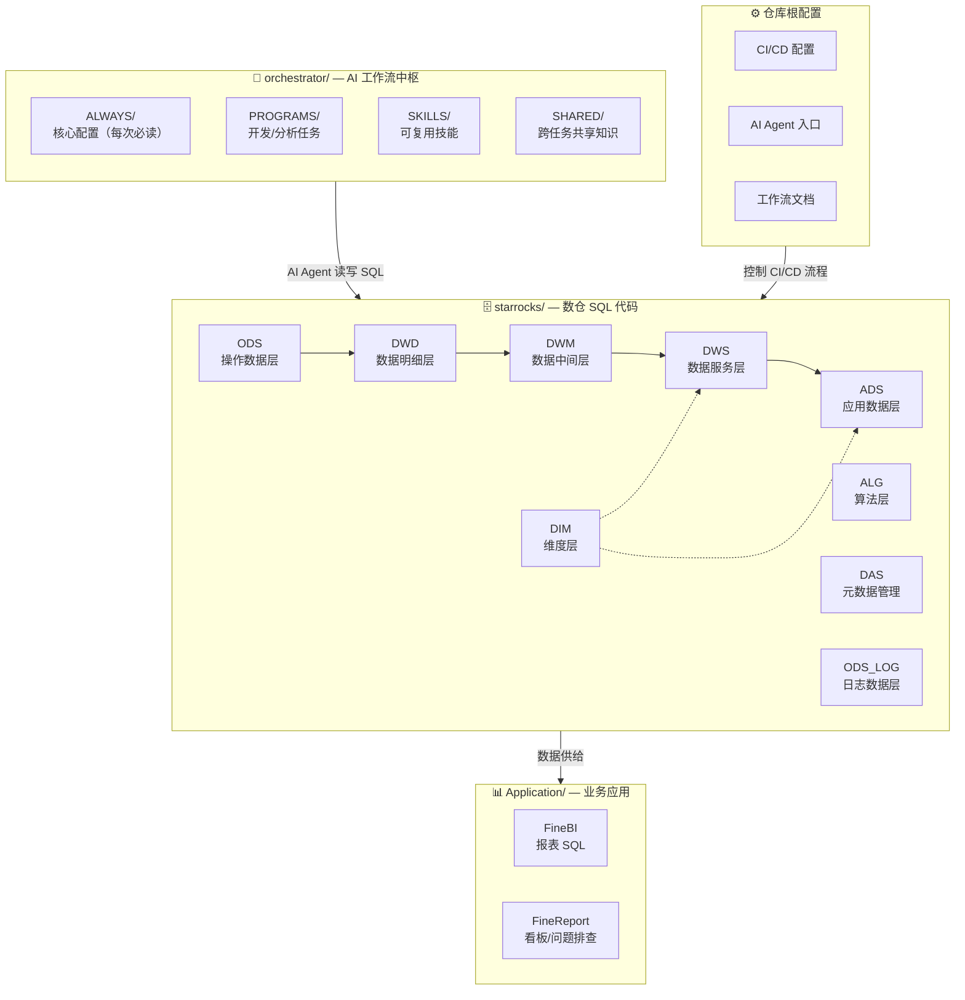
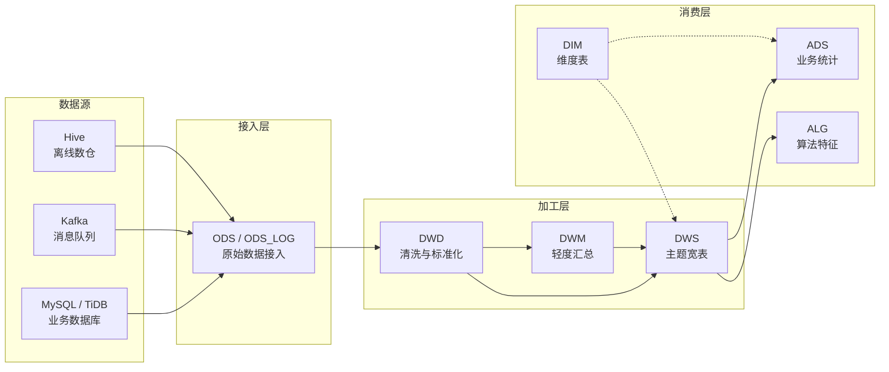
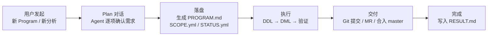

本文档为你提供 kunlun-dolphinscheduler 数据仓库项目的全貌认知。读完后你将清楚了解：项目由哪些目录和文件构成、各目录的职责边界、以及它们之间如何协作。如果你是一名刚接触本仓库的开发者，这篇文档就是你阅读代码的"地图"。

Sources: [CLAUDE.md](CLAUDE.md#L1-L5)

## 五分钟俯瞰：四层结构，一张图

先通过下面的全景图建立直觉——仓库被自然地划分为四个核心区域：



这张图揭示了一个关键设计理念：**orchestrator 管流程，starrocks 管数据，Application 管业务呈现**。三者在物理目录上分离，在逻辑上通过 AI Agent 的 Program 机制串联。

Sources: [RESOURCE-MAP.yml](orchestrator/ALWAYS/RESOURCE-MAP.yml#L1-L10)

---

## 区域一：`starrocks/` — 数仓代码核心

`starrocks/` 是本仓库最大的代码区，承载了所有数据表的结构定义（DDL）和数据加工逻辑（DML）。它遵循经典的**分层数仓架构**，每一层有明确的职责边界和数据流转方向。

### 数据分层一览

| 分层 | 目录路径 | 职责 | 数据特征 | 典型表名示例 |
|------|----------|------|----------|-------------|
| **ODS** | `starrocks/ods/` | 操作数据层 — 从业务系统（MySQL、TiDB、Hive、Kafka）接入原始数据 | 与源系统结构 1:1 对应，仅做最低限度的类型兼容 | `ods_tidb_readernovel_tidb_tag_center_book` |
| **ODS_LOG** | `starrocks/ods_log/` | 日志数据层 — 接入埋点日志、传感器事件、Kafka 消息 | 仅含 DDL，以 `_view` 视图为主 | `ods_sensors_cd_video_startwatching` |
| **DWD** | `starrocks/dwd/` | 数据明细层 — 清洗、标准化、脱敏、统一编码 | 明细粒度保留，但已完成字段映射和口径统一 | `dwd_trade_user_payorder` |
| **DWM** | `starrocks/dwm/` | 数据中间层 — 轻度汇总，服务于跨域指标计算 | 部分聚合，降低下游 join 复杂度 | `dwm_consume_user_consume_mild_ed` |
| **DWS** | `starrocks/dws/` | 数据服务层 — 主题宽表，面向特定分析主题整合多源数据 | 宽表，以 `_ed`（增量）、`_a`（累计）、`_di`（日增量）后缀区分周期 | `dws_user_wide_active_ed` |
| **ADS** | `starrocks/ads/` | 应用数据层 — 面向业务报表、BI 看板、投放决策 | 高度聚合，直接供给 FineBI/FineReport | `ads_bi_sv_recharge_user_detail_di` |
| **DIM** | `starrocks/dim/` | 维度层 — 维度表，包含用户信息、书籍信息、国家字典、账户映射等 | 缓慢变化维度（SCD），以 `_da`（全量快照）为主 | `dim_user_all_info`、`dim_country_dic` |
| **ALG** | `starrocks/alg/` | 算法层 — 推荐算法特征工程、样本数据、排序模型输入 | 包含 itemCF、用户画像向量、DNN 特征宽表 | `alg_short_video_itemcf_reco_list_top100` |
| **DAS** | `starrocks/das/` | 元数据管理工具 — 表结构统计、资源消耗监控、表变更通知 | 运维辅助性质，独立于主数据流 | `P_das_dict_table`、`P_das_sla_result` |

Sources: [CLAUDE.md](CLAUDE.md#L50-L70) | [RESOURCE-MAP.yml](orchestrator/ALWAYS/RESOURCE-MAP.yml#L29-L67)

### 核心命名约定

每一层的 `ddl/` 和 `dml/` 子目录遵循严格的命名规范，这让你无需打开文件就能大致判断文件的用途：

- **DDL 文件**：`{表名}.sql` — 例如 `ods_tidb_readernovel_tidb_tag_center_book.sql`
- **DML 文件**：`P_{表名}.sql` — 例如 `P_dwd_trade_user_payorder.sql`
- **表命名公式**：`{层}_{业务域}_{主题}_{粒度}_{周期}`
  - 周期后缀含义：`di` = 日增量、`hi` = 小时增量、`df` = 全量快照、`ed` = 增量追加

Sources: [RESOURCE-MAP.yml](orchestrator/ALWAYS/RESOURCE-MAP.yml#L70-L76)

### 数据流转路径

下图展示数据在各层之间的典型流转路径：



这条路径并非每个表都完整经历——部分表可能直接从 ODS 跳到 ADS（如简单视图映射），但绝大多数业务统计表都遵循 ODS → DWD → DWS → ADS 的主链路。

Sources: [CLAUDE.md](CLAUDE.md#L5-L8)

> **下一步阅读**：想要深入理解分层设计哲学和数据在每个阶段的具体处理规则，请阅读 [分层设计理念与数据流转](5-fen-ceng-she-ji-li-nian-yu-shu-ju-liu-zhuan)。

---

## 区域二：`orchestrator/` — AI Agent 工作流中枢

如果说 `starrocks/` 是"被操作的数据"，那 `orchestrator/` 就是"操作的规则和状态"。它用**文件驱动**的方式管理 AI Agent 的所有行为：启动流程、任务生命周期、编码规范、可复用技能。

### 子目录职责速览

| 子目录 | 职责 | 何时加载 | 关键文件 |
|--------|------|----------|----------|
| `ALWAYS/` | 核心配置与协议 — AI Agent 每次启动必须读取 | 每次会话启动 | `BOOT.md`（启动序列）、`CORE.md`（工作协议）、`DEV-FLOW.md`（开发流程）、`RESOURCE-MAP.yml`（资源索引） |
| `PROGRAMS/` | 任务管理 — 每个开发/分析任务一个独立目录 | 用户指定 Program 时 | `PROGRAM.md`（任务定义）、`STATUS.yml`（状态跟踪）、`SCOPE.yml`（写入范围） |
| `SKILLS/` | 可复用技能 — 独立的功能模块，可被多个 Program 复用 | 用户触发特定命令时 | `sql-codeformat/`（SQL 格式化）、`dw-generate-dag/`（DAG 自动生成） |
| `SHARED/` | 跨任务共享资源 — 分析标准、知识库 | 分析类 Program 启动时 | `knowledge/数据资产等级划分标准.md` |
| `CORE-PROJ/` | 长期运营项目 — 财务分析等持续性工作 | 按需手动引用 | `财务运营分析支持/README.md` |

Sources: [CLAUDE.md](CLAUDE.md#L50-L75) | [BOOT.md](orchestrator/ALWAYS/BOOT.md#L1-L68)

### Program 生命周期

Program 是本仓库最重要的管理单元——**一切开发或分析工作都以 Program 为单位进行**。它的生命周期如下：



每个 Program 目录（如 `P-20260515-存储治理`）包含四类文件：`PROGRAM.md` 记录任务目标和方案，`STATUS.yml` 追踪当前进度，`SCOPE.yml` 限制写入范围防止误操作，`workspace/` 存放工作文档和中间产物。

Sources: [WORKFLOW.md](WORKFLOW.md#L1-L60) | [CORE.md](orchestrator/ALWAYS/CORE.md#L1-L90)

> **下一步阅读**：了解 Program 的完整生命周期和开发流程细节，请阅读 [Program 生命周期管理](12-program-sheng-ming-zhou-qi-guan-li)。

---

## 区域三：`Application/` — 业务应用层

`Application/` 存放直接服务于业务报表和数据分析的 SQL 文件。与 `starrocks/` 中的 DDL/DML 不同，这里的 SQL 是**面向最终展示**的查询语句，通常直接挂载到 FineBI 或 FineReport 中使用。

```
Application/
├── FineBI/
│   ├── 海剧/                              # 海外短剧业务报表
│   │   ├── 海剧用户留存V6.sql
│   │   ├── 海剧三方支付漏斗链路报表V4.sql
│   │   ├── 收入【海阅+海剧+国剧】V6.sql
│   │   └── ...
│   └── 阅读/                              # 海外阅读业务报表
│       ├── 海阅三方支付漏斗链路报表V3.sql
│       └── 海阅续订.sql
└── FineReport/
    ├── 首页.sql                           # 首页数据看板
    └── 首页数据问题排查sop.sql             # 数据异常排查流程
```

业务域划分清晰：`海剧`（海外短剧）和 `阅读`（海外阅读）是两个独立的分析主题，各自拥有独立的报表集合。FineReport 目录则存放看板 SQL 和数据质量排查 SOP。

Sources: [Application 目录](Application/)

> **下一步阅读**：了解 FineBI 报表和 FineReport 看板的开发方式，请阅读 [FineBI 报表应用开发](20-finebi-bao-biao-ying-yong-kai-fa) 和 [FineReport 数据看板与问题排查](21-finereport-shu-ju-kan-ban-yu-wen-ti-pai-cha)。

---

## 区域四：仓库根目录 — 全局配置与文档

根目录文件数量虽少，但作用关键：

| 文件 | 作用 | 说明 |
|------|------|------|
| `CLAUDE.md` | AI Agent 入口指导 | Agent 启动后第一个读取的文件，定义了项目概述、目录结构、快速命令和状态来源 |
| `AGENTS.md` | AI Agent 入口指导（同步副本） | 与 `CLAUDE.md` 内容保持一致，供不同 Agent 框架读取 |
| `WORKFLOW.md` | 端到端工作流程文档 | 详细描述了"新 Program"、"修改已有表"、"跨会话继续"三个场景的完整行为序列 |
| `CHANGELOG.md` | 变更日志 | 记录仓库级别的版本变更 |
| `.gitlab-ci.yml` | CI/CD 流水线配置 | 定义三个 stage：测试验证 → 自动合并 → 通知 DolphinScheduler |
| `.gitignore` | Git 忽略规则 | 排除不需要版本控制的文件 |

其中 `.gitlab-ci.yml` 的流水线设计值得特别关注：当代码合入 master 分支后，会自动调用 DolphinScheduler API 触发调度系统的 Git 检出，形成 **"代码提交 → CI 验证 → 自动合并 → 调度更新"** 的完整闭环。

Sources: [.gitlab-ci.yml](.gitlab-ci.yml#L1-L86) | [WORKFLOW.md](WORKFLOW.md#L1-L130)

---

## 基础设施全景

仓库依赖的三项基础设施决定了开发方式和能力边界：

| 基础设施 | 类型 | 在项目中的角色 |
|----------|------|---------------|
| **StarRocks 3.2.15** | OLAP 数据库 | 数仓存储与计算引擎，支持 Bitmap 去重、分区表、哈希分布、CTE 复用 |
| **DolphinScheduler** | 调度平台 | ETL 任务编排与定时执行，核心参数 `${dt}`（当前日期）、`${bf_1_dt}`（前一天） |
| **GitLab CI** | CI/CD | 分支校验、自动合并、触发调度系统更新 |

Sources: [RESOURCE-MAP.yml](orchestrator/ALWAYS/RESOURCE-MAP.yml#L78-L97)

---

## 建议阅读路径

根据你的角色和需求，推荐以下阅读顺序：

**如果你是数据开发工程师**（写 SQL、建表、做 ETL）：
1. [分层设计理念与数据流转](5-fen-ceng-she-ji-li-nian-yu-shu-ju-liu-zhuan) — 理解数据在各层之间的变化规则
2. [DDL 与 DML 开发规范](14-ddl-yu-dml-kai-fa-gui-fan) — 掌握 SQL 编码标准
3. [Program 生命周期管理](12-program-sheng-ming-zhou-qi-guan-li) — 学会用 Program 管理开发任务
4. [SQL 编码风格与数据质量兜底](15-sql-bian-ma-feng-ge-yu-shu-ju-zhi-liang-dou-di) — 写出规范且健壮的 SQL

**如果你是数据分析师**（查数据、做报表、看指标）：
1. [ADS 层：面向业务的应用统计](9-ads-ceng-mian-xiang-ye-wu-de-ying-yong-tong-ji) — 了解业务统计表在哪里
2. [FineBI 报表应用开发](20-finebi-bao-biao-ying-yong-kai-fa) — 快速上手 BI 报表
3. [数据资产等级划分与质量治理](22-shu-ju-zi-chan-deng-ji-hua-fen-yu-zhi-liang-zhi-li) — 了解数据可信度

**如果你想了解 AI Agent 工作方式**：
1. [AI Agent 工作流入门](4-ai-agent-gong-zuo-liu-ru-men) — 下一篇文档，理解 Agent 的工作机制
2. [Plan 确认流程与对话协议](13-plan-que-ren-liu-cheng-yu-dui-hua-xie-yi) — 理解 Plan 模式的对话规则