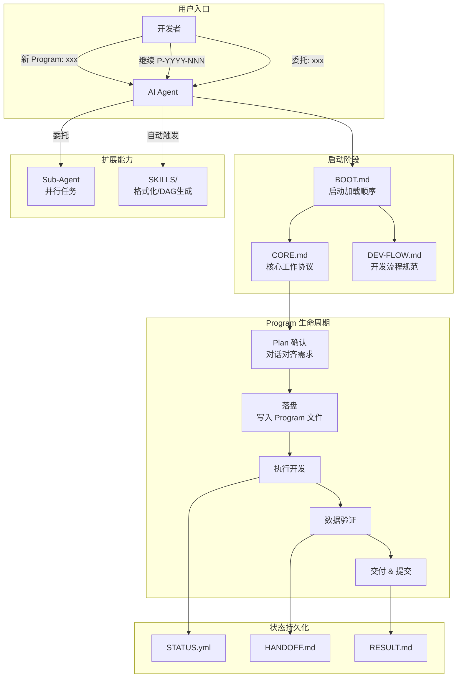
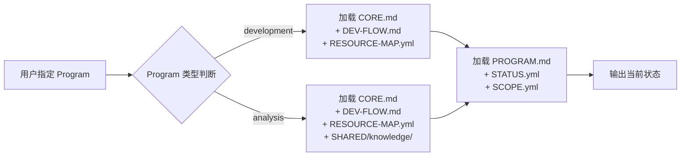
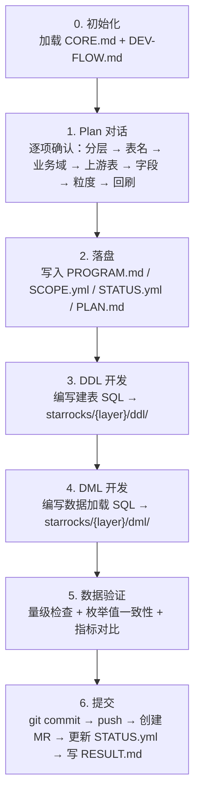
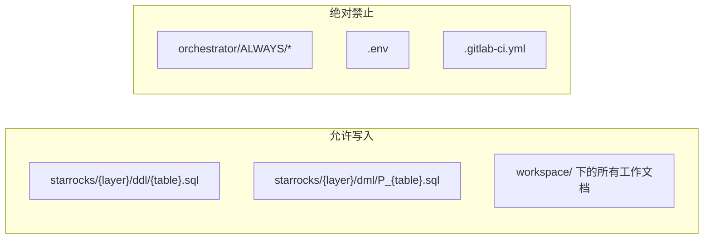

本文档面向刚接触本项目的开发者，系统性地介绍 AI Agent 在本数据仓库项目中的工作方式——从启动、对话确认、任务执行到跨会话恢复的完整流程。读完本文将理解 Agent 如何辅助数仓开发与分析任务，并掌握与 Agent 协作的基本命令。

## 什么是 AI Agent 工作流

本项目的 AI Agent 并非一个简单的"代码补全工具"，而是一个遵循严格协议的数仓工程协作者。它通过**结构化的文件系统**（而非对话记忆）来管理任务状态，通过**Plan 先行**的对话协议来确保需求对齐，通过**Program 生命周期**来规范化从需求到交付的全过程。

下面这张架构图展示了 Agent 工作流的核心参与者和它们的协作关系：



Agent 的核心设计哲学是：**文件即状态，Plan 即契约**。所有任务信息写入文件系统，确保跨会话零信息损失；所有开发动作前必须先完成 Plan 对话确认，确保理解一致后再动手。

Sources: [AGENTS.md](AGENTS.md#L1-L148), [CLAUDE.md](CLAUDE.md#L1-L142)

## 两种 Program 类型

Agent 支持两类任务，它们在启动时通过 `PROGRAM.md` 中的 `type` 字段自动分流：

| 维度 | 开发类（development） | 分析类（analysis） |
|------|----------------------|-------------------|
| **标识命令** | `新 Program: xxx` | `新分析: xxx` |
| **典型场景** | 新建表、修改字段、口径变更、SQL 重构 | 数据资产定级、血缘梳理、质量审计、架构评估 |
| **核心产物** | SQL 文件（DDL + DML），通过 DolphinScheduler 调度执行 | 分析报告、标注清单、结构化数据（CSV/JSON） |
| **Plan 确认项** | 10 项（分层、表名、字段、粒度、回刷等） | 9 项（分析目标、范围、框架、产出物等） |
| **执行阶段** | 5 步：Plan → 编码 → 验证 → 更新 → 交付 | 8 步：Plan → 数据采集 → 小样验证 → 批量执行 → 汇总 → 验证 → 交付 |
| **写入范围** | `starrocks/{layer}/` 下的 DDL/DML | `workspace/`、`scripts/`，默认禁止写 `starrocks/` |

两种类型共用同一套 Program 生命周期框架，但 Plan 确认清单和执行节奏有所不同。Agent 根据 `PROGRAM.md` 中的 `type` 字段自动选择对应的工作流。

Sources: [AGENTS.md](AGENTS.md#L12-L19), [CORE.md](orchestrator/ALWAYS/CORE.md#L5-L102)

## 第一次接触：Boot Sequence

当你在新会话中告诉 Agent 要做什么时，Agent 会执行一套标准化的启动流程。理解这个流程有助于你预期 Agent 的行为：



启动完成后，Agent 会输出一段简短摘要：

```
Program: {名称}
类型: {development / analysis}
目标: {一句话描述}
当前阶段: {阶段名}
下一步: {具体行动}
```

如果用户没有指定 Program，Agent 会扫描 `orchestrator/PROGRAMS/` 目录，展示已有的任务列表并询问要做什么。

Sources: [BOOT.md](orchestrator/ALWAYS/BOOT.md#L1-L90), [AGENTS.md](AGENTS.md#L26-L32)

### 快速命令速查

| 命令 | 说明 |
|------|------|
| `继续 P-YYYY-NNN` | 从上次中断处恢复 Program |
| `新 Program: xxx` | 创建开发类任务，进入 Plan 确认流程 |
| `新分析: xxx` | 创建分析类任务，进入 Plan 确认流程 |
| `保存进度` | 写入 HANDOFF.md 保存当前状态 |
| `委托: xxx` | 将子任务委托给 Sub-Agent 并行执行 |

Sources: [AGENTS.md](AGENTS.md#L131-L138), [WORKFLOW.md](WORKFLOW.md#L1-L130)

## Program 生命周期：从需求到交付

每个 Program 都经历一个结构化的生命周期。以**开发类**最常见的"新建表"场景为例：



**修改已有表**的流程类似，但 Plan 阶段额外关注：读取现有 DDL 确认表结构、评估下游影响、记录口径变更的新旧差异。改表时优先使用 `ALTER TABLE ... ADD COLUMN`，严禁 `DROP + CREATE`（会丢失生产数据）。

**跨会话继续**时，Agent 直接从 `STATUS.yml` 和 `HANDOFF.md` 恢复上下文，无需你重新描述背景。

Sources: [WORKFLOW.md](WORKFLOW.md#L9-L64), [DEV-FLOW.md](orchestrator/ALWAYS/DEV-FLOW.md#L1-L95)

## 核心文件地图

理解下面的目录结构，你就能快速定位任何工作流相关的文件：

```
orchestrator/
├── ALWAYS/                           # 🔴 核心配置（每次会话必读）
│   ├── BOOT.md                       # 启动加载顺序 — Agent 的"开机自检"
│   ├── CORE.md                       # 核心工作协议 — Plan 清单 + 执行原则 + 状态持久化
│   ├── DEV-FLOW.md                   # 数仓开发流程 — DDL/DML 规范 + 分支管理 + Commit 规范
│   ├── RESOURCE-MAP.yml              # 资源索引 — 仓库架构/基础设施/编码规范（只读）
│   ├── SUB-AGENT.md                  # Sub-Agent 规范 — 并行任务委托（按需）
│   ├── PLAN-TEMPLATE.md              # Plan 方案模板 — 开发类用 1-7 章，分析类用 1、4-8 章
│   └── CHANGELOG-SPEC.md             # CHANGELOG 规范 — AI 赋能效率占比记录
│
├── PROGRAMS/                         # 🟢 任务实例
│   ├── _TEMPLATE/                    # 新建 Program 的模板
│   │   ├── PROGRAM.md                # 任务定义（含 type 字段）
│   │   ├── STATUS.yml                # 状态跟踪（阶段 + 任务列表）
│   │   └── SCOPE.yml                 # 写入范围控制
│   └── P-YYYY-NNN-name/              # 每个具体 Program
│       ├── PROGRAM.md
│       ├── STATUS.yml
│       ├── SCOPE.yml
│       └── workspace/                # 工作文档
│           ├── PLAN.md               # 详细方案
│           ├── HANDOFF.md            # 跨会话交接
│           ├── CHECKPOINT.md         # 上下文紧张时快照
│           └── RESULT.md             # 完成时最终总结
│
├── SHARED/                           # 🟡 跨 Program 共享（分析类专用）
│   └── knowledge/                    # 分析规则/标准定义
│
└── SKILLS/                           # 🔵 可复用技能
    ├── sql-codeformat/               # SQL 格式化（自动触发）
    └── dw-generate-dag/              # DolphinScheduler DAG 生成
```

Sources: [AGENTS.md](AGENTS.md#L52-L101), [BOOT.md](orchestrator/ALWAYS/BOOT.md#L1-L90)

## Plan 确认：Agent 如何与你对齐需求

Plan 确认是 Agent 工作流中最关键的环节。在写任何一行代码之前，Agent 必须先与你逐项确认需求细节。这不是走形式——Plan 确认清单中的每一项都可能影响后续的编码决策。

### 开发类确认清单（10 项）

| # | 确认项 | Agent 会做什么 |
|---|--------|---------------|
| 1 | 需求理解 | 用一句话复述你的需求，确保双方理解一致 |
| 2 | 目标层级 | 确认新表/修改表属于 ODS/DWD/DWS/ADS/DIM 哪一层 |
| 3 | 业务域 | 确认归属于哪个业务领域 |
| 4 | 表命名 | 按 `${层}_${业务域}_${主题}_${粒度}_${周期}` 规范生成候选表名 |
| 5 | 上游表 | 扫描 `starrocks/` 目录识别数据来源，读取已有 DDL 作为参考 |
| 6 | 字段清单 | 逐字段确认名称、类型、来源和计算口径 |
| 7 | 粒度 & 周期 | 确认 `di`（日）、`hi`（小时）、`df`（全量快照）、`ed`（增量） |
| 8 | 口径变更 | 如有旧口径改新口径，必须记录新旧差异 |
| 9 | 回刷需求 | 是否需要回刷历史数据及回刷范围 |
| 10 | 下游影响 | 扫描引用此表的 DML，评估影响范围 |

### 分析类确认清单（9 项）

| # | 确认项 | Agent 会做什么 |
|---|--------|---------------|
| 1 | 分析目标 | 明确要回答什么问题或达成什么结论 |
| 2 | 分析范围 | 哪些 schema/表/对象，包含/排除条件 |
| 3 | 评估框架 | 引用 `SHARED/knowledge/` 中的规则，规则不存在则先结构化定义 |
| 4 | 数据采集 | 需要哪些数据、如何获取 |
| 5 | 分析粒度 | 逐表 / 按业务域 / 按分层 / 跨表对比 |
| 6 | 产出物 | 交付什么、格式是什么 |
| 7 | 小样验证 | 选取哪几个对象试跑，验证标准是什么 |
| 8 | 验证标准 | 覆盖率、一致性、可复现性 |
| 9 | 后续动作 | 分析结果是否落盘、是否触发后续 Program |

确认完成后，Agent 将内容写入 `PROGRAM.md`、`SCOPE.yml`、`STATUS.yml` 和 `workspace/PLAN.md`，**你必须确认文件内容无误后，Agent 才开始编码**。这是整个工作流中最重要的"刹车点"。

Sources: [CORE.md](orchestrator/ALWAYS/CORE.md#L5-L102), [PLAN-TEMPLATE.md](orchestrator/ALWAYS/PLAN-TEMPLATE.md#L1-L179)

## 状态管理：跨会话不丢失上下文

Agent 的上下文窗口有限，大型任务必然跨越多次会话。本项目通过三份文件实现跨会话零信息损失：

| 文件 | 写入时机 | 内容 |
|------|---------|------|
| `STATUS.yml` | 持续更新 | 当前阶段（phase）、各任务状态（pending/in-progress/done/blocked）、产物清单 |
| `HANDOFF.md` | 会话结束未完成时 | 当前进度、关键决策、口径变更记录、明确的下一步操作 |
| `CHECKPOINT.md` | 上下文紧张时 | 工作快照——目标、已完成、进行中（含进度百分比）、卡点 |

当你说"保存进度"时，Agent 会执行：commit 当前变更 → 更新 `STATUS.yml` → 写入 `HANDOFF.md`。下次新会话中说"继续 P-YYYY-NNN"，Agent 就能无缝恢复。

HANDOFF 文件的规范结构确保了信息传递的完整性——它不仅记录"做了什么"，更记录"为什么这样做"和"接下来该做什么"。例如口径变更记录格式为：`{字段名}: 旧={来源A} → 新={来源B}`。

Sources: [CORE.md](orchestrator/ALWAYS/CORE.md#L104-L179), [WORKFLOW.md](WORKFLOW.md#L90-L103)

## Scope 控制：Agent 的"安全围栏"

每个 Program 都有一个 `SCOPE.yml` 文件，明确规定了 Agent 的写入边界：



**核心原则**：Agent 只修改 `SCOPE.yml` 中 `write` 允许的路径。超出范围时必须先询问你。分析类 Program 默认**不允许修改 `starrocks/` 下的 SQL 文件**，除非 `SCOPE.yml` 明确授权。这一机制防止 Agent 在你不注意时"越界"修改关键配置或生产代码。

Sources: [CORE.md](orchestrator/ALWAYS/CORE.md#L48-L55), [SCOPE.yml](orchestrator/PROGRAMS/_TEMPLATE/SCOPE.yml#L1-L44)

## Sub-Agent 委托：并行任务执行

当任务量大、可以并行处理时，你可以使用"委托"机制让多个 Sub-Agent 同时工作。Sub-Agent 之间通过**文件**通信，而非对话——这保护了主 Agent 的上下文窗口不被大段代码和报告撑满。

Sub-Agent 返回给主 Agent 的只有 4 行摘要：

```
状态：已完成 / 失败 / 需要决策
报告：workspace/X.Y-xxx.md
产出：N 个文件（列出路径）
决策点：[如有，一句话描述]
```

任务编号遵循 `X.Y` 格式：相同 `X` 的任务可并行执行，`X` 递增表示串行依赖。主 Agent 产出（规划、决策）编号为 `X.0`。

**注意**：Sub-Agent 委托仅在用户明确说"委托"时才启用，Agent 不会主动发起委托。这是为了确保你始终掌握任务拆分和并行化的决策权。

Sources: [SUB-AGENT.md](orchestrator/ALWAYS/SUB-AGENT.md#L1-L81)

## 内置技能：自动触发的工具链

Agent 在特定场景下会自动激活内置技能，无需手动调用：

| 触发条件 | 技能 | 作用 |
|---------|------|------|
| "规范化 xxx.sql" / "格式化 xxx.sql" | `sql-codeformat` | 自动选择对应脚本格式化 DDL/DML/FineBI 文件 |
| DDL 文件 | `format_starrocks_create_table.py` | 按规范格式化建表语句 |
| DML 文件 | `format_starrocks_insert_select.py` | 按规范格式化数据加载语句 |
| 需要生成调度配置 | `dw-generate-dag` | 生成 DolphinScheduler DAG JSON |

技能目录位于 `orchestrator/SKILLS/`，每个技能包含 `SKILL.md`（规范说明）、`scripts/`（可执行脚本）和 `references/`（参考文档）。

Sources: [AGENTS.md](AGENTS.md#L139-L142)

## 阅读建议

理解 AI Agent 工作流后，建议按以下顺序继续深入：

1. **[仓库结构总览](3-cang-ku-jie-gou-zong-lan)** — 了解项目整体目录布局与各层职责
2. **[Program 生命周期管理](12-program-sheng-ming-zhou-qi-guan-li)** — 深入学习 Program 从创建到交付的完整管理流程
3. **[Plan 确认流程与对话协议](13-plan-que-ren-liu-cheng-yu-dui-hua-xie-yi)** — 掌握 Plan 对话的细节和最佳实践
4. **[DDL 与 DML 开发规范](14-ddl-yu-dml-kai-fa-gui-fan)** — 理解 Agent 编写 SQL 时遵循的编码标准
5. **[跨会话上下文管理与 HANDOFF 机制](19-kua-hui-hua-shang-xia-wen-guan-li-yu-handoff-ji-zhi)** — 深入理解状态持久化与跨会话恢复
6. **[SQL 代码格式化技能](17-sql-dai-ma-ge-shi-hua-ji-neng)** — 了解自动格式化技能的详细用法

如果你是开发类任务的新手，建议从第 1、2、3 项开始；如果你主要做数据分析，可以在第 2、3 项之后直接跳到分析类 Program 的具体案例。