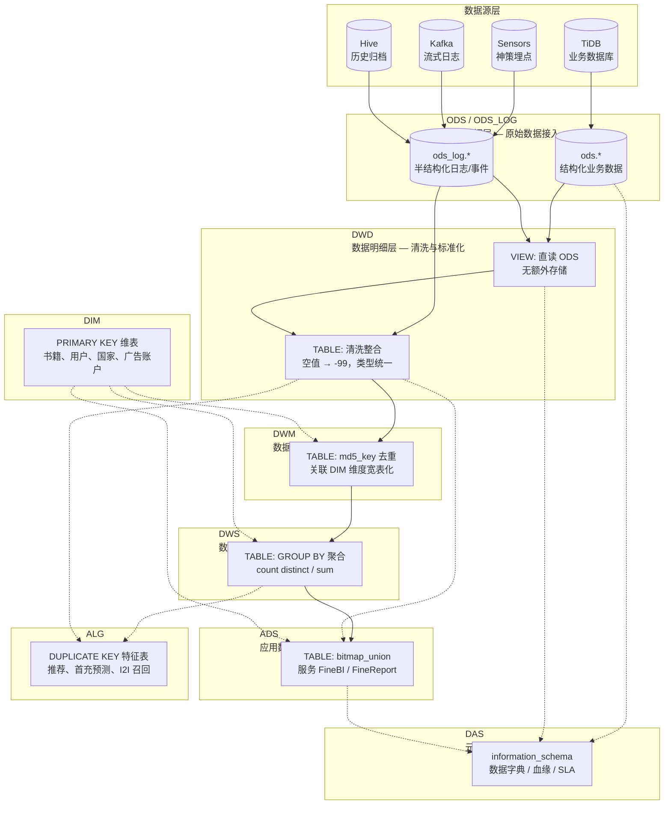
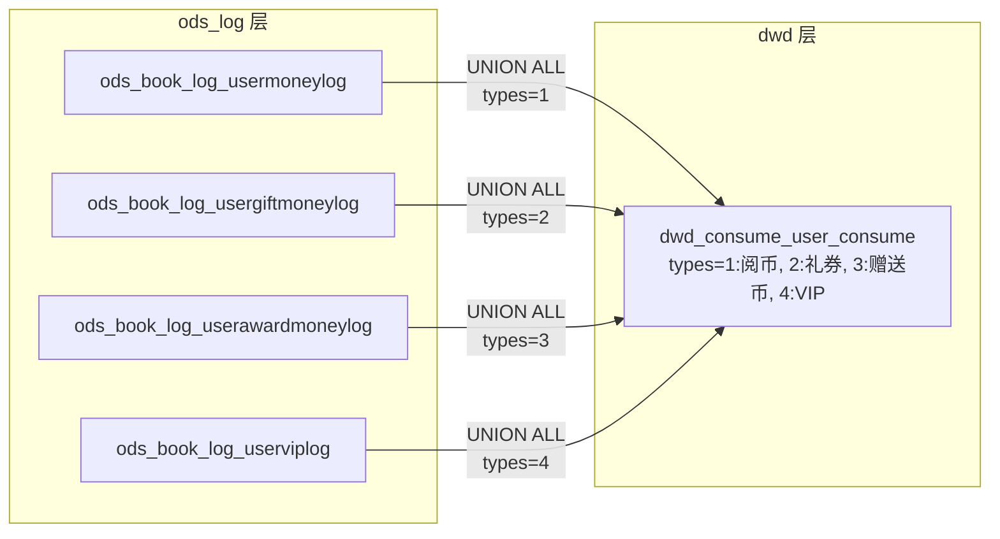
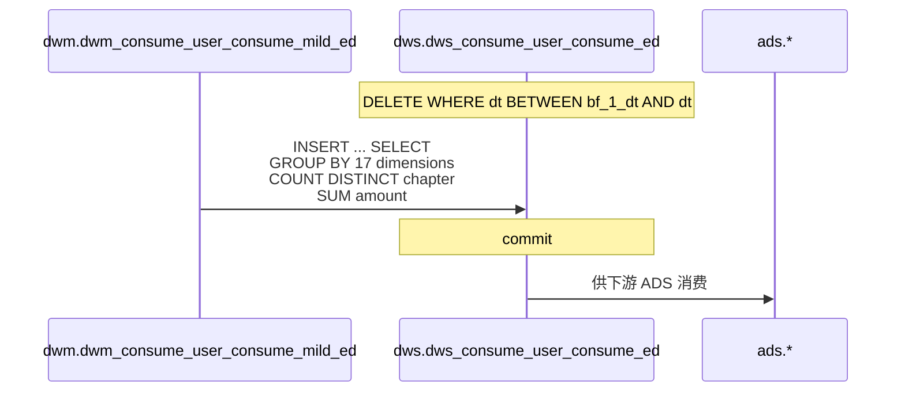
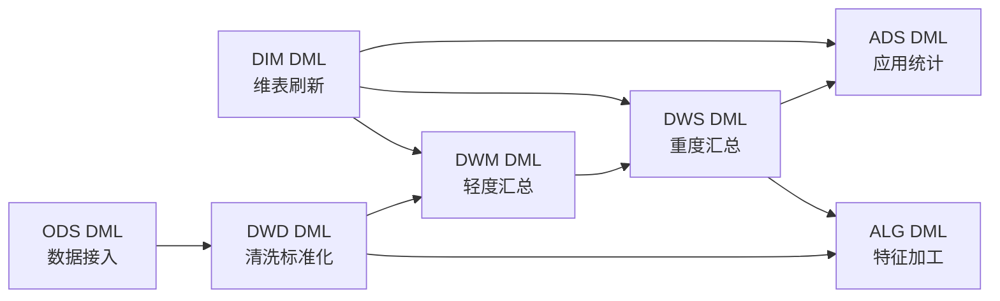

本文档深入解析本数仓项目的分层架构设计哲学，阐明各层的职责边界、数据流转路径以及层间协作模式。本文属于 **Deep Dive** 系列的核心篇章，建议在阅读《仓库结构总览》后继续。

Sources: [CLAUDE.md](CLAUDE.md#L1-L16)

---

## 分层架构全景

本数仓采用经典的分层架构，在 StarRocks 3.2.15 上构建了 **七层一辅** 的数据体系。每一层承载明确的工程职责，层级之间遵循严格的单向依赖原则——数据从上游向下游流动，下游不反向写入上游。

每一层的数据表遵循统一的命名规范 `{层}_{业务域}_{主题}_{粒度}_{周期}`，其中周期后缀 `di` 代表日增量、`hi` 代表小时增量、`df` 代表全量快照、`ed` 代表日汇总。这种命名规范使开发者无需查阅 DDL 即可推断表的基本性质。

Sources: [CLAUDE.md](CLAUDE.md#L25-L45) | [starrocks/das/P_das_dict_table.sql](starrocks/das/P_das_dict_table.sql#L22-L28)

---

## 各层职责详解

### ODS 层（Operational Data Store）— 原始数据的一比一镜像

ODS 层是整个数仓的"地基"，其核心设计原则是**保持与源系统结构一致，不做业务逻辑转换**。该层又细分为两个子层：

| 子层 | 数据库 | 数据来源 | 典型表名模式 | 数据特征 |
|------|--------|----------|-------------|---------|
| `ods` | `ods.*` | TiDB 业务库 | `ods_tidb_{db}_{table}` | 结构化表，PRIMARY KEY 模型 |
| `ods_log` | `ods_log.*` | Sensors / Kafka / Hive | `ods_sensors_{event}` / `ods_hive_{source}` | 半结构化事件/日志 |

ODS 层的 DDL 直接复刻源系统的字段名与类型（如 TiDB 的 `bigint(20)`、`varchar` 等），并追加 `sr_createtime` 和 `sr_updatetime` 两个 StarRocks 专属的审计字段。DML 则执行轻量级的数据搬运——从外部表（Hive/Kafka）或 CDC 同步链路写入 StarRocks，仅做必要的字段投射（`COALESCE`、`from_unixtime` 时间戳转换等）。

举个例子，TiDB 中 `tag_center_book` 表的 ODS 层建表语句完整保留了源库的 `BookId`、`LangId`、`BookNature`、`Channel` 等 30+ 个原始字段，不做任何语义层加工：

Sources: [starrocks/ods/ddl/ods_tidb_readernovel_tidb_tag_center_book.sql](starrocks/ods/ddl/ods_tidb_readernovel_tidb_tag_center_book.sql#L1-L50) | [starrocks/ods/dml/P_ods_sensors_production_element_click.sql](starrocks/ods/dml/P_ods_sensors_production_element_click.sql#L10-L12)

### DWD 层（Data Warehouse Detail）— 清洗、标准化与业务打标

DWD 层是数据"变得可用"的分水岭。该层的核心职责是：

1. **空值标准化**：将源系统中的 `NULL`、空字符串统一替换为哨兵值 `-99`，确保 BI 层聚合不出错
2. **类型统一**：将分散在多个源头（如阅币消费、礼券消费、赠送币消费、VIP 消费）的同类数据通过 `UNION ALL` 整合，并用 `types` 字段区分来源
3. **字段语义化**：将源系统的技术字段（如 `ChapterIds` JSON 数组）解析为有意义的指标（如通过 `LENGTH` 计算章节数）

DWD 层采用 **VIEW + TABLE 混合模式**。对于传感器埋点数据，DWD 创建 `*_view` 视图直接映射到 `ods_log` 表以节省存储；对于需要多源整合的业务数据，DWD 创建物理表并通过 DML 执行清洗逻辑：

这种多路归并模式使得下游只需查询一张 DWD 表即可获取完整消费数据，而不必关心底层源表的分散结构。

Sources: [starrocks/dwd/dml/P_dwd_consume_user_consume.sql](starrocks/dwd/dml/P_dwd_consume_user_consume.sql#L11-L104) | [starrocks/dwd/ddl/dwd_sensors_cd_video_startwatching_view.sql](starrocks/dwd/ddl/dwd_sensors_cd_video_startwatching_view.sql#L1-L4)

### DWM 层（Data Warehouse Middle）— 轻度汇总与维度富化

DWM 层介于明细与重度汇总之间，解决两个核心问题：**去重**与**维度宽表化**。

DWM 表的关键设计特征是引入 `md5_key` 字段作为去重主键——将多个维度字段拼接后取 MD5 值，配合 StarRocks 的 PRIMARY KEY 模型实现幂等写入。同时，DWM 层开始关联 DIM 维表，将用户画像（注册时间、语言偏好、性别、负向用户标记等）和书籍属性带入数据流。

以 `dwm_consume_user_consume_mild_ed` 为例，它在 DWD 消费明细的基础上，关联了用户维度信息（`corever`、`current_language`、`reg_country`、`sex` 等 20+ 个属性字段），并将章节消费拆分为单条记录（`Chapter_id`），为后续的 DWS 汇总提供标准化的输入：

Sources: [starrocks/dwm/ddl/dwm_consume_user_consume_mild_ed.sql](starrocks/dwm/ddl/dwm_consume_user_consume_mild_ed.sql#L1-L59)

### DWS 层（Data Warehouse Service）— 重度汇总与宽表构建

DWS 层是数仓的"汇总引擎"，它从 DWM 层读取轻度汇总数据，执行 `GROUP BY` + `COUNT DISTINCT` + `SUM` 逻辑，产出面向特定主题的日汇总宽表。

DWS 层的命名后缀以 `ed`（each day 汇总）为主，其 DML 遵循 **DELETE + INSERT** 的幂等覆写模式——先删除目标分区数据，再从上游按日重新聚合写入。这保证了调度重跑时的数据一致性：

DWS 层还承载"宽表"构建角色——将用户活跃、消费、充值、阅读行为等多主题数据汇聚为 `dws_user_wide_active_ed`、`dws_wide_user_read_user_label_info_ed` 等跨域宽表，大幅减少 BI 报表的 JOIN 复杂度。

Sources: [starrocks/dws/dml/P_dws_consume_user_consume_ed.sql](starrocks/dws/dml/P_dws_consume_user_consume_ed.sql#L11-L70) | [starrocks/dws/ddl/dws_consume_user_consume_ed.sql](starrocks/dws/ddl/dws_consume_user_consume_ed.sql#L1-L48)

### ADS 层（Application Data Service）— 面向业务的应用统计

ADS 层是数仓的最终"交付层"，直接服务于 FineBI 报表和 FineReport 数据看板。其核心特征包括：

- **BITMAP 聚合**：对用户 ID 使用 `bitmap_union(to_bitmap(user_id))` 实现高性能的去重用户计数，避免 `COUNT DISTINCT` 带来的性能瓶颈
- **月分区策略**：ADS 表通常采用月粒度分区（`PARTITION BY RANGE(dt)`，`dynamic_partition.time_unit = "month"`），与 BI 报表的月度查询模式对齐
- **业务口径固化**：将 DWS 层的汇总数据按 BI 报表所需维度（产品、语言、平台、新老用户等）进行最终切割——例如 `ads_report_user_dau_ed` 从 `dws_user_wide_active_ed` 读取，按 10 个维度分组，产出可直接用于看板的日活指标：

ADS 层的 DML 同样遵循先删后插的幂等模式：`DELETE FROM ads.{table} WHERE dt = '${bf_1_dt}'` → `INSERT INTO ads.{table} SELECT ... FROM dws.{table}`。

Sources: [starrocks/ads/dml/P_ads_report_user_dau_ed.sql](starrocks/ads/dml/P_ads_report_user_dau_ed.sql#L8-L33) | [starrocks/ads/ddl/ads_report_user_dau_ed.sql](starrocks/ads/ddl/ads_report_user_dau_ed.sql#L1-L113)

### DIM 层（Dimension）— 维度建模与维表管理

DIM 层独立于数据流转的主链路，但通过层间 JOIN 贯穿数仓的各个环节。维表使用 StarRocks 的 PRIMARY KEY 模型，以业务主键（如 `product_id + book_id`、`user_id` 等）作为去重键。

DIM 层覆盖的维度域包括：

| 维表类别 | 典型表名 | 更新周期 |
|---------|---------|---------|
| 书籍维度 | `dim_book_author`、`dim_book_chapter_info`、`dim_novel_book_info_view` | 日/周 |
| 用户维度 | `dim_user_all_info`、`dim_user_corever`、`dim_user_sv_userinfo_f` | 日 |
| 广告维度 | `dim_ad_account`、`dim_optimizergroups`、`dim_FbAccount_view` | 日 |
| 地理维度 | `dim_country_dic`、`dim_countrylevel` | 静态/月 |
| 业务配置 | `dim_tag_center_activity_da`、`dim_sv_strategy_info` | 准实时/日 |

维表在 DWM 层开始被关联使用，在 DWS 和 ADS 层持续发挥维度富化作用。这一设计遵循 Kimball 维度建模的理念：事实表存储度量，维表存储上下文。

Sources: [starrocks/dim/ddl/dim_book_author.sql](starrocks/dim/ddl/dim_book_author.sql#L1-L20) | [starrocks/dim/dml/P_dim_book_author.sql](starrocks/dim/dml/P_dim_book_author.sql)

### ALG 层（Algorithm）— 算法特征工程与推荐数据

ALG 层是与主数据流并行的一条专门链路，服务于推荐系统和机器学习模型。该层大多使用 StarRocks 的 **DUPLICATE KEY** 模型（允许重复行），存储算法特征和推荐候选集。

其核心数据产品包括：

- **特征工程**：`alg_book_feature`（书籍多窗口特征）、`alg_user_first_pay_feature_1d`（首充特征）、`alg_short_video_user_feature_di`（短视频用户特征）
- **召回候选**：`alg_short_video_itemcf_reco_list_top100`（ItemCF 协同过滤 TOP100）、`alg_short_video_tag_reco_list`（标签召回）
- **排序数据**：`alg_short_video_series_country_rank`（国家榜）、`alg_short_video_hot_list`（热榜）
- **样本数据**：`alg_sample_xgb_cnxh_v1`（XGBoost 训练样本）、`alg_novel_repay_sample_feature`（复充样本）

ALG 层的数据源主要来自 DWS 层的用户行为汇总表和 DWD 层的明细交互记录，通过 DML 定时加工特征并写回 ALG 表，供线上推荐服务消费。

Sources: [starrocks/alg/ddl/alg_book_feature.sql](starrocks/alg/ddl/alg_book_feature.sql#L1-L45)

---

## 数据流转核心路径

### 主流转路径：ODS → DWD → DWM → DWS → ADS

这是数仓中最标准、最频繁的数据流转路径，覆盖了从原始数据到 BI 看板的完整旅程。以下以"用户消费统计"主题为例，展示数据如何在各层间逐步精炼：

| 阶段 | 层 | 表名 | 数据形态 | 关键操作 |
|------|---|------|---------|---------|
| 1 | ODS_LOG | `ods_book_log_usermoneylog` 等 4 表 | 原始日志：NULL、空字符串、JSON | 无 |
| 2 | DWD | `dwd_consume_user_consume` | 清洗后明细：NULL→-99，4 源 UNION | `if(UserId is null, -99, UserId)` |
| 3 | DWM | `dwm_consume_user_consume_mild_ed` | 轻度汇总 + 维度富化 | 关联 DIM 用户属性，章节拆行 |
| 4 | DWS | `dws_consume_user_consume_ed` | 日粒度汇总 | `GROUP BY` 17 维 + `COUNT DISTINCT` 章节 + `SUM` 金额 |
| 5 | ADS | 各类 BI 报表表 | 面向看板的最终指标 | `bitmap_union` 去重用户，维度切割 |

每一步都使数据更"聚合"、更"业务化"，最终在 ADS 层达到可直接被 BI 工具消费的形态。

### 旁路路径：DWD/DWS → ALG

算法层的数据并不经过完整的 DWM→DWS 链，而是从 DWD（明细交互日志）和 DWS（行为汇总）直接提取特征。例如 `alg_book_feature` 从多个 DWS 表中提取书籍的 1d/3d/7d/30d 多窗口阅读和消费指标，构建为模型可消费的特征向量。

### 维表渗透路径：DIM → DWM/DWS/ADS

DIM 维表在所有汇总层（DWM、DWS、ADS）的 DML 中通过 JOIN 被引用，将业务主键（`book_id`、`user_id`）翻译为可读的属性（书名、作者、用户注册国家、语言偏好）。维表不参与主数据流，但在每一层汇总时"渗透"进入数据，起到关键的语义增强作用。

Sources: [starrocks/dws/dml/P_dws_consume_user_consume_ed.sql](starrocks/dws/dml/P_dws_consume_user_consume_ed.sql#L11-L70) | [starrocks/ads/dml/P_ads_report_user_dau_ed.sql](starrocks/ads/dml/P_ads_report_user_dau_ed.sql#L11-L33)

---

## 层间调度与依赖

全部 DDL 和 DML 通过 **DolphinScheduler** 编排执行。DML 文件中使用的变量 `${dt}`（当前调度日期）和 `${bf_1_dt}`（T-1 日期）由 DolphinScheduler 在运行时注入。

调度依赖遵循分层顺序：

每张表的 DML 头部注释记录了其在 DolphinScheduler 中的 `workflow_name`、`task_name` 和 `sql_path`，便于开发者追溯调度链路。DAS 层的元数据工具会采集 `information_schema.tables` 中的建表信息，自动构建数据字典和表级血缘，辅助调度依赖的正确配置。

Sources: [starrocks/dwd/dml/P_dwd_consume_user_consume.sql](starrocks/dwd/dml/P_dwd_consume_user_consume.sql#L1-L10) | [starrocks/das/P_das_dict_table.sql](starrocks/das/P_das_dict_table.sql#L22-L28)

---

## StarRocks 表模型选择策略

不同层级选择了不同的 StarRocks 表模型，反映了各层对数据更新和查询模式的需求差异：

| 模型 | 适用层 | 原因 |
|------|--------|------|
| **PRIMARY KEY** | ODS、DWD、DWM、DWS、DIM、ADS | 需要幂等更新（DELETE+INSERT 覆写），需要唯一键约束 |
| **DUPLICATE KEY** | ALG | 允许重复行，特征数据多为追加写入，无需去重 |
| **VIEW** | DWD（部分） | 传感器埋点数据量大，VIEW 零存储开销，直接透传 ODS_LOG |

在存储优化方面，所有层统一使用 `LZ4` 压缩、`replicated_storage = true` 和 `enable_persistent_index = true`，平衡了查询性能和存储成本。

Sources: [starrocks/dws/ddl/dws_consume_user_consume_ed.sql](starrocks/dws/ddl/dws_consume_user_consume_ed.sql#L35-L48) | [starrocks/alg/ddl/alg_book_feature.sql](starrocks/alg/ddl/alg_book_feature.sql#L35-L45)

---

## 设计哲学总结

本数仓的分层设计遵循以下核心原则：

1. **单向依赖**：数据只能从上游流向下游（ODS→DWD→DWM→DWS→ADS），不允许反向写入或跨层调用，保证数据血缘的清晰可追溯
2. **逐层精炼**：从原始数据到最终 BI 指标，数据经历「原始→清洗→富化→汇总→应用」的渐进式加工，每层只做该层该做的事
3. **幂等优先**：所有 DML 采用 DELETE+INSERT 模式，任何任务重跑都不会产生重复数据
4. **维表分离**：DIM 层作为独立维度层，不与事实表耦合，支持维度属性的独立更新和历史追踪
5. **算法独立**：ALG 层与 BI 主链路并行，二者的数据加工节奏和 SLA 要求不同，互不干扰

理解这套分层体系后，建议继续阅读后续各层的专题文档，深入掌握每层的具体开发规范。

---

## 阅读建议

- 已完成：**[分层设计理念与数据流转](5-fen-ceng-she-ji-li-nian-yu-shu-ju-liu-zhuan)** ← 当前页面
- 下一步：**[ODS 层：原始数据接入](6-ods-ceng-yuan-shi-shu-ju-jie-ru)** — 深入 ODS 层的数据源接入方式和表模型选择
- 进阶：**[DWD 层：明细数据清洗与标准化](7-dwd-ceng-ming-xi-shu-ju-qing-xi-yu-biao-zhun-hua)** — 掌握 DWD 层的清洗规则和多源整合模式
- 进阶：**[DWM 与 DWS 层：汇总与宽表构建](8-dwm-yu-dws-ceng-hui-zong-yu-kuan-biao-gou-jian)** — 理解汇总层的设计模式和宽表策略
- 参考：**[StarRocks 表模型与分区策略](28-starrocks-biao-mo-xing-yu-fen-qu-ce-lue)** — 了解 PRIMARY KEY / DUPLICATE KEY 模型的技术细节