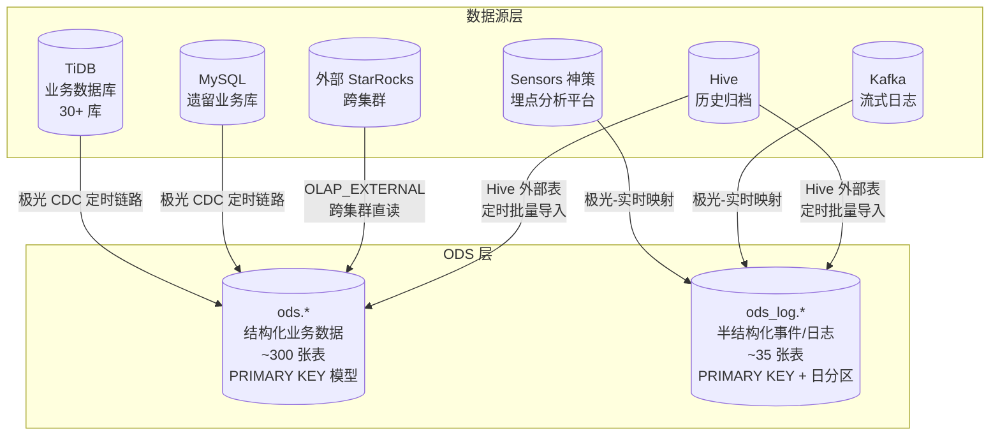
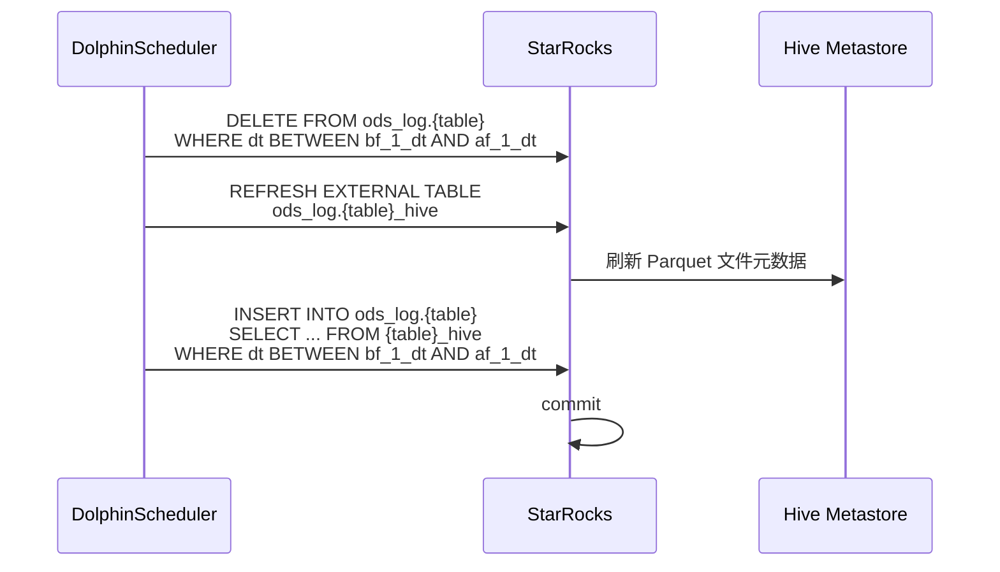
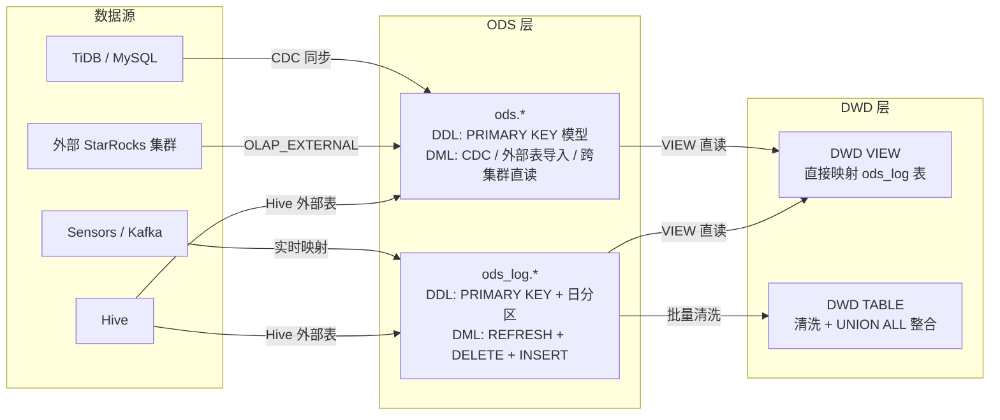

ODS（Operational Data Store）层是整个数仓架构的**数据入口层**，承担将外部异构数据源一比一映射到 StarRocks 的职责。它的设计哲学是"忠于源头、不做加工"——ODS 表结构完整复刻源系统的字段名、类型与语义，确保数据在进入数仓治理体系之前具备完整、可追溯的原始形态。ODS 层是数仓的"地基"，其质量直接决定下游 DWD、DWM、DWS 乃至 ADS 所有层级的数据可信度。

Sources: [CLAUDE.md](CLAUDE.md#L25-L28)

---

## 双层子结构：`ods` 与 `ods_log`

ODS 层依据数据的**结构化程度与存储特征**，划分为两个独立的 StarRocks 数据库（Schema）。这种分离不仅仅是物理隔离，更体现了两类数据在分区策略、表模型和生命周期管理上的本质差异。

| 维度 | `ods` | `ods_log` |
|------|-------|-----------|
| **数据来源** | TiDB 业务库、MySQL 遗留库、外部 StarRocks 集群 | Sensors（神策）埋点、Kafka 流式日志、Hive 历史归档 |
| **数据形态** | 结构化业务实体（用户、订单、书籍、广告账户） | 半结构化事件/日志（点击、曝光、推荐回执、阅读行为） |
| **表模型** | PRIMARY KEY（以业务主键为去重键） | PRIMARY KEY（以 `dt + id` 复合键为去重键） |
| **分区策略** | 多数不分区，少数按需分区 | 统一使用 `PARTITION BY RANGE(dt)` + 动态分区（DAY 粒度） |
| **典型行数** | 百万～千万级 | 亿级（日志/事件流） |
| **副本数** | `replication_num = 3`（高可靠性） | `replication_num = 2`（日志数据容许降级） |
| **核心审计字段** | `sr_createtime`、`sr_updatetime` | `dt`（分区日期）、`etl_tm`（清洗时间） |
| **采集工具** | 极光-定时链路（CDC 同步） | 极光-实时映射 / Hive 外部表导入 |

下图展示了 ODS 层的双层结构与数据源之间的映射关系：



Sources: [starrocks/ods/ddl/ods_tidb_short_video_accountinfo.sql](starrocks/ods/ddl/ods_tidb_short_video_accountinfo.sql#L1-L7) | [starrocks/ods_log/ddl/ods_sensors_production_adshow.sql](starrocks/ods_log/ddl/ods_sensors_production_adshow.sql#L1-L10) | [starrocks/ods/ddl/ods_alg_log_full_hive.sql](starrocks/ods/ddl/ods_alg_log_full_hive.sql#L1-L22)

---

## 命名规范：从表名解码数据溯源

ODS 层的表命名遵循严格的**三段式或四段式**模式，使开发者无需查阅 DDL 即可推断数据的来源系统与归属业务域：

```
ods_{数据源类型}_{数据库名}_{源表名}_{可选_后缀}
```

| 命名模式 | 示例 | 含义 |
|---------|------|------|
| `ods_tidb_{db}_{table}` | `ods_tidb_readernovel_tidb_tag_center_book` | 来自 TiDB `readernovel` 库的 `tag_center_book` 表 |
| `ods_tidb_{db}_{table}_external` | `ods_tidb_FbAdRoiInstallReferrerDc_external` | 跨集群外部表，读取远程 StarRocks 集群数据 |
| `ods_sensors_{event}` | `ods_sensors_production_element_click` | Sensors 埋点事件，对应 `element_click` 事件 |
| `ods_hive_{source}` | `ods_hive_reco_book_log_hive` | Hive 历史数据，来自推荐书单日志 |
| `ods_kafka_{topic}` | `ods_kafka_alg_log_book_reco` | Kafka 流式日志，来自算法推荐回执 Topic |
| `ods_mysql_{db}_{table}` | `ods_mysql_Fmx_Book` | MySQL `Fmx` 库的 `Book` 表 |
| `ods_{business}_{detail}` | `ods_cdmoney_report_tidb_cn_dispute_antom` | 特定业务域（CDMoney 财务）的争议数据 |

**`_external` 后缀**表示该表为 `ENGINE=OLAP_EXTERNAL` 类型，即不存储本地数据，而是在查询时通过 JDBC 协议实时访问远程 StarRocks 集群。这种设计主要用于跨集群数据共享场景——例如投放系统的 StarRocks 集群向数仓集群暴露广告素材评分数据：

Sources: [starrocks/ods/ddl/ods_adsTidb_MaterialScore_external.sql](starrocks/ods/ddl/ods_adsTidb_MaterialScore_external.sql#L1-L31) | [starrocks/ods/ddl/ods_adsTidb_MaterialScore.sql](starrocks/ods/ddl/ods_adsTidb_MaterialScore.sql)

---

## DDL 设计模式：三种引擎，三类场景

ODS 层的建表语句（DDL）根据数据接入方式，呈现三种清晰的引擎模式。每种模式对应一种数据接入场景，在表属性、索引策略和分区策略上有明确差异。

### 模式一：OLAP + PRIMARY KEY（TiDB/MySQL 业务表同步）

这是 `ods` 库中占比最高的模式（约 90% 的表）。数据通过极光 CDC 定时链路从 TiDB/MySQL 同步到 StarRocks，表结构一比一复刻源系统：

```sql
CREATE TABLE ods.ods_tidb_short_video_accountinfo (
    Id                  bigint        not null     comment "用户Id",
    Account             varchar(1000)              comment "用户账号",
    -- ... 40+ 字段完整复刻源表 ...
    sr_createtime       datetime  default current_timestamp,
    sr_updatetime       datetime  default current_timestamp
) PRIMARY KEY(Id)
COMMENT "短剧用户注册信息表"
DISTRIBUTED BY HASH(Id) BUCKETS 105
PROPERTIES (
    "replication_num" = "3",
    "bloom_filter_columns" = "Account, CreateTime",
    "enable_persistent_index" = "true",
    "replicated_storage" = "true",
    "compression" = "LZ4"
);
```

关键设计决策：

- **PRIMARY KEY 直接对应源表业务主键**（如 `Id`、`BookId + LangId` 复合键），不做转换
- **字段类型保留源系统特征**：TiDB 的 `bigint(20)`、`int(11)`、`varchar(N)`、`datetime` 原样保留，即便 StarRocks 支持更精确的类型
- **`sr_createtime` 和 `sr_updatetime`** 是两个 StarRocks 专有的审计字段，由极光同步链路自动填充，分别记录数据首次注入时间和最近更新时间
- **`in_memory = "false"`**：ODS 层数据不常被高频查询，关闭内存加速以节省资源
- **`enable_persistent_index = "true"`**：启用持久化主键索引，加速 UPSERT 操作

Sources: [starrocks/ods/ddl/ods_tidb_short_video_accountinfo.sql](starrocks/ods/ddl/ods_tidb_short_video_accountinfo.sql#L1-L94) | [starrocks/ods/ddl/ods_tidb_readernovel_tidb_tag_center_book.sql](starrocks/ods/ddl/ods_tidb_readernovel_tidb_tag_center_book.sql#L1-L50)

### 模式二：OLAP + PRIMARY KEY + 动态日分区（日志/事件数据）

这是 `ods_log` 库的统一模式。所有事件日志表使用 `dt` 作为分区键，结合 StarRocks 的动态分区机制自动管理分区生命周期：

```sql
CREATE TABLE ods_log.ods_sensors_production_adshow (
    dt                date     not null comment "分区日期",
    id                string   not null comment "nvl(rid,track_id)",
    track_id          string             comment "",
    -- ... 30+ 事件字段 ...
    etl_tm            datetime           comment "清洗时间"
) PRIMARY KEY (dt, id)
COMMENT "event=ADShow 广告播放"
PARTITION BY RANGE (dt)
(PARTITION p20251201 VALUES LESS THAN ("2025-12-02"))
DISTRIBUTED BY HASH (dt, id) BUCKETS 3
PROPERTIES (
    "replication_num" = "2",
    "dynamic_partition.enable" = "true",
    "dynamic_partition.time_unit" = "DAY",
    "dynamic_partition.start" = "-92",
    "dynamic_partition.end" = "3",
    "dynamic_partition.prefix" = "p",
    "dynamic_partition.buckets" = "21",
    "compression" = "ZSTD"
);
```

与 `ods` 库的关键差异：

| 属性 | `ods`（业务表） | `ods_log`（日志表） |
|------|----------------|---------------------|
| 分区 | 多数不分区 | 强制日分区 `PARTITION BY RANGE(dt)` |
| 主键 | 业务主键（单列/复合） | 业务主键前加 `dt`，构成 `(dt, id)` 复合键 |
| 动态分区历史 | 无 | `start = "-92"`（保留 92 天）或 `start = "-15"` |
| 副本数 | 3 | 2（日志可降级） |
| 压缩算法 | LZ4（读写均衡） | ZSTD（高压缩比，适合大日志量） |
| 审计字段 | `sr_createtime`、`sr_updatetime` | `dt`（分区列）、`etl_tm`（清洗时间） |

**`dynamic_partition.start = "-92"` 与 `"-15"` 的选择**取决于数据的回溯需求：对于需要参与季度/年度报表的埋点事件，保留 92 天；对于仅用于实时监控的流式日志（如 Kafka 算法回执），仅保留 15 天即可。

Sources: [starrocks/ods_log/ddl/ods_sensors_production_adshow.sql](starrocks/ods_log/ddl/ods_sensors_production_adshow.sql#L1-L79) | [starrocks/ods_log/ddl/ods_kafka_alg_log_book_reco.sql](starrocks/ods_log/ddl/ods_kafka_alg_log_book_reco.sql#L1-L63)

### 模式三：HIVE 外部表 + Parquet SerDe（Hive 历史数据接入）

对于存储在 Hive 中的历史归档数据（如算法日志全量快照、Sensors 早期历史事件），ODS 层通过 **Hive 外部表** 直接映射，避免数据搬迁：

```sql
CREATE EXTERNAL TABLE ods.ods_alg_log_full_hive (
    `host`    varchar(65533) NULL,
    `source`  varchar(65533) NULL,
    `message` varchar(65533) NULL,
    `dt`      varchar(65533) NULL
) ENGINE=HIVE
PROPERTIES (
    "database" = "ods",
    "table" = "ods_alg_log_full",
    "resource" = "hive0",
    "hive.table.serde.lib" = "org.apache.hadoop.hive.ql.io.parquet.serde.ParquetHiveSerDe",
    "parquet.compression" = "SNAPPY",
    "hive.metastore.uris" = "thrift://node21:9083,thrift://node22:9083"
);
```

这种模式的关键在于 `hive.table.column.names` 和 `hive.table.column.types` 属性的显式声明——Hive 的 Parquet 文件可能包含 StarRocks 外部表 DDL 中未列出的额外列，需通过这两个属性完整声明 Hive 侧的列名和类型映射，以确保查询时列裁剪正确。

Sources: [starrocks/ods/ddl/ods_alg_log_full_hive.sql](starrocks/ods/ddl/ods_alg_log_full_hive.sql#L1-L22) | [starrocks/ods/ddl/ods_sensors_data_event_stream_new.sql](starrocks/ods/ddl/ods_sensors_data_event_stream_new.sql#L1-L23)

---

## DML 数据注入模式：三条通道

ODS 层的数据写入不经过复杂的业务逻辑，其 DML 核心目标是**高效、幂等地将数据从源端搬运到 StarRocks**。依据数据源类型，形成了三条清晰的注入通道：

### 通道一：CDC 定时同步（TiDB → StarRocks）

这是 `ods` 库的主要数据注入方式。极光（Aurora）数据同步平台配置 CDC 链路，将 TiDB 源表的增量变更实时（准实时）同步到 StarRocks 的 ODS 表中。开发者在仓库中通常**不需要编写此通道的 DML**——同步由极光平台配置完成，仓库中的 DML 仅用于少数需要额外 JOIN 加工的场景。

例如，`tag_center_book` 表的 ODS 注入需要在同步数据基础上关联书籍信息表以修正评分字段：

```sql
INSERT INTO ods.ods_tidb_readernovel_tidb_tag_center_book
SELECT
    a.BookId, a.LangId, a.BookName, -- ... 30+ 字段 ...
    IFNULL(b.Score, a.Score),       -- 用信息表的 Score 修正主表的 Score
    a.sr_createtime, a.sr_updatetime
FROM ods.ods_tidb_readernovel_tidb_tag_center_book_source a
LEFT JOIN ods.ods_tidb_readernovel_tidb_tag_center_book_information b
    ON a.BookId = b.BookId AND a.LangId = b.LangId;
```

这里 `_source` 后缀表是极光同步的中间表，最终的 ODS 表通过 JOIN 逻辑从中间表加工产出。

Sources: [starrocks/ods/dml/P_ods_tidb_readernovel_tidb_tag_center_book.sql](starrocks/ods/dml/P_ods_tidb_readernovel_tidb_tag_center_book.sql#L1-L55)

### 通道二：Hive 外部表批量导入（Hive → StarRocks）

对于 Sensors 埋点数据和 Hive 历史归档，DML 遵循**先刷新元数据 → 先删后插**的幂等模式。这种模式确保调度重跑时的数据一致性：



对应的 DML 实现：

```sql
-- 1. 删除目标分区已有数据
DELETE FROM ods_log.ods_sensors_event_info
WHERE dt >= '${bf_1_dt}' AND dt < '${af_1_dt}';

-- 2. 刷新 Hive 外部表元数据（确保读到最新 Parquet 文件）
REFRESH EXTERNAL TABLE ods_log.ods_sensors_event_info_hive;

-- 3. 从外部表批量导入
INSERT INTO ods_log.ods_sensors_event_info
SELECT dt, productid, event, userid, position, extid,
       isretry, serial, ip, createtime, NOW() AS etl_tm
FROM ods_log.ods_sensors_event_info_hive
WHERE dt >= '${bf_1_dt}' AND dt < '${af_1_dt}';
```

其中 `${bf_1_dt}` 和 `${af_1_dt}` 是 DolphinScheduler 调度系统的内置参数，分别代表"业务日期前一天"和"业务日期后一天"。`REFRESH EXTERNAL TABLE` 是 Hive 外部表查询的关键前置操作——Hive 侧新增的 Parquet 文件不会自动被 StarRocks 感知，必须显式刷新。

Sources: [starrocks/ods/dml/P_ods_sensors_event_info.sql](starrocks/ods/dml/P_ods_sensors_event_info.sql#L1-L43) | [starrocks/ods/dml/P_ods_sensors_production_element_click.sql](starrocks/ods/dml/P_ods_sensors_production_element_click.sql#L1-L15)

### 通道三：流水线内部迁移（ODS → ODS_LOG / ODS_LOG → ODS_LOG）

部分数据在 ODS 层内部存在二次迁移——例如 Kafka 实时写入的临时日志表需要按历史区间回填到正式日志表，或将 Sensors 全量事件流按 `event` 类型拆分到独立的 `ods_log` 表中：

```sql
-- 从 Kafka 原始日志表按历史区间回填到正式 ODS_LOG 表
INSERT INTO ods_log.ods_kafka_alg_log_book_reco_new
SELECT dt, userId, traceId, bookId, event_name, metadata,
       beat, source, message, host, event_time, index,
       reqstr, extendMap, rankFeature, pageId, timestamp_c
FROM ods_log.ods_kafka_alg_log_book_reco
WHERE dt >= '${bf_1_dt}' AND dt < '${dt}';
```

这种"临时表 → 正式表"的模式常见于 Kafka 实时接入场景：原始 Kafka 数据先进入结构宽泛的临时表（列少且全部为 STRING），再通过 DML 清洗后写入带有明确类型和分区的正式 ODS_LOG 表。

Sources: [starrocks/ods/dml/P_ods_kafka_alg_log_book_reco_new.sql](starrocks/ods/dml/P_ods_kafka_alg_log_book_reco_new.sql#L1-L17)

---

## 数据源全景：五大数据域

ODS 层覆盖了公司核心业务的五大数据域，约 **340 张表**。以下是按业务域的统计与代表性表：

| 业务域 | 表数（估） | 主要数据源 | 代表性表 | 核心实体 |
|--------|----------|-----------|---------|---------|
| **阅读（Reader/Novel）** | ~80 | TiDB `readernovel` | `ods_tidb_readernovel_tidb_tag_center_book` | 书籍、用户、章节、消费、书架 |
| **短剧（Short Video）** | ~60 | TiDB `short_video` | `ods_tidb_short_video_accountinfo`、`ods_tidb_short_video_payorder` | 用户、剧集、付费、广告 |
| **广告投放（Ads）** | ~80 | TiDB `sharpengine_ads_global` | `ods_tidb_sharpengine_ads_global_FbAdDailyInsight` | Facebook/Google/TikTok 广告、素材、ROI |
| **双文（Shuangwen）** | ~50 | TiDB `shuangwen` | `ods_tidb_shuangwen_xx_author`、`ods_tidb_shuangwen_en_objectbook` | 作者、章节、翻译、稿酬 |
| **埋点/日志（Sensors/Kafka）** | ~35 | Sensors / Kafka / Hive | `ods_sensors_production_element_click`、`ods_kafka_alg_log_book_reco` | 用户行为事件、推荐回执、错误日志 |
| **财务/支付（CDMoney）** | ~15 | TiDB `cdmoney_report` | `ods_cdmoney_report_tidb_cn_dispute_antom` | 争议订单、退款、渠道结算 |
| **KOC/创作者** | ~10 | TiDB `koc` | `ods_koc_b_userinfo_tb`、`ods_tidb_koc_codeinfo` | 创作者、机构、视频素材 |
| **Hallow（独立App）** | ~10 | TiDB `hallow` | `ods_tidb_hallow_accountinfo`、`ods_tidb_hallow_payorder` | 用户、课程、祈祷、支付 |

每条 ODS DDL 的**文件头注释**记录了该表的数据溯源元信息（来源实例、来源表、负责人、采集工具），构成了一张完整的"数据地图"：

```sql
-- 目标表： ods.ods_tidb_short_video_accountinfo
-- 来源实例： old_tidb_source
-- 来源表： short_video.accountinfo
-- 来源负责： lwb
-- 采集工具： 极光-定时链路
-- 开发人： qhr
-- 开发日期：2026-01-26
```

Sources: [starrocks/ods/ddl/ods_tidb_short_video_accountinfo.sql](starrocks/ods/ddl/ods_tidb_short_video_accountinfo.sql#L1-L8) | [starrocks/ods/ddl/ods_cdmoney_report_tidb_cn_dispute_antom.sql](starrocks/ods/ddl/ods_cdmoney_report_tidb_cn_dispute_antom.sql#L1-L56) | [starrocks/ods_log/ddl/ods_sensors_production_adshow.sql](starrocks/ods_log/ddl/ods_sensors_production_adshow.sql#L1-L10)

---

## ODS 层的数据流向：上游与下游

ODS 层在数仓架构中的位置决定了它的上下游关系。理解这些关系有助于在开发新表时快速确定 DDL/DML 的放置位置：



**关键流向规则**：

1. **ODS 不读取 ODS**：ODS 表之间除了少量 JOIN 加工（如 `tag_center_book` JOIN `tag_center_book_information`），原则上不相互引用
2. **ODS → DWD 是唯一出口**：所有 ODS 数据只能通过 DWD 层进入下游加工链路，ADS 层不直接引用 ODS（除了直接服务于报表的 VIEW）
3. **DWD VIEW 模式省存储**：对于 Sensors 埋点数据，DWD 层通常创建 VIEW 直接映射 `ods_log` 表——因为原始埋点数据已经结构化良好，无需清洗即可用于分析

Sources: [starrocks/dwd/ddl/dwd_sensors_cd_video_startwatching_view.sql](starrocks/dwd/ddl/dwd_sensors_cd_video_startwatching_view.sql#L1-L4) | [starrocks/ods/dml/P_ods_tidb_readernovel_tidb_tag_center_book.sql](starrocks/ods/dml/P_ods_tidb_readernovel_tidb_tag_center_book.sql#L1-L55)

---

## 反模式与边界约定

了解 ODS 层"不应该做什么"与了解"应该做什么"同样重要。以下是在本项目中明确约定的边界规则：

| 反模式 | 说明 | 正确做法 |
|--------|------|---------|
| 在 ODS 层做业务逻辑转换 | ODS 的 `IFNULL(b.Score, a.Score)` 是例外而非常态——只有当源表拆分导致数据不完整时才允许轻量修正 | 将业务逻辑下沉到 DWD 或 DWM 层 |
| 在 ODS 层创建聚合 | 任何 `GROUP BY`、`COUNT`、`SUM` 聚合操作都不应出现在 ODS DML 中 | 聚合操作在 DWS/ADS 层执行 |
| ODS 表关联 DIM 维表 | ODS 层不应引入维度富化逻辑 | 维度富化在 DWM 层首次出现 |
| 跳过 ODS 直接从源头到 DWD | 即便某些源表"看起来不需要 ODS"，仍然需要 ODS 层作为数据溯源锚点 | 所有外部数据先进入 ODS，再流入 DWD |
| 在 `ods` 库创建 VIEW | `ods` 库仅存放物理表，VIEW 统一放在 DWD 层 | VIEW 属于 DWD 层的"轻量映射"职责 |

---

## 快速定位参考

当需要查找特定数据源对应的 ODS 表时，可按以下路径索引：

| 数据源系统 | ODS 位置 | 命名模式 |
|-----------|---------|---------|
| TiDB `readernovel` 库 | `starrocks/ods/ddl/ods_tidb_readernovel_*.sql` | `ods_tidb_readernovel_{table}` |
| TiDB `short_video` 库 | `starrocks/ods/ddl/ods_tidb_short_video_*.sql` | `ods_tidb_short_video_{table}` |
| TiDB `sharpengine_ads_global` 库 | `starrocks/ods/ddl/ods_tidb_sharpengine_ads_global_*.sql` | `ods_tidb_sharpengine_ads_global_{table}` |
| TiDB `shuangwen` 库 | `starrocks/ods/ddl/ods_tidb_shuangwen_*.sql` | `ods_tidb_shuangwen_{db}_{table}` |
| Sensors 神策埋点 | `starrocks/ods_log/ddl/ods_sensors_*.sql` | `ods_sensors_{event}` |
| Kafka 流式日志 | `starrocks/ods_log/ddl/ods_kafka_*.sql` | `ods_kafka_{topic}` |
| Hive 历史归档 | `starrocks/ods/ddl/ods_*_hive.sql` | `ods_{source}_hive` |
| 外部 StarRocks 集群 | `starrocks/ods/ddl/*_external.sql` | `ods_{source}_external` |
| DML 注入脚本 | `starrocks/ods/dml/P_ods_*.sql` | `P_ods_{table}` |

---

## 阅读建议

你已经理解了 ODS 层如何将原始数据映射到 StarRocks。接下来可以深入下游：

- **[DWD 层：明细数据清洗与标准化](7-dwd-ceng-ming-xi-shu-ju-qing-xi-yu-biao-zhun-hua)**：了解 ODS 数据如何在 DWD 层经历空值标准化（`NULL → -99`）、多源 UNION ALL 整合和字段语义化加工
- **[DIM 层：维度建模与维表管理](10-dim-ceng-wei-du-jian-mo-yu-wei-biao-guan-li)**：了解 ODS 的业务表如何被提炼为贯穿全链路的维表体系
- **[DDL 与 DML 开发规范](14-ddl-yu-dml-kai-fa-gui-fan)**：了解新建 ODS 表时需要遵守的 DDL 模板、审计字段规范和文件头注释格式