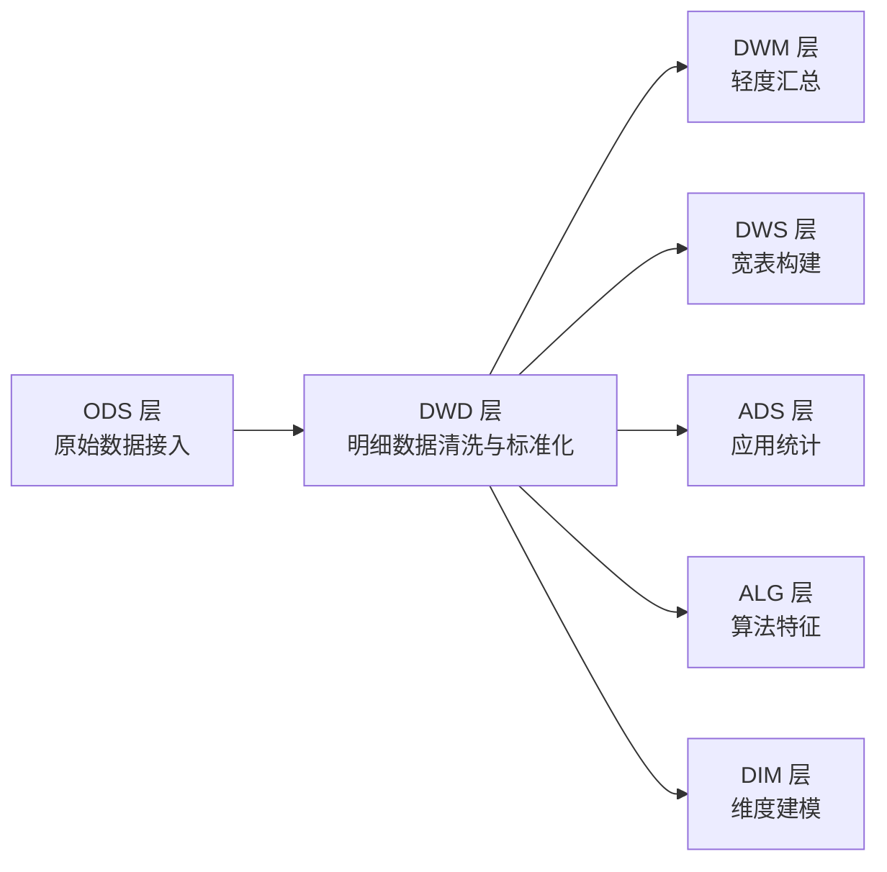
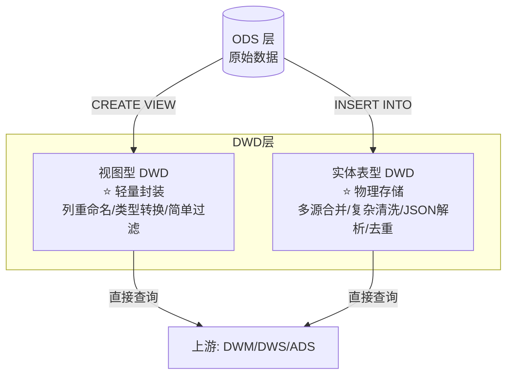
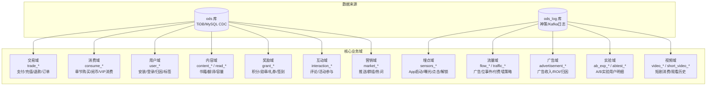

DWD（Data Warehouse Detail）层是整个数仓分层架构中的明细数据层，位于 ODS 层之上，负责对原始数据进行清洗、标准化和轻度整合。本文档系统性地解析 DWD 层的架构设计、建表规范、清洗模式以及各业务域的组织方式。

## DWD 层在数仓中的位置

DWD 层承上启下——从 ODS 层接收原始业务数据和日志数据，经过清洗转换后，为上游的 DWM（汇总层）、DWS（宽表层）、ADS（应用统计层）和 ALG（算法层）提供可信的明细事实表。



DWD 层的数据来源包含两条路径：**业务数据库**（TiDB/MySQL 通过 CDC 同步至 `ods` 库）和**日志系统**（神策 Sensors、自建 Kafka 写入 `ods_log` 库）。视图型 DWD 直接基于 ODS 表构建轻量查询层，而实体表型 DWD 则通过 DolphinScheduler 调度的 DML 任务每日/每小时增量写入。

Sources: [分层设计理念与数据流转](5-fen-ceng-she-ji-li-nian-yu-shu-ju-liu-zhuan)

## 目录结构与命名规范

DWD 层的 SQL 文件统一存放在 `starrocks/dwd/` 目录下，严格区分为 DDL 和 DML 两个子目录：

| 目录 | 用途 | 文件前缀 | 数量 |
|------|------|----------|------|
| `starrocks/dwd/ddl/` | 建表/建视图语句 | `dwd_` | ~178 文件 |
| `starrocks/dwd/dml/` | ETL 清洗与加载脚本 | `P_dwd_` | ~87 文件 |

**命名规范的完整结构**为：

```
[P_]dwd_{业务域}_{实体描述}_{刷新策略}[_view]
```

其中各部分的含义如下：

| 组成部分 | 说明 | 示例 |
|----------|------|------|
| `P_` 前缀 | 表示 DolphinScheduler 调度任务脚本，仅 DML 使用 | `P_dwd_trade_user_payorder` |
| `dwd_` | 固定前缀，标识为 DWD 层对象 | — |
| `{业务域}` | 所属业务域标识，如 `trade`、`consume`、`sensors` | `dwd_**trade**_user_payorder` |
| `{实体描述}` | 具体的业务实体名称，使用下划线分隔 | `dwd_trade_**user_payorder**` |
| `{刷新策略}` | 数据刷新粒度标识 | 见下表 |
| `_view` 后缀 | 表示该对象为视图而非实体表 | `dwd_sensors_production_appstart_view` |

**刷新策略后缀**决定了表的调度频率和分区粒度：

| 后缀 | 含义 | 分区粒度 | 典型调度频率 |
|------|------|----------|-------------|
| `_di` | Daily Insert，日增量 | 天 | 每日一次 |
| `_hi` | Hourly Insert，小时增量 | 小时 | 每小时一次 |
| `_da` | Daily Append，日追加 | 天 | 每日一次 |
| `_df` | Daily Full，日全量快照 | 天 | 每日一次 |
| `_p_di` | Partitioned Daily Insert，分区日增量 | 天 | 每日一次 |
| `_p_hi` | Partitioned Hourly Insert，分区小时增量 | 小时 | 每小时一次 |
| （无后缀） | 非分区表或低频全量表 | 无/按月 | 按需 |

Sources: [starrocks/dwd/ddl/](starrocks/dwd/ddl) and [starrocks/dwd/dml/](starrocks/dwd/dml)

## 两类 DWD 实体：视图与实体表

DWD 层采用**双轨制**设计——根据数据量和使用场景，选择视图或实体表两种实现方式。理解这一设计决策是掌握 DWD 层的关键。



### 视图型 DWD

视图型 DWD 本质是一个 SQL VIEW，不占用物理存储。典型场景是：ODS 表结构已经足够规范，只需对列进行重命名、类型转换或简单的行过滤。

以神策埋点事件的 DWD 视图为例——它仅对列做了语义化重命名并过滤特定项目：

```sql
CREATE VIEW `dwd_sensors_production_appstart_view` (
    `dt`, `id`, `track_id`, `rid`, `event_tm`, 
    `login_id`, `identity_login_id`, `event`
) AS
SELECT ... FROM `ods_log`.`ods_sensors_cd_video_production_AppStart`
WHERE `project_id` = 5;
```

Sources: [dwd_sensors_production_appstart_view.sql](starrocks/dwd/ddl/dwd_sensors_production_appstart_view.sql#L1-L5)

视图型 DWD 也常用于跨源数据合并，通过 `UNION ALL` 将多个 ODS 表整合为统一视图：

```sql
CREATE OR REPLACE VIEW dwd.dwd_user_install_info_ed_view (...) AS
SELECT ... FROM ods.ods_sharpengine_ads_hk_bak_if_user_installreferrer
WHERE ProductId NOT IN (6883)
UNION ALL
SELECT ... FROM ods.ods_tidb_cdvideo_tidb_xcx_user_attribution;
```

Sources: [dwd_user_install_info_ed_view.sql](starrocks/dwd/ddl/dwd_user_install_info_ed_view.sql#L1-L158)

### 实体表型 DWD

实体表型 DWD 是物理存储的 StarRocks 表，适合需要**多源融合、复杂清洗逻辑、JSON 字段解析、数据去重**的场景。实体表通过 DolphinScheduler 调度对应的 `P_dwd_*` DML 脚本来实现增量写入。

实体表采用 **StarRocks 主键模型（PRIMARY KEY）** 或 **重复键模型（DUPLICATE KEY）**：

| 表模型 | 适用场景 | DWD 层典型用例 |
|--------|----------|---------------|
| PRIMARY KEY | 需要幂等更新的明细事实表 | `dwd_trade_user_payorder`、`dwd_consume_user_consume` |
| DUPLICATE KEY | 仅追加不更新的明细表 | `dwd_advertisement_user_position_amt_p_di`、`dwd_consume_user_consume_explode` |
| HIVE ENGINE | 基于 Hive 外表联邦查询 | `ods_sensors_cd_video_unlockepisode_hive` |

Sources: [dwd_trade_user_payorder.sql](starrocks/dwd/ddl/dwd_trade_user_payorder.sql#L1-L49), [dwd_advertisement_user_position_amt_p_di.sql](starrocks/dwd/ddl/dwd_advertisement_user_position_amt_p_di.sql#L1-L44), [ods_sensors_cd_video_unlockepisode_hive.sql](starrocks/dwd/ddl/ods_sensors_cd_video_unlockepisode_hive.sql#L1-L45)

## 分区策略

DWD 实体表的物理设计围绕**分区**展开，直接影响查询性能和数据管理效率。仓库中存在两种主流分区模式：

### 模式一：RANGE(dt) + 动态分区

这是最常用的模式，以 `dt DATE` 列作为分区键，按月份进行动态分区管理：

```sql
PARTITION BY RANGE(`dt`)
(...)
PROPERTIES (
    "dynamic_partition.enable" = "true",
    "dynamic_partition.time_unit" = "MONTH",
    "dynamic_partition.start" = "-120",  -- 保留 120 个月历史
    "dynamic_partition.end" = "2",       -- 预创建 2 个月未来分区
    "dynamic_partition.start_day_of_month" = "1"
)
```

这种模式适用于历史数据量大、需要按月淘汰的明细表。典型用例包括 `dwd_consume_user_consume`、`dwd_ab_exp_user_detail_di`。

Sources: [dwd_consume_user_consume.sql](starrocks/dwd/ddl/dwd_consume_user_consume.sql#L24-L42), [dwd_ab_exp_user_detail_di.sql](starrocks/dwd/ddl/dwd_ab_exp_user_detail_di.sql#L15-L44)

### 模式二：date_trunc('day', dt) + 无动态分区

较新的表采用 `date_trunc('day', dt)` 天级分区表达式，不使用动态分区（手动管理）：

```sql
PARTITION BY date_trunc('day', dt)
```

适用于数据生命周期较短、需要精细控制分区创建/删除策略的表。典型用例包括 `dwd_trade_user_payorder`、`dwd_trade_pay_succ_recharge_order_hi`。

Sources: [dwd_trade_user_payorder.sql](starrocks/dwd/ddl/dwd_trade_user_payorder.sql#L40-L41), [dwd_trade_pay_succ_recharge_order_hi.sql](starrocks/dwd/ddl/dwd_trade_pay_succ_recharge_order_hi.sql#L26-L27)

### 小时分区表

对于 `_hi`（小时增量）表，分区粒度为天级但使用 `date_trunc('day', dt_hour)` 或 RANGE 按天组织：

```sql
PARTITION BY RANGE(`dt_hour`)
(...)
PROPERTIES (
    "dynamic_partition.time_unit" = "DAY",
    "dynamic_partition.start" = "-30",
    "dynamic_partition.end" = "3"
)
```

Sources: [dwd_abtest_content_recommend_p_hi.sql](starrocks/dwd/ddl/dwd_abtest_content_recommend_p_hi.sql#L28-L45)

## 数据清洗标准化模式

DML 脚本是整个 DWD 层的核心——它们将 ODS 层的原始数据转换为可信的明细数据。通过对全部 ~87 个 DML 文件的系统性分析，可以归纳出以下标准化模式。

### 模式一：空值哨兵处理

DWD 层采用统一的**空值替换策略**，确保下游无需额外处理 NULL：

| 数据类型 | 空值替换值 | 说明 |
|----------|-----------|------|
| 整型/数值 | `-99` | 统一的无效值哨兵 |
| 字符串（非空约束） | `-99` | 字符串化哨兵 |
| 日期时间 | `'1970-01-01 00:00:00'` | Unix 纪元作为默认值 |
| ETL 时间戳 | `now()` / `current_timestamp()` | 记录清洗时刻 |

典型实现：

```sql
if(UserId is null or UserId = '', -99, UserId)                    as user_id,
if(CreateTime is null or CreateTime = '', '1970-01-01 00:00:00', CreateTime) as CreateTime,
now() as etl_time
```

Sources: [P_dwd_trade_user_payorder.sql](starrocks/dwd/dml/P_dwd_trade_user_payorder.sql#L17-L34)

### 模式二：多源 UNION ALL 合并

当同一业务实体分散在多个 ODS 表中时（如不同货币类型的消费记录），DML 通过 `UNION ALL` 将其整合，并用 `types` 字段区分来源：

```sql
INSERT INTO dwd.dwd_consume_user_consume
SELECT ..., 1 AS types, ... FROM ods_log.ods_book_log_usermoneylog    -- 阅币
UNION ALL
SELECT ..., 2 AS types, ... FROM ods_log.ods_book_log_usergiftmoneylog -- 礼券
UNION ALL
SELECT ..., 3 AS types, ... FROM ods_log.ods_book_log_userawardmoneylog -- 赠送币
UNION ALL
SELECT ..., 4 AS types, ... FROM ods_log.ods_book_log_userviplog;      -- VIP
```

Sources: [P_dwd_consume_user_consume.sql](starrocks/dwd/dml/P_dwd_consume_user_consume.sql#L10-L104)

### 模式三：数组炸裂（Explode）

当 ODS 中的 `chapter_ids` 字段以逗号分隔存储多个章节 ID 时（如 `[101,102,103]`），DWD 层通过 `split()` + `unnest()` 将其炸裂为单行记录，同时将金额按章节数均摊：

```sql
SELECT ..., 
       amount / IF(chapter_num = 0, 1, chapter_num) AS amount,
       1 / IF(chapter_num = 0, 1, chapter_num)      AS consume_cnt,
       t.unnest                                     AS chapter_id
FROM (
    SELECT ..., split(substr(chapterids, 2, length(chapterids) - 2), ',') AS chapter_id
    FROM ods_log.ods_book_log_usermoneylog
) t1, unnest(chapter_id) AS t
```

这一模式使得下游可以按单个章节粒度进行分析，而非只能按书籍聚合。

Sources: [P_dwd_consume_user_consume_explode.sql](starrocks/dwd/dml/P_dwd_consume_user_consume_explode.sql#L15-L38)

### 模式四：JSON 字符串字段解析

对于存储在 `varchar` 中的 JSON 数据（如广告收入事件），DWD 层使用 StarRocks 的字符串函数进行轻量级解析：

```sql
replace(substring_index(replace(substr(s0, instr(s0, '"adUnitId":')), '"adUnitId":', ''), ',', 1), '"', '') AS ad_unit,
substring_index(replace(substr(s0, instr(s0, '"positionId":')), '"positionId":', ''), ',', 1) AS position_id
```

这种就地解析避免了引入额外的 JSON 解析引擎，在性能和可维护性之间取得了平衡。

Sources: [P_dwd_advertisement_user_position_amt_p_di.sql](starrocks/dwd/dml/P_dwd_advertisement_user_position_amt_p_di.sql#L70-L76)

### 模式五：幂等删除+插入

为保证任务重跑时的数据一致性，DML 脚本普遍采用**先删后插**的幂等模式：

```sql
DELETE FROM dwd.dwd_advertisement_user_position_amt_p_di 
WHERE dt >= '${bf_1_dt}' AND dt <= '${dt}';

INSERT INTO dwd.dwd_advertisement_user_position_amt_p_di ...
```

`${bf_1_dt}` 和 `${dt}` 是 DolphinScheduler 调度系统传入的日期参数，分别表示调度批次的前一天日期和当前日期。这种变量化设计确保了同一脚本在不同调度日期下都能正确执行。

Sources: [P_dwd_advertisement_user_position_amt_p_di.sql](starrocks/dwd/dml/P_dwd_advertisement_user_position_amt_p_di.sql#L16-L20)

### 模式六：MD5 唯一键生成

对于无天然主键的事件数据，DWD 层使用 `MD5(CONCAT(...))` 生成确定性唯一键：

```sql
md5(concat(ifnull(nullif(cast(a1.id as varchar), ''), '-99')
          ,ifnull(nullif(a1.unnest_node_id, ''), '-99')
          ,ifnull(nullif(cast(a1.map_node_id as varchar), ''), '-99')
          )) AS md5_key
```

这确保了即使在分布式写入场景下，也能实现幂等去重。

Sources: [P_dwd_traffic_sv_paywall_strategy_hit_event_di.sql](starrocks/dwd/dml/P_dwd_traffic_sv_paywall_strategy_hit_event_di.sql#L10-L14)

## 业务域全景

DWD 层覆盖了 17 个核心业务域，每个域包含若干张实体表和视图。下图展示了各域的组织逻辑及其数据来源：



### 域与关键表映射

| 业务域 | 关键实体表 | 关键视图 | 刷新策略 |
|--------|-----------|----------|----------|
| **交易域** | `dwd_trade_user_payorder`（用户充值）<br>`dwd_trade_pay_succ_recharge_order_hi`（成功充值）<br>`dwd_trade_short_video_payorder`（短剧支付） | `dwd_trade_sharpenginepaycenter_payorder_view`（支付中心订单）<br>`dwd_trade_video_cn_payorder_view`（国内视频支付） | 日增量/小时增量 |
| **消费域** | `dwd_consume_user_consume`（用户消费事实）<br>`dwd_consume_user_consume_explode`（章节级炸裂）<br>`dwd_sv_consume_user_consume_bill_pdi`（短剧消费账单） | `dwd_consume_short_video_consume_view`（短剧消费）<br>`dwd_sr_user_consume_info_view`（用户消费汇总） | 日增量 |
| **广告域** | `dwd_advertisement_user_position_amt_p_di`（广告预估收益明细）<br>`dwd_advertisement_admob_income`（AdMob 收入） | `dwd_advertisement_fbad_daily_insight_view`（FB广告日洞察）<br>`dwd_advertisement_ltv_daily_insight_view`（LTV日洞察） | 日增量 |
| **埋点域** | — | `dwd_sensors_production_appstart_view`（应用启动）<br>`dwd_sensors_production_itemclick_view`（元素点击）等 30+ 视图 | 实时/准实时 |
| **实验域** | `dwd_ab_exp_user_detail_di`（实验用户明细）<br>`dwd_abtest_content_recommend_p_hi`（内容推荐实验）<br>`dwd_abtest_user_operation_p_hi`（用户运营实验） | `dwd_ab_exp_version_detail`（实验版本） | 日增量/小时增量 |
| **用户域** | `dwd_user_appstartlog`（应用启动日志）<br>`dwd_sv_user_core_attribution`（短剧用户core归因）<br>`dwd_user_install_info_ed`（用户安装信息） | `dwd_user_install_info_ed_view`（安装信息视图）<br>`dwd_user_short_video_user_login_view`（短剧登录视图） | 日增量/非分区 |
| **内容域** | `dwd_content_book_capacity_daily`（书籍容量日报）<br>`dwd_read_book_read_book_readtime`（书籍阅读时长） | `dwd_content_book_daily_sale_view`（书籍日销售）<br>`dwd_read_user_chapter_view`（用户章节阅读） | 日增量 |
| **视频域** | `dwd_video_short_video_consume_production`（短剧消费）<br>`dwd_video_short_video_epis_history`（短剧剧集历史） | `dwd_video_short_video_watch_view`（短剧观看）<br>`dwd_video_vedio_watch_cn_view`（国内视频观看） | 日增量 |
| **数据质量** | `dwd_data_quality_link_monitor`（链路监控）<br>`dwd_data_quality_sensors_exception`（神策异常） | — | 日增量 |

### 产品线前缀标识

部分表名使用前缀区分产品线归属：

| 前缀 | 产品线 | 示例 |
|------|--------|------|
| `dwd_sv_*` | 海剧（Short Video） | `dwd_sv_user_core_attribution`（海剧用户core归因） |
| `dwd_srsv_*` | 海剧海外（StarRocks Short Video） | `dwd_srsv_trade_hk_sync_payorder_di`（海剧香港支付同步） |
| `dwd_sr_*` | 阅读/通用（StarRocks） | `dwd_sr_trade_user_refund_order_di`（退款订单） |
| `dwd_cr_*` | 特定阅读产品 | `dwd_cr_trade_payorder_view` |
| `dwd_cv_*` | 特定视频产品 | `dwd_cv_user_group_log_di_view` |

这些前缀帮助开发人员快速识别表的业务归属，在跨产品线数据整合场景中尤为重要。

## StarRocks 存储优化实践

DWD 层表的 PROPERTIES 配置体现了一套经过验证的存储优化实践：

### Bloom Filter 索引

高基数列（如 `user_id`、`create_time`）统一配置 Bloom Filter，加速等值查询：

```sql
"bloom_filter_columns" = "user_id, create_tm"
```

对于多条件查询的表，Bloom Filter 列会包含多个维度：`"bloom_filter_columns" = "project_id, exp_id, vip_type, exp_sub_type, position_index"`。

Sources: [dwd_advertisement_user_position_amt_p_di.sql](starrocks/dwd/ddl/dwd_advertisement_user_position_amt_p_di.sql#L29), [dwd_abtest_content_recommend_p_hi.sql](starrocks/dwd/ddl/dwd_abtest_content_recommend_p_hi.sql#L33)

### 持久化索引与副本

```sql
"enable_persistent_index" = "true",   -- 主键索引持久化到磁盘，减少内存占用
"replicated_storage" = "true",        -- 三副本存储确保高可用
"replication_num" = "3"
```

对于非核心表，副本数会降至 2 以节省存储成本：`"replication_num" = "2"`。

### 压缩策略选择

| 压缩算法 | 适用场景 | 特点 |
|----------|----------|------|
| LZ4 | 通用明细表 | 压缩速度快，适合高频写入 |
| ZSTD | 大数据量表（SSD存储） | 压缩率更高，适合低频查询的大表 |

高频写入的 `dwd_consume_user_consume` 使用 LZ4，而数据量极大的 `dwd_advertisement_user_position_amt_p_di` 和 `dwd_abtest_content_recommend_p_hi` 则使用 ZSTD + SSD 存储。

Sources: [dwd_consume_user_consume.sql](starrocks/dwd/ddl/dwd_consume_user_consume.sql#L43), [dwd_advertisement_user_position_amt_p_di.sql](starrocks/dwd/ddl/dwd_advertisement_user_position_amt_p_di.sql#L42)

## 调度变量与时间窗口

DWD 层 DML 脚本依赖 DolphinScheduler 传入的调度变量来控制数据时间窗口：

| 变量 | 含义 | 典型用法 |
|------|------|----------|
| `${dt}` | 当前调度批次日期 | `WHERE dt <= '${dt}'` |
| `${bf_1_dt}` | 前一天日期（before 1 day） | `WHERE dt >= '${bf_1_dt}'` |
| `${bf_2_dt}` | 前两天日期 | 用于补偿两天的延迟数据 |

大部分日增量任务使用 `${bf_1_dt}` 到 `${dt}` 的窗口，即每次调度处理前一天到当天的增量。小时增量任务（如 `_hi` 表）则直接使用 `${dt}` 精确匹配当前小时分区：

```sql
WHERE dt = '${dt}'  -- 小时分区精确匹配
```

对于跨多天的补偿任务，窗口会扩大为 `${bf_2_dt}` 到 `${bf_1_dt}`，用于捕捉延迟到达的数据。

Sources: [P_dwd_trade_user_payorder.sql](starrocks/dwd/dml/P_dwd_trade_user_payorder.sql#L42-L43), [P_dwd_abtest_content_recommend_p_hi.sql](starrocks/dwd/dml/P_dwd_abtest_content_recommend_p_hi.sql#L24), [P_dwd_read_readerlog_readtimelog_view.sql](starrocks/dwd/dml/P_dwd_read_readerlog_readtimelog_view.sql#L14)

## 开发规范要点

基于对 DWD 层全部 DDL 和 DML 文件的分析，总结以下关键开发规范：

**DDL 规范**：
- 所有字段必须添加 `COMMENT` 注释，表级必须包含中文业务描述
- 分区键统一使用 `dt`（日分区）或 `dt_hour`（小时分区）
- 所有实体表必须配置 `etl_time DATETIME DEFAULT CURRENT_TIMESTAMP`
- 主键列必须 `NOT NULL`，业务外键（如 `user_id`）允许 NULL
- Bloom Filter 必须覆盖所有高频过滤列

**DML 规范**：
- 文件头部必须包含注释块：`project_name`、`workflow_name`、`task_name`、`update_time`、`sql_path`
- 空值统一替换为 `-99`（数值/字符串）或 `'1970-01-01 00:00:00'`（日期时间）
- ETL 时间戳统一使用 `now()` 或 `CURRENT_TIMESTAMP()`
- 幂等写入必须 `DELETE` + `INSERT`
- 多源合并必须使用 `UNION ALL` 并在注释中说明各分支含义

有关更详细的规范，请参阅 [DDL 与 DML 开发规范](14-ddl-yu-dml-kai-fa-gui-fan) 和 [SQL 编码风格与数据质量兜底](15-sql-bian-ma-feng-ge-yu-shu-ju-zhi-liang-dou-di)。

## 阅读建议

完成本文档后，建议按以下路径继续深入：

- **向上溯源**：了解 DWD 层的数据来源 → [ODS 层：原始数据接入](6-ods-ceng-yuan-shi-shu-ju-jie-ru)
- **向下延伸**：理解 DWD 数据如何被聚合使用 → [DWM 与 DWS 层：汇总与宽表构建](8-dwm-yu-dws-ceng-hui-zong-yu-kuan-biao-gou-jian)
- **维度建模**：了解 DWD 关联的维度表体系 → [DIM 层：维度建模与维表管理](10-dim-ceng-wei-du-jian-mo-yu-wei-biao-guan-li)
- **开发实操**：掌握 DDL/DML 的具体编写规范 → [DDL 与 DML 开发规范](14-ddl-yu-dml-kai-fa-gui-fan)
- **调度集成**：理解 DML 如何在 DolphinScheduler 中编排 → [DolphinScheduler DAG 自动生成](18-dolphinscheduler-dag-zi-dong-sheng-cheng)
- **存储原理**：深入 StarRocks 的分区和表模型 → [StarRocks 表模型与分区策略](28-starrocks-biao-mo-xing-yu-fen-qu-ce-lue)