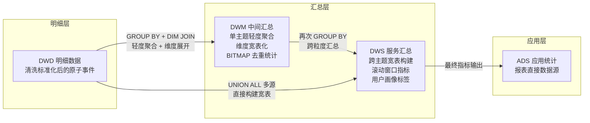
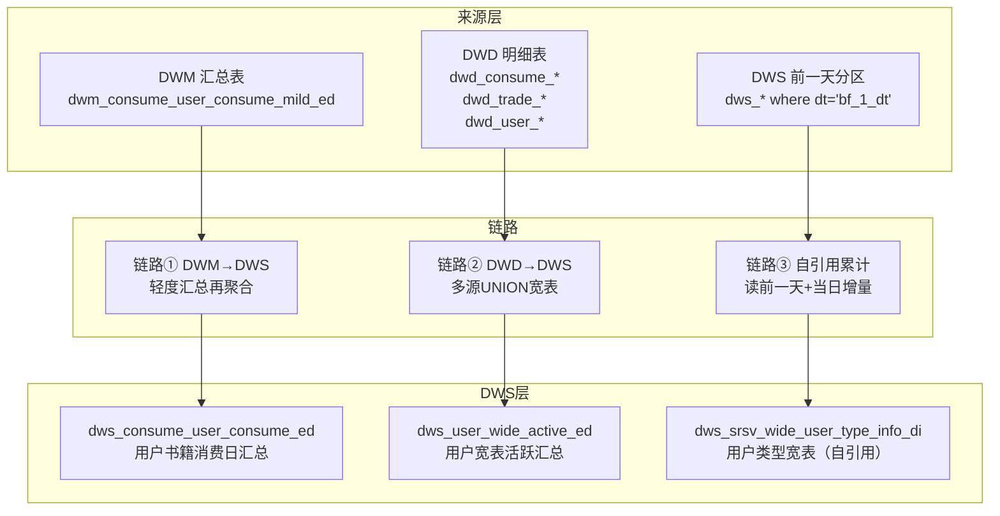

DWM（Data Warehouse Middle）与 DWS（Data Warehouse Service）构成数仓架构中承上启下的核心汇总层。DWM 对 DWD 明细数据做**单主题轻度聚合**，DWS 则在此基础上构建**跨主题宽表与面向业务的服务级汇总**。两层协同完成从原子明细到业务可用指标的转化，直接服务于 ADS 应用层和 FineBI/FineReport 报表系统。

## 架构定位与数据流转

DWM 和 DWS 在整体数仓分层中处于中间位置：DWM 位于 DWD 之上，对上屏蔽明细层的复杂性；DWS 位于 DWM 之上（或直接对接 DWD），对下整合多域数据为宽表。两者的分工遵循"中间层做加法汇总、服务层做乘法整合"的原则。



关键发现：DWS 存在两条数据链路——一条经 DWM 预聚合后再汇总（适合需要复用中间结果的场景），另一条直接从 DWD UNION 多张明细表构建宽表（适合一次性宽表场景）。

Sources: [P_dws_consume_user_consume_ed.sql](starrocks/dws/dml/P_dws_consume_user_consume_ed.sql#L15-L17) | [P_dws_user_wide_active_ed.sql](starrocks/dws/dml/P_dws_user_wide_active_ed.sql#L50-L82) | [P_dwm_consume_user_consume_mild_ed.sql](starrocks/dwm/dml/P_dwm_consume_user_consume_mild_ed.sql#L16-L25)

## DWM 层：单主题轻度汇总

DWM 是数仓中的"中间聚合车间"——规模紧凑（28 张 DDL、26 个 DML 任务），每张表聚焦单一业务主题，对 DWD 明细数据做初步的 GROUP BY 聚合并关联 DIM 维表展开属性。

### DWM 层概览

| 维度 | 特征 |
|---|---|
| **表数量** | DDL 28 张，DML 26 个任务 |
| **数据来源** | DWD 明细表 + DIM 维表（`dim_user_account_info_view`、`dim_user_other_info_view` 等） |
| **聚合粒度** | 用户+时间+业务对象（如 user_id + book_id + dt） |
| **表模型** | PRIMARY KEY（去重汇总）、AGGREGATE KEY（BITMAP 去重）、DUPLICATE KEY（明细快照） |
| **分区策略** | 按天（`_di`/`_ed`）为主，部分按月（`_ed`） |
| **额外对象** | 3 个 VIEW（`day_consume_view`、`hour_consume_view`、`recharge_view`） |

### 表模型三态

DWM 层使用三种 StarRocks 表模型，各司其职：

| 表模型 | 代表表 | 使用场景 |
|---|---|---|
| **PRIMARY KEY** | `dwm_consume_user_consume_mild_ed` | 按主键唯一存储，每批次 DELETE+INSERT 覆盖写入 |
| **AGGREGATE KEY** | `dwm_ab_exp_distinct_stat_di` | BITMAP_UNION 聚合，支持高效的 UV 去重和 BITMAP 交并运算 |
| **DUPLICATE KEY** | `dwm_video_short_video_watch_consume_ed`、`dwm_advertisement_ad_cost_amt_ed` | 明细级快照，不保证主键唯一，保留原始数据粒度 |

**PRIMARY KEY** 模型示例——用户消费轻度汇总表 `dwm_consume_user_consume_mild_ed`，以 `(dt, md5_key)` 为主键，通过 DML 中 `DELETE ... WHERE dt = '${bf_1_dt}'` + `INSERT INTO` 实现每日幂等覆盖：

Source: [dwm_consume_user_consume_mild_ed.sql](starrocks/dwm/ddl/dwm_consume_user_consume_mild_ed.sql#L1-L59)

**AGGREGATE KEY** 模型示例——AB 实验去重指标表 `dwm_ab_exp_distinct_stat_di`，采用 `BITMAP_UNION` 聚合多个用户集合（实验组用户、策略命中用户、曝光/点击/观看/解锁/充值/消费用户），支持后续 BITMAP 交并运算实现灵活的人群交叉分析：

Source: [dwm_ab_exp_distinct_stat_di.sql](starrocks/dwm/ddl/dwm_ab_exp_distinct_stat_di.sql#L1-L39)

### DWM 业务域分布

```
dwm/
├── A/B 实验域 (11张)       ← dwm_ab_exp_*, dwm_abtest_*
├── 消费域 (5张)            ← dwm_consume_user_*
├── 视频/短剧域 (4张)        ← dwm_video_short_video_*
├── 内容/书籍域 (2张)        ← dwm_content_*
├── 阅读域 (2张)            ← dwm_read_*, dwm_user_first_read_*
├── 广告投放 (1张)          ← dwm_advertisement_ad_cost_amt_ed
└── 视图 (3个)              ← day_consume_view, hour_consume_view, recharge_view
```

### DWM DML 标准模式

以 `P_dwm_consume_user_consume_mild_ed` 为例，DWM 层 DML 遵循经典的"删后插"模式：

1. **DELETE** 清除目标分区：`DELETE FROM dwm.dwm_consume_user_consume_mild_ed WHERE dt ='${bf_1_dt}'`
2. **CTE 聚合** 从 DWD 提取并聚合：`FROM dwd.dwd_consume_user_consume_explode WHERE dt>='${bf_1_dt}' ... GROUP BY`
3. **DIM JOIN** 关联维表展开属性：`LEFT JOIN dim.dim_user_account_info_view ... LEFT JOIN dim.dim_user_other_info_view`
4. **MD5 主键生成**：`md5(concat_ws('_', dt, product_id, user_id, ...))` 保证主键唯一性

Source: [P_dwm_consume_user_consume_mild_ed.sql](starrocks/dwm/dml/P_dwm_consume_user_consume_mild_ed.sql#L1-L46)

视频域 DWM DML 则展示了更复杂的 **FULL JOIN 多源融合** 模式——`P_dwm_video_short_video_watch_consume_ed` 将消费计费数据（`dwd_sv_consume_user_consume_bill_pdi`）、观看历史（`dwd_video_short_video_epis_history`）、观看日志（`dwd_video_short_video_epis_watch_log`）、点赞数据（`dwd_video_short_video_account_like_view`）四张 DWD 表通过嵌套 FULL JOIN 融合为一张统一的剧集消费+观看+点赞汇总表：

Source: [P_dwm_video_short_video_watch_consume_ed.sql](starrocks/dwm/dml/P_dwm_video_short_video_watch_consume_ed.sql#L16-L122)

## DWS 层：服务级汇总与宽表

DWS 是数仓中体量最大的汇总层——约 180 张 DDL、160 个 DML 任务——承担"面向业务交付"的职责。其核心工作是构建可直接被 ADS、FineBI、FineReport 消费的**服务级指标表**和**跨域宽表**。

### DWS 层概览

| 维度 | 特征 |
|---|---|
| **表数量** | DDL ~180 张（含 temp/bak 变体），DML ~160 个任务 |
| **数据来源** | DWM 汇总表、DWD 明细表、自身前一天分区 |
| **聚合粒度** | 多维度组合：用户+产品+时间段、广告位+渠道+日期、书籍+章节+用户等 |
| **核心模式** | 聚合汇总、宽表构建、滚动窗口（_mid）、自引用累计 |
| **分区策略** | 按天为主（`_di`/`_ed`），按月（`_a`/部分 `_ed`），按小时（`_hi`/`_h`） |
| **内部结构** | 包含 `_mid` 中间表和 `_wide_` 宽表两个子体系 |

### DWS 三种数据链路

DWS 层的数据来源呈现三种不同的架构模式，这是理解 DWM-DWS 关系的关键：



#### 链路①：DWM → DWS（预聚合再汇总）

`dws_consume_user_consume_ed` 直接从 `dwm.dwm_consume_user_consume_mild_ed` 读取，按 `(dt, product_id, user_id, book_id, types)` 再做一轮 GROUP BY 得到更粗粒度的日汇总指标。DWM 中的 `md5_key` 被展开为独立的维度字段，使得 DWS 层的查询不再依赖复杂的拼接键。

Source: [P_dws_consume_user_consume_ed.sql](starrocks/dws/dml/P_dws_consume_user_consume_ed.sql#L15-L17)

#### 链路②：DWD → DWS（直接构建宽表）

`dws_user_wide_active_ed` 不走 DWM，而是直接从四张 DWD 表 UNION ALL 获取当天活跃用户（登录、交易、消耗、阅读事件），再 LEFT JOIN 维表展开用户属性。这种模式适用于**需要跨多主题快速整合**且**不需要复用中间结果**的场景。

Source: [P_dws_user_wide_active_ed.sql](starrocks/dws/dml/P_dws_user_wide_active_ed.sql#L50-L82)

#### 链路③：DWS 自引用（增量累计）

`dws_srsv_wide_user_type_info_di` 是一个典型示例：每日任务先读取自身前一天分区（`WHERE dt='${bf_1_dt}'`）作为基准用户池，再与当日 DWD 事件表关联计算触达位置、在包状态等滚动指标。这种"读自己前一天 + 当日事件"的模式实现了高效的增量累计，避免了全量回刷。

Source: [P_dws_srsv_wide_user_type_info_di.sql](starrocks/dws/dml/P_dws_srsv_wide_user_type_info_di.sql#L14-L18)

### DWS 内部 `_mid` 中间表体系

DWS 层内部存在一个重要的中间表子体系——以 `_mid` 为后缀的表。这些表承担"在 DWS 层内部做分步计算"的角色，典型场景是**多日滚动窗口指标**（近 1 天、近 7 天、近 15 天、历史累计）。

以 `dws_consume_user_amt_mid` 为例，它按 `(dt, product_id, user_id, book_id)` 粒度存储四个时间窗口的消耗量：

| 字段 | 含义 | 窗口 |
|---|---|---|
| `sum_amount_01` | 近 1 天消耗数 | 滚动 1 天 |
| `sum_amount_07` | 近 7 天消耗数 | 滚动 7 天 |
| `sum_amount_15` | 近 15 天消耗数 | 滚动 15 天 |
| `sum_amount` | 历史累计消耗数 | 全量累计 |

Source: [dws_consume_user_amt_mid.sql](starrocks/dws/ddl/dws_consume_user_amt_mid.sql#L1-L46)

此外，还存在一批以 `_tmp` 或 `_temp` 结尾的临时表（如 `dws_read_user_read_book_ed_tmp`、`dws_user_first_read_book_est_temp`），它们是宽表构建过程中的**分步计算中间产物**，通常被后续合并步骤引用后就不再对外暴露。

### DWS 宽表（`_wide_` 表）

DWS 层的宽表（名称包含 `_wide_` 或以 `wide_` 开头）是跨域整合的最终产物，通常聚合了用户基础属性、活跃状态、付费标签、触达位置、渠道来源等多个维度的信息，是 ADS 和报表层最直接的数据源。

核心宽表一览：

| 宽表 | 覆盖域 | 用途 |
|---|---|---|
| `dws_user_wide_active_ed` | 用户+登录+阅读+充值+消耗 | 阅读线用户活跃全景 |
| `dws_user_wide_active_est_ed` | 同上（预估版） | 实时预估场景 |
| `dws_user_short_video_wide_active_ed` | 用户+短剧+登录+观看+点赞 | 短剧线用户活跃全景 |
| `dws_srsv_wide_user_type_info_di` | 用户+产品+触达位置+渠道 | 海阅&海剧用户分群宽表 |
| `dws_wide_user_read_user_label_info_ed` | 用户+阅读+标签 | 阅读用户标签宽表 |
| `dws_wide_video_cn_user_type_info_ed` | 用户+国内视频+付费类型 | 国内视频用户分群宽表 |

Source: [dws_user_wide_active_ed.sql](starrocks/dws/ddl/dws_user_wide_active_ed.sql#L1-L45) | [dws_srsv_wide_user_type_info_di.sql](starrocks/dws/ddl/dws_srsv_wide_user_type_info_di.sql#L1-L43)

### DWS 业务域分布

DWS 层覆盖了仓库中几乎全部的业务域，按 DDL 文件数量分布：

```
dws/
├── 用户域 (~35张)          ← dws_user_*, dws_user_wide_*, dws_user_sv_*
├── 广告域 (~25张)          ← dws_advertisement_*, dws_ad_*, dws_sv_ads_*
├── 交易域 (~20张)          ← dws_trade_*, dws_cr_trade_*
├── 消费域 (~18张)          ← dws_consume_*, dws_comsume_*
├── 视频/短剧域 (~15张)     ← dws_video_*, dws_sv_*
├── 阅读域 (~15张)          ← dws_read_*
├── 流量/埋点域 (~14张)     ← dws_flow_*, dws_cr_*
├── A/B实验域 (5张)         ← dws_abtest_*
├── 内容域 (5张)            ← dws_content_*
├── 互动域 (2张)            ← dws_interaction_*
├── 竞品域 (2张)            ← dws_competitor_*
├── 其他 (~15张)            ← dws_grant_*, dws_subscribe_*, dws_alg_*, dws_report_*, dws_device_*, dws_koc_*, dws_data_quality_*
```

### 多源合并与 UNION ALL 模式

DWS 层在跨产品线（阅读线 vs 短剧线）和跨时区（东八区 vs 西五区）场景下大量使用 UNION ALL 模式。例如 `dws_trade_user_recharge_30d` 将三个不同来源的充值数据 UNION 在一起：

- `dws_trade_user_shopitem_charge_ed`（阅读线商城充值）
- `dws_trade_short_viedo_payorder_ed`（海外短剧充值）
- `dws_trade_viedo_cn_payorder_ed`（国内视频充值）

三张源表的字段名和含义各不相同，DML 通过字段映射统一为相同的输出列名。

Source: [P_dws_trade_user_recharge_30d.sql](starrocks/dws/dml/P_dws_trade_user_recharge_30d.sql#L37-L55)

## DWM 与 DWS 的协同设计原则

总结两层之间的关键设计决策：

| 设计原则 | DWM 的体现 | DWS 的体现 |
|---|---|---|
| **单一职责** | 每表只聚合一个 DWD 主题 | 每表面向一个业务分析场景 |
| **维表展开时机** | DWM 阶段即 JOIN 维表展开属性 | 直接复用 DWM 已展开的维度，或自行 JOIN |
| **幂等写入** | DELETE + INSERT (按分区覆盖) | DELETE + INSERT 或 INSERT (追加) |
| **主键设计** | MD5 拼接键或业务联合键 | 天然业务联合键 |
| **时区处理** | 东八区 (`_ed`) 和西五区 (`_w5_p_di`) 分别建表 | 同样按需建表 (`_est_ed`、`_west5_ed`) |
| **中间表策略** | 无内部中间表（直接产出） | 有 `_mid` 和 `_tmp` 中间表子体系 |

DWM 和 DWS 共同构成了从"原子事件"到"业务指标"的完整转化管道。DWM 做的是**纵向聚合**（同主题内从明细到汇总），DWS 做的是**横向整合**（跨主题关联构建多维度宽表）。理解这一分工后，开发新需求时就能准确判断：单主题的轻度汇总应建在 DWM，跨域宽表和面向报表的最终指标应建在 DWS。

## 命名规范速查

两层共享一套命名约定，理解后缀含义是快速定位目标表的关键：

| 后缀 | 全称 | 含义 | 典型表 |
|---|---|---|---|
| `_di` | Day Incremental | 按天增量分区 | `dwm_ab_exp_distinct_stat_di` |
| `_ed` | End of Day | 每日全量汇总 | `dws_consume_user_consume_ed` |
| `_hi` | Hour Incremental | 按小时增量分区 | `dwm_abtest_content_recommend_distinct_stat_hi` |
| `_a` | Aggregate | 全量累计快照 | `dws_consume_book_consume_a` |
| `_mid` | Middle | DWS 内部中间计算表 | `dws_consume_user_consume_mid` |
| `_da` | Day Aggregate | 按日聚合 | `dws_content_book_submit_publish_stat_p_da` |
| `_df` | Daily Full | 每日全量快照 | `dws_srsv_user_first_preload_info_df` |
| `_td` | To Date | 截至当日累计 | `dws_video_user_watch_series_td_a` |
| `_est` | Estimated | 含预估逻辑 | `dws_user_wide_active_est_ed` |
| `_temp` / `_tmp` | Temporary | 临时中间表 | `dws_trade_user_recharge_temp` |
| `_h` | Hourly | 按小时粒度 | `dws_ad_product_user_income_h` |
| `_p_di` | Period Day Incremental | 带前缀的按天增量 | `dwm_consume_user_money_consume_p_di` |

业务域前缀的完整列表：`consume_`（消费）、`user_`（用户）、`advertisement_` / `ad_`（广告）、`video_`（视频/短剧）、`ab_` / `abtest_`（A/B 实验）、`content_`（内容/书籍）、`trade_`（交易/充值）、`flow_`（流量/埋点）、`read_`（阅读）、`interaction_`（互动）、`alg_`（算法）、`competitor_`（竞品）、`grant_`（积分/奖励）、`subscribe_`（订阅）。

Source: [starrocks/dwm/ddl/](starrocks/dwm/ddl/) | [starrocks/dws/ddl/](starrocks/dws/ddl/)

## 继续阅读

理解 DWM 和 DWS 的汇总逻辑后，建议按以下路径深入：

- [ADS 层：面向业务的应用统计](9-ads-ceng-mian-xiang-ye-wu-de-ying-yong-tong-ji) — DWS 的下一站，了解报表直接消费的最终数据形态
- [DIM 层：维度建模与维表管理](10-dim-ceng-wei-du-jian-mo-yu-wei-biao-guan-li) — DWM/DWS 中大量 JOIN 的维表来源
- [DWD 层：明细数据清洗与标准化](7-dwd-ceng-ming-xi-shu-ju-qing-xi-yu-biao-zhun-hua) — 回顾 DWM 的上游数据源
- [DDL 与 DML 开发规范](14-ddl-yu-dml-kai-fa-gui-fan) — 新建 DWM/DWS 表时需要遵循的规范