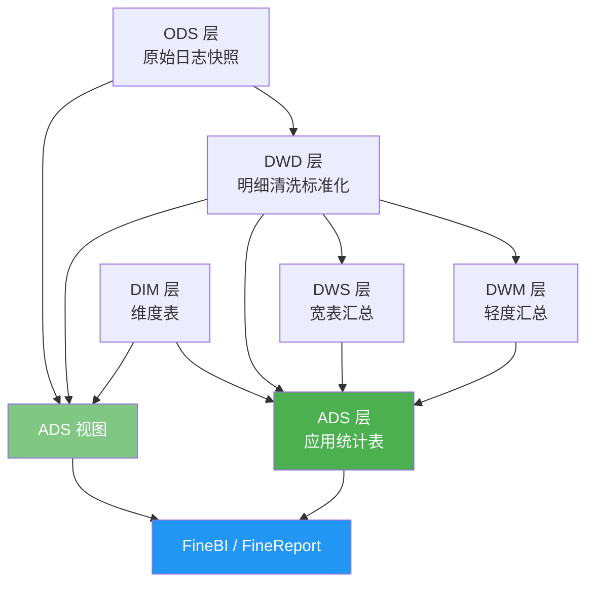
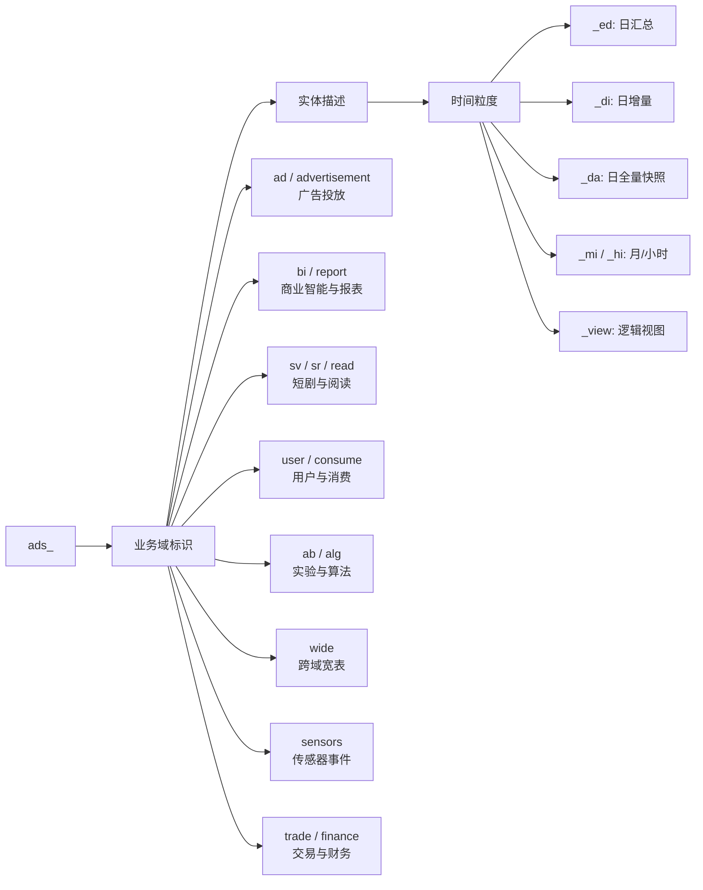
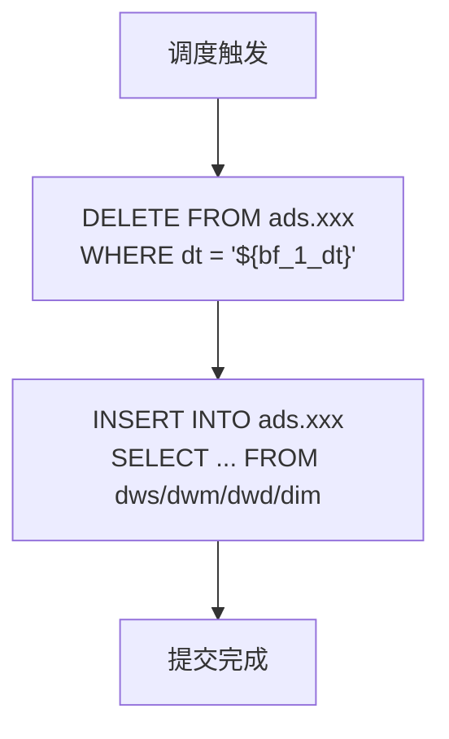
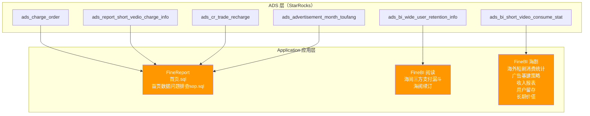

ADS（Application Data Service）层是数仓分层架构的最顶层，直接面向业务应用、BI 报表和管理驾驶舱。ADS 层的数据经过了 ODS 原始接入、DWD 清洗标准化、DWM/DWS 汇总宽表构建等层层加工，最终以**业务可理解、查询高性能**的形态呈现。从架构角度看，ADS 层是整个数据价值链条的"最后一公里"——它上承 DWS/DWM 汇总层、下接 FineBI/FineReport 等应用端，同时自身也包含两类迥然不同的物理形态：**物化表**和**逻辑视图**。

Sources: [ads_report_user_dau_ed](starrocks/ads/ddl/ads_report_user_dau_ed.sql#L1-L113) | [ads_wide_user_info_ed](starrocks/ads/ddl/ads_wide_user_info_ed.sql#L1-L200) | [ads_ab_exp_core_index](starrocks/ads/ddl/ads_ab_exp_core_index.sql#L1-L98)

## 数据流转定位

ADS 层在整体数仓中处于消费侧的终点位置。下图展示了数据从原始日志到业务报表的完整流转路径，其中 ADS 层是唯一承担**对外交付职责**的分层：



ADS 层不是简单的"存储查询结果"——它的定位决定了它具有两条截然不同的技术路线：**物化表**（预计算、定期刷新）和**逻辑视图**（实时查询、无存储成本）。两者各自承担着不同的业务场景。

Sources: [P_ads_report_user_dau_ed](starrocks/ads/dml/P_ads_report_user_dau_ed.sql#L1-L33) | [P_ads_wide_user_info_ed](starrocks/ads/dml/P_ads_wide_user_info_ed.sql#L1-L200) | [ads_sensors_production_element_click_view](starrocks/ads/ddl/ads_sensors_production_element_click_view.sql#L1-L2)

## 两种物理形态：物化表 vs 逻辑视图

ADS 层最核心的架构决策是"物化还是虚拟"。这与查询频率、数据量级和时效性要求密切相关。

| 维度 | 物化表（Table） | 逻辑视图（View） |
|---|---|---|
| **DDL 语法** | `CREATE TABLE ... PRIMARY KEY ... PARTITION BY RANGE` | `CREATE VIEW ... AS SELECT ...` |
| **存储** | 占用 StarRocks 磁盘空间，数据预计算写入 | 不占存储，每次查询实时计算 |
| **更新方式** | DML 脚本定期 DELETE + INSERT | 无更新，查下层实时数据 |
| **数据来源** | 主要来自 DWS / DWM 汇总层 | 主要来自 ODS / DWD / DIM |
| **时效性** | T+1（日级调度） | 实时（取决于下层数据写入延迟） |
| **查询性能** | 极快，适合大范围聚合 | 取决于底层 JOIN 复杂度 |
| **典型场景** | DAU 报表、留存分析、收入报表 | 元素曝光/点击流、传感器事件日志 |
| **文件后缀** | `_ed`、`_di`、`_da`、`_mi`、`_hi` | `_view` |
| **配套文件** | DDL + DML 成对出现 | 仅 DDL，无 DML |

Sources: [ads_report_user_dau_ed](starrocks/ads/ddl/ads_report_user_dau_ed.sql#L1-L13) | [ads_bi_ad_new_user_value_ed](starrocks/ads/ddl/ads_bi_ad_new_user_value_ed.sql#L1-L41) | [ads_advertisement_roi_early_warning_view](starrocks/ads/ddl/ads_advertisement_roi_early_warning_view.sql#L1-L31) | [ads_sensors_production_element_click_view](starrocks/ads/ddl/ads_sensors_production_element_click_view.sql#L1-L2)

一张典型的物化表 `ads_report_user_dau_ed` 从 `dws.dws_user_wide_active_ed` 聚合而来，经过 `bitmap_union` 去重计数和维度补齐后写入 ADS，支撑 FineReport 首页的 DAU 指标卡。而传感器事件类视图 `ads_sensors_production_element_click_view` 则直接将 ODS 日志层与 DIM 维表做一次 LEFT JOIN，为实时事件分析提供零延迟的数据窗口。

## 命名规范与粒度标识

ADS 层的命名遵循严格的四段式结构：`ads_<业务域>_<实体描述>_<时间粒度>`。理解这套命名体系是快速定位目标表的关键。



Sources: [starrocks/ads/ddl/](starrocks/ads/ddl/) | [starrocks/ads/dml/](starrocks/ads/dml/)

**时间粒度后缀**是理解表刷新频率和查询范围的第一入口：

| 后缀 | 含义 | 典型表名 | 刷新频率 |
|---|---|---|---|
| `_ed` | Every Day，按天汇总 | `ads_wide_user_info_ed` | 每日一次，T+1 |
| `_di` | Daily Insert，日增量分区 | `ads_sv_beidou_series_daily_stat_di` | 每日增量写入 |
| `_da` | Daily Append/All，日全量快照 | `ads_consume_book_consume_top30_df` | 每日全量覆盖 |
| `_mi` | Monthly Increment | `ads_sv_act_user_stat_mi` | 每月增量 |
| `_hi` | Hourly Increment | `ads_sv_hot_list_hi` | 每小时增量 |
| `_view` | Virtual View | `ads_advertisement_roi_early_warning_view` | 无刷新，实时查询 |

Sources: [ads_wide_user_info_ed](starrocks/ads/ddl/ads_wide_user_info_ed.sql#L1-L6) | [ads_sv_beidou_series_daily_stat_di](starrocks/ads/ddl/ads_sv_beidou_series_daily_stat_di.sql#L1-L7) | [ads_report_user_dau_ed](starrocks/ads/ddl/ads_report_user_dau_ed.sql#L1-L13)

**业务域前缀**按职责将数百张 ADS 表划分为明确的责任边界，截取最具代表性的前缀如下：

| 前缀 | 业务域 | 代表表 |
|---|---|---|
| `ads_ad*` / `ads_advertisement*` | 广告投放与 ROI | `ads_ad_adgroup_d0_roi_stat`、`ads_advertisement_month_toufang` |
| `ads_ab_*` | A/B 实验分析 | `ads_ab_exp_core_index`、`ads_ab_exp_detail` |
| `ads_bi_*` | 商业智能宽表 | `ads_bi_wide_user_retention_info`、`ads_bi_sv_recharge_user_detail_di` |
| `ads_report_*` | 管理报表 | `ads_report_user_dau_ed`、`ads_report_cost_income` |
| `ads_sv_*` | 短剧（海剧） | `ads_sv_series_ranking`、`ads_sv_user_subscription` |
| `ads_sr_*` / `ads_read_*` | 阅读（海阅） | `ads_sr_book_income_expand_di`、`ads_read_retention_stat_p_da` |
| `ads_wide_*` | 跨域用户/书籍宽表 | `ads_wide_user_info_ed`、`ads_wide_book_read_consume_info_ed` |
| `ads_user_*` | 用户行为 | `ads_user_login_dau`、`ads_user_charge_1d` |
| `ads_consume_*` | 消费分析 | `ads_consume_user_consume_di`、`ads_consume_book_consume_top30_df` |
| `ads_trade_*` | 交易与支付 | `ads_trade_user_recharge_view`、`ads_trade_user_type_ltv_est_mid` |
| `ads_finance_*` | 财务核算 | `ads_finance_moneylog_month_report_mob_view` |
| `ads_content_*` | 内容管理 | `ads_content_book_publish_mgr`、`ads_content_remuneration_detail` |
| `ads_sensors_*` | 神策事件流 | `ads_sensors_production_element_click_view` |
| `ads_alg_*` | 算法特征 | `ads_alg_series_score`、`ads_alg_user_appnotify_verify` |
| `ads_srsv_*` | 阅读+短剧联合 | `ads_srsv_bi_ad_optimizer_target_data_result` |
| `ads_koc_*` | KOC 达人归因 | `ads_koc_srsv_bi_attribution_result_data_new` |
| `ads_offline_label_*` | 离线用户标签 | `ads_offline_label_user_info_wide_a_view` |
| `ads_creation_*` / `ads_market_*` | 投放创意与营销 | `ads_creation_ad_set_task_view`、`ads_market_tag_group_info_view` |
| `ads_beidou_*` / `ads_big_dipper_*` | 北斗指标系统 | `ads_sv_beidou_series_daily_stat_di` |
| `ads_competitor_*` | 竞品分析 | `ads_competitor_data_ai_app_timeline_view` |

Sources: [starrocks/ads/ddl/](starrocks/ads/ddl/)

## DDL 建表模式

ADS 物化表全部采用 **StarRocks OLAP 引擎**，建表 DDL 遵循一套高度一致的模板。

**分区策略**是 ADS 层最关键的物理设计决策。所有物化表均以 `dt`（日期字段）作为分区键，支持两种分区粒度：

| 分区策略 | 语法 | 适用场景 | 代表表 |
|---|---|---|---|
| 月分区 | `PARTITION BY RANGE(dt) (PARTITION p202501 VALUES [("2025-01-01"), ("2025-02-01")))` | 大多数日汇总表，配合动态分区自动创建 | `ads_report_user_dau_ed`、`ads_bi_wide_user_retention_info` |
| 日分区 | `PARTITION BY date_trunc("day", dt)` | 北斗日增量表等数据量大且需要精细管理的表 | `ads_sv_beidou_series_daily_stat_di` |

伴随分区定义的是一套**动态分区属性**，以 `ads_bi_wide_user_retention_info` 为例：

```sql
"dynamic_partition.enable" = "true",
"dynamic_partition.time_unit" = "month",
"dynamic_partition.start" = "-2147483648",   -- 保留所有历史分区
"dynamic_partition.end" = "3",               -- 提前创建未来3个月分区
"dynamic_partition.prefix" = "p",
"dynamic_partition.start_day_of_month" = "1"
```

Sources: [ads_bi_wide_user_retention_info](starrocks/ads/ddl/ads_bi_wide_user_retention_info.sql#L108-L117) | [ads_sv_beidou_series_daily_stat_di](starrocks/ads/ddl/ads_sv_beidou_series_daily_stat_di.sql#L63-L72)

**主键与分布键**的设计直接影响查询性能。ADS 表通常将去重维度列全部纳入 PRIMARY KEY，配合 BITMAP 索引加速过滤：

| 表 | PRIMARY KEY | DISTRIBUTED BY | 索引 |
|---|---|---|---|
| `ads_report_user_dau_ed` | `dt, years, product_id, corever, current_language, current_language2, app_ver, mt, ver, reg_country, user_types` | `HASH(product_id, dt)` | BITMAP on `product_id`, `current_language`, `current_language2` |
| `ads_bi_wide_user_retention_info` | `dt, md5_key` | `HASH(dt, md5_key)` BUCKETS 3 | BITMAP on `user_period`, `current_language2`, `product_id` |
| `ads_ab_exp_core_index` | `experimentId, experimentGroupId, dt, projectId, trackficVersion, windowNum` | `HASH(experimentId)` BUCKETS 6 | 无额外索引 |
| `ads_sv_beidou_series_daily_stat_di` | `dt, core, acquisition_source_cd, language_code, series_id` | `HASH(core, acquisition_source_cd, language_code, series_id)` BUCKETS 8 | BLOOM FILTER on `publish_time`, `series_id` |

Sources: [ads_report_user_dau_ed](starrocks/ads/ddl/ads_report_user_dau_ed.sql#L10-L28) | [ads_bi_wide_user_retention_info](starrocks/ads/ddl/ads_bi_wide_user_retention_info.sql#L19-L25) | [ads_ab_exp_core_index](starrocks/ads/ddl/ads_ab_exp_core_index.sql#L91-L98) | [ads_sv_beidou_series_daily_stat_di](starrocks/ads/ddl/ads_sv_beidou_series_daily_stat_di.sql#L63-L72)

**BITMAP 类型的妙用**是 ADS 层的一大特色。在 `ads_wide_user_info_ed` 中，`consume_book_cnt`、`consume_chapter_cnt` 等字段使用了 `bitmap` 类型——在 DML 中通过 `bitmap_union(to_bitmap(...))` 聚合写入，查询时用 `bitmap_count()` 展开。这种设计让"用户在某天消费了多少本书"这种需要跨多行去重的语义，在写入时就被预计算为紧凑的 bitmap，查询时只需一次函数调用即可得到精确结果。

Sources: [ads_wide_user_info_ed](starrocks/ads/ddl/ads_wide_user_info_ed.sql#L16-L36) | [P_ads_wide_user_info_ed](starrocks/ads/dml/P_ads_wide_user_info_ed.sql#L14-L16)

## DML 刷新模式

每个物化表都对应一个 DML 脚本（`P_<table_name>.sql`），用于定期将下层汇总数据刷新到 ADS。DML 脚本的头部注释包含完整的元数据信息：

```sql
-- project_name     : starrocks
-- workflow_name    : tbl_ads_report_user_dau_ed
-- workflow_version : 14
-- create_user      : yanxh
-- task_name        : tbl_ads_report_user_dau_ed
-- task_version     : 8
-- update_time      : 2024-11-29 14:09:40
-- sql_path         : \starrocks\tbl_ads_report_user_dau_ed\tbl_ads_report_user_dau_ed
```

Sources: [P_ads_report_user_dau_ed](starrocks/ads/dml/P_ads_report_user_dau_ed.sql#L1-L10)

绝大多数 DML 遵循 **DELETE + INSERT** 的两阶段刷新模式：



这种模式本质上是**分区覆盖写入**——先清空目标分区，再全量写入当日计算结果。调度参数 `${bf_1_dt}`（before one day，即 T-1 日期）和 `${dt}`（T 日期）的配合使用确保了幂等性：无论重跑多少次，同一分区永远只有一份数据。

Sources: [P_ads_report_user_dau_ed](starrocks/ads/dml/P_ads_report_user_dau_ed.sql#L12-L33) | [P_ads_report_cost_income](starrocks/ads/dml/P_ads_report_cost_income.sql#L14-L77)

**数据来源层级**呈现规律性的分布：

| 来源层级 | 典型用途 | DML 示例 |
|---|---|---|
| `dws.*` | 宽表汇总，单表聚合 | `ads_report_user_dau_ed` ← `dws.dws_user_wide_active_ed` |
| `dwm.*` | 轻度汇总，多 UNION ALL 拼接 | `ads_wide_user_info_ed` ← `dwm.dwm_consume_user_consume_mild_ed` + `dwd.*` + `dws.*` |
| `dwd.*` | 明细数据，直接聚合 | `ads_user_login_dau` ← `dws.dws_user_login_ed` + `dim.dim_user_account_info_view` |
| `dim.*` | 维度关联补充 | `ads_wide_book_read_consume_info_ed` ← `dim.dim_shuangwen_book_read_consume_info` |
| `ods_log.*` | 视图直接映射（仅 VIEW） | `ads_sensors_production_element_click_view` ← `ods_log.ods_sensors_production_element_click` |

Sources: [P_ads_report_user_dau_ed](starrocks/ads/dml/P_ads_report_user_dau_ed.sql#L25-L33) | [P_ads_wide_user_info_ed](starrocks/ads/dml/P_ads_wide_user_info_ed.sql#L11-L200) | [P_ads_user_login_dau](starrocks/ads/dml/P_ads_user_login_dau.sql#L16-L81) | [P_ads_wide_book_read_consume_info_ed](starrocks/ads/dml/P_ads_wide_book_read_consume_info_ed.sql#L17-L113)

**复杂宽表的 UNION ALL 聚合模式**是 `P_ads_wide_user_info_ed` 这类脚本的标志性特征。由于用户级别的日汇总指标来源分散（消费来自 `dwm_consume_user_consume_mild_ed`、积分消耗来自 `dwd_grant_readerlog_jifenmonthlog_view`、登录来自 `dws_user_login_ed`），DML 将每个来源封装为独立的子查询，通过 `UNION ALL` 合并后再做最外层的 `SUM` + `bitmap_union` 聚合，最终以 `(dt, product_id, user_id)` 为粒度输出一行完整的用户日画像。

Sources: [P_ads_wide_user_info_ed](starrocks/ads/dml/P_ads_wide_user_info_ed.sql#L62-L200)

## A/B 实验分析：窗口累积计算

ADS 层中有一条特殊的业务线——A/B 实验核心指标计算，以 `ads_ab_exp_core_index` 为典型代表。它的 DML 脚本使用了一种**滑动窗口累积**的计算模式，与其他"每日快照"类的 ADS 表截然不同。

核心思路是：以 DWM 层的每日去重指标（`dwm_ab_exp_distinct_stat_di`）和每日累积指标（`dwm_ab_exp_accumulation_stat_di`）为基础，通过 `dim_date` 日期维表做笛卡尔积展开，计算出实验开始至今每一天的"过去 N 天窗口"内的累积值。具体分三步：

1. **去重指标 CTE**（`distinct_data_tmp`）：将分流人数、策略命中人数、曝光人数等去重指标按 `windowNum`（窗口天数）展开
2. **累加指标 CTE**（`accumulate_data_tmp`）：将曝光 PV、点击 PV、充值金额等累加指标按窗口展开
3. **充值明细 CTE**（`recharge_data_tmp`）：独立处理充值与订阅维度的用户数和金额

最终外层 SELECT 将三者 JOIN 并计算比率指标（ARPU、付费率、ARPPU 等），其中分子分母的分离存储（如 `payRateFenzi` / `payRateFenMu`）使得 FineBI 报表可以灵活调整可视化口径。

Sources: [P_ads_ab_exp_core_index](starrocks/ads/dml/P_ads_ab_exp_core_index.sql#L1-L80) | [ads_ab_exp_core_index](starrocks/ads/ddl/ads_ab_exp_core_index.sql#L1-L98)

## 应用消费层：FineBI 与 FineReport

ADS 层的最终消费者是 `Application/` 目录下的两类应用：



**FineReport 首页**是 ADS 层最典型的消费场景。以 `Application/FineReport/首页.sql` 为例，一个"本月充值收入"指标卡的背后，需要从三张 ADS 表做 UNION ALL：

```sql
-- 来源1：海阅充值
SELECT ... FROM ads.ads_charge_order WHERE datetypes IN (3, 4)
UNION ALL
-- 来源2：海剧+国剧充值
SELECT ... FROM ads.ads_report_short_vedio_charge_info WHERE datetypes IN (...)
UNION ALL
-- 来源3：国阅充值
SELECT ... FROM ads.ads_cr_trade_recharge WHERE date_types IN (...)
```

这种多来源 UNION 模式说明：ADS 层虽然已经做了一轮聚合，但跨产品线的指标合并仍在应用层完成，保持了各业务域 ADS 表的独立性和可维护性。

Sources: [首页.sql](Application/FineReport/首页.sql#L1-L200)

**FineBI 海剧报表**则更依赖单一的 ADS 宽表。`Application/FineBI/海剧/海外短剧消费统计表-天维度V2.sql` 从 `ads.ads_bi_short_video_consume_stat` 出发，关联 `dim.dim_dic`（字典维表）做语言/平台翻译、关联 `dim.dim_short_video_series_view` 获取上下架状态、关联 `ads.ads_short_video_admin_series_view` 获取剧集等级，再通过 `${if(...)}` 动态参数实现 FineBI 筛选器交互。

Sources: [海外短剧消费统计表-天维度V2.sql](Application/FineBI/海剧/海外短剧消费统计表-天维度V2.sql#L1-L113)

## 数据资产等级

ADS 层作为对外交付的最终载体，其数据质量直接影响业务决策。结合 [数据资产等级划分与质量治理](22-shu-ju-zi-chan-deng-ji-hua-fen-yu-zhi-liang-zhi-li) 中定义的体系，ADS 层表的资产等级划分遵循以下原则：

| 等级 | 特征 | ADS 表示例 |
|---|---|---|
| **L1（核心）** | 公司级指标看板依赖，影响管理层决策 | `ads_report_user_dau_ed`、`ads_charge_order`、`ads_bi_wide_user_retention_info` |
| **L2（重要）** | 业务线报表依赖，影响运营决策 | `ads_sv_series_ranking`、`ads_report_cost_income`、`ads_ab_exp_core_index` |
| **L3（一般）** | 临时分析/探索性报表 | `ads_temp_*` 前缀表、`_bak` 后缀备份表 |
| **L4（实验性）** | 个人开发调试，无下游依赖 | `_bak_xixg*`、`_temp` 后缀中间表 |

需要特别说明的是，ADS 目录中存在大量 `_bak`（备份）、`_temp`（临时）、`_new`（新版本）和 `_v1`/`_v2`（版本迭代）后缀的文件——它们是开发迭代的自然产物。这些文件通常不需要额外的质量治理，但应定期清理以避免表膨胀。

Sources: [starrocks/ads/ddl/](starrocks/ads/ddl/) | [starrocks/ads/dml/](starrocks/ads/dml/)

## 阅读路径建议

理解 ADS 层之后，建议按以下路径深入探索相关主题：

- **上游数据来源**：了解 DWM/DWS 汇总层如何为 ADS 提供数据基础 → [DWM 与 DWS 层：汇总与宽表构建](8-dwm-yu-dws-ceng-hui-zong-yu-kuan-biao-gou-jian)
- **维度关联支撑**：ADS 查询常常 JOIN DIM 维表做名称翻译 → [DIM 层：维度建模与维表管理](10-dim-ceng-wei-du-jian-mo-yu-wei-biao-guan-li)
- **算法特征数据**：ADS 层也承接算法特征工程结果 → [ALG 层：算法特征工程与推荐数据](11-alg-ceng-suan-fa-te-zheng-gong-cheng-yu-tui-jian-shu-ju)
- **应用端开发**：FineBI/FineReport 如何消费 ADS 数据 → [FineBI 报表应用开发](20-finebi-bao-biao-ying-yong-kai-fa) / [FineReport 数据看板与问题排查](21-finereport-shu-ju-kan-ban-yu-wen-ti-pai-cha)
- **调度编排**：ADS DML 脚本在 DolphinScheduler 中的调度配置 → [DolphinScheduler 调度参数与任务编排](27-dolphinscheduler-diao-du-can-shu-yu-ren-wu-bian-pai)
- **数据库物理设计**：StarRocks 分区与分桶策略详解 → [StarRocks 表模型与分区策略](28-starrocks-biao-mo-xing-yu-fen-qu-ce-lue)